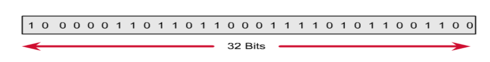
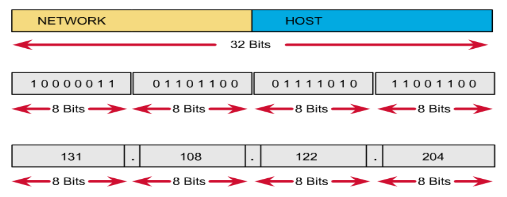
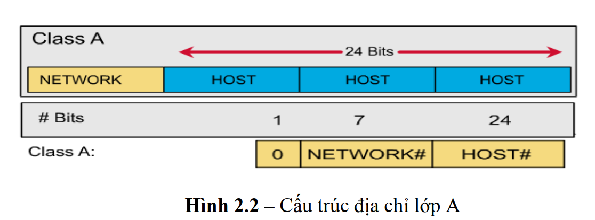
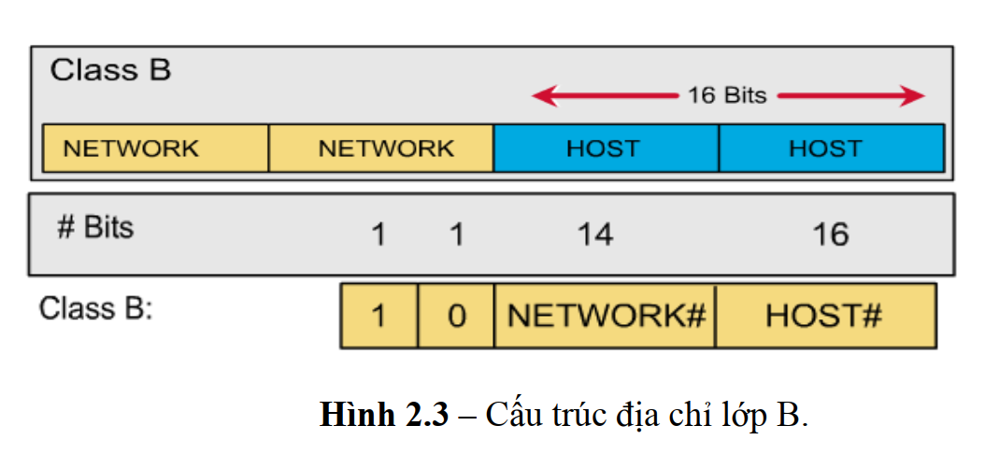
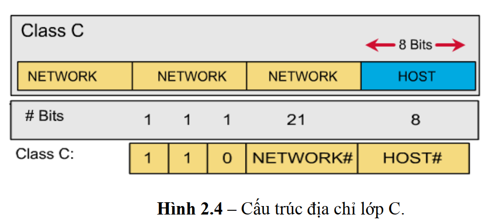
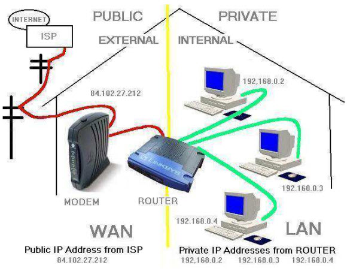

# **IPv4 SUBJECT**

## 1. Định nghĩa
[IPv4](https://vi.wikipedia.org/wiki/IPv4) (Internet Protocol version 4) là phiên bản thứ tư của giao thức Internet (IP), IPv4 hoạt động ở tầng 3 (Network Layer) của mô hình OSI (Open Systems Interconnection). Tầng này chịu trách nhiệm định tuyến các gói dữ liệu từ nguồn đến đích qua các mạng khác nhau.

## 2. Đặc điểm của một địa chỉ IPv4
- Là địa chỉ logic được sử dụng trong giao thức IP của lớp Internet thuộc mô hình TCP/IP(Network Layer).
- Dài 32 bit, biểu diễn thành 4 số thập phân(192.168.1.1)
- 32 bits địa chỉ của IP được chia thành 4 nhóm , mỗi nhóm gồm 8 bits (gọi là một octet), các octet được biểu diễn dưới dạng thập phân và được phân cách nhau bởi các dấu chấm. 
- **Nhược điểm:** Không được tích hợp sẵn bảo mật
- Số lượng địa chỉ giới hạn khoảng 4,3 tỷ thiết bị. Do số lượng địa chỉ giới hạn, IPv4 đang dần bị thay thế bởi IPv6.

- **Đặt địa chỉ IP phải tuân theo các quy tắc sau:**
  - Các bit phần mạng không được phép đồng thời bằng 0.
  - Nếu các bit phần host đồng thời bằng 0, ta có một địa chỉ mạng.
  - Nếu các bit phần host đồng thời bằng 1, ta có một địa chỉ broadcast

- **1 địa chỉ IPv4 có 2 phần** là _phần mạng(network)_ và _phần host_
  - 192.168 là phần network: thuốc lớp C
  - 0.1 là thiết bị cụ thể, 0 là số hiệu mạng con, 1 là thiết bị cụ thể trong mạng con đó.
  - 192.168.0 là phần mạng, tất cả các thiết bị chung mạng sẽ có cấu trúc như này
  - Địa chỉ này giúp các thiết bị nhận biết, liên lạc với nhau và với router tại tầng mạng của mô hình OSI.

## 3. Mục đích của IPv4
- Cung cấp địa chỉ duy nhất cho từng host.
- Xác định đường đi của các thiết bị từ thiết bị gửi đến thiết bị nhận.
- Chia nhỏ dữ liệu thành các packets nhỏ để truyền qua mạng và ghép lại ở đích.
- Bao gồm kiểm tra tổng thể để phát hiện lỗi trong quá trình truyền.

## 4. Phân loại các lớp địa chỉ IPv4

### 4.1\) Lớp A
- Địa chỉ lớp A sử dụng 1 octet đầu làm phần mạng, và 3 octet sau làm phần host.
- Bit đầu của một lớp A luôn được giữ là 0 nên dải địa chỉ 1.0.0.0 -> 127.0.0.0. Tuy nhiên 127.0.0.0 được giữ làm mạng loopback nên dải sử dụng được từ 1.0.0.0 đến 126.0.0.0 (126 mạng)
- Phần host có 24 bit ( 3 octet) nên mỗi mạng lớp A có (224-2) host.

### 4.2\) Lớp B
- Địa chỉ lớp B sử dụng 2 octet đầu làm phần mạng, 2 octet sau làm phần host.
- Hai bit đầu của một địa chỉ lớp B luôn được giữ là 1 0 nên dải địa chỉ 128.0.0.0 -> 191.255.0.0 , có tất cả 214 mạng trong lớp B.
- Phần host có 16 bit, một mạng lớp B có 216-2 host.

### 4.3\) Lớp C
- Địa chỉ lớp C sử dụng 3 octet đầu làm phần mạng, 1 octet sau làm phần host.
- Ba bit đầu của lớp C luôn được giữ là 1 1 0. Do đó các địa chỉ lớp C gồm 192.0.0.0 đến 223.255.255.0
- Có tất cả 221 mạng trong lớp C
- Phần host có 8 bit, một mạng lớp C có 28-2 = 254 host. 

### 4.4\) Lớp D
- Dải địa chỉ: 224.0.0.0 đến 239.255.255.255
  - Dùng làm địa chỉ Multicast.

### 4.5\) Lớp E 
- Dải địa chỉ: 244.0.0.0 đến 255.255.255.255
  - Được sử dụng dự trữ và thử nghiệm.

**_Ví dụ: 192.168.0.1_**

## 4. IPv1, 2, 3
Các địa chỉ IPv1, IPv2 và IPv3 có tồn tại nhưng:
- Những phiên bản này là các bản thiết kế thử nghiệm ban đầu khi phát triển giao thức Internet Protocol (IP) cho ARPANET.

- Chúng chưa bao giờ được tiêu chuẩn hóa thành giao thức công cộng.

- Chúng chỉ tồn tại trong nội bộ các nhóm nghiên cứu. 

## 5. IPv5 

- IPv5 có tồn tại, nhưng nó là tên của một giao thức Internet Stream Protocol (ST, hoặc ST-II) để thử nghiệm truyền tải voice/video streaming qua IP.

- Nó không phải là kế thừa trực tiếp của IPv4 — mà chỉ dùng chung hạ tầng.

- Không trở thành chuẩn phổ biến.

- Khi chuẩn bị phát triển IP thế hệ tiếp theo, người ta tránh dùng số 5 để không nhầm lẫn với Stream Protocol → đặt tên là IPv6.

## 6. IP public và IP private
- **IP Public**:  là địa chỉ IP được cung cấp bởi nhà cung cấp dịch vụ Internet (ISP) và được sử dụng để xác định thiết bị hoặc mạng của bạn trên Internet. Mỗi thiết bị kết nối trực tiếp với Internet đều có một địa chỉ IP công cộng duy nhất (trên toàn cầu).

- **IP Private**: là địa chỉ IP được sử dụng trong các mạng nội bộ (LAN) như trong gia đình, công ty hoặc trường học. Các địa chỉ này không thể truy cập trực tiếp từ Internet và được dùng để giao tiếp giữa các thiết bị trong cùng một mạng nội bộ.

## 7. Multicast và Broadcast

**7.1\) Broadcast**

- Broadcast là hình thức gửi dữ liệu từ một thiết bị tới tất cả các thiết bị khác trong cùng một mạng LAN hoặc subnet.
- Gói tin broadcast sẽ được gửi đến địa chỉ IP đặc biệt (ví dụ: 255.255.255.255 trong IPv4), tất cả các thiết bị trong mạng sẽ nhận được dữ liệu này.
- Broadcast thường được sử dụng trong các giao thức như ARP, DHCP.
- Nhược điểm: Tiêu tốn băng thông mạng vì tất cả các thiết bị đều phải xử lý gói tin, dễ gây “ngập lụt” mạng (broadcast storm) nếu sử dụng quá mức.
- Broadcast có 2 loại: Direct và Local.
Ví dụ khi máy có địa chỉ IP là 192.168.2.1 truyền tin đến 255.255.255.255 tất cả máy thuộc mạng 192.168.2.0 ( mạng máy gửi gói tin trong đó) sẽ nhận được gói broadcast này. Còn nếu nó gửi tới 192.168.1.255 thì tất cả máy trong mạng 192.168.1.0 sẽ nhận được (các máy trong 192.168.2.0 sẽ không nhận được gói broadcast này).

**7.2\) Multicast (Phát sóng nhóm)**

- Multicast là hình thức gửi dữ liệu từ một thiết bị đến một nhóm các thiết bị nhất định (không phải tất cả).
- Chỉ những thiết bị đăng ký (tham gia nhóm multicast) mới nhận được dữ liệu này.
- Địa chỉ multicast trong IPv4 thường nằm trong dải 224.0.0.0 đến 239.255.255.255.
- Multicast rất hữu ích cho các ứng dụng truyền hình trực tuyến, hội nghị video, hoặc truyền dữ liệu đến nhiều người cùng lúc mà không phải gửi nhiều bản tin giống nhau (tiết kiệm băng thông).

| Tiêu chí            | Broadcast                    | Multicast                          |
|---------------------|-----------------------------|------------------------------------|
| Đối tượng nhận      | Tất cả trong mạng           | Một nhóm thiết bị nhất định        |
| Địa chỉ IP dùng     | 255.255.255.255 (IPv4)      | 224.0.0.0 – 239.255.255.255        |
| Tiết kiệm băng thông| Không                       | Có                                 |
| Ứng dụng            | ARP, DHCP                   | Truyền hình, Video Conference      |

## 8. Subnet, Subnet Mask và Prefix

**8.1\) Subnet**

- Subnet (mạng con) là một phần nhỏ của một mạng lớn hơn, được tạo ra bằng cách chia nhỏ một mạng IP lớn thành các mạng nhỏ hơn.
- Mỗi subnet hoạt động như một mạng độc lập trong phạm vi tổng thể, giúp quản lý và sử dụng tài nguyên mạng hiệu quả hơn, tăng tính bảo mật và giảm thiểu lưu lượng broadcast.

**8.2\) Subnet Mask**

- Subnet mask là dãy số 32 bit được dùng với địa chỉ IP, được các host dùng để xác định địa chỉ mạng của địa chỉ IP này. Để làm được điều đó, host sẽ đem địa chỉ IP thực hiện phép tính AND từng bit một với subnet mask của nó, kết quá sẽ thu được địa chỉ mạng tương ứng của địa chỉ IP.
- Subnet mask thường được viết dưới dạng thập phân, ví dụ: 255.255.255.0.
- Các bit “1” trong subnet mask xác định phần địa chỉ mạng, còn các bit “0” xác định phần host.

**8.3\) Prefix**

- Prefix là cách viết khác của subnet mask, biểu diễn bằng số lượng bit “1” liên tiếp trong subnet mask (ký hiệu /n).
- Ví dụ:
  - Subnet mask 255.255.255.0 tương đương với prefix /24 (vì có 24 bit “1”).
  - 255.255.255.128 tương đương với /25.

**_Nguyên lý chia Subnet_**

Để có thể chia nhỏ một mạng lớn thành nhiều mạng con bằng nhau, người ta thực hiện mượn thêm một số bit bên phần host để làm phần mạng, các bit mượn này được gọi là cac bit subnet. Tùy thuộc vào số bit subnet mà ta có được các số lượng mạng con khác nhau với các kích cỡ khác nhau.

Chúng ta có thêm phần subnet ở giữa phần Network và phần host.

