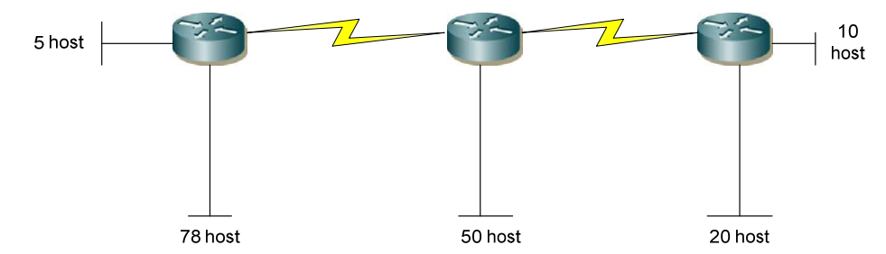
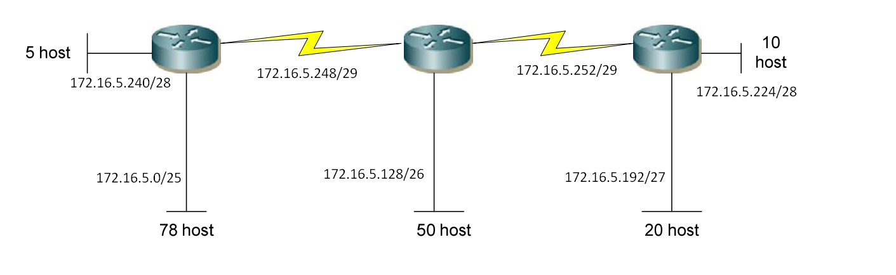

Công thức cần nhớ:
- Số subnet có thể có: 2số bit mượn
- Số host trên mỗi subnet: 2số bit host còn lại - 2
- Bước nhảy: 2số bit host trong octet bị chia cắt
- Địa chỉ mạng: Bội số của bước nhảy.
- Host đầu: Network + 1
- Broadcast: Next Network - 1
- Host cuối: Broadcast -1
- Subnet zero là khi tất cả các bit mượn(Subnet bits) = 0
- Subnet cuối cùng là khi tất cả các bit mượn (Subnet bits) = 1
- Khi subnet bị chia cắt, octet bị chia cắt là octet chứa phần ranh giới giữa phần mạng (Network) và phần host trong subnet mask.
---
## 4.6.1
**a\)** 192.168.2.0/24 mượn 5 bit.
- Số subnet có thể có = 25 
- Số host trên mỗi subnet: 28-5-2
- Địa chỉ mạng có octet thứ 4 là bội số của 8(octet này bị mượn 5 bit)
  - 192.168.2.0 : địa chỉ mạng
  - 192.168.2.1 : địa chỉ host đầu

    .......

  - 192.168.2.6 : địa chỉ host cuối
  - 192.168.2.7 : địa chỉ broadcast
  

  - 192.168.2.8 : địa chỉ mạng
  - 192.168.2.9 : địa chỉ host đầu

    .......

  - 192.168.2.14 : địa chỉ host cuối
  - 192.168.2.15 : địa chỉ broadcast
    
    **................................**

  - 192.168.2.248 : địa chỉ mạng
  - 192.168.2.249 : địa chỉ host đầu

    .......

  - 192.168.2.254 : địa chỉ host cuối
  - 192.168.2.255 : địa chỉ broadcast

**b\)** 192.168.12.0/24 mượn 3 bit
- Số subnet có thể có: 23
- Số host trên mỗi subnet: 28-3-2
- Địa chỉ mạng có octet thứ 4 là bội số của 32(octet này bị mượn 3 bit)
  - 192.168.2.0 : địa chỉ mạng
  - 192.168.2.1 : địa chỉ host đầu

    .......

  - 192.168.2.30 : địa chỉ host cuối
  - 192.168.2.31 : địa chỉ broadcast
  

  - 192.168.2.32 : địa chỉ mạng
  - 192.168.2.33 : địa chỉ host đầu

    .......

  - 192.168.2.62 : địa chỉ host cuối
  - 192.168.2.63 : địa chỉ broadcast
    
    **................................**

  - 192.168.2.224 : địa chỉ mạng
  - 192.168.2.225 : địa chỉ host đầu

    .......

  - 192.168.2.254 : địa chỉ host cuối
  - 192.168.2.255 : địa chỉ broadcast

**c\)** 172.16.2.0/24 mượn 2 bit
- Số subnet có thể có: 22 = 4
- Số host trên mỗi subnet: 28-2-2
- Địa chỉ mạng có octet thứ 4 là bội số của 64(octet này bị mượn 2 bit)
  - 172.16.2.0 : địa chỉ mạng
  - 172.16.2.1 : địa chỉ host đầu

    .......

  - 172.16.2.62 : địa chỉ host cuối
  - 172.16.2.63 : địa chỉ broadcast
  

  - 172.16.2.64 : địa chỉ mạng
  - 172.16.2.65 : địa chỉ host đầu

    .......

  - 172.16.2.126 : địa chỉ host cuối
  - 172.16.2.127 : địa chỉ broadcast
    
    **................................**

  - 172.16.2.192 : địa chỉ mạng
  - 172.16.2.193 : địa chỉ host đầu

    .......

  - 172.16.2.254 : địa chỉ host cuối
  - 172.16.2.255 : địa chỉ broadcast

**d\)** 172.16.0.0/16 mượn 3 bit
- Số subnet có thể có: 23 = 8
- Số host trên mỗi subnet: 213-2
- Địa chỉ mạng có octet thứ 3 là bội số của 32(octet này bị mượn 3 bit)
  - 172.16.0.0 : địa chỉ mạng
  - 172.16.0.1 : địa chỉ host đầu

    .......

  - 172.16.31.254 : địa chỉ host cuối
  - 172.16.31.255 : địa chỉ broadcast
  

  - 172.16.32.0 : địa chỉ mạng
  - 172.16.32.1 : địa chỉ host đầu

    .......

  - 172.16.63.254 : địa chỉ host cuối
  - 172.16.63.255 : địa chỉ broadcast
    
    **................................**

  - 172.16.224.0 : địa chỉ mạng
  - 172.16.224.1 : địa chỉ host đầu

    .......

  - 172.16.224.254 : địa chỉ host cuối
  - 172.16.224.255 : địa chỉ broadcast

**e\)** 172.16.0.0/16 mượn 12 bit
- Số subnet có thể có: 24 = 16 
- Số host trên mỗi subnet: 24-2
- Địa chỉ mạng có octet thứ 4 là bội số của 16(octet này bị mượn 4 bit)
  - 172.16.0.0 : địa chỉ mạng
  - 172.16.0.1 : địa chỉ host đầu

    .......

  - 172.16.0.14 : địa chỉ host cuối
  - 172.16.0.15 : địa chỉ broadcast
  

  - 172.16.0.16 : địa chỉ mạng
  - 172.16.0.17 : địa chỉ host đầu

    .......

  - 172.16.0.31 : địa chỉ host cuối
  - 172.16.0.32 : địa chỉ broadcast
    
    **................................**

  - 172.16.0.240 : địa chỉ mạng
  - 172.16.0.241 : địa chỉ host đầu

    .......

  - 172.16.0.254 : địa chỉ host cuối
  - 172.16.0.255 : địa chỉ broadcast

**f\)** 10.0.0.0/8 mượn 5 bit.
  - Số subnet có thể có: 25
  - Số host trên mỗi subnet: 219-2
  - Địa chỉ mạng có octet thứ 2 là bội số của 8(octet này bị mượn 5 bit)
  - 10.0.0.0 : địa chỉ mạng
  - 10.0.0.1 : địa chỉ host đầu

    .......

  - 10.7.255.254 : địa chỉ host cuối
  - 10.7.255.255 : địa chỉ broadcast
  

  - 10.8.0.0 : địa chỉ mạng
  - 10.8.0.1 : địa chỉ host đầu

    .......

  - 10.15.255.254 : địa chỉ host cuối
  - 10.15.255.255 : địa chỉ broadcast
    
    **................................**

  - 10.248.0.0 : địa chỉ mạng
  - 10.248.0.1 : địa chỉ host đầu

    .......

  - 10.255.255.254 : địa chỉ host cuối
  - 10.255.255.255 : địa chỉ broadcast

**g\)** 10.0.0.0/8 mượn 10 bit
  - Số subnet có thể có: 22
  - Số host trên mỗi subnet: 214-2
  - Địa chỉ mạng có octet thứ 3 là bội số của 64(octet này bị mượn 2 bit)
  - 10.0.0.0 : địa chỉ mạng
  - 10.0.0.1 : địa chỉ host đầu

    .......

  - 10.0.63.254 : địa chỉ host cuối
  - 10.0.63.255 : địa chỉ broadcast
  

  - 10.0.64.0 : địa chỉ mạng
  - 10.0.64.1 : địa chỉ host đầu

    .......

  - 10.0.127.254 : địa chỉ host cuối
  - 10.0.127.255 : địa chỉ broadcast
    
    **................................**

  - 10.0.192.0 : địa chỉ mạng
  - 10.0.192.1 : địa chỉ host đầu

    .......

  - 10.0.255.254 : địa chỉ host cuối
  - 10.0.255.255 : địa chỉ broadcast

**h\)** 10.0.0.0/8 mượn 18 bit
  - Số subnet có thể có: 22
  - Số host trên mỗi subnet: 212-2
  - Địa chỉ mạng có octet thứ 4 là bội số của 64(octet này bị mượn 2 bit)
  - 10.0.0.0 : địa chỉ mạng
  - 10.0.0.1 : địa chỉ host đầu

    .......

  - 10.0.0.62 : địa chỉ host cuối
  - 10.0.0.63 : địa chỉ broadcast
  

  - 10.0.0.64 : địa chỉ mạng
  - 10.0.0.65 : địa chỉ host đầu

    .......

  - 10.0.0.127 : địa chỉ host cuối
  - 10.0.0.128 : địa chỉ broadcast
    
    **................................**

  - 10.0.0.192 : địa chỉ mạng
  - 10.0.0.193 : địa chỉ host đầu

    .......

  - 10.0.0.254 : địa chỉ host cuối
  - 10.0.0.255 : địa chỉ broadcast
  
## 4.6.2 Cho mạng 172.16.5.0/24

Xét mạng nhiều host nhất có 78 host  và 5 host thêm.
Ta cần giải hệ:
- 2m ≥ 78
- m + n = 8 (mượn bit ở octet thứ 4 với với m: số bit host, n: số bit mượn).
m = 7, n = 1. Vậy ta mượn 1 bit, dành mạng 172.16.5.0/25 để gán cho mạng 78 host. Vậy dải địa chỉ còn lại 172.16.5.128 -> 172.16.5.255

Xét đến mạng 50 host.
- 2m ≥ 51
- m + n = 7 (mượn bit ở octet thứ 4 với với m: số bit host, n: số bit mượn).
m = 6, n = 1. Vậy ta mượn 1 bit, dành mạng 172.16.5.128/26 để gán cho mạng 50 host. Vậy dải địa chỉ còn lại 172.16.5.192 -> 172.16.5.255

Xét mạng có 20 host.
Ta cần giải hệ:
- 2m ≥ 21
- m + n = 6 (mượn bit ở octet thứ 4 với với m: số bit host, n: số bit mượn).
m = 5, n = 1. Vậy ta mượn 1 bit, dành mạng 172.16.5.192/27 để gán cho mạng 20 host. Vậy dải địa chỉ còn lại 172.16.5.224 -> 172.16.5.255

Xét mạng có 10 host.
Ta cần giải hệ:
- 2m ≥ 11
- m + n = 5 (mượn bit ở octet thứ 4 với với m: số bit host, n: số bit mượn).
m = 4, n = 1. Vậy ta mượn 1 bit, dành mạng 172.16.5.224/27 để gán cho mạng 10 host. Vậy dải địa chỉ còn lại 172.16.5.240 -> 172.16.5.255

Xét mạng có 5 host.
Ta cần giải hệ:
- 2m ≥ 6
- m + n = 4 (mượn bit ở octet thứ 4 với với m: số bit host, n: số bit mượn).
m = 3, n = 1. Vậy ta mượn 1 bit, dành mạng 172.16.5.240/27 để gán cho mạng 10 host. Vậy dải địa chỉ còn lại 172.16.5.248 -> 172.16.5.255

Tiếp đó ta xét đến các mạng có 2 host là các liên kết điểm – điểm serial, ta xem
thử mượn bao nhiêu bit là phù hợp:
- 2m – 2 ≥ 2
- m + n = 3 (mượn bit ở octet thứ 4 với với m: số bit host, n: số bit mượn).

m = 2 và n = 1 là tối ưu nhất. Vậy ta mượn 1 bit mạng với 21 = 172.16.5.248 và 172.16.5.252 để gán cho 2 liên kết serial.

## 4.6.3 

**a\)** 192.168.1.130/29 
- mượn 5 bit ở octet thứ 4, bước nhảy là bội số của 8. Ta lấy 130/8 = 16 và dư 2. 16x8 = 128 vậy host này thuộc mạng 192.168.1.128/29

**b\)** 172.16.34.57/18
- mượn 2 bit ở octet thứ 3, bước nhảy là bội số của 32. Ta lấy 34/32 = 1 dư 2. Vậy host này thuộc mạng 172.16.32.0/18

**c\)** 203.162.4.191/28
- mượn 4 bit ở octet thứ 4, bước nhảy là bội số của 16. Ta lấy 191/16 = 11 dư 15. Vậy địa chỉ này thuộc mạng 203.162.4.176/28 nhưng là địa chỉ broadcast, không thể dùng làm host.

**d\)** 1.1.1.1/30
- Dùng làm địa chỉ broadcast.

**e\)** 10.10.10.89/29
- Mượn 5 bit ở octet thứ 4, bước nhảy là bội số của 8. Ta lấy 89/8 = 11 dư 1. Vậy địa chỉ IP này thuộc mạng 10.10.10.88/29. Dùng làm địa chỉ broadcast, không thích hợp làm địa chỉ host.

**f\)** 70.9.12.35/30
- Mượn 6 bit ở octet thứ 4, bước nhảy là bội số của 4. Địa chỉ IP này thuộc mạng 70.9.12.32/30, được dùng làm địa chỉ broadcast, không thích hợp làm địa chỉ host.

**g\)** 158.16.23.208/29
- Mượn 5 bit ở octet thứ 4, bước nhảy là bội số của 8. Địa chỉ IP này là địa chỉ mạng không được dùng làm địa chỉ host.

## 4.6.4

**a\)**
192.168.0.0/24 - 
192.168.1.0/24 - 
192.168.2.0/24 - 
192.168.3.0/24 

Địa chỉ mạng đại diện là 192.168.0.0/24 do có các bit thuộc phần host đều bằng 0.

**b\)**
172.16.16.0/24 - 
172.16.20.0/24 - 
172.16.24.0/24 - 
172.16.28.0/24 

Địa chỉ mạng đại diện là 172.16.16.0/24 do có các bit thuộc phần host đều bằng 0.
