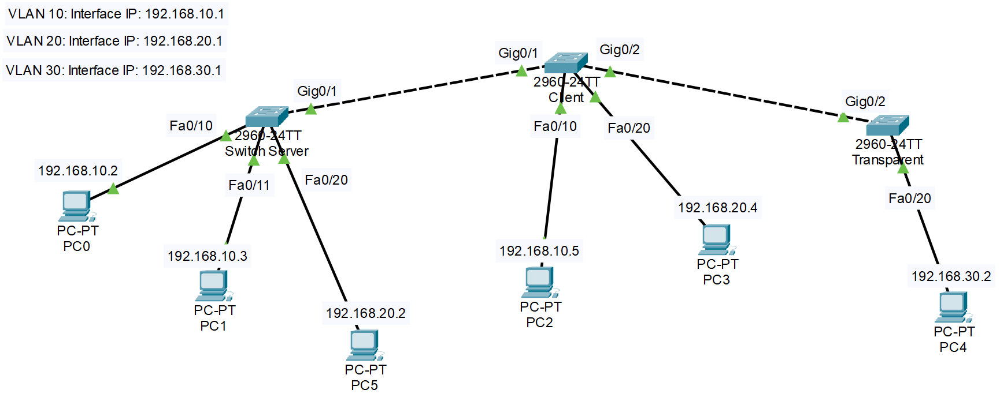
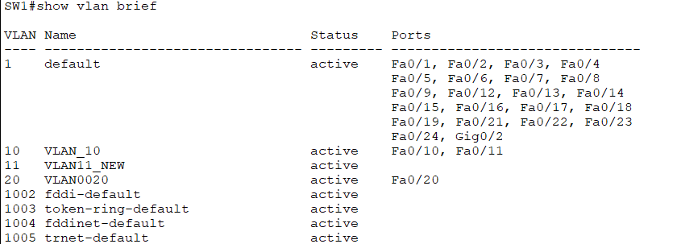
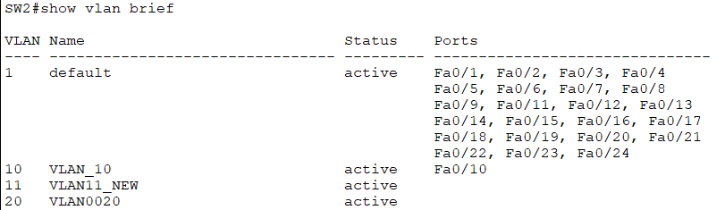
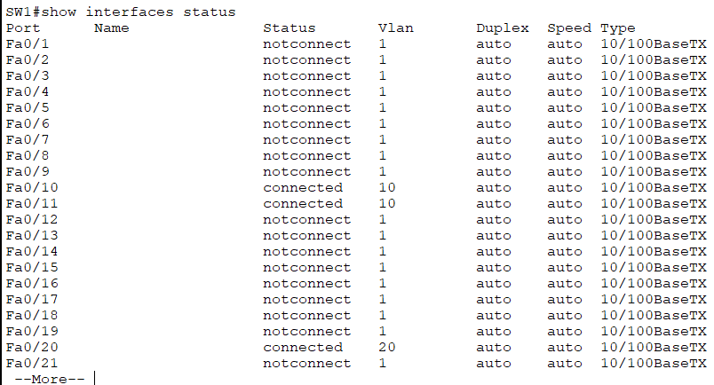
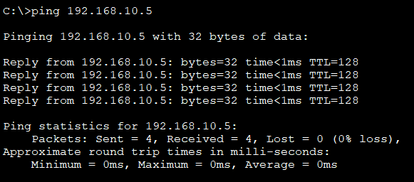

# Cấu hình VTP domain
## Sơ đồ Lab


## Cấu hình VTP
### 1. Các thiết bị dùng
- 3 Switch Cisco 2960 IOS15.
- 6 PC
- Kết nối: Kết nối Switch Server(Gig0/1) với Switch Client(Gig0/1) bằng cáp Cross-Over. Kết nối Switch2 (Gig0/2) với Switch3 (Gig0/2) bằng cáp Cross-Over.
- Switch1: PC0(Fa0/10, VLAN 10), PC1(Fa0/11,VLAN10), PC5(Fa0/20, VLAN20).
- Switch2: PC2(Fa0/10, VLAN 10), PC3(Fa0/20, VLAN20)
- Switch3: PC4(Fa0/20, VLAN 30)
### 2. Cấu hình từng PC
- PC 1: 
  - IP address: 192.168.10.2
  - Subnet mask: 255.255.255.0
  - Default Gateway: (Bỏ trống nếu không có Router)
- Các PC khác làm tương tự.
### 3. Thiết lập VLAN
#### 3.1 Đặt tên switch
``` plaintext
Switch>enable
Switch#configure terminal
Switch(config)#hostname SW1
SW1(config)#
```
- `enable`: chuyển từ chế độ User EXEC(dấu nhắc >) sang Privileged EXEC(dấu nhắc #). EXEC mode: quyền hạn chế chỉ dùng được các lệnh cơ bản như xem thông tin (ping, show,...). Không cấu hình được thiết bị. Privileged EXEC mode: Có quyền chạy các lệnh quản trị nâng cao.
- `configure terminal`(conf t): là lệnh dùng để vào cấu hình toàn cục(Global Configuration Mode): cho phép thay đổi cấu hình chung của thiết bị. Tại đây cũng có thể vào các cấu hình con.
- `hostname SW1`: Đặt tên cho thiết bị là "SW1".
- Tương tự trên Switch 2 và 3.
---
#### 3.2 Tạo VLAN trên Switch Server
```plaintext
SW1(config)#vlan 10
SW1(config-vlan)#name VLAN_10
SW1(config-vlan)#end

SW1(config)#vlan20
SW1(config-vlan)#name VLAN_20
SW2(config-vlan)#end
SW2(config)#
```
**Gán các Port vào VLAN**
```plaintext
SW1(config)#interface fa0/10
SW1(config-ip)#switchport access vlan 10
SW1(config-ip)#end 

SW1(config)#interface fa0/11
SW1(config-ip)#switchport access vlan 10
SW1(config-ip)#end 

SW1(config)#interface fa0/20
SW1(config-ip)#switchport access vlan 20
SW1(config-ip)#end 

SW1(config)#end
SW1# show vlan brief
```
**Kiểm tra kết quả:**

 
### 4. Cấu hình VTP
#### 4.1 Đặt địa chỉ IP cho Interface VLAN10 là 192.168.10.1 và VLAN20 là 192.168.20.1
```plaintext
SW1#configure terminal
SW1(config)#interface vlan 10
SW1(config-ip)#ip address 192.168.10.1 255.255.255.0
SW1(config-ip)#no shutdown
SW1(config-ip)#end
SW1(config-ip)#

SW1#configure terminal
SW1(config)#interface vlan 20
SW1(config-ip)#ip address 192.168.20.1 255.255.255.0
SW1(config-ip)#no shutdown
SW1(config-ip)#end
SW1(config-ip)#
```
#### 4.2 Cấu hình Trunk port giữa các Switch
- Switch 1: Server
```plaintext
SW1>enable
SW1#configure terminal
SW1(config)#interface gig0/1
SW1(config-if)#switchport mode trunk
SW1(config-ip)#switchport trunk allowed vlan 1,10,20
SW1(config-ip)#switchport trunk native vlan 1
SW1(config-ip)#end
```
- Switch 2: Client
```plaintext
SW1(config)#interface gig0/1
SW1(config-if)#switchport mode trunk
SW1(config-ip)#switchport trunk allowed vlan 1,10,20
SW1(config-ip)#switchport trunk native vlan 1
SW1(config-ip)#end

SW1(config)#interface gig0/2
SW1(config-if)#switchport mode trunk
SW1(config-ip)#switchport trunk allowed vlan 1,10,20
SW1(config-ip)#switchport trunk native vlan 1
SW1(config-ip)#end
```
- Switch 3: Transparent
```plaintext
SW1>enable
SW1#configure terminal
SW1(config)#interface gig0/1
SW1(config-if)#switchport mode trunk
SW1(config-if)#switchport trunk encapsulation dot1q
SW1(config-ip)#switchport trunk allowed vlan 1,10,20,30
SW1(config-ip)#switchport trunk native vlan 1
SW1(config-ip)#end
```
#### 4.3 Cấu hình VTP trên các Switch
- Đặt cùng VTP domain và password (bảo mật) để đồng bộ.
- Switch1 (Server):
```plaintext
SW1>enable
SW1#configure terminal
SW1(config)#vtp domain LabVTP
SW1(config)#vtp mode server
SW1(config)#vtp password secret
SW1(config)#end
SW1#write memory
```

- Switch2 (Client):
```plaintext
SW1>enable
SW1#configure terminal
SW1(config)#vtp domain LabVTP
SW1(config)#vtp mode client
SW1(config)#vtp password secret
SW1(config)#end
SW1#write memory
```

- Switch3 (Client):
```plaintext
SW1>enable
SW1#configure terminal
SW1(config)#vtp domain LabVTP
SW1(config)#vtp mode transparent
SW1(config)#vtp password secret
SW1(config)#end
SW1#write memory
```
- Switch 2 đã đồng bộ thành công VLAN 10,20


- VTP sẽ tự động gửi bản cập nhập (advertisement) qua trunk. Revision Number trên Server tăng.
- Trên Switch2 (Client): VLAN10 và 20 sẽ tự động đồng bộ sau vài giây. Không tạo VLAN mới trên client (vì mode Client không cho phép).
- Trên Switch3(Transparent): Không đồng bộ VLAN từ Server, nhưng có thể tạo VLAN riêng (ví dụ VLAN 30).
- Các lệnh kiểm tra: `show vtp status`: hiển thị domain name hoặc password khác nhau giữa Server và Client., `show vlan brief`,`show interfaces trunk`: hiển thị các cổng trunk. Kiểm tra trạng thái cổng: `show interfaces status`.



- PC0 thuộc switch server ping to PC2 thuộc switch clien:



### Phần bổ sung
- `SW1(config-if)# switchport mode allowed vlan 10`: Xoá và ghi đè
- `SW1(config-if)# switchport mode allowed add vlan 10`: Ghi thêm vào nếu muốn đổi thêm remove để xoá
- Port Security là một tính năng trên switch Cisco được sử dụng để giới hạn và kiểm soát các địa chỉ MAC được phép truy cập qua một cổng cụ thể. Khi được cấu hình, port security giúp ngăn chặn truy cập trái phép bằng cách giới hạn số lượng địa chỉ MAC có thể dược học hoặc cấu hình tĩnh trên cổng.
- Giới hạn số lượng MAC address: Mặc định, port security cho phép tối đa 1 địa chỉ MAC được học trên cổng (maximum 1). Nếu số lượng địa chỉ MAC vượt quá giới hạn này (ví dụ, switch học được hơn 1 MAC address), cổng sẽ chuyển sang trạng thái err-disabled để bảo vệ mạng.