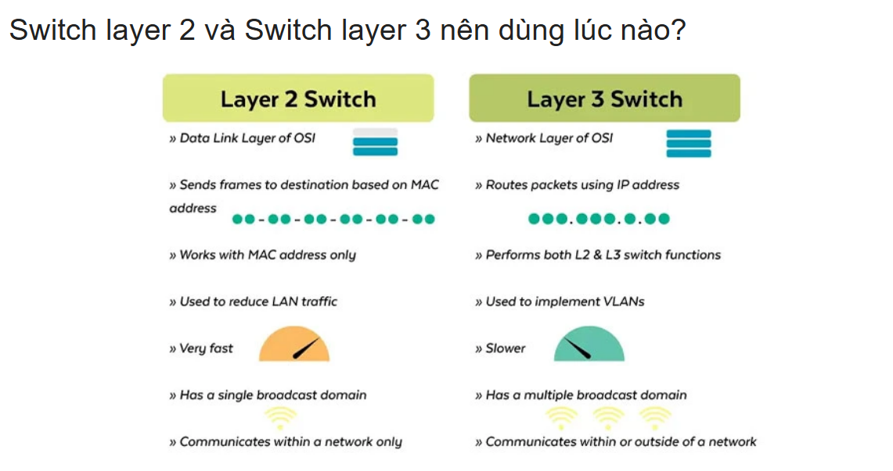
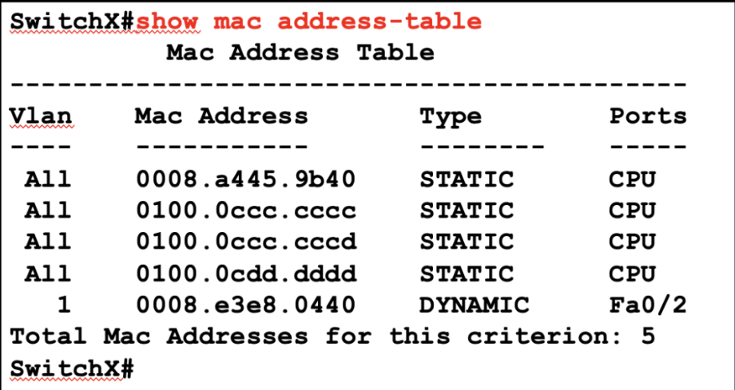
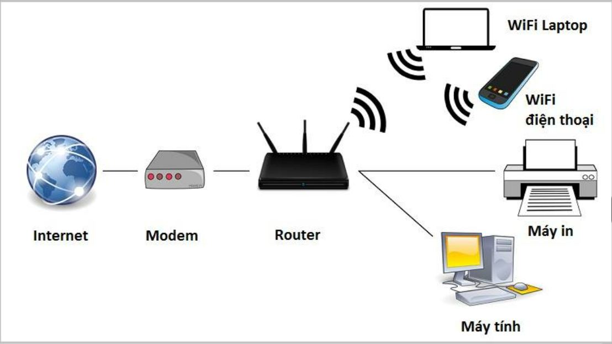
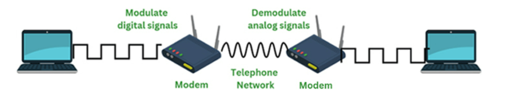
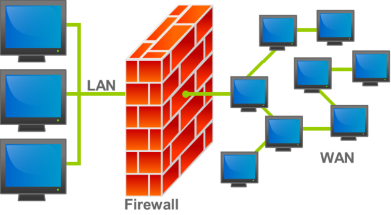

# CÁC THIẾT BỊ MẠNG

## Switch
Switch là một bộ chuyển mạch trong hệ thống mạng, dùng để kết nối nhiều thiết bị trong cùng một mạng cục bộ LAN và chuyển tiếp dữ liệu thông minh dựa trên địa chỉ MAC, nó hoạt động ở tầng 2 Data Link trong mô hình OSI nhưng cũng có Switch L3 hoạt động ở tầng Network Layer là tầng 3 trong mô hình OSI.
## Cách hoạt động của Switch
### So sánh Switch L2 và Switch L3

|Tiêu chí| Switch Layer 2| Switch Layer 3|
|-----|-------|-------|
|Tầng hoạt động| Tầng 2 trong mô hình OSI(Data Link Layer)| Tầng 3 trong mô hình OSI(Network Layer)|
|Chức năng| Chuyển tiếp dữ liệu giữa các thiết bị trong cùng một mạng con(subnet) bằng cách sử dụng địa chỉ MAC| Không chỉ chuyển tiếp dữ liệu giữa các thiết bị trong cùng mạng con, mà còn định tuyến dữ liệu giữa các mạng con khác nhau trong mạng lớn hơn, sử dụng địa chỉ IP.|
|Phạm vi hoạt động| Các mạng VLAN nhỏ và đơn giản | Cho các mạng lớn và phức tạp, nơi cần định tuyến giữa các mạng con và tối ưu hoá việc giao tiếp giữa chúng.|
| Định tuyến| Không có khả năng định tuyến và chỉ sử dụng mạng thông minh(MAC Address table) để xác định đích của dữ liệu trong cùng mạng con.| Có khả năng định tuyến dữ liệu giữa các mạng con, sử dụng thông tin trong tiêu đề IP để xác định đường đi tối ưu.|
| Phạm vi địa chỉ| Sử dụng địa chỉ MAC để xác định đích và nguồn của dữ liệu trong mạng LAN| Sử dụng địa chỉ IP để định tuyến và chuyển tiếp dữ liệu giữa các mạng con|

- Tập hợp các máy nối vào 1 chuỗi Switch tạo thành 1 broadcast Domain.
- Switch layer 3 sẽ có địa chỉ IP gán cho mỗi cổng hoặc giao diện mạng, trong khi Switch layer 2 thường không cần địa chỉ IP cho mỗi cổng.
- Switch layer 3 thường hỗ trợ các tính năng định tuyến và chia VLAN dựa trên địa chỉ IP, trong khi Switch layer 2 thường chỉ hỗ trợ chia VLAN dựa trên địa chỉ MAC.
### Cách Switch học địa chỉ MAC

- Ban đầu, bảng MAC của switch chống, Khi mới bật lên hoặc mới reset, bảng địa chỉ MAC (MAC address table) của switch chưa có thông tin gì về các thiết bị kết nối.
- Khi một thiết bị (ví dụ: máy tính A) gửi một gói tin ra mạng, gói tin này sẽ có:
  - Địa chỉ MAC nguồn (source MAC): của máy tính A.
  - Địa chỉ MAC đích (destination MAC): của thiết bị mà máy tính A muốn gửi tới.
- Switch nhận được gói tin này tại 1 cổng (Ví dụ cổng f0/1)
- Switch học địa chỉ MAC nguồn: Switch kiểm tra địa chỉ MAC nguồn của gói tin. Nó ghi lại địa chỉ MAC nguồn này vào bảng MAC, gắn với số cổng mà gói tin đi vào.
- Xử lý địa chỉ MAC đích
  - Switch kiểm tra bảng MAC để xem đã biết MAC đích chưa :
    - Nếu đã biết: Switch chỉ gửi gói tin ra đúng cổng đã lưu trong bảng MAC cho địa chỉ MAC đích đó.
    - Nếu chưa biết: Switch sẽ gửi (Flood) gói tin ra tất cả các cổng còn lại ( trừ cổng gửi gói tin), để đảm bảo tới được đích.
- Lặp lại và cập nhập bảng MAC: Quá trình này lặp lại mỗi khi Switch nhận được gói tin mới. Nếu cùng 1 địa chỉ MAC xuất hiện ở cổng khác, switch sẽ cập nhập lại thông tin trong bảng MAC.

### Access Port
- Access port chỉ gắn với 1 VLAN duy nhất, phù hợp với thiết bị đầu cuối như PC, vì chúng không có khả năng xử lý frame có tag VLAN.
- Khi kết nối không dây (Wi-Fi) giữa laptop với mạng LAN
  - Khi laptop kết nối Wifi, nó không kết nối trực tiếp với Switch vật lý mà sẽ kết nối tới một thiết bị gọi là Access Point(AP).
  - AP sau đó sẽ kết nối với Switch vật lý thông qua cáp mạng.

### Modem
- Modem: là thiết bị mạng phổ biến hay gặp nhất trong hệ thống mạng gia đình, thường được sử dụng để kết nối với nhà cung cấp dịch vụ Internet(ISP) như Viettel, FPT, ... Modem có nhiệm vụ điều chế tín hiệu sóng để mã hoá thông tin kỹ thuật số và đồng thời giải đầu tín hiệu. Sau đó, nó tạo lại thông tin kỹ thuật số ban đầu.

- Modem viết tắt của Modulator hay Demodulator hay được gọi là bộ điều giải. Đây là thiết bị phần cứng được sử dụng để kết nối các thiết bị được kết nối trong mạng LAN với Internet, chức năng chủ yếu của modem là chuyển đổi tín hiệu Analog từ cáp thoại sang tín hiệu Digital hoặc chuyển đổi tín hiệu Digital qua tín hiệu Analog để truyền đi. Ở tín hiệu digital, số dữ liệu được lưu trữ dưới dạng 0 và 1 nhằm truyền tải dữ liệu qua các phương tiện truyền dẫn như dây đồng, cáp quang, sóng vô tuyến hoặc đường dây điền thoại. Hoặc tín hiệu Analog hay light pulse phía WAN side (ISP)

- **Tại sao chúng ta cần modem**:
  - Trong LAN, dữ liệu là tín hiệu số (digital signal) truyền trực tiếp qua cáp đồng ngắn, tốc độ cao, và không cần điều chế phức tạp vì khoảng cách gần (thường dưới 100m), môi trường ít nhiễu.
  - Nhưng kết nối từ nhà bạn đến ISP là WAN (Wide Area Network), với khoảng cách xa (có thể hàng km đến hàng chục km), qua hạ tầng công cộng như đường dây điện thoại (DSL), cáp đồng trục (cable), cáp quang (fiber), hoặc sóng di động (4G/5G). Những hạ tầng này không được thiết kế để truyền tín hiệu số Ethernet trực tiếp: 
    - Khoảng cách xa: Tín hiệu số Ethernet yếu đi nhanh chóng khi truyền xa, dễ bị nhiễu (interference) từ điện từ, thời tiết, hoặc các tín hiệu khác. 
    - Hạ tầng cũ/mục đích khác: Nhiều ISP tận dụng hạ tầng sẵn có, như đường dây điện thoại (cho DSL) hoặc cáp TV (cho cable), vốn không phải dành riêng cho dữ liệu số. Nếu truyền trực tiếp tín hiệu Ethernet qua đó, dữ liệu sẽ bị méo mó, mất mát, hoặc không tương thích.
    - Tối ưu hóa: Để truyền dữ liệu tốc độ cao qua khoảng cách xa, cần chuyển đổi thành dạng tín hiệu khác (analog, quang, hoặc tần số cao) để chống nhiễu, tăng khoảng cách, và chia sẻ tài nguyên (như băng thông).
  - Modem (Modulator-Demodulator) làm đúng như tên gọi: Điều chế (modulate) tín hiệu số từ router thành dạng phù hợp với hạ tầng ISP, và giải điều chế (demodulate) tín hiệu nhận về thành dữ liệu số.
  - Tương thích hạ tầng: 
    - Với DSL (Digital Subscriber Line): Sử dụng đường dây điện thoại đồng cũ. Modem điều chế dữ liệu thành tần số cao (không ảnh hưởng đến cuộc gọi thoại ở tần số thấp). Nếu không điều chế, dữ liệu sẽ lẫn với tiếng nói hoặc không truyền xa được. 
    - Với Cáp quang (Fiber): Modem (thường gọi ONT - Optical Network Terminal) chuyển dữ liệu thành tín hiệu quang (ánh sáng laser). Tín hiệu số Ethernet không thể truyền qua sợi quang mà không chuyển đổi.
    - Với Di động (4G/5G): Modem (trong router di động) điều chế thành sóng vô tuyến. Không thể truyền Ethernet qua không khí mà không có điều chế.
  - Chống nhiễu và truyền xa: Điều chế giúp "mã hóa" dữ liệu vào sóng mang (carrier wave) mạnh mẽ hơn, dễ khôi phục ở đầu kia. Ví dụ, trong cáp đồng, nhiễu điện từ có thể làm hỏng tín hiệu số trực tiếp, nhưng sau điều chế, nó trở nên bền bỉ hơn.
  - Tiết kiệm chi phí: ISP không cần xây dựng hạ tầng Ethernet riêng từ nhà bạn đến trạm (rất tốn kém, phải đào đường, kéo cáp mới). Họ tận dụng hạ tầng cũ, chỉ cần modem ở hai đầu để "dịch".
- **Cách thức hoạt động của Modem**
  - **Mạng nội bộ LAN**: 
    - Thiết bị gửi: Máy tính ở Hà Nội tạo gói dữ liệu (IP Packet) chứa địa chỉ IP đích (Bắc Kinh).
    - Router gia đình: Xem bảng định tuyến → thấy IP đích không thuộc LAN → gửi gói tới Gateway (qua các router gần đó và ra tới modem của nhà mạng ISP khu vực).
    - Kết nối: Dùng Ethernet hoặc Wi-Fi (dạng digital signal trong phạm vi ngắn).
  - **Từ nhà bạn đến ISP Việt Nam**:
    - Modem: Chuyển tín hiệu digital sang tín hiệu analog-like(QAM/OFDM, ánh sáng, quang học,...) để truyền qua cáp quang / DSL.
    - Điểm tập trung ISP: Các DSLAM hoặc OLT (nếu dùng cáp quang) gom nhiều kết nối dân cư -> đưa về router biên (edge router) của ISP.
  - **Mạng lõi của ISP Việt Nam**:
    - Edge router của ISP VN -> quyết định gói này đi ra nước ngoài -> đẩy vào core routers.
    - Core routers: Làm việc ở tốc độ rất cao, chỉ đọc địa chỉ IP và bảng định tuyến BGP để tìm đường tốt nhất. 
    - Cáp quang biển / đường truyền quốc tế: Ví dụ từ Hà Nội -> qua trạm cáp quang biển tại Đà Nẵng hoặc qua cửa khẩu Hữu Nghị(nếu đi đường cáp quang xuyên biên giới) -> ra mạng quốc tế.
  - **Kết nối quốc tế & ISP Trung Quốc**
    - Điểm trung chuyển quốc tế: Gói đi vào ISP Trung Quốc thông qua các peering points.
    - BGP routing: Các ISP trao đổi thông tin tuyến qua giao thức BGP để biết “đường” nào đưa gói tới Bắc Kinh.
  - **Mạng lõi của ISP Trung Quốc**
    - Core routers bên Trung Quốc chuyển tiếp gói qua nhiều router nội địa tốc độ cao.
    - Đến router biên của thành phố Bắc Kinh → vào mạng nội bộ khu vực.
  - **Mạng khu vực / doanh nghiệp**
    - Gói đi qua router khu vực → router doanh nghiệp / tổ chức → cuối cùng đến PC nhận ở Bắc Kinh.
    - Lớp TCP ở đích xác nhận (ACK) → gửi ngược lại đường tương tự (nhưng không nhất thiết cùng tuyến).
  - **Nguyên tắc chung của quy trình**
    - Gói dữ liệu (packet): Là một đơn vị dữ liệu nhỏ (khoảng 1500 bytes), chứa header với IP nguồn (của bạn ở Hà Nội), IP đích (ví dụ: 220.181.38.148 của baidu.com ở Bắc Kinh), và nội dung (như yêu cầu web).
    - Định tuyến: Mỗi router nhận packet, đọc IP đích, tra bảng định tuyến (routing table), và forward đến next-hop. Nếu qua khoảng cách xa, dùng hạ tầng cáp quang biển (như APG, IA, AAE-1 nối VN-Trung Quốc qua Hong Kong hoặc trực tiếp biên giới đất liền tại Lạng Sơn/Móng Cái).
    - Hops: Mỗi router là một "hop". Latency (độ trễ) tăng dần do khoảng cách (~2500km, nhưng đường mạng có thể dài hơn): 11 (có thể nhiều hơn nếu đường detour do tải cao).
    - ISP (Internet Service Provider): Các nhà mạng lớn, mỗi ISP quản một AS (Autonomous System). Packet thường qua ISP nguồn → transit ISP → ISP đích: 4 (Viettel/VNPT → PCCW/Transit → China Telecom/Unicom → Baidu network).
    - Số lượng điển hình:
      - Số router (hops): 10-20 (bao gồm router nội bộ và quốc tế).
      - Số ISP: 3-5 (ISP Việt Nam, ISP trung gian như PCCW Hong Kong, ISP Trung Quốc như China Telecom/Unicom, và có thể Tier-1 như Level3).
    - Thời gian: 50-200ms round-trip, tùy chất lượng.
    
    
### Router
#### Khái niệm
Router(bộ định tuyến) là thiết bị mạng hoạt động ở tầng 3 mô hình OSI dùng để kết nối nhiều mạng IP khác nhau và định tuyến(chọn đường) cho các gói dữ liệu từ nguồn đến đích dựa trên địa chỉ IP đích.
- Switch: nối các thiết bị trong cùng một mạng.
- Router: nối các mạng khác nhau lại với nhau.
#### Cách thức hoạt động
- Nhận gói tin từ cổng mạng (interface).
- Đọc thông tin địa chỉ IP đích trong header của gói tin.
- So khớp với bảng định tuyến (Routing Table) để tìm đường tốt nhất( next hop, interface).
- Chuyển tiếp gói tin ra cổng tương ứng để đến mạng tiếp theo hoặc đích cuối cùng.
  - Router có thể dùng nhiều phương thức để tìm đường:
    - Static routing: Quản trị viên cấu hình thủ công.
    - Dynamic routing: Dùng giao thức định tuyến như OSPF, EIGRP, BGP để tự động cập nhật đường đi.

### Firewall (Tường lửa)

  

- Firewall là hệ thống phần cứng hoặc phần mềm dùng để giám sát, lọc và kiểm soát lưu lượng mạng vào/ra dựa trên tập hợp các quy tắc bảo mật.
- Mục tiêu: Ngăn chặn truy cập trái phép, cho phép kết nối hợp lệ.
- Có thể triển khai dưới dạng:
  - Phần cứng: thiết bị chuyên dụng(Cisco ASA, FortGate...)
  - Phần mềm: chạy trên máy tính/ máy chủ (Windows Firewall, iptables...)
- **Cách thức hoạt động**:
  - Nhận gói tin từ mạng vào (inbound) hoặc ra ngoài (outbound).
  - Phân tích thông tin trong gói tin: Địa chỉ IP nguồn/ đích, Cổng TCP/UDP, Giao thức (HTTP,FTP, ICMP,...), Nội dung (nếu là firewall nâng cao - DPI)
  - So sánh với quy tắc (rule/policy): Cho phép(allow), Chặn (deny/drop), Ghi log.
  - Thực hiện hành động theo kết quả so khớp.

| Loại Firewall            | Layer chính                             | Đặc điểm                                                            |
| ------------------------ | --------------------------------------- | ------------------------------------------------------------------- |
| **Packet Filtering**     | Layer 3 (Network) & Layer 4 (Transport) | Lọc dựa trên IP, port, protocol.                                    |
| **Stateful Firewall**    | Layer 3–4                               | Theo dõi trạng thái kết nối, cho phép gói tin thuộc kết nối hợp lệ. |
| **Application Firewall** | Layer 7 (Application)                   | Hiểu được dữ liệu ứng dụng (HTTP, SMTP…), lọc sâu nội dung.         |
| **Next-Gen Firewall**    | Layer 3–7                               | Kết hợp stateful + DPI + IDS/IPS + lọc ứng dụng.                    |

### Hub

- Hub là một thiết bị mạng đơn giản hoạt động ở Layer 1 của tầng mạng OSI (physical Layer) dùng để kết nối nhiều thiết bị trong cùng một mạng LAN. Nó hoạt động như một bộ lặp (repeater), nhận tín hiệu từ một cổng và phát (broadcast) ra tất cả các cổng còn lại.
- **Cách thức hoạt động**
  - Một thiết bị gửi dữ liệu vào Hub.
  - Hub không phân tích địa chỉ gì hết mà chỉ nhân bản và phát dữ liệu đó ra tất cả các cổng còn lại.
  - Tất cả các thiết bị nhận được dữ liệu, chỉ thiết bị có địa chỉ đích đúng mới xử lý, còn lại bỏ đi.

  ### Gig và Fa cổng trong Switch
  - Fa(FastEthernet): chuẩn Ethernet tốc độ 100 Mbps, có thể chạy 10/100Mbps(half/full duplex).
  - Gi(GigabitEthernet): chuẩn Ethernet tốc độ 1 Gbps = 1000 Mbps. Hỗ trợ tốc độ 10/100/1000 Mbps, thường chạy full duplex mặc định.
  - **Ứng dụng**
    - Fa: thường làm cổng kết nối cho pc
    - Gi: thường dùng làm uplink(nối giữa switch-switch, switch-router) hoặc server vì bằng thông cao hơn.
  - **Half-duplex**(Bán song công): Thiết bị chỉ truyền hoặc nhận tại một thời điểm, không thể làm cả hai cùng lúc.
  - **Full-duplex**: Thiết bị có thể truyền và nhận dữ liệu đồng thời trên cùng đường truyền.