# VLAN Trunking Protocol
VLAN Trunking Protocol(VTP) là một giao thức do Cisco phát triển dùng để quản lý và phân phối thông tin VLAN giữa các switch trong cùng một VTP domain. Nó giúp tự động đồng bộ, cầu hình VLAN giữa nhiều Switch, thay vì phải tạo thủ công từng VLAN trên từng thiết bị.
## 1. Kết nối Trunk
- Kết nối “trunk” là liên kêt Point-to-Point giữa các cổng trên switch với router hoặc với các switch khác trên mạng cho phép truyền nhiều VLAN (Virtual Local Area Network) qua một đường truyền duy nhất.
- Vì kỹ thuật này cho phép dùng chung một kết nối vật lý cho dữ liệu của các VLAN đi qua nên dể phân biệt được chúng là dữ liệu của VLAN nào, người ta gắn vào các gói tin một dấu hiệu gọi là “tagging”. Hay nói cách khác là dùng một kiểu đóng gói riêng cho các gói tin di chuyển qua đường “trunk” này. Giao thức được sử dụng là 802.1Q (dot1 q).
- Mục đích: Tiết kiệm cáp, kết nối nhiều VLAN giữa các thiết bị mà không cần cáp riêng cho từng VLAN.

## Chuẩn IEEE 802.1Q(DOT1Q)

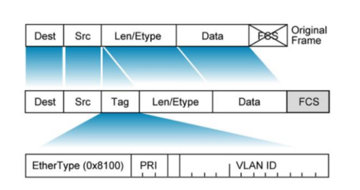

### Khái niệm
- IEEE 802.1Q là một chuẩn giao thức mạng do IEEE phát triển, dùng để hỗ trợ VLAN (Virtual Local Area Network) trên mạng Ethernet.
- Mục đích chính: Cho phép gắn thẻ (tagging) các frame Ethernet để phân biệt dữ liệu thuộc các VLAN khác nhau khi truyền qua một trunk link giữa các thiết bị mạng (switch-switch hoặc switch-router).
- Dot1Q là chuẩn phổ biến nhất để thực hiện VLAN trunking, thay thế cho chuẩn ISL (Inter-Switch Link) độc quyền của Cisco, nhờ tính tương thích cao và hiệu quả.
### Cách hoạt động
  - **Tagging (gắn thẻ):** Khi một frame từ một VLAN đi qua trunk port, switch gắn một VLAN tag (thường là 802.1Q tag, 4 byte) vào header của frame. Tag này chứa thông tin về VLAN ID(12 bit, hỗ trợ tối đa 4096 VLAN). Frame được gửi qua trunk link đến thiết bị khác (switch hoặc router).
  - **Xử lý ở đầu nhận**: Thiết bị nhận (switch/router) đọc VLAN tag, xác định frame thuộc VLAN nào (VD: VLAN 10).
  Switch tách tag ra và chuyển frame đến các port thuộc VLAN tương ứng (hoặc xử lý tiếp nếu là router). Nếu frame thuộc native VLAN (mặc định VLAN 1 trên Cisco), nó không được gắn tag để tiết kiệm băng thông và tương thích với thiết bị không hỗ trợ 802.1Q.
  - **Truyền qua Trunk** Trunk Link thường là Ethernet hoặc quang mang frame của nhiều VLAN, mỗi frame được gắn tag để phân biệt (trừ native VLAN). Các thiết bị phải cấu hình trunk port với giao thức 802.1Q và danh sách VLAN được phép (allowed VLANs).
  - **Native VLAN**: Frame của Native VLAN đi qua Trunk mà không gắn Tag, giúp tương thích với thiết bị không hỗ trợ VLAN hoặc giảm xử lý cho VLAN mặc định. Nếu hai đầu Trunk có Native VLAN khác nhau(misconfiguration), có thể gây lỗi (VLAN mismatch).
  - **Ứng dụng**: Kết nối switch-switch: Cho phép nhiều VLAN (VD: VLAN 10, 20, 30) chia sẻ một cáp. Router-on-a-Stick: Router dùng một giao diện trunk để định tuyến giữa các VLAN. Mạng doanh nghiệp lớn: Quản lý lưu lượng VLAN hiệu quả, tách biệt dữ liệu các phòng ban.
### Thành phần của IEEE 802Q.1

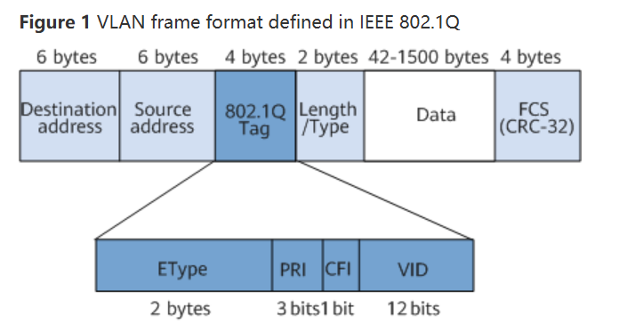

- Frame 802Q.1 [Destination MAC | Source MAC | 802.1Q Tag | Type/Length | Data | FCS]
- 802Q.1 Tag gồm: 
  - **Tag protocol Identifier (TPID)** (2byte):
    - Giá trị cố định: **0x8100**, cho biết Frame này dùng chuẩn 802.1Q
    - Giúp thiết bị nhận diện Frame có VLAN Tag.
  - **Tag Control Information (TCI)** (2byte):
    - Priority Code Point (PCP) (3bit): Xác định độ ưu tiên (0-7) cho QoS (Quality of Service), dùng để ưu tiên lưu lượng trong mạng đông.
    - Drop Eligible Indicator (DEI) (1bit): Chỉ định frame có thể bị drop khi mạng tắc nghẽn (thường dùng cho QoS).
    - VLAN Identifier (VID) (12 bit): Xác định VLAN ID(1-4094; 0 và 4095 dành riêng ).
  - **Frame Size**: tối đa 1522

  **Thành phần liên quan**
    - **Trunk Port**: Port trên Switch, Router được cấu hình để mang nhiều VLAN, sử dụng 802.1Q Tagging.
    - **Native VLAN**: VLAN không cần Tag (mặc định VLAN 1).
    - **Allowed VLANs**: Danh sách VLAN được phép đi qua Trunk, cấu hình để giới hạn lưu lượng.
    - **Hỗ trợ 802.1Q**: Hầu hết Switch hiện đại (Cisco, Juniper, Hp) hỗ trợ 802.1Q để xứ lý Tagging, detagging.

## 2. Khái niệm
- VTP hoạt động ở Data Link Layer theo mô hình OSI.
- Cho phép một switch (thường là server mode) quản lý danh sách VLAN và truyền thông tin đó cho các switch khác (client mode).
- Khi VLAN mới được thêm, xóa hoặc đổi tên ở switch server, các switch client cùng domain sẽ tự động cập nhật cấu hình VLAN của mình.
## 3. Hoạt động của VTP
- VTP gửi thông điệp quảng bá qua “VTP domain” mỗi 5 phút một lần, hoặc khi có sự thay đổi xảy ra trong quá trình cấu hình VLAN. Một thông điệp VTP bao gồm “rivision-number”, tên VLAN (VLAN name), số hiệu VLAN.
- Bằng sự cấu hình VTP Server và việc quảng bá thông tin VTP tất cả các switch đều đồng bộ về tên VLAN và số liệu VLAN của tất cả các VLAN.
- Một trong những thành phần quan trọng trong các thông tin quảng bá VTP là tham số “revision-number”.  Mỗi thành phần VTP server điều chỉnh thông tin VLAN, nó tăng “revision-number” lên 1, rồi sau đó VTP Server mới gửi thông tin quảng bá VTP đi. Khi một switch nhận một thông điệp VTP với “revision-number” lớn hơn, nó sẽ cập nhật cấu hình VLAN.

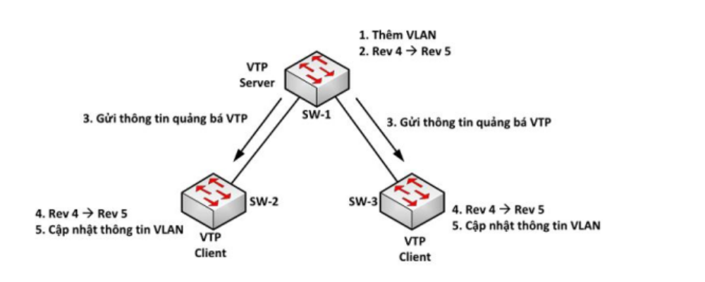

- Switch ở chế độ VTP Server có thể tạo, chỉnh sửa và xóa VLAN. VTP server lưu cấu hình VLAN trong NVRAM của nó. VTP Server gửi thông điệp ra tất cả các cổng” trunk”.
- Switch ở chế độ VTP client không tạo, sửa và xóa thông tin VLAN. VTP Client có chức năng đáp ứng theo mọi sự thay đổi của VLAN từ Server và gửi thông điệp ra tất cả các cổng “trunk” của nó. VTP Client đồng bộ cấu hình VLAN trong hệ thống.
- Switch ở chế độ transparent sẽ nhận và chuyển tiếp các thông điệp quảng bá VTP do các switch khác gửi đến mà không quan tâm đến nội dung của các thông điệp này. Nếu “transparent switch” nhận thông tin cập nhật VTP nó cũng không cập nhật vào cơ sở dữ liệu của nó; đồng thời nếu cấu hình VLAN của nó có gì thay đổi, nó cũng không gửi thông tin cập nhật cho các switch khác. Trên “transparent switch” chỉ có một việc duy nhất là chuyển tiếp thông điệp VTP. Switch hoạt động ở “transparent-mode” chỉ có thể tạo ra các VLAN cục bộ. Các VLAN này sẽ không được quảng bá đến các switch khác.

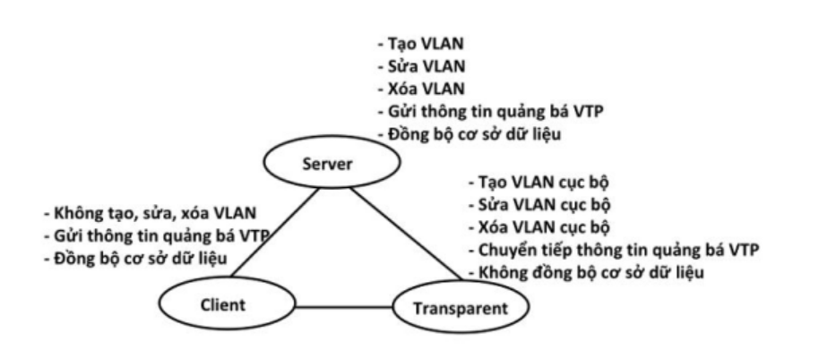

## Dynamic Auto & Dynamic Desirable
### Dynamic Auto
- Là chế độ tự động chấp nhận Trunk nếu phía bên kia đề nghị.
- Nghĩa là cổng sẽ ở chế độ Access bình thường, nhưng nếu bên kia bật trunk( hoặc để Dynamic Desirable), thì nó sẽ chấp nhận trở thành Trunk.
- Nó không chủ động đề nghị Trunk.
### Dynamic Desirable
- Là chế độ chủ động đề nghị trunk bằng cách gửi DTP frame sang bên kia.
- Nếu bên kia ở chế độ Dynamic Auto hoặc Dynamic Desirable, thì 2 cổng sẽ thống nhất thành Trunk.

| Chế độ                | Mô tả                                                                   | Khi gặp bên kia…                          |
| --------------------- | ----------------------------------------------------------------------- | ----------------------------------------- |
| **Access**            | Ép cổng luôn là Access, không bao giờ trunk.                            | Không tạo trunk.                          |
| **Trunk**             | Ép cổng luôn là Trunk, không cần DTP.                                   | Luôn trunk.                               |
| **Dynamic Auto**      | Thụ động, chỉ trở thành trunk nếu bên kia chủ động đề nghị.             | Trunk nếu bên kia = Trunk/Desirable.      |
| **Dynamic Desirable** | Chủ động đề nghị trunk qua DTP.                                         | Trunk nếu bên kia = Auto/Desirable/Trunk. |
| **Nonegotiate**       | Tắt DTP hoàn toàn. Muốn trunk thì phải cấu hình **trunk** ở cả hai bên. | Không đàm phán.                           |

## 4. Access Port và Trunk Port
### 4.1 Access Port
- Access Port là cổng trên switch được cấu hình để kết nối với một thiết bị cuối (end device) như máy tính, máy in, hoặc điện thoại IP.
- Access Port chỉ thuộc về một VLAN duy nhất và không gắn thẻ(tag) VLAN cho các khung dữ liệu(frame) mà nó gửi hoặc nhận.
### 4.2 Trunk Port
- Trunk Port là cổng trên switch được cấu hình để mang lưu lượng của nhiều VLAN(hoặc tất cả VLAN)
- Trunk Port thường được sử dụng để kết nối giữa các switch hoặc giữa switch và router( trong trường hợp Router on a Stick).
- Dữ liệu đi qua Trunk Port thường được gắn thẻ VLAN(tagged) để xác định VLAN nào mà khung dữ liệu thuộc về, trừ trường hợp của native VLAN.
- Gửi dữ liệu: Khi Trunk Port gửi dữ liệu, nó gắn thẻ VLAN (VLAN tag) vào khung dữ liệu (theo chuẩn IEEE 802.1Q) để chỉ định VLAN mà dữ liệu thuộc về. Ngoại lệ là native VLAN, nơi dữ liệu được gửi ở dạng untagged.
- Nhận dữ liệu: Trunk Port nhận dữ liệu từ các VLAN khác nhau, đọc thẻ VLAN để xác định VLAN tương ứng và chuyển tiếp dữ liệu đến đúng đích trong mạng.
- Native VLAN: Là VLAN mà lưu lượng không được gắn thẻ (untagged) trên Trunk Port. Mặc định, native VLAN là VLAN 1, nhưng có thể được cấu hình khác.
#### 4.2.1 Cấu hình cơ bản Access Port
```plaintext
Switch(config)#interface Fa0/1
Switch(config-if)#switchport mode access
Switch(config-if)#access vlan 10
```
#### 4.2.2 Cấu hình cơ bản Trunk Port
```plaintext
Switch(config)#interface Fa0/2
Switch(config-if)#switchport mode trunk
Switch(config-if)#switchport trunk allowed vlan 10,20,30
Switch(config-if)#switchport trunk native vlan 1
```

- Trong môi trường thực tế, các giao thức như Dynamic Trunking Protocol (DTP) có thể tự động thương lượng chế độ Access hoặc Trunk, nhưng nên cấu hình thủ công để đảm bảo tính ổn định.

## Cấu hình Native VLAN khác nhau

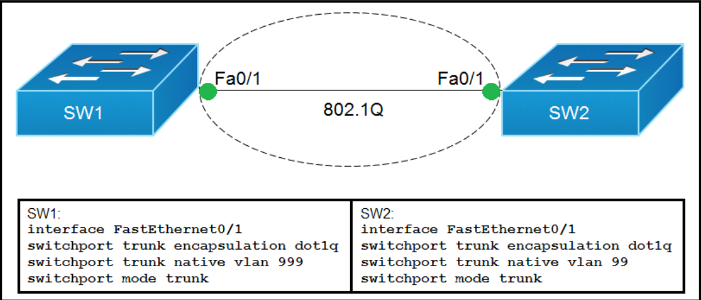

- Việc Trunk lên hay không không phụ thuộc vào Native VLAN có giống nhau hay khác nhau.
- Trunk được hình thành dựa trên cấu hình switchport mode trunk hoặc thương lượng DTP (auto/desirable).
- Trunk vẫn được thiết lập bình thường dù Native VLAN có cấu hình khác nhau.
- **Cấu hình Native VLAN khác nhau**
  - Native VLAN mismatch.
  - Các VLAN tagged vẫn hoạt động bình thường nhưng lưu lượng untagged sẽ gặp vấn đề -> Sai VLAN gây lỗi truyền thông.

## 5. STP (Spaning Tree Protocol)
### 5.1 Nguyên nhân dẫn đến loop Layer 2
- Trong hệ thống mạng việc đấu nối nhiều dây giữa các thiết bị lớp 2 nhằm tăng khả năng dự phòng khi có thiết bị hỏng đã không còn xa lạ, tuy nhiên việc này vô tình gây ra vòng lặp vô tận trên thiết bị lớp 2 hay còn được gọi là loop layer 2.
#### 5.1.1 Vòng lặp Broadcast:
  
  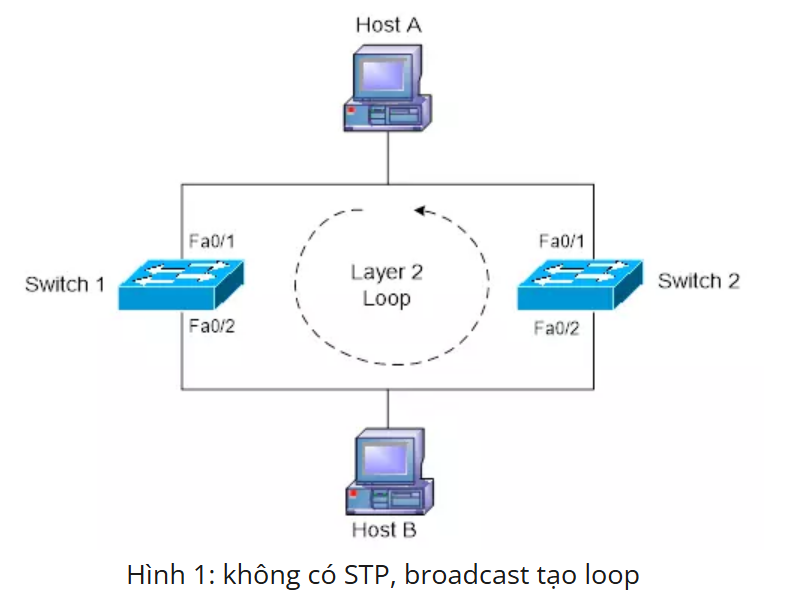

  - Vòng lặp broadcast (broadcast loop) xảy ra trong mạng khi các gói tin quảng bá (broadcast frame) bị truyền lặp lại vô hạn giữa các switch do thiết kế mạng tạo thành một vòng khép kín mà không có cơ chế chặn.
  - **Giả sử rằng không có Switch nào trong mô hình này sử dụng giao thức STP( Spanning Tree Protocol)**: 
  - Host A gửi 1 frame bằng địa chỉ Broadcast
  - Frame đến cả SW1 và SW2 qua cồng Fa0/1
  - SW1 chuyển gói frame qua cổng Fa0/2 ( Gói tin sẽ được gửi dưới dạng broad-cast ra tất cả các cổng còn lại trên đường dây Ethernet trừ cổng nhận tin.)
  - Gói tin sẽ đến cổng Fa0/2 của SW2, SW2 tiếp tục đẩy gói tin ra cổng Fa0/1
  -  Một lần nữa gói tin sẽ được đẩy đến cổng Fa0/1 của SW1 lần thứ 2. (Các dòng switch hiện tại có tốc độ xử lý rất nhanh do đó các gói tin lặp sẽ được nhân bản lên rất nhiều lần và đến 1 thời điểm switch sẽ bị tràn thậm chí là treo luôn cả con switch.)

#### 5.1.2 Sự sai lệch của bảng MAC

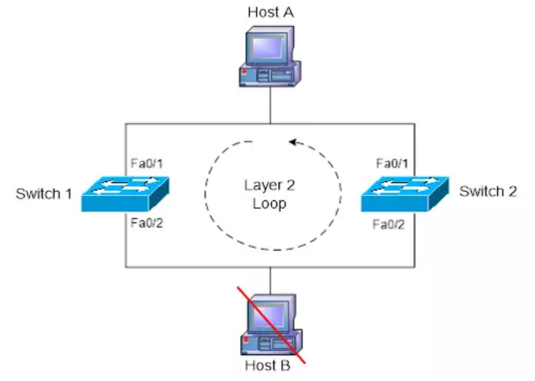

- Host A muốn gửi 1 gói tin dạng unicast đến Host B, tuy nhiên Host B đã rời khỏi hệ thống mạng và trong bảng MAC không có địa chỉ MAC của Host B.
- Gói tin sẽ đến được cổng Fa0/1 của cả 2 SW.
- Do trong MAC của SW1 không có địa chỉ MAC của host B( do host B đã down) nên gói tin sẽ được tràn ra tất cả các cổng trừ cổng nhận gói tin và đến được cổng Fa0/2 của SW2
- Vấn đề bắt đầu nảy sinh, SW2 không học được địa chỉ MAC của Host B nên nó tiếp tục tràn gói tin ra tất cả các cổng trừ cổng nhận gói tin. Một lần nữa gói tin lại đến cổng Fa0/1 của SW1 và bắt đầu xuất hiện loop-layer 2. Lúc này SW2 sẽ thay đổi địa chỉ MAC của Host A trong MAC-table của SW1 dẫn đến sai cổng.

### 5.2 Giao thức Spanning Tree
- Spanning Tree Protocol (STP) là một giao thức mạng hoạt động ở tầng liên kết dữ liệu(Data Link Layer- Layer 2) trong mô hình OSI, được thiết kế để ngăn chặn các vòng lặp(loop) trong mạng sử dụng các thiết bị chuyển mạch (Switch) hoặc cầu nối (bridge). STP đảm bảo rằng chỉ có một đường dẫn logic duy nhất giữa các nút mạng, loại bỏ các đường dẫn dư thừa để tránh hiện tượng "bão broadcast" (broadcast storm) lặp gói tin vô hạn. Giao thức được chuẩn hóa trong 802.1D
#### 5.2.1 Gói tin BPDU
- Khi switch bắt đầu khởi động, chúng sẽ liên tục gửi các gói tin BPDU cho nhau, gói tin BPDU này chứa các trường thông tin BID và chi phí đường đi giúp các switch bầu chọn và tính toán các câu trúc trong cây spanning tree.
- Trong STP các switch sẽ liên lạc với nhau thông qua gói tin BPDU, sau đây là BPDU header.


#### 5.2.1.1 Bridge ID (BID)

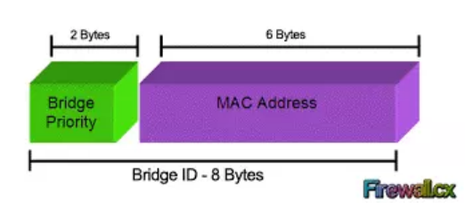

- BID là một trường có 8 bytes, nó gồm có 2 trường con là bridge priority và MAC address.
- Bridge priority: bao gồm 2 bytes(16 bits) là độ ưu tiên bridge có giá trị từ 0-65.535. Độ ưu tiên bridge có giá trị mặc định là 32.768
- MAC address có 6 bytes là địa chỉ gán cho Switch. Địa chỉ MAC trong BID sử dụng dạng Hexa.

#### 5.2.2.2 Chi phí đường đi (Root Path cost)
- Chi phí đường đi (path cost) được sử dụng để đánh giá đường đi từ các switch khác về switch root bridge (gốc trong cây). Chi phí STP càng thấp thì càng tốt

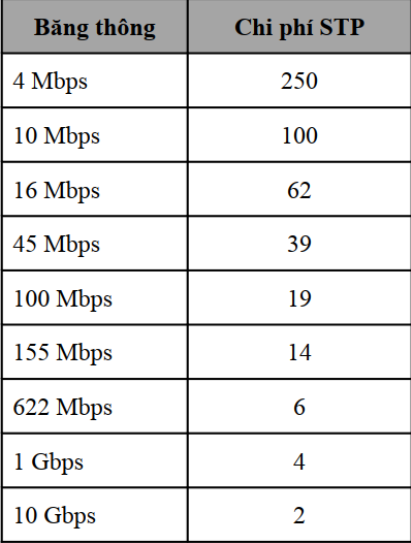

#### 5.2.2.3 Cơ chế hoạt động của STP
**Thực hiện trình tự 4 bước**:
- Bầu chọn Root Bridge
- Bầu chọn Root Port
- Bầu chọn Designated Port
- Các port còn lại sẽ là block port

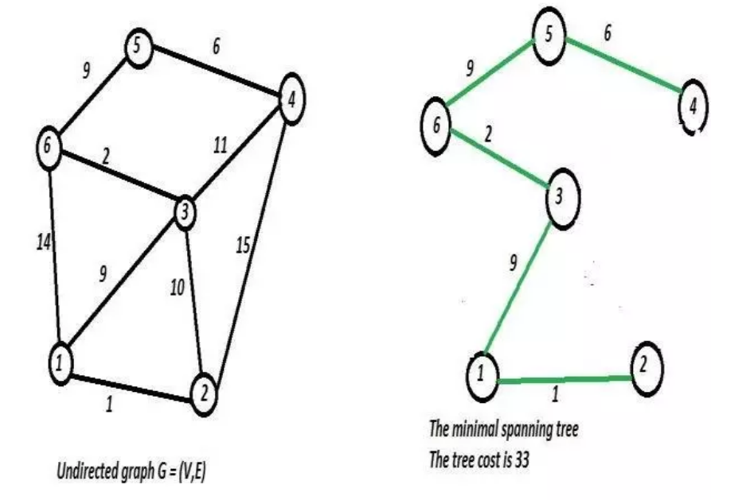

- **Bầu chọn Root Bridge**
  - Chọn ra Switch gốc, rễ trong cây spanning tree. Được coi như trung tâm của vạn vật, chịu trách nhiệm gửi các gói tin BPDU để duy trì giao thức STP(2s/ lần). Các switch còn lại chỉ có thể tiếp nhận, bổ sung thông tin vào trường BPDU và forward gói tin.
  - Đầu tiên sẽ so sánh switch nào có trị số priority thấp nhất sẽ là Root-bridge. Trị số priority mặc định của switch đó là 32.678
  - Nếu Priority được thiết lập như nhau, tiến hành so sánh địa chỉ MAC, Switch nào có MAC nhỏ nhất sẽ làm Root-Bridge. Địa chỉ MAC của mỗi thiết bị là duy nhất trên thế giới và không thể trùng được.
  - Khi các thiết bị bắt đầu khởi động nó sẽ gửi gói tin BPDU một cách rất lộn xộn. Trong gói tin BPDU sẽ chứa thông tin của Root BID, Các bridge sẽ luôn đặt bridge ID của chính nó trong Sender BID.
  - Giả sử ban đầu SW3 khởi động trước, nó sẽ gửi các gói tin BPDU và tự nhận mình là root bridge. Một lúc sau SW2 khởi động và cũng gửi các gói tin BPDU và cũng tự nhận chính mình mới là root bridge. Khi BPDU của nó đến được SW3 thì SW3 sẽ loại bỏ gói tin BPDU vì nó có BID thấp hơn(dựa trên đ/c MAC). Ngay lập tức SW3 sẽ gửi gói tin BPDU đến SW2 nhằm thông báo giả định ban đầu của nó là sai. Lúc này SW2 trở thành root bridge, nó bắt đầu gửi gói tin BPDU với root BID là 2, sender BID là 3.
  - 1 thời gian sau SW1 khởi động và gửi gói tin BPDU đến SW2,SW3 tự nhận mình là root bridge. Lúc này SW2,SW3 sẽ nhường quyền root bridge cho SW1 do nó có trị số MAC thấp hơn.
  - Các switch sẽ lắng nghe các gói tin BPDU từ các switch khác gửi tới, nó sẽ nhường quyền cho switch nào có trị số BID tốt hơn.
- **Bầu chọn Root Port_RP - Cổng gốc**
  - Sau khi các switch bầu chọn được root bridge, nó sẽ bắt đầu tiến hành bầu chọn Root Port dựa trên khái niệm chi phí đường đi. Cụ thể là các bridge theo dõi chi phí đường đi gốc, chi phí tích lũy của tất cả các liên kết đến bridge gốc. RP là port cung cấp đường về Root-bridge mà có tổng path-cost là nhỏ nhất.
  - Ngoại trừ root bridge, các switch con còn lại sẽ phải bầu chọn 1 gốc root port. Path cost được tính theo chiều từ Root bridge đến Bridge đang xét theo nguyên tắc vào cộng, ra không cộng.
  - SW1(root bridge) sẽ bắt đầu gửi gói tin BPDU chứa chi phí đường đi gốc là 0. Khi SW2 nhận được gói tin BPDU nó sẽ thêm vào chi phí đường đi của cổng Fa0/14 vào chi phí đường đi gốc chứa trong BPDU nhận. SW2 nhận chi phí đường đi gốc là 0 và thêm chi phí đường đi của cổng Fa0/14 là 19( các cổng kết nối ở đây đều là fastethernet có chi phí STP là 19) và thêm thông tin vào trường BPDU rồi gửi qua Fa0/16. Tương tự khi SW3 nhận gói tin từ SW2 nó sẽ tăng chi phí đường đi gốc thành 38( 19+19).
  - SW2 sẽ tính toán và chọn cổng Fa0/14 làm root port với chi phí là 19. Tương tự SW3 sẽ chọn Fa0/14 làm root port do có chi phí STP thấp hơn cổng Fa0/16.
  - Trong trường hợp nếu Path cost của các cổng là như nhau ra sẽ xét đến BID, rồi đến Port ID và cuối cùng là Port Number.

  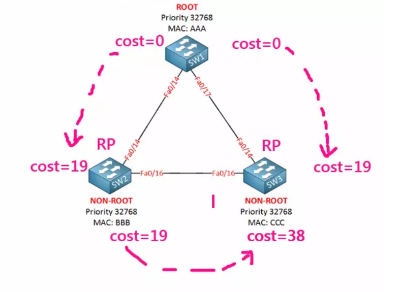

- **Designated port_DP**
  - Designated port là port cung cấp đường về root-bridge có tổng path cost nhỏ nhất trên phân đoạn mạng đang xét. Mỗi phân đoạn mạng đều phải có 1 cổng được chỉ định, có nhiệm vụ nhận và gửi lưu lượng dữ liệu đến phân đoạn mạng khác. DP là port cung cấp đường về Root-bridge trên phân đoạn mạng đang xét mà có tổng path-cost là nhỏ nhất.
  - Tất cả các port của Root bridge là Designated port.
  - Đối diện với Root port là Designated port


- **Các port còn lại sẽ là Block Port**    