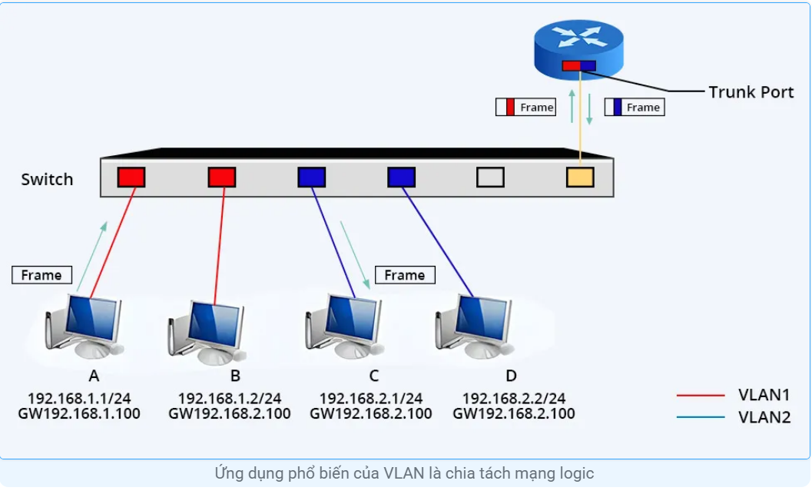
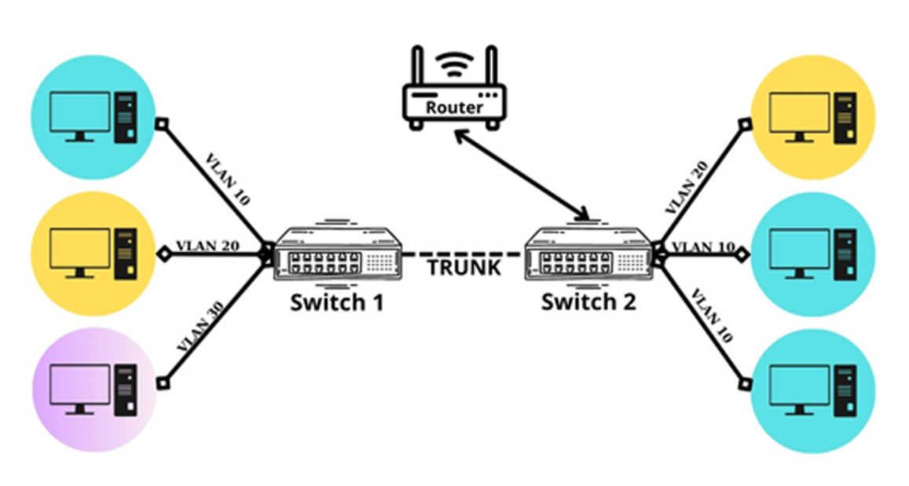
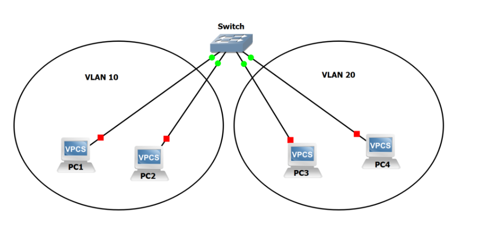
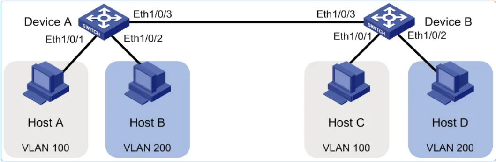
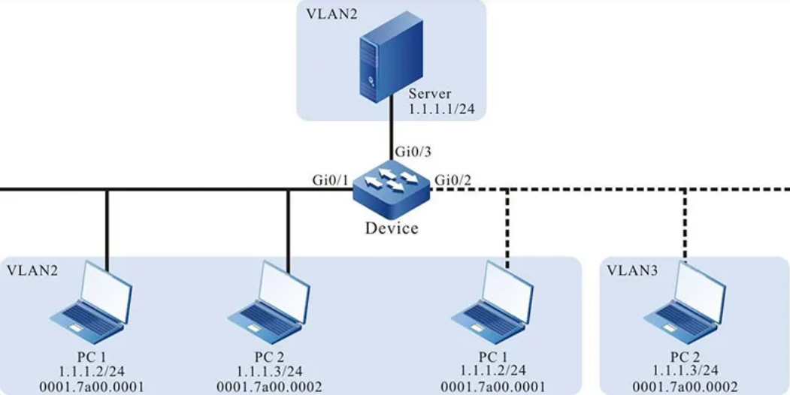
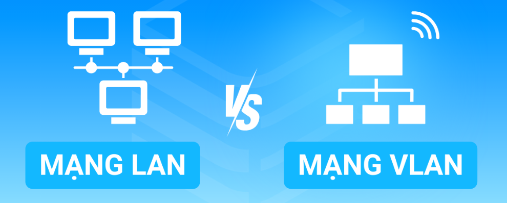

# Virtual local area network
## 1. Tại sao cần chia VLAN
- Ứng dụng phổ biến nhất của VLAN là chia tách mạng logic: VLAN giúp chia tách mạng vật lý thành các mạng logic riêng biệt, mỗi mạng logic có thể đại diện cho một bộ phận, phòng ban hoặc nhóm người dùng khác nhau trong tổ chức.

- Giảm broadcast domain: mỗi VLAN là một broadcast domain riêng -> giới hạn phạm vi broadcast -> mạng nhẹ hơn, nhanh hơn, tăng hiệu năng, giảm lãng phí băng thông.
  - Khi gửi một gói tin nó sẽ chỉ gửi trong 1 VLAN duy nhất.
- Tăng cường bảo mật nội bộ: Các máy khác VLAN không giao tiếp trực tiếp được với nhau( trừ khi có router cấu hình Inter- VLAN routing) giảm nguy cơ rò rỉ dữ liệu. Khi phát sinh lỗi, có thể nhận biết, giới hạn được phạm vi bị lỗi hoặc nhiễm virus.
- Tổ chức mạng theo logic linh hoạt, dễ quản lý.
- Tiết kiệm chi phí phải mua thiết bị: VD 1 Switch có thể chia thành nhiều VLAN thay vì chúng ta sử dụng nhiều Switch.
- Quản lý chính sách theo phòng ban, theo chức năng: VLAN cho phép chia nhỏ mạng LAN thành các nhóm logic dựa trên các tiêu chí như phòng ban, chức năng hoặc vị trí địa lý. Điều này giúp quản trị viên dễ dàng quản lý và theo dõi các nhóm thiết bị riêng biệt.
- Hỗ trợ các công nghệ mạng doanh nghiệp:
  - Voice VLAN: Tách Traffic thoại
  - Guest VLAN: cho khách truy cập Internet nhưng không vào hệ thống nội bộ.
  - Inter VLAN Routing: Định tuyến giữa các nhóm
  - QoS ưu tiên luồng VLAN cụ thể
- Thêm xóa máy tính vào mạng VLAN dễ dàng

- Phân đoạn mạng: VLAN giúp phân đoạn mạng thành các vùng riêng biệt, mỗi vùng có thể có các chính sách bảo mật và chất lượng dịch vụ (QoS) riêng. Việc phân đoạn mạng đặc biệt hữu ích trong môi trường mạng có nhiều loại lưu lượng truy cập khác nhau, chẳng hạn như mạng văn phòng, mạng VoIP, mạng IoT,v..v..
- Tạo mạng ảo cho dịch vụ đặc biệt: Mạng VLAN có thể được sử dụng để tạo ra các mạng ảo cho các dịch vụ đặc biệt như mạng khách, mạng DMZ, v.v. Việc tạo ra các mạng ảo riêng biệt giúp tăng cường bảo mật và khả năng kiểm soát cho các dịch vụ này.
- Hỗ trợ các ứng dụng đa phát sóng: VLAN giúp cải thiện hiệu quả của các ứng dụng đa phát sóng như chia sẻ tệp, họp trực tuyến, v.v. bằng cách giới hạn lưu lượng truy cập đa phát sóng trong phạm vi VLAN.

## 2. Definition
- LAN là một mạng cục bộ (Viết tắt của Local Area Network), được định nghĩa là tất cả các máy tính trong cùng một miền quảng bá(broadcast domain).
- Broadcast domain là phạm vi trong nhà mạng mà một gói tin Broadcast gửi ra sẽ tới được tất cả thiết bị trong phạm vi đó.
- Các Router (bộ định tuyến chặn tin broadcast) trong khi các switch chỉ chuyển tiếp chúng.
- VLAN hay virtual LAN còn được gọi là mạng LAN ảo(mạng LAN logic, tách biệt trên cùng 1 hạ tầng vật lý). VLAN là một kỹ thuật cho phép **tạo lập các mạng LAN độc lập** một cách logic trên **cùng 1 kiến trúc hạ tầng vật lý**

- Đối với Network: VLAN = Broadcast Domain = Logical Network, còn với Switch: VLAN = Logical switch.
  - Switch là thiết bị ở tầng DataLink
  - Nó chuyển frame dựa trên địa chỉ MAC.
  - Mặc định, tất cả các ports trên một switch vật lý nằm chung một broadcast domain

### 2.1 Tại sao lại nói đối với Switch: VLAN = Logical Switch
  - Mỗi VLAN là một 1 broacast domain, mỗi switch cũng là 1 broadcast domain.
  - Mỗi VLAN có 1 bảng MAC riêng - mỗi switch.
  - VLAN khác nhau không thể nói chuyện với nhau (nếu không có router). Switch khác nhau cũng không thể nch với nhau nếu k đc nối.
  - VLAN trên cùng 1 switch nhưng hoàn toàn động lập như 1 Switch khác nhau.
  - --> Mỗi VLAN hoạt động như 1 switch độc lập về mặt Broadcast domain, học địa chỉ MAC, cách chuyển frame.

  

### 2.2 Tại sao lại nói đối với Network: VLAN = Logical Network
  - Chia từ vài Switch thành các hệ thống chuyển mạch với mỗi hệ thống có các con switch.
  - Tập hợp các máy kết nối vào 1 chuỗi switch tạo thành broadcast domain.
  - Các máy không chỉ thể giao tiếp với nhau không được, chúng phải được đặt địa chỉ IP như bth để hỗ trợ cho các tầng trên. Các máy cùng thuộc 1 chuỗi switch, cùng cắm vào 1 broadcast domain phải đặt IP cùng mạng.
  - Gán các subnet IP vào cho các VLAN.
    - **Lưu ý**
      - Gán các subnet IP cho các VLAN không phải là gán cho bản thể VLAN bởi VLAN chỉ là 1 khái niệm Layer 2. Gán cho các PC và các host Layer 3 mà join vào trong VLAN.
      - VLAN là khái niệm tầng DataLink: VLAN không cần có IP nó hoạt động ở tầng 2, không cần hiểu IP, chỉ làm việc với MAC Address. Khi cấu hình VLAN, chỉ đang chia khung MAC và broadcast.
      - Gán subnet IP cho các host vd: VLAN 10 có subnet 192.168.10.0/24 -> ý là các host trong VLAN 10 sẽ được gán IP thuộc subnet đó. Không phải VLAN10 có IP đó.
  - Logical Network là một khái niệm trong mạng máy tính: Tách biệt lưu lượng mạng theo logic, không cần tách biệt Vật Lý, được xác định bằng địa chỉ IP và Subnet, Broadcast Domain, Cấu hình Switch, Router.
  - Ví dụ: 

    |Thiết bị |Cổng switch |VLAN |IP           |
    |-------- |----------- |---- |------------ |
    |PC A     |Port 1      |10   |192.168.10.2 |
    |PC B     |Port 2      |10   |192.168.10.3 |
    |PC C     |Port 3      |20   |192.168.20.2 |
 
  - PC A và B có thể giao tiếp với nhau: cùng logical network.
  - PC C không giao tiếp với A và B vì thuộc logical network khác.
  - Mặc dù tất cả đều cắm chung 1 switch vật lý.
  - Một switch có thể tạo ra nhiều VLAN, khi switch có một broadcast được gửi bởi một thiết bị nằm trong một VLAN sẽ được chuyển đến những thiết bị khác trong cùng VLAN, tuy nhiên broadcast sẽ không được forward đến các thiết bị trong VLAN khác.

  ## 3. Phân loại VLAN
  - Static VLAN or Port Based VLAN: VLAN phân chia theo cổng, cắm máy vào cổng nào nó sẽ thuộc VLAN đó bất kể địa chỉ MAC, IP,...

  

  - Dynamic VLAN or MAC address-Based VLAN: Phân chia theo địa chỉ MAC, quy ước máy nào thuộc VLAN nào bất kể cắm ở cổng nào, thực hiện thao tác ánh xạ địa chỉ MAC vào trong VLAN, dùng VMPS server (VLAN Management policy server).

  

  - Voice VLAN: chỉ dành riêng cho dữ liệu voice đi. 

   
 
  ## 4. Cách thức hoạt động của VLAN

  #### 4.1 VLAN tách biệt mạng
  - Switch sẽ chia các cổng thành nhiều nhóm VLAN khác nhau. 
  - Broadcast, multicast và unicast đều chỉ truyền trong phạm vi VLAN tương ứng -> Mỗi VLAN tạo thành 1 nhóm mạng riêng biệt không thể thấy nhau.
  #### 4.2 Gán địa chỉ IP cho các thiết bị trong cùng VLAN
  - Mỗi thiét bị (Pc, máy in,...) được gán IP thuộc cùng 1 subnet.
  #### 4.3 VLAN Tag(802.1Q) khi dùng Trunk Port
  - Trên cổng Trunk (nối switch với switch hoặc switch với router):
    - Gói tin được thêm 1 quẻ VLAN TAG gồm VLAN ID(12-bit) QoS DEI (Drop Eligible Indicator)
      - VLAN ID là số định danh dùng để phân biệt các VLAN với nhau.
  - Khi rời khỏi nó sẽ untagging 
  #### 4.4 Giao tiếp giữa các VLAN cần Inter-VLAN Routing
  - Router(Router on a stick): tạo sub interface cho từng VLAN
  - Hoặc layer 3 switch: Tạo các Switch virtual interface
  - Cho phép chuyển gói tin giữa các subnet.

  #### 4.5 Cách thức hoạt động chi tiết
  - **Gửi khung Ethernet**: Thiết bị gắn mã VLAN vào khung Ethernet trước khi gửi
  - **Chuyển khung đến bộ chuyển mạch**: Khung Ethernet sẽ thực hiện truyền dữ liệu qua cáp đến bộ chuyển mạch.
  - **Đọc mã VLAN**: Bộ chuyển mạch đọc mã VLAN sẽ thuộc khung Ethernet
  - **Chuyển khung đến cổng tương ứng**: Bộ chuyển mạch định tuyến khung Ethernet đến cổng phù hợp với VLAN xác định bởi mã VLAN.
  - **Thiết bị nhận khung**: Thiết bị kết nối tới cổng nhận và xử lý khung Ethernet đó.
 ### EXMAPLE:
   - PC A thuộc VLAN 10 cắm vào switch ở port 1.
   - PC B cũng thuộc VLAN 10 nhưng cắm ở switch khác, nối với Switch A bằng cap Trunk (port 24)
   - 2 PC ở 2 switch khác nhau nhưng cùng 1 VLAN -> Chúng có thể giao tiếp.
   - Khi PC A muốn gửi dữ liệu đến PC B:
     - Nó tạo ra 1 khung Ethernet, có địa chỉ MAC đích là MAC của PC B.
     - Nếu kết nối cổng A là access port thuộc VLAN10, switch sẽ tự gắn thêm một VLAN tag (theo chuẩn 802.1Q) khi gói tin đi qua Trunk Port (port 24).
     - VLAN tag là đoạn thông tin thêm vào giữa Ethernet Header và Payload, gồm:
       - VLAN ID
       - QoS (Priority)
       - Cờ nhận diện (802.1Q)
   - Chuyển khung đến bộ chuyển mạch: Gói tin đã có VLAN tag được truyền qua trunk link từ switch A -> switch B.
   - Đọc mã VLAN: Switch B nhận gói tin từ trunk port, nhìn vào Tag 802.1Q đọc VLAN ID = 10 -> Nó biết gói tin này thuộc VLAN 10, không phải broadcast, unknown từ bên ngoài.
   - Switch B kiểm tra bảng MAC và tìm xem MAC đích của gói tin (PC B) đang nằm ở cổng nào trong VLAN 10. Nếu biết -> gửi trực tiếp. Nếu chưa biết -> Flood trong phạm vi VLAN 10. Chỉ những cổng trong VLAN 10 mới nhận đc gói tin này.
   - PC B nhận được khung Ethernet, kiểm tra địa chỉ MAC đích -> đúng là của mình -> nhận và xử lý dữ liệu. Lúc này VLAN tag sẽ bị gỡ bỏ trước khi đến PC B, vì PC không hiểu khung có Tag.
   - **Lưu ý**
     - Nó sẽ flood trong toàn bộ hệ thống switch nào có VLAN 10 và trunk cho phép VLAN 10. Không chỉ trong 1 Switch.
     - Nói cách khác khi một Switch nhận gói tin và chưa biết MAC đích, nó flood gói đó đến tất cả các cổng thuộc VLAN tương ứng, bao gồm: Access Port trong VLAN đó(máy tính, máy in,..) Trunk Port nào đang cho phép VLAN đó chạy qua. 
     - Khi đó các Switch lân cận nhận được gói tin từ trunk cũng lặp lại hành động tương tự: Flood ra tất cả các port VLAN 10 trên switch của mình.
     - Quá trình này lan truyền ra toàn bộ mạng, trong phạm vi VLAN 10 cho đến khi Gói tin đến đúng thiết bị có MAC đích đó hay hết các nhánh của VLAN 10.
     - FLood trong VLAN là hoạt động song song không phải lần lượt:
       - Khi Switch A không biết MAC đích, nó flood ra tất cả các port trong VLAN 10: Access port và trunk port.
       - Các switch lân cận nhận được gói tin gần như cùng lúc và tiếp tục flood ra các port VLAN 10 của chúng. 
       - Nếu Switch nào đó tìm được thiết bị đích, gửi duy nhất qua cổng đó, không flood thêm nữa nhưng các switch khác vẫn flood tiếp 1 lúc bởi Gói tin đã được gởi đi và mạng LAN ko biết gói nào đã đến đích, không có cơ chế hủy Broadcast trong Ethernet.
       - Vậy nên gói vẫn tiếp tục lan rộng 1 chút cho đến khi hết nhánh VLAN 10.
       - Sau lần flood đầu tiên: Ghi nhớ MAC đích và MAC nguồn vào MAC address table.
       - Các lần sau gửi unicast trực tiếp k flood nữa.

  - Thông thường máy tính, các thiết bị nhận truyền tin thông dụng nên cắm vào access port vì thiết bị đầu cuối không xử lý được frame có Tag VLAN.
  - Hầu hết hệ điều hành và card mạng thông thường không hiểu frame gắn tag VLAN, nên sẽ không xử lý hoặc bỏ qua, thậm chí mất kết nối mạng.
  - Trường hợp đặc biệt: Máy chủ (server), máy tính chuyên dụng hoặc máy tính chạy các phần mềm ảo hóa/network chuyên sâu: Có thể cần cắm vào trunk port để hỗ trợ nhiều VLAN cùng lúc (ví dụ: server chạy nhiều máy ảo, mỗi máy ảo thuộc một VLAN khác nhau).
  - Các PC có card mạng hỗ trợ VLAN tagging: Nếu bạn cấu hình trên hệ điều hành và card mạng, PC có thể hiểu và gửi/nhận frame có tag VLAN (rất hiếm, chủ yếu dùng cho server, thiết bị đặc biệt). 

  ## 5. Một số nhược điểm của VLAN
  - Packet có thể rò rỉ giữa các VLAN
  - Packet được inject có thể dẫn đến Cyber Attack
  - Các mối đe doạ ở trong một hệ thống đơn lẻ vẫn có thể phát tán virus cho toàn bộ mạng nếu không biết cách kiểm soát.
  - Cần có một router bổ sung để kiểm soát workload trong những mạng lớn.
  - Kha năng tương tác có thể gặp vấn đề.
  - Một VLAN không thể chuyển tiếp lưu lượng mạng sang các VLAN khác.

  ## 6. VLAN và LAN khác nhau như thế nào ?
  

  |Tiêu chí so sánh|LAN(Local Area Network)|VLAN(Virtual Local Area Network)|
  |------|---------|----------|
  |Phạm vi| Là mạng cục bộ được giới hạn trong khu vực địa lý nhất định. Ví dụ như toà nhà, khu dân cư, văn phòng| Là một mạng ảo được tạo ra để chia phạm vi mạng LAN thành nhiều đoạn ảo, không phụ thuộc vào vị trí địa lý.|
  |Cách tổ chức| Được tổ chức theo dạng cấu trúc vật lý, các máy tính được kết nối thông qua một cấu trúc chuyển mạch hay Hub.| Tổ chức logic, cho phép thiết bị thuộc cùng 1 nhóm thông qua cấu hình phần mềm mà không cần thiết phải kết nối vật lý với nhau.|
  |Quản lý và bảo mật| Quản lý thông qua cấu hình vật lý của mạng, quá trình bảo mật được vào các biện pháp khác như cấu hình và mật khẩu.| Quá trình cấu hình dựa trên cấu hình logic, đảm bảo dữ liệu được bảo mật nhờ tính năng ngăn chặn giữa các VLAN khác nhau, đồng thời tăng tính an toàn cho toàn bộ dữ liệu.
  |Hiệu suất và linh hoạt |Dễ gặp vấn đề liên quan đến hiệu suất sử dụng, đặc biệt là khi có nhiều máy tính cùng kết nối với một bộ chuyển mạch hoặc một đoạn mạng.| Dễ dàng cải thiện hiệu suất, khả năng linh hoạt thông qua việc chia mạng thành các nhóm ảo, điều này giúp giảm tải lưu lượng trong quá trình hoạt động, đồng thời cải thiện khả năng quản lý dữ liệu của mạng VLAN.
  |Chi phí và quản lý| Đòi hỏi phải có cấu hình vật lý, nếu mở rộng chi phí có thể tăng cao hoặc làm thay đổi cấu trúc| Sử dụng VLAN sẽ giúp doanh nghiệp giảm chi phí và thời gian quản lý nếu cần thay đổi cấu hình mạng, không cần phải thay đổi cấu trúc Vật lý