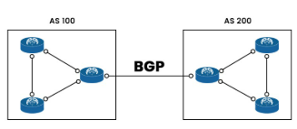

# Routing Protocols
## 1. Khái niệm
- Routing Protocol là các giao thức được sử dụng trong mạng máy tính để giúp các router trao đổi thông tin và xác định đường đi tốt nhất cho các gói tin từ nguồn đến đích
- Khác với Routed Protocol( ví dụ: IP, IPv6) vốn chỉ là giao thức được định tuyến.
- Routing Protocol: cách các router nói chuyện với nhau để tìm đường.
- Routed Protocol: dữ liệu thực tế(IP packet) được gửi đi nhờ bảng định tuyến đó.

## 2. Chức năng của Routing Protocol
- Khám phá mạng lưới (network discovery)
- Trao đổi thông tin định tuyến với các router khác.
- Xác định đường đi tốt nhất( best path selection).
- Cập nhật bảng định tuyến khi có sự thay đổi topology(link down, thêm mạng mới...).
- Hỗ trợ cơ chế dự phòng(redundancy) và cân bằng tải (load balancing).

## 3. Phân loại Routing Protocol
- Interior Gateway Protocols (IGP) - chạy trong một hệ tự quản(AS- Autonomous System)
### 3.1 Distance Vector Protocols: 
- Giao thức định tuyến Distance Vector( Vector khoảng cách) chọn đường đi tốt nhất dựa trên số bức nhảy( hop count) từ nguồn đến đích trong một hướng cụ thể. Mỗi bước nhảy là một router mà gói tin phải đi qua. Đường đi có số bước nhảy ít nhất sẽ được chọn là tốt nhất. Hai giao thức phổ biến:
  - RIP(Routing Information Protocol): đơn giản, metric = số hop, chậm, ít dùng hiện nay.
  - IGRP(Interior Gateway Routing Protocol - Cisco proprietary).
  - **Đặc điểm**:
    - **Cập nhập định kỳ:** router gửi thông tin định tuyến đến các router láng giềng theo chu kỳ( thường là mỗi 30 giây).
    - **Chia sẻ với láng giềng:** Thông tin định tuyến chỉ được gửi đến các router láng giềng, không phát broadcast ra toàn mạng.
    - **Chia sẻ vector khoảng cách** Chỉ gửi thông tin về khoảng cách( distance vector) đến các đích, không gửi toàn bộ bảng định tuyến.
    - **Tin tưởng thông tin láng giềng:** Router luôn tin vào thông tin định tuyến nhận được từ router láng giềng.
  - **Ưu điểm**
    - **Dễ sử dụng**: Cấu hình và vận hành đơn giản
    - **Tiết kiệm tài nguyên**: Yêu cầu CPU và bộ nhớ thấp.
    - **Cập nhật tự động**: Tự động điều chỉnh khi mạng thay đổi.
    - **Phù hợp với mạng nhỏ**: Hoạt động tốt trong các mạng có quy mô đơn giản.
  - **Nhược điểm**
    - **Hội tụ chậm**: Mất thời gian để cập nhật bảng định tuyến sau khi mạng thay đổi.
    - **Khả năng mở rộng hạn chế**: Không hiệu quả cho các mạng lớn.
    - **Tốn băng thông**: Cập nhật định kỳ có thể tiêu tốn nhiều băng thông mạng.
    - **Ít chính xác**: Đường đi được chọn không phải lúc nào cũng tối ưu.

### 3.2 Advanced Distance Vector/ Hybrid:
- Giao thức Hybrid là sự kết hợp giữa các điểm của Distance Vector và Link-State, tận dụng ưu điểm của cả hai. 
  - EIGRP (Enhaced IGRP - Cisco propretary): metric dựa trên băng thông, delay, tin cậy, tải.
- **Cách hoạt động**
  - Sử dụng Hello protocol để phát hiện và thiết lập kết nối với các Router láng giềng, tương tự Link-State.
  - Gửi cập nhật từng phần(partial updates) khi có thay đổi trong mạng, thay vì gửi toàn bộ bảng định tuyến.
  - Học các tuyến từ các router láng giềng trực tiếp, giống như Distance Vector.
  - Sử dụng thuật toán DUAL( Diffusing Update Algorithm) để chọn đường đi tối ưu và tránh vòng lặp định tuyến.
- **Ưu điểm**
  - **Kết hợp ưu điểm**: Tận dụng được lợi ích của cả Distance Vector và Link-State.
  - **Khả năng mở rộng**: Hoạt động tốt trong cả mạng nhỏ và lớn.
  - **Cập nhật nhanh**: Thích nghi nhanh với các thay đổi trong mạng.
  - **Tiết kiệm băng thông**: Sử dụng ít băng thông hơn so với các giao thức Link-State thuần tuý.
  - **Phù hợp với mạng lớn**: Hiệu quả trong các mạng doanh nghiệp lớn.
- **Nhược điểm**
  - **Cấu hình phức tạp**: Khó thiết lập và quản lý hơn so với Distance Vector.
  - **Tốn tài nguyên**: Yêu cầu nhiều bộ nhớ và CPU hơn Distance Vector.
  - **Cập nhật thông tin không đồng nhất**: Có thể dẫn đến cập nhật chậm trong một số trường hợp.

### 3.3 Link State Protocols:
- Giao thức Link-State có hiểu biết sâu rộng hơn về toàn mạng so với Distance Vector. Chúng được gói là giao thức **SPF(Shortest Path First)**, sử dụng thuật toán tìm đường đi ngắn nhất. Các giao thức của nó gồm:
  - **OSPF(Open Shortest Path First):** dùng thuật toán Dijkstra, metric dựa trên cost, hội tụ nhanh.
  - **IS-IS(Intermediate System to Intermediate System):** tương tự OSPF, hay dùng trong backbone của ISP.
  - **Exterior Gateway Protocols(EGP)** - chạy giữa các AS(giữa các ISP với nhau)
  - **BGP(Border Gateway Protocol)**: giao thức định tuyến "xương sống của Internet".
    - Sử dụng Path Vector(dựa vào AS-PATH, policies).
    - Rất linh hoạt, hỗ trợ chính sách định tuyến phức tạp.
- **Đặc điểm**
  - Thông điệp Hello: Sử dụng các thông điệp "hello" (hay keep-alive) để phát hiện và duy trì kết nối với các router láng giềng.
  - **Cập nhật khi có thay đổi**: Chỉ gửi cập nhật( triggered updates) khi có sự thay đổi trong cấu trúc mạng( topology), thay vì định kỳ.
  - **Chia sẻ thông tin theo yêu cầu**: Chỉ gửi các cập nhật mà router láng giềng yêu cầu, giúp tiết kiệm tài nguyên.
- **Ba bảng thông tin**:
  - **Bảng láng giềng( Neighbor Table):** Lưu thông tin về các router láng giềng mà router đã thiết lập kết nối.
  - **Bảng cấu trục mạng( Topology Table):** Chứa thông tin về toàn bộ cấu trúc mạng, bao gồm các tuyến tốt nhất và tuyến dự phòng.
  - **Bảng định tuyến (Routing Table)**: Lưu các tuyến tốt nhất để đến các mạng được quảng bá.
- **Ưu điểm**
  - **Cập nhật nhanh**: Thích nghi nhanh với các thay đổi trong mạng.
  - **Định tuyến chính xác**: Cung cấp các tuyến tối ưu nhờ có cái nhìn toàn diện về mạng.
  - **Phù hợp với mạng lớn**: Hoạt động tốt trong các mạng phức tạp và quy mô lớn.
  - **Ngăn vòng lặp định tuyến**: Giảm nguy cơ lỗi trong tính toán đường đi.
  - **Đáng tin cậy hơn**: Ít xảy ra sai sót trong định tuyến.
- **Nhược điểm**
  - **Tốn tài nguyên**: Yêu cầu nhiều bộ nhớ và sức mạnh xử lý hơn.
  - **Cấu hình phức tạp**: Khó thiết lập và quản lý hơn.
  - **Tốn băng thông**: Cập nhật mạng có thể sử dụng nhiều băng thông hơn.
  - **Không phù hợp với mạng nhỏ**: Gây lãng phí tài nguyên trong các mạng đơn giản.

## 4. Tìm hiểu sâu một vài giao thức phổ biến

- BGP, còn được gọi là Border Gateway Protocol, là giao thức định tuyến được sử dụng cho mạng Internet toàn cầu. BGP xác định các điều kiện mạng mới nhất để tìm ra đường đi tối ưu. Các điều kiện mạng này cập nhật khả năng tiếp cận và thông tin định tuyến giữa các router tại biên. BGP định tuyến lưu lượng và quản lý cách các tập tin được gửi giữa các hệ thống tự trị (AS) - các nework quản lý bởi doanh nghiệp hoặc nhà mạng.

### 4.1 Hệ thống tự trị (Autonomous System)
- Hệ thống tự trị là một mạng IP lớn hoặc một nhóm mạng được điều hành bởi các nhà mạng có chính sách định tuyến thống nhất. Internet là một mạng của các mạng được tạo thành từ vô số Autonomous System nhỏ hơn. Mọi máy tính hoặc thiết bị kết nối Internet đều được kết nối với hệ thống tự trị.
- Peering là cách các hệ thống tự trị giao tiếp và trao đổi lưu lượng mạng. Một phương pháp mà các hệ thống tự trị peering với nhau là thông qua các vị trí vật lý gọi là Điểm trao đổi Internet (IXP).
- Các hệ thống mới liên tục xuất hiện trên Internet, trong khi các hệ thống cũ hơn thường không khả dụng. Vậy nên, mỗi Autonomous System phải duy trì thông tin về mọi tuyến đường mới lẫn cũ. Điều này được thực hiện thông qua các phiên peering. Trong các phiên peering, mỗi AS thiết lập kết nối TCP/IP với AS gần đó để trao đổi dữ liệu định tuyến. Autonomous System sử dụng thông tin này để định tuyến chính xác dữ liệu gửi đi.
- Tùy thuộc vào doanh nghiệp và thỏa thuận peering, các hệ thống tự trị đôi khi tính phí lẫn nhau để chuyển lưu lượng truy cập qua mạng của họ. Chi phí truy cập có thể ảnh hưởng đến quyết định lựa chọn tuyến đường cuối cùng của BGP.
#### Vận hành hệ thống tự trị
- Các hệ thống tự trị AS thường thuộc về các nhà cung cấp dịch vụ Internet(ISP) hoặc các tổ chức lớn khác như công ty công nghệ, trường đại học, cơ quan chính phủ và cơ sở nghiên cứu. Mỗi AS phải có một số hiệu mạng (ASN) đã đăng ký để trao đổi thông tin định tuyến.
#### Cách thức hoạt động BGP
- Giao thức Border Gateway Protocol là cơ chế định tuyến lưu lượng truy cập qua Internet. Hầu hết các nhà mạng không có tuyến đường mặc định, mà chỉ có đường đi đến tất cả các tiền tố (prefix). BGP đánh giá các đường dẫn đến một tuyến đường nhất định và chọn đường tốt nhất giữa các router nhằm xác định đường dẫn tới tất cả các điểm đến.
- Để truyền lưu lượng đến router gần đích nhất, BGP đánh giá tất cả các đối tác peering của router thông qua thông tin định tuyến của các đối tác peering. Thông tin định tuyến được lưu giữ trong Bảng định tuyến (RIB – Routing Information Base).
- Mỗi router hoặc host lưu trữ một bảng RIB chứa thông tin về khoảng cách hoặc tuyến đường đến mạng đích để hỗ trợ kiểm soát hướng đi của các gói dữ liệu. RIB sử dụng dữ liệu từ cả các đối tác peering nội bộ lẫn đối tác bên ngoài. Các đối tác peering này đều kết nối trực tiếp với nhau. RIB liên tục cập nhật khi có các thay đổi dựa trên các chính sách về tuyến đường được sử dụng và thông tin công bố.
- **Thiết lập Phiên(Session Establishment)**
  - Router BGP dùng TCP (port 179) để thiết lập kết nối với peer (neighbor).
  - BGP peers kết nối với nhau thông qua các kết nối TCP (Transmission Control Protocol).
  - Khi phiên BGP được thiết lập, 2 router trở thành BGP peers.
- **Trao đổi thông tin (Route Exchange)**
  - BGP peers trao đổi NLRI( Network Layer Reachability Information) tức là các thông tin về các mạng IP mà chúng có thể định tuyến.
  - Mỗi peer thông báo về các mạng mà nó biết đến và đường dẫn để đến các mạng đó.
  - Mỗi prefix mạng được gắn với nhiều BGP attributes để quyết định chọn đường.
- **Lựa chọn đường đi**
  - Giao thức này sử dụng thuật toán quyết định để lựa chọn đường dẫn tốt nhất.
  - BGP có nhiều attributes để chọn đường đi tối ưu, quan trọng nhất là: 
    - Weight(Cisco propretary - chỉ trong local router).
    - Local Preference(ưu tiên đường đi trong AS)
    - AS - PATH (ít AS hop hơn được ưu tiên).
    - Origin type (IGP < EGP < Incomplete).
    - MED (Multi-Exit Discriminator): chỉ ra lối tốt nhất đến một AS.
    - Nếu vẫn bằng nhau chọn nexthop thấp nhất.
  - Đường dẫn nào được chọn sẽ được lưu vào bảng định tuyến BGP.
- **Update routing tables** 
  - Sau khi đường dẫn tốt nhất được xác định, nó sẽ được đưa vào bảng định tuyến của router.
  - Router sử dụng thông tin trong bảng định tuyến để xác định cách chuyển tiếp gói tin giữa các mạng.
- **Periodic updates và keepalive:**
  - BGP peers thường xuyên trao đổi các thông điệp keepalive để duy trì kết nối.
  - Thông điệp update được sử dụng để thông báo về sự thay đổi trong mạng, ví dụ như khi có một đường dẫn mới hoặc một đường dẫn cũ không còn khả dụng.
- **Ví dụ thực tế**
  - AS64512 (VNPT) muốn gửi gói tin đến mạng 8.8.8.0/24 (Google, AS15169).
  - Router biên VNPT nhận được prefix 8.8.8.0/24 từ 2 peer:
    - Peer 1: NTT Japan (AS2914) với path 64512 → 2914 → 15169.
    - Peer 2: China Telecom (AS4134) với path 64512 → 4134 → 15169.
  - BGP so sánh: nếu chính sách ưu tiên NTT, thì chọn đường qua Nhật; nếu không thì so AS-PATH (độ dài 2 hop = nhau), sẽ tiếp tục so bằng Local Preference/MED.
  - Sau đó gói tin từ VN → Nhật → Mỹ (Google).
### 4.2 Đặc điểm của giao thức BGP (Border Gateway Protocol)
- **Thiết lập liên kết(Peering)**: Giao thức này sử dụng quá trình thiết lập liên kết (peering) giữa các router. Các router BGP thiết lập phiên làm việc với nhau để chia sẻ thông tin định tuyến.
- **Định tuyến giữa các Autonomous System(AS):** Giao thức này chủ yếu được sử dụng để định tuyến giữa các AS khác nhau trên Internet. Nó quảng bá thông tin định tuyến giữa các hệ thống tự lập.
- **Phương thức TCP kết nối:** Giao thức này sử dụng giao thức TCP(Transmission Control Protocol) để duy trì liên kết giữa các router. Giao thức này đảm bảo tin cậy và độ tin cậy trong truyền thông giữa các router.
- **Path Vector Protocol:** BGP là một giao thức đường đi vector(Path Vector Protocol), có nghĩa là nó truyền thông tin định tuyến cùng với thông tin về đường đi. Điều này giúp quyết định đường đi tốt nhất dựa trên các thuộc tính khác nhau.
- **Loop Prevention:** Giao thức này sử dụng cơ chế chống lặp (loop prevention) để tránh việc xuất hiện vòng lặp trong quá trình định tuyến. Điều này đảm bảo tính ổn định của hệ thống định tuyến.
- **Phương thức quảng bá độc lập:** Giao thức này có khả năng quảng bá độc lập, nghĩa là nó có thể chọn lọc và quảng bá chỉ một số lượng nhỏ các mạng thay vì quảng bá toàn bộ bảng định tuyến.
- **Tính linh hoạt và mở rộng:** BGP là một giao thức linh hoạt và mở rộng, có khả năng thích ứng với môi trường mạng lớn và phức tạp trên Internet.

### 4.3 OSPF(Open Shortest Path First)