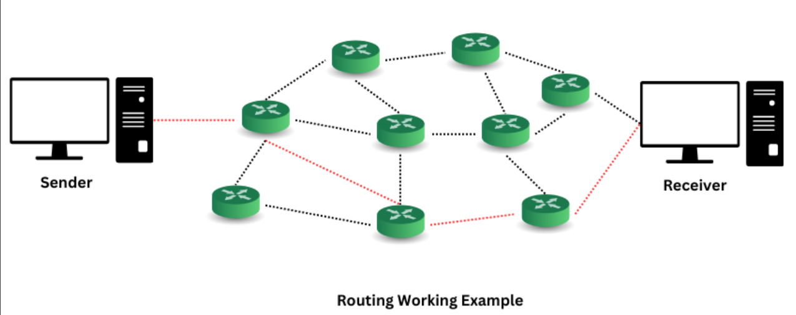

# ROUTING
## 1. Khái niệm
- Routing là quá trình xác định và chuyển tiếp dữ liệu (gói tin) từ một điểm nguồn đến một điểm đích trong mạng máy tính hoặc trong một ứng dụng( như web hoặc ứng dụng di động).
- Routing Process đảm bảo các gói tin được truyền đi một cách đầy đủ và đáng tin cậy bằng cách tìm ra đường đi ngắn nhất và an toàn dựa trên bảng routing.
### Routing trong mạng máy tính
- Routing chỉ ra hướng, sự di chuyển của các gói (dữ liệu) được đánh địa chỉ từ mạng nguồn của chúng, hướng đến đích cuối thông qua các node trung gian; thiết bị phần cứng chuyên dùng được gọi là router( bộ định tuyến). Tiến trình định tuyến thường chỉ hướng đi dựa vào bảng định tuyến, đó là bảng chứa những lộ trình tốt nhất đến các đích khác nhau trên mạng.- **Cách thức hoạt động**
  - Router nhận gói tin và kiểm tra địa chỉ IP đích.
  - Router tra cứu bảng định tuyến để tìm đường đi phù hợp.

- **Cách thức hoạt động**
  - Gói tin(Packet): Dữ liệu được chia thành các gói tin, mỗi gói chứa thông tin về nguồn, đích và nội dung.
  - Bảng định tuyến(Routing table): Router lưu trữ thông tin về các mạng mà nó biết, bao gồm địa chỉ đích, cổng ra(interface), và metric(độ ưu tiên đường đi).
  - Router nhận gói tin và kiểm tra địa chỉ IP đích.
  - Router sẽ tra cứu bảng định tuyến để tìm đường đi phù hợp.
  - Nếu địa chỉ đích nằm trong mạng cục bộ, router gửi trực tiếp. Nếu không, router chuyển gói tin đến router tiếp theo (next hop) dựa trên bảng định tuyến.
  - Quá trình này lặp đi lặp lại cho đến đích.

### Bảng định tuyến
- Routing Table là bảng định tuyến- một tập hợp các quy tắc, thường được hiển thị dưới dạng bảng, dùng để xác định nơi các gói dữ liệu sẽ được gửi trong mạng sử dụng giao thức Internet(IP). Tất cả các thiết bị hỗ trợ IP như router và Switch Lv3 đều sử dụng bảng định tuyến.

Routing Table bao gồm các mục:
- Destination: Đây là địa chỉ IP của điểm đến cuối cùng mà gói dữ liệu cần tới.
- Subnet Mask: Là một địa chỉ mạng 32-bit dùng để xác định là một máy chủ thuộc mạng cục bộ hay mạng từ xa.
- Gateway( Cổng kết nối): Là bước tiếp theo hoặc địa chỉ IP của thiết bị lân cận mà gói dữ liệu sẽ được chuyển tiếp tới.
- Interface(Giao diện): Đây là cổng giao tiếp mạng của router. 
- Metric(Chỉ số ưu tiên): Là giá trị được gán cho mỗi tuyến đường đến một mạng cụ thể, giúp router chọn tuyến đường hiệu quả nhất.
- Routes(các tuyến đường): Bao gồm các mạng con được kết nối trực tiếp, các mạng con gián tiếp  và các tuyến mặc định được sử dụng khi không có thông tin cụ thể về đường đi.

## 2. Các loại định tuyến

- **Static Routing(Định tuyến tĩnh)**: 
  - Quản trị viên mạng cấu hình thủ công bảng định tuyến. Các tuyến đường này không thay đổi trừ khi quản trị viên thay đổi thủ công.
  - Phù hợp cho mạng nhỏ, đơn giản, không tốn tài nguyên CPU.
  - Nhưng không linh hoạt khi mạng thay đổi, khó quản lý khi mạng lớn.
- **Dynamic Routing(Định tuyến động)**:
  - Router tự động học đường đi bằng giao thức định tuyến như RIP, OSPF, BGP.
  - Có thể tự cập nhật khi mạng thay đổi (link down, thêm mạng mới). Phù hợp cho mạng lớn, phức tạp.
    - **RIP(Routing Information Protocol):** Một giao thức định tuyến động sử dụng thuật toán Distance Vector. RIP hạn chế phạm vi của nó với số lượng nhảy tối đa(15), và không phù hợp cho các mạng lớn.
    - **OSPF(Open Shortest Path First):** Giao thức định tuyến link-state, tối ưu hoá quá trình tìm đường đi ngắn nhất trong mạng lớn hơn so với RIP, và hỗ trợ nhiều tính năng như phân vùng mạng.
    - **BGP(Border Gateway Protocol):** Giao thức định tuyến giữa các hệ thống tự trị (AS), chủ yếu dùng trong Internet để trao đổi thông tin 
    - **EIGRP(Enhanced Interior Gateway Routing Protocol)**: Giao thức nâng cao của Cisco, kết hợp ưu điểm của RIP và OSPF.
- **Default Routing(Định tuyến mặc định)**:
  - Khi router không biết đường đi, nó sẽ gửi gói tin ra default route một địa chỉ mặc định( thường dùng để ra internet).  
## 3. Các thuật toán định tuyến
- **Distance Vector:** Router chia sẻ toàn bộ bảng định tuyến với các router láng giềng 
  - Mỗi router duy trì một bảng định tuyến chứa thông tin về đích, khoảng cách đến đích, và router láng giềng (next hop) để đến đích.
  - Router định kỳ gửi bảng định tuyến của mình đến các router láng giềng.
  - Khi nhận bảng định tuyến từ láng giềng, router cập nhật bảng của mình nếu tìm thấy đường đi ngắn hơn (dựa trên metric, thường là số hop).
  - Sử dụng thuật toán Bellman-Ford để tính toán đường đi. 
  - Đơn giản, dễ triển khai - Phù hợp cho mạng nhỏ hoặc mạng có cấu trúc đơn giản.
- **Link-State:** Thuật toán Link-State yêu cầu mỗi router xây dựng một bản đồ toàn mạng bằng cách thu thập thông tin trạng thái liên kết(link state) từ tất cả các router trong mạng. Sau đó, router sử dụng thuật toán tìm đường đi ngắn nhất( thường là Dijkstra) để xác định tuyến tối ưu.
  - Mỗi router gửi thông tin về trạng thái của các liên kết trực tiếp(như băng thông, độ trễ, hoặc trạng thái kết nối) đến tất cả router khác trong mạng thông qua Link-State Advertisement(LSA).
  - Tất cả router xây dựng một cơ sở dữ liệu trạng thái liên kết(Link-State Database) giống nhau, tạo ra một bản đồ mạng.
  - Router sử dụng thuật toán Dijkstra để tính đường đi ngắn nhất từ nó đến mọi đích trong mạng dựa trên metric(như chi phí, băng thông).
  - Bảng định tuyến được tạo tù kết quả này. Hội tụ nhanh khi mạng thay đổi. Hỗ trợ mạng lớn và phức tạp. Giảm nguy cơ vòng lặp định tuyến.
  - **Ví dụ**: OSPF(Open Shortest Path First) IS-IS(Intermediate System to Intermediate System)
- **Path Vector:** Lưu trữ danh sách đường đi đầy đủ đến đích (ví dụ: BGP).
  - Mỗi Router lưu trữ một bảng định tuyến chứa:
    - Địa chỉ đích.
    - Danh sách các AS mà gói tin cần đi qua AS(AS Path)
    - Thuộc tính khác như chính sách định tuyến.
  - Router chia sẻ thông tin đường đi với các router láng giềng, thường trong cùng hoặc giữa các AS.
  - Khi nhận thông tin, Router cập nhập bảng định tuyến và chọn đường đi tốt nhất dựa trên số lượng AS, chính sách, hoặc các thuộc tính khác.
  - Ưu điểm: Ngăn chặn vòng lặp định tuyến bằng cách kiểm tra AS path. Link hoạt, hỗ trợ chính sách định tuyến phức tại. Phù hợp cho định tuyến giữa các mạng lớn(như Internet). Ví dụ BGP
## 4. Metric 
- Metric là giá trị dùng để so sánh các đường đi, thường dựa trên:
  - Số lượng Hop( Số router phải đi qua)
  - Độ trễ( latency)
  - Băng thông( bandwidth)
  - Độ tin cậy( Reliability)

## 5. Nguyên lý hoạt động của Routing
- **Khởi động phiên giao tiếp**: Quá trình bắt đầu khi một nút mạng(máy khách hoặc máy chủ) khởi tạo một phiên giao tiếp qua mạng, sử dụng giao thức HTTP. Đây là bước đầu tiên để thiết lập kết nối giữa hai thiết bị.
- **Phân tách gói tin**: Thiết bị nguồn chia thông tin lớn thành các gói tin nhỏ để đảm bảo việc truyền tải đáng tin cậy và hiệu quả. Quá trình này được gọi là phân tách và đóng gói dữ liệu. Mỗi gói tin được gán nhãn với:
  - **Địa chỉ IP đích**: Địa chỉ của nút mạng mà gói tin cần đến.
  - **Thông tin khác**: Như địa chỉ nguồn, số thứ tự gói tin để hỗ trợ tái tạo lại dữ liệu sau này.
- **Bảng định tuyến**: Là một cấu trúc dữ liệu logic lưu trữ thông tin về các địa chỉ IP và các router lân cận. Bảng định tuyến được lưu trữ trong router, một thiết bị mạng chịu trách nhiệm xác định đường đi ngắn nhất và chuyển tiếp gói tin. Thiết bị nguồn tra cứu bảng định tuyến để:
  - Xác định các nút mạng có thể truyền gói tin đến đích.
  - Chọn đường đi ngắn nhất bằng cách sử dụng thuật toán đường đi ngắn nhất
  - Sau đó, gói tin được định tuyến theo đường đi đã chọn.
- **Quá trình nhảy**: Trong quá trình định tuyến, gói tin sẽ đi qua nhiều nút mạng(routers, switches,v.v.) trước khi đến đích. Số lượng nút mà gói tin phải đi qua được gọi là số bước nhảy(hop count).
  - **Tiêu chí nhảy**:
    - Một gói tin có giới hạn số bước nhảy tối đa( thường được xác định bởi TTL).
    - Nếu gói tin vượt quá số bước nhảy cho phép, nó sẽ bị coi là mất gói và được gửi lại từ nguồn.
- **Đến nút đích**
- Khi tất cả các gói tin đến được nút đích:
  - Các gói tin được tái tạo lại để trở thành thông tin hoàn chỉnh như lúc gửi đi từ nguồn.
  - Thiết bị đích thực hiện các cơ chế kiểm tra lỗi để đảm bảo tính toàn vẹn và xác thực của dữ liệu.

  