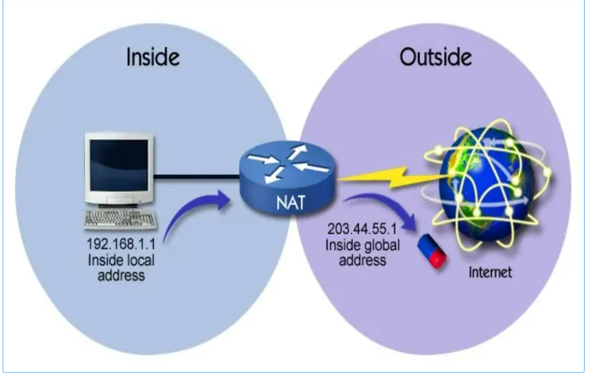
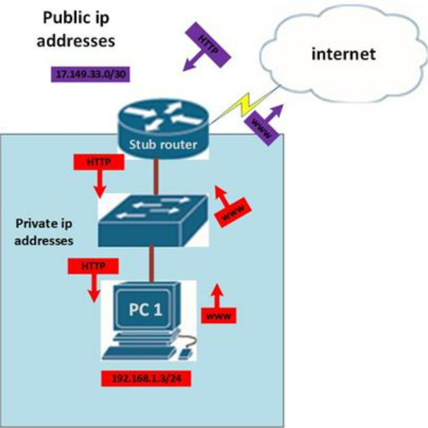
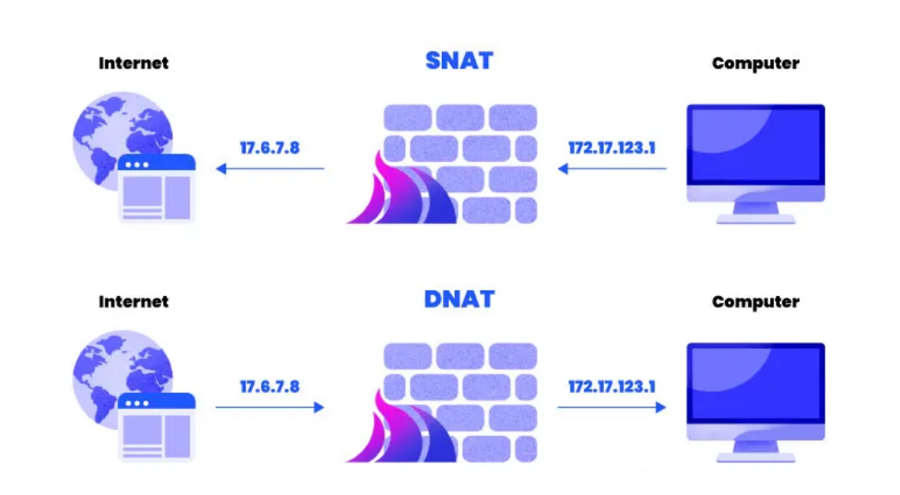
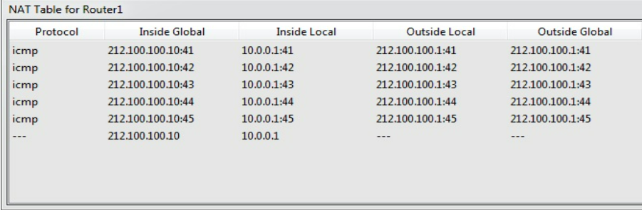

# NAT
## KHÁI NIỆM
### Khái niệm
- NAT(Network Access Translation - Dịch địa chỉ mạng): là kỹ thuật được sử dụng trong mạng máy tính để ánh xạ địa chỉ IP từ một không gian địa chỉ này(địa chỉ riêng private) sang một không gian địa chỉ khác(Công cộng - Public) khi nó muốn truy cập Internet.  Khi các thiết bị trong mạng riêng gửi yêu cầu tới Internet, địa chỉ IP công cộng sẽ được sử dụng để giao tiếp với các máy chủ trên Internet. 

### Ưu điểm của NAT
- **Tiết kiệm địa chỉ IP**: NAT giúp tiết kiệm địa chỉ IP bằng cách sử dụng một địa chỉ IP công cộng duy nhất để đại diện cho nhiều thiết bị trong mạng nội bộ.
- **Ẩn mạng nội bộ**: Che giấu nối trúc mạng nội bộ khỏi bên ngoài, tăng cường bảo mật.
- **Kiểm soạt truy cập**: Điều chỉnh luồng dữ liệu giữa các mạng.
- **Phân vùng mạng**: NAT cho phép phân vùng mạng nội bộ và mạng bên ngoài, cải thiện quản lý mạng và tăng tính bảo mật.
- **Tăng hiệu suất mạng**: NAT tăng hiệu suất mạng bằng cách sử dụng các kỹ thuật tối ưu hoá đường truyền và định tuyến.
## PHÂN LOẠI

Src = https://lptech.asia/kien-thuc/nat-la-gi
### Static NAT
- Ánh xạ 1:1 giữa một địa chỉ IP riêng và một địa chỉ IP công cộng. Mỗi private IP được gán cố định một public IP.
Thông qua cách cố định địa chỉ IP cục bộ sang địa chỉ IP công khai (Public), quá trình này được thiết lập và cài đặt thủ công.
#### Điểm quan trọng của Static NAT
- 1 Private <-> 1 Public cố định, cần nhiều IP Public, Luôn tồn tại ánh xạ. 
- Phù hợp khi cần công khai dịch vụ nội bộ ra Internet (web server, mail server, camera IP…).
### Dynamic NAT
- Dynamic NAT dùng để ánh xạ một địa chỉ IP này sang một địa chỉ IP khác bằng cách thức tự động. Thông thường, Dynamic NAT sẽ chuyển từ IP mạng cục bộ sang địa chỉ IP đã được đăng ký. Bất kỳ một địa chỉ IP nào nằm trong dải IP Public đã được định trước đều được gán với một địa chỉ bên trong mạng.
- Router giữ một pool địa chỉ IP public (ví dụ: 203.113.5.10 – 203.113.5.20).
- Khi một máy trong LAN(IP private) cần đi ra Internet, router lấy tạm một IP public trong pool để ánh xạ.
- Nguyên tắc: ánh xạ 1-1, nhưng ánh xạ này không cố định và chỉ tồn tại trong thời gian có lưu lượng.
- Khi lưu lượng ngưng (timeout), ánh xạ bị xoá, IP public trong pool được trả lại để máy khác dùng.
#### Điểm quan trọng của Dynamic NAT
- Không cố định như Static NAT -> mỗi lần client ra Internet có thể được gán một IP public khác nhau.
- Không tiết kiệm như PAT -> vì mỗi private cần một public riêng tại một thời điểm.
- Không phù hợp cho server nội bộ -> vì nếu người ngoài muốn truy cập server, router không biết ánh xạ public nào cho server đó( ánh xạ không tồn tại trước).
- Ứng dụng chính: thường dùng trong mạng doanh nghiệp khi có đủ một dải IP public để cấp phát cho nhân viên ra ngoài Internet, nhưng không cần ánh xạ cố định.
### NAT Overload
- NAT Overload hay gọi là PAT (Port Address Translation). Đây được xem là dạng biến đổi của Dynamic NAT có thể chuyển đổi IP bằng cách tự động. Nhưng về hoạt động thì NAT Overload là ánh xạ nhiều địa chỉ IP thành 1 địa chỉ IP bằng cách dùng các port khác nhau để phân biệt.
#### Đặc điểm quan trọng của PAT
- Nhiều Private dùng chung 1 IP Public, Đặc điểm là tiết kiệm, chỉ cần 1 địa chỉ IP. Tạm thời theo phiên session.
- Là dạng NAT phổ biến nhất, đặc biệt ở router hộ gia đình. Ví dụ điện thoại, máy tính,... IP từ 192.168.10.1, 192.168.10.2,...
- Không dùng cho server công khai trực tiếp, nhưng có thể cấu hình port forwarding để truy cập từ ngoài vào.
## NGUYÊN LÝ HOẠT ĐỘNG

- **Thiết bị trong mạng nội bộ (LAN)** gửi gói tin ra ngoài (hoặc ngược lại, từ ngoài vào trong). Trong gói tin sẽ có **địa chỉ IP nguồn** và **địa chỉ IP đích**.
- **Router hoặc thiết bị NAT** chặn gói tin tại biên giới mạng. Nó kiểm tra địa chỉ IP (nguồn hoặc đích) của gói tin.
- **NAT thay thế địa chỉ IP** trong gói tin:
  - Nếu gói tin từ LAN → Internet: thay đổi IP nguồn từ private sang public.
  - Nếu gói tin từ Internet → LAN: thay đổi IP đích từ public sang private.
- **NAT ghi nhớ ánh xạ**(trong bảng NAT - NAT table): Để khi nhận gói trả lời, nó biết cần chuyển ngược lại cho thiết bị nào trong LAN.
- **Gói tin sau khi được dịch** sẽ được gửi đi tiếp đến đích: Đối với bên ngoài, chỉ thấy địa chỉ IP public. Đối với bên trong, vẫn giao tiếp bình thường bằng địa chỉ private.

## SNAT(Source Network Address Translation)

- SNAT thay đổi địa chỉ IP nguồn trong gói tin thành IP Public. Ngoài ra có thể đổi cổng nguồn trong TCP/UDP. Thường được dùng bởi người dùng nội bộ. 
- Máy trong mạng LAN (private IP) truy cập Internet, vì IP private không đi ra ngoài được.
- Nói cách khác dành cho người dùng trong LAN muốn đi ra ngoài Internet hay là người dùng.
### Cách hoạt động:
- Máy trong LAN (VD: 192.168.1.10) gửi gói tin ra ngoài, IP nguồn ban đầu là 192.168.1.10.
- Router NAT thay thế IP nguồn bằng IP public của nó (VD: 203.113.5.10).
- Server ngoài Internet chỉ thấy gói tin đến từ 203.113.5.10
- Khi server trả lời về 203.113.5.10, router NAT tra bảng NAT để dịch ngược, rồi gửi lại cho 192.168.1.10. Nhờ SNAT, nhiều máy private trong LAN có thể chia sẻ cùng một IP public.
## DNAT(Destination Network Address Translation)
- DNAT đổi địa chỉ đích trong IP. Có thể thay đổi cổng đích trong TCP/UDP.
- Sử dụng khi cần chuyển hướng các gói đến có đích là địa chỉ/ cổng public đến địa chỉ / cổng IP private bên trong mạng.
- Thường dùng khi máy ngoài Internet truy cập dịch vụ trong LAN (web server, mail server…) qua cơ chế Port Forwarding.
- DNAT được dùng bởi người vận hành dịch vụ (cung cấp web, game server, camera IP, mail server…).
### Cách hoạt động
- Bạn cài web server trên máy 192.168.1.100 trong LAN
- Router nhà bạn có IP Public là 203.113.5.10
- Người ngoài Internet gõ http://203.113.5.10
- Router dùng DNAT để đổi địa chỉ đích từ 203.113.5.10:80 -> 192.168.1.100:80
- Web server nhận được request và trả lời -> router dịch ngược lại rồi gửi ra Internet.
### Lưu ý
- **Ví dụ**
  - Client(192.168.10.5 trong lAN A) gửi request. 
    - IP nguồn: 192.168.10.5
    - IP đích: 203.113.5.10
  - Router Client(LAN A) làm SNAT:
    - IP nguồn 192.168.10.5 -> 45.67.89.10 (IP public của mạng A)
    - Gói ra Internet: Src=45.67.89.10, Dst=203.11.3.5.10
  - Router Server(LAN B) nhận gói
    - Nó thấy đích 203.113.5.10 là IP public của chính nó. Thực hiện DNAT đổi IP đích = 203.113.5.10:80 -> 192.168.1.100:80
    - Gói tin đi vào LAN B: Src= 45.67.89.10, Dst=192.168.1.100:80
  - Web server (192.168.1.100) nhận request và trả lời.

  ...

- Router client chỉ làm SNAT (dịch IP private của client → IP public để đi ra Internet).
- Router server mới làm DNAT (dịch IP public của dịch vụ → IP private của máy chủ nội bộ).
- Router phía Client: làm SNAT khi đi ra, DNAT ngược khi gói tin trả về.
- Router phía Server: làm DNAT khi có request đến, SNAT ngược khi gửi response ra ngoài.

## NAT Table

Src = https://www.ccnablog.com/nat-network-address-translation/

- NAT Table là nơi router lưu trữ thông tin ánh xạ giữa địa chỉ private <-> public(và có thể kèm port).
- Khi gói tin đi qua NAT, router sẽ:
  - Tạo một entry tron NAT Table.
  - Ghi lại địa chỉ IP nguồn/ đích, port, và trạng thái kết nối.
  - Dùng entry đó để dịch ngược khi gói trả về.
  - Nếu không có NAT Table, router sẽ không biết gói trả lời từ Internet phải gửi về máy nào trong LAN.
### Cấu trúc NAT Table 
| Inside Local                        | Inside Global                            | Outside Local              | Outside Global                             |
| ----------------------------------- | ---------------------------------------- | -------------------------- | ------------------------------------------ |
| Địa chỉ IP private + port trong LAN | Địa chỉ public đã dịch của máy trong LAN | Địa chỉ IP đích (theo NAT) | Địa chỉ IP thật sự của đích ngoài Internet |

- Inside Local: IP/Port của host trong LAN(private)
- Inside Global: IP/Port public mà NAT gán cho host đó.
- Outside Local: IP/Port đích như router NAT nhìn thấy.
- Outside Global: IP/Port thật sự của server trên Internet.