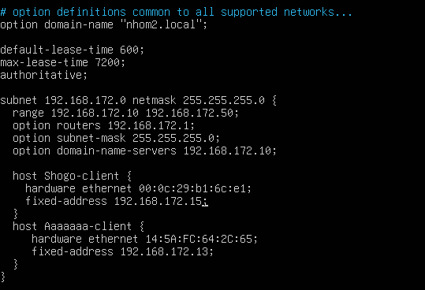
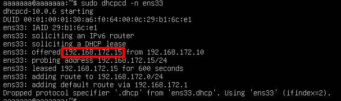

# Cấp phát IP theo địa chỉ MAC
## CentOS và Windows
### Xác định MAC của client
Kiểm tra địa chỉ MAC
- `ip a`: Ubuntu


- `ipconfig /all`: Window


### Chỉnh sửa file cấu hình DHCP server
Mở file cấu hình:
```plaintext
sudo nano /etc/dhcp/dhcpd.conf
```

Tìm đến phần khai báo subnet, thêm một đoạn cấu hình dạng sau vào bên trong hoặc ngay sau subnet:

```ruby
# Cho CentOS
host ubuntus-client {
    hardware ethernet 00:0c:29:b1:6c:e1;
    fixed-address 192.168.172.111;
}
# Cho windows
host windows-client {
    hardware ethernet 14:5A:FC:64:2C:65;
    fixed-address 192.168.172.112;
}
```
- `host ubuntus-client`: tên định danh tùy chọn
- `hardware ethernet`: địa chỉ MAC của client
- `fixed-address`: IP muốn gán cố định



- Khởi động lại DHCP Server
```plaintext
sudo systemctl restart isc-dhcp-server
sudo systemctl status isc-dhcp-server
```
### Xin cấp phát lại IP trên máy client
**Ubuntu** 
```ruby
# Giải phóng IP cũ
sudo dhcpcd -k ens33
# Yêu cầu cấp phát IP mới
sudo dhcpcd -n ens33
```


**Windows**
```ruby
# Giải phóng IP cũ
ipconfig /release
# Yêu cầu cấp phát IP mới
ipconfig /renew
```

**CentOS 9** 
```ruby
# Giải phóng IP cũ
sudo dhclient -r ens33
# Yêu cầu cấp phát IP mới
sudo dhcpcd -v ens33
```