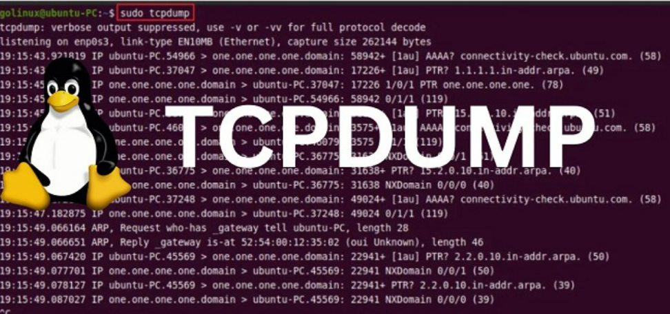
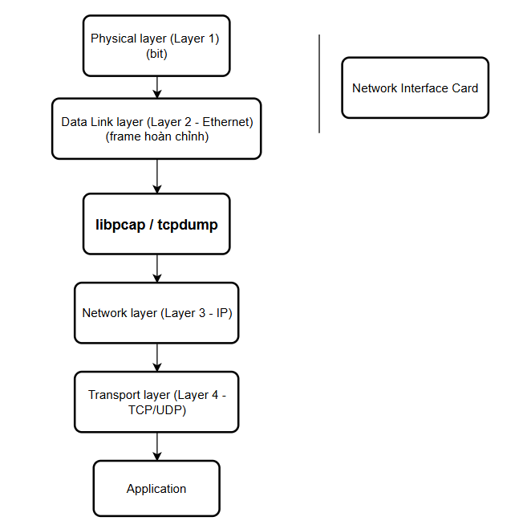
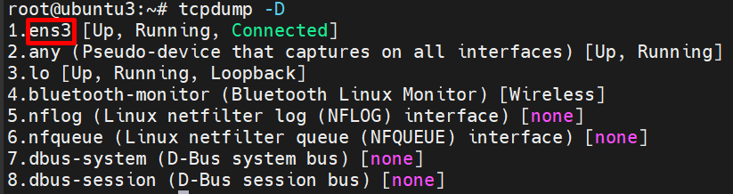
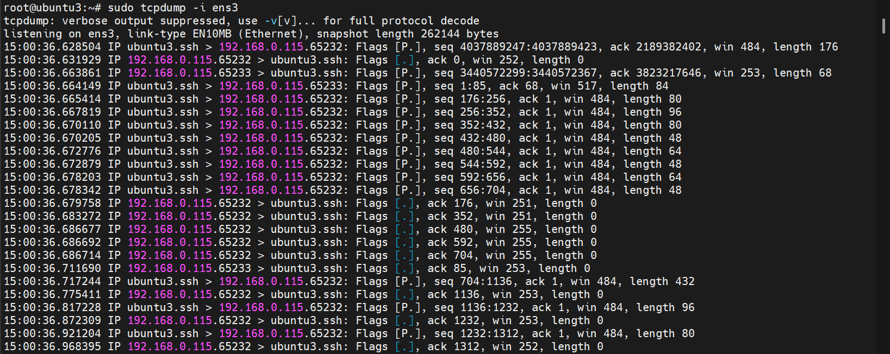
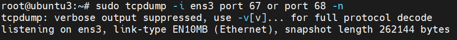
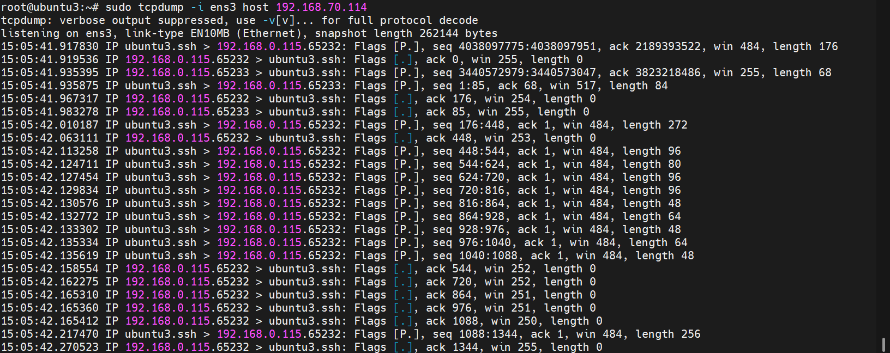
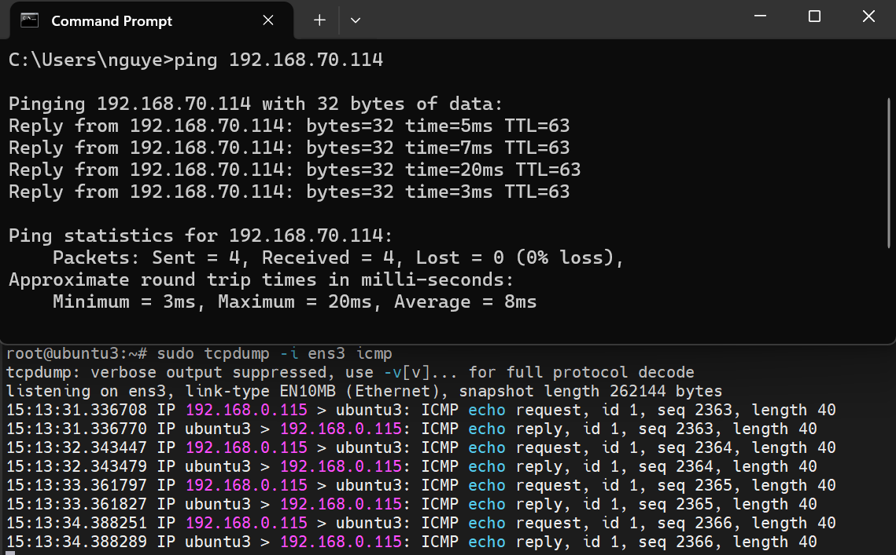

# TCPdump
## 1. Khái niệm TCPdump
**TCPdump** là một công cụ phân tích gói tin (packet analyzer) mạng dựa trên dòng lệnh (command-line). Nó là một trong những công cụ phổ biến nhất và mạnh mẽ nhất để bắt (capture), phân tích và hiển thị các gói tin mạng (packet) đi qua network interface của máy (eth0, ens33, lo, …) với mục đích để theo dõi và ghi lại lưu lượng mạng trên các hệ thống giống Unix (như Linux, macOS, BSD).

TCPdump giúp người dùng thấy chính xác dữ liệu mạng đang chạy, thấy ai gửi, gửi gì, qua cổng nào, dùng giao thức gì.
Thông thường: NIC chỉ nhận gói có MAC của nó. Khi dùng tcpdump: NIC bật promiscuous mode: nhận tất cả gói đi qua mạng trong cùng broadcast domain



## 2.Cơ chế hoạt động TCPdump
### TCPdump trong mô hình OSI



TCPdump bắt gói ở layer 2 & 3, phân tích lên Layer 4
  - **Bắt gói(Packet capture)**: lấy Raw frame đi qua card mạng, trước khi hệ điều hành xử lý nó cho ứng dụng.
  - tcpdump đứng rất thấp, gần sát card mạng
- **Layer 1** chỉ là: 0/1, điện áp/ ánh sáng
- **NIC**: 
  - Nhận bit từ dây mạng (L1)
  - Ghép bit thành **Ethernet frame**
  - Kiểm tra FCS (CRC)
  - Xác định frame hợp lệ
  - Đưa frame lên kernel
- Qua **layer 2**: tcpdump bắt Ethernet frame trước khi kernel bóc header để xử lý Layer 3
- TCPdump không ghép lại nó show tất cả Ethernet frame
### 2.2 Thư viện cốt lõi: libpcap
`tcpdump` không bắt gói trực tiếp, mà dùng thư viện:
```bash 
libpcap (Linux) / WinPcap/Npcap (Windows)
```
  - Cho phép chương trình "nghe trộm" traffic
  - Hỗ trợ BPF (Berkeley Packet Filter) -> lọc gói rất nhanh

### 2.3 TCPdump bắt được những gì
| Thứ             | Ví dụ                  |
| --------------- | ---------------------- |
| IP nguồn / đích | 192.168.1.10 → 8.8.8.8 |
| Port            | 80, 443, 22, 67        |
| Protocol        | TCP, UDP, ICMP         |
| Flag TCP        | SYN, ACK, FIN          |
| Payload         | (nếu không mã hóa)     |
| MAC address     | AA:BB:CC:DD            |

## 3. Sử dụng TCPdump
```bash
sudo apt update
sudo apt/dnf install tcpdump
```
- Check Version
```bash
tcpdump --version
```
### 3.1 Cú pháp lệnh `tcpdump`
```bash
sudo tcpdump [option] [filter]
```
Trong đó:
  - [filter] là bộ lọc tập tin
  - [option] là các tùy chọn của lệnh Tcpdump

| Option              | Describe                                                  |
| ------------------- | --------------------------------------------------------- |
| `-i <giao_dien>`    | Chỉ định giao diện mạng để bắt gói tin(vd: `eth0`, `any`) |
| `-c <số>`           | Dừng sau khi bắt đủ số lượng gói                          |
| `-n`                | Không phân giải tên miền (hiển thị IP thô)                |
| `-nn`               | Không phân giải IP và cổng (hiển thị số cổng thô)         |
| `-v`, `-vv`, `-vvv` | Mức độ chi tiết khi hiển thị gói tin                      |
| `-w <file>`         | Ghi gói tin vào file (dạng nhị phân `.pcap`)              |
| `-r <file>`         | Đóc gói tin từ file `.pcap`                               |
| `-t`                | Ẩn dấu thời gian hiển thị                                 |
| `-tttt`             | Hiển thị thời gian đầy đủ, có ngày giờ                    |

Các biển thức bộ lọc `[Filter]` như:
  - Giao thức: `tcp`, `udp`, `ip`, ...
  - Địa chỉ IP: `host 192.168.70.93`, `src 10.0.0.1`, `dst 8.8.8.8`
  - Cổng: `port 80`, `src port 443`, `dst port 53`
  - Tổ hợp: `tcp and port 80 and src 192.168.70.93`
## 4. Định dạng chung của 1 dòng đầu ra TCPdump
```bash
time-stamp src > dst:  flags  data-seqno  ack  window urgent options
```
- Trong đó: 
  - `Time-stamp`: hiển thị thời gian gói tin được capture
  - `Src` và `dst`: hiển thị địa chỉ IP của người gửi và nhận
  - Cờ `Flags` sẽ bao gồm các giá trị cơ bản đó là:
    - `S (SYN)`: Được sử dụng trong quá trình bắt tay của giao thức TCP
    - `.(ACK)`: Được sử dụng để thông báo cho bên gửi biết là gói tin đã nhận được dữ liệu thành công.
    - `F(FIN)`: Được sử dụng để đóng kết nối TCP
    - `P(PUSH)`: Thường được đặt ở cuối để đánh dấu việc truyền dữ liệu.
    - `R(RST)`: Được sử dụng khi muốn thiết lập lại đường truyền.
    - `Data-squeno`: Số sequence number của gói dữ liệu hiện tại.
    - `ACK`: Mô tả số sequence number tiếp theo được truyền đến của gói tin mà bên gửi mong muốn nhận được.
    - `Window`: Đây là vùng nhớ đệm có sẵn trên kết nối theo một hướng khác
    - `Urgent`: Giá trị này cho người dùng biết được các gói dữ liệu khận có trong gói tin.
## 5. Sử dụng TCPdump
- Kiểm tra danh sách giao diện mạng:
```bash
ip a or tcpdump -D
```


-> Liệt kê các interface mà TCPdump có thể sử dụng

**Bắt tất cả các gói tin trên interface ens33:**
```bash 
sudo tcpdump -i ens33
```



**Bắt gói tin DHCP (Cổng 67 và 68)**
```bash
sudo tcpdump -i ens33 port 67 or port 68 -n
```


**Bắt gói tin đến từ IP cụ thể**
```bash
sudo tcpdump -i ens33 host 192.168.70.114
```



**Bắt gói tin giao thức cụ thể(VD: ICMP - ping):**
```bash
sudo tcpdump -i ens33 icmp
```


**Lưu lại gói tin để xem bằng Wireshark sau này:**
```bash
sudo tcpdump -i ens33 -w dhcp_traffic.pcap
```

## 6. Tổng hợp một số lệnh
### 1. Cơ bản
| Lệnh | Mô tả |
|------|-------|
|`sudo tcpdump -i ens33`| Bắt gói tin trên interface `ens33`|
|`sudo tcpdump -i any`| Bắt trên tất cả interface cùng lúc|
|`sudo tcpdump -c 10`| Bắt đúng 10 gói tin rồi dừng |
|`sudo tcpdump -nn` | Không resolve IP và port(hiển thị số IP và port rõ ràng)|
### 2. Bắt gói giao thức cụ thể
| Lệnh | Giao thức |
|---------------------|---------------|
| `sudo tcpdump icmp` | **Ping(ICMP)**|
|`sudo tcpdump port 80`|**HTTP(port 80)**|
|`sudo tcpdump port 53`|**DNS(port 53)**|
|`sudo tcpdump port 67 or port 68`|**DHCP(port 67, 68)**|

### 3. Bắt gói theo IP
| Lệnh | Mô tả |
|----------|---------|
|`sudo tcpdump host 192.168.3.100`|Gói từ / đến IP này |
|`sudo tcpdump src host 192.168.3.100`| Gói có nguồn là IP này |
|`sudo tcpdump dst host 192.168.3.100`| Gói có đích là IP này |
### 4. Bắt theo port
| Lệnh | Mô tả |
|----------------------|------------------|
|`sudo tcpdump port 22` | Gói liên quan SSH |
|`sudo tcpdump tcp port 80` | Gói TCP cổng 80 (HTTP) |

### 5. Bắt theo gói giao thức TCP/UDP
| Lệnh | Mô tả |
|-------------------|-------------|
|`sudo tcpdump tcp` | Chỉ gói TCP |
|`sudo tcpdump udp` | Chỉ gói UDP |

### 6. Ghi vào file để xem sau bằng Wireshark
`sudo tcpdump -i ens33 -w output.pcap`
  - Ghi toàn bộ lưu lượng vào file `output.pcap`
  - Mở file bằng Wireshark trên máy Windows

### 7. Đọc lại file pcap
```bash
tcpdump -r output.pcap
```
- Đọc file `.pcap` đã lưu( không cần `sudo`)
### 8. Kết hợp bộ lọc nâng cao
```bash
sudo tcpdump -i ens33 'tcp and port 80 and src host 192.168.3.10'
```
- Chỉ bắt các gói TCP có `port 80` từ IP `192.168.3.10`