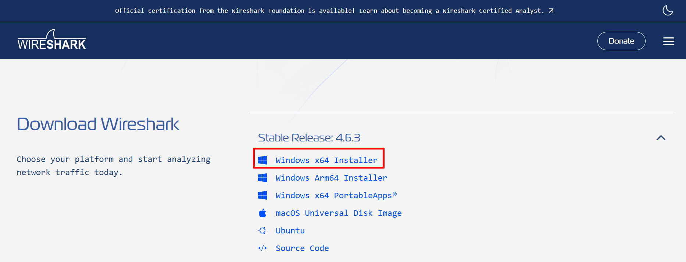
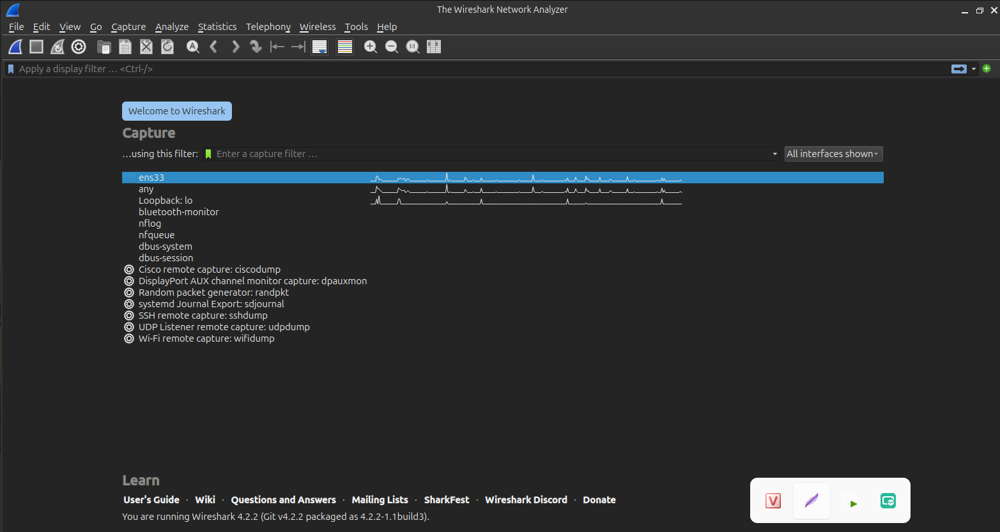
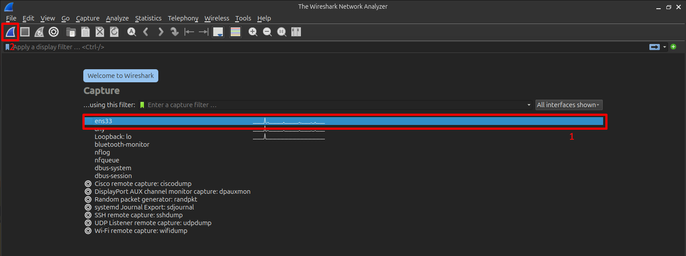
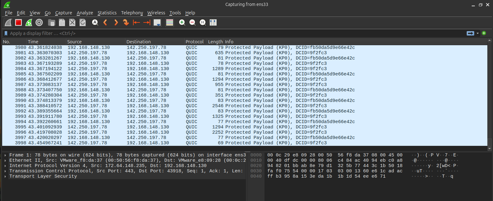
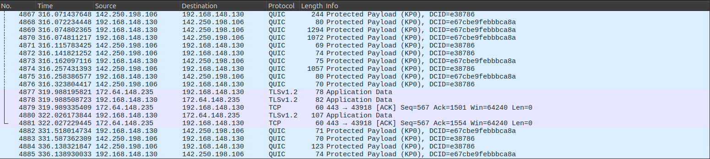
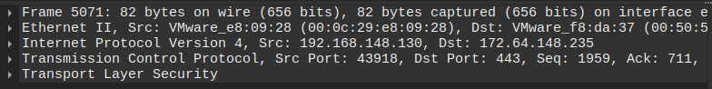
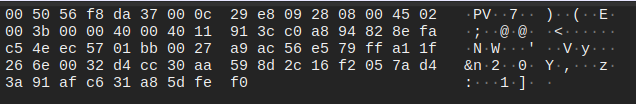
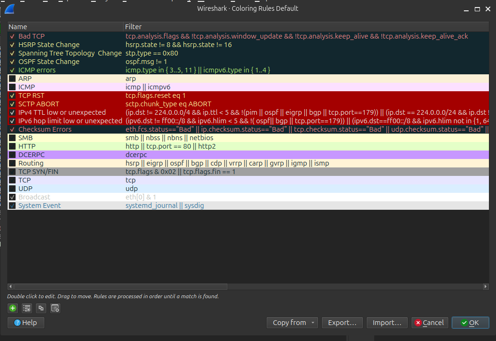
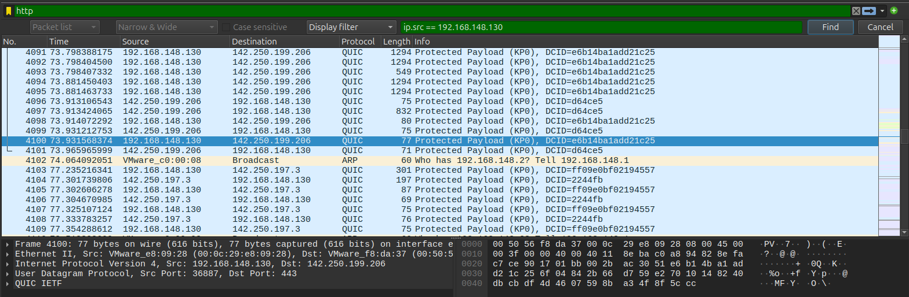

# WireShark
## 1. Khái niệm về WireShark
- **Wireshark** là một công cụ phân tích mạng và ghi lại giao thức mạng. Nó cho phép người dùng theo dõi và phân tích các gói tin mạng trong thời gian thực. Wireshark có khả năng xem và phân tích dữ liệu trong các giao thức
mạng phổ biến như TCP, UDP, IP, HTTP và nhiều giao thức khác.

Với Wireshark, người dùng có thể xem các gói tin mạng được truyền qua mạng, xác định nguồn gốc và đích của các gói tin, kiểm tra nội dung và cấu trúc của các giao thức, và phân tích lưu lượng mạng để tìm hiểu về hiệu suất và vấn đề liên quan đến mạng.

## 2. Phần mềm WireShark dùng để làm gì?
- **Xác định vấn đề**: Phát hiện kết nối chậm, rớt gói, lỗi cấu hình.
- **Phân tích bảo mật**: Phát hiện truy cập bất thường, hành vi phần mềm độc hài, quét cổng.
- **Nghiên cứu giao thức**: Hiểu sâu cách thức hoạt động của các giao thức mạng
## 3. Phần mềm WireShark hoạt động thế nào
**Wireshark** hoạt động ngay khi được cài đặt trên thiết bị nhưng bạn cần cài đặt mạng phù hợp với hệ thống mạng đang dùng. Wireshark thực hiện thu thập tất cả các địa chỉ IP đã được kết nối với hệ thống mạng. Mỗi khi có thiết bị sử dụng mạng được kết nối, chúng sẽ được cập nhật trong các gói dữ liệu mà Wireshark thu thập được.

**Các bước hoạt động cơ bản**:
  - **Bắt gói tin(Packet Capture)**:  Wireshark lắng nghe lưu lượng mạng trên một giao diện (ví dụ: Ethernet, Wi-Fi). Sử dụng driver chuyên dụng, nó nắm bắt các gói tin mạng theo thời gian thực. Có thể dùng Capture Filters để chỉ bắt những gói tin thỏa điều kiện, giảm tải dữ liệu.
  - **Hiển thị và Giải mã(Display & Decode)**: Các gói tin được bắt sẽ xuất hiện trong bảng danh sách, được tô màu sắc khác nhau theo giao thức. Wireshark giải mã cấu trúc gói tin (Ethernet, IP, TCP/UDP, HTTP, DNS...) và hiển thị chi tiết theo từng lớp trong bảng giữa (Packet Details).
  - **Lọc và tìm kiếm**: Wireshark cung cấp khả năng lọc và tìm kiếm dựa trên các tiêu chí như địa chỉ IP, cổng, giao thức, dữ liệu và nhiều tiêu chí khác.
  - **Phân tích(Analysis)**: 
    - **Display Filters**: Lọc các gói tin đã bắt để chỉ xem những gì quan tâm. 
    - **Xem byte thô (Packet Bytes)**: Bảng dưới cùng hiển thị dữ liệu ở dạng thập lục phân (hex) để phân tích sâu hơn. 
    - **Theo dõi luồng (Follow Stream)**: Theo dõi toàn bộ cuộc hội thoại giữa hai điểm (ví dụ: TCP Stream). 
    - **Thống kê**: Tạo các báo cáo, biểu đồ về lưu lượng mạng. 
  - **Xuất và chia sẻ dữ liệu**: Phần mềm cho phép xuất dữ liệu phân tích thành các định dạng như CSV, XML hoặc JSON để tạo báo cáo hoặc chia sẻ thông tin với người khác.
## 4. Sử dụng phần mềm
### 1. Tải & cài đặt phần mềm ứng dụng



```bash
sudo apt update
sudo apt install wireshark -y
```
Trong lúc cài, hệ thống sẽ hỏi:
```bash
Allow non-superusers to capture packets?
```
Sau đó thêm User vào Wireshark
- Chọn Yes để user nào cũng có thể bắt gói không bắt buộc phải sudo
```bash
sudo usermod -aG wireshark $USER
newgrp wireshark
```

-> Chạy Wireshark


### 2. Cách sử dụng Wireshark
- Mở ứng dụng Wireshark trên máy tính.
- Chọn một giao diện mạng để chụp gói tin từ danh sách giao diện có sẵn



- Lưu lượng hiển thị qua `ens3` được hiển thị



- Ta thấy giao diện WireShark được chia làm 3 phần chính :
  - **Packet list**: Hiển thị các gói tin bắt được trên 1 card mạng, mỗi gói tin là một dòng được đánh số theo thứ tự.

  

  - **Packet details**: Hiển thị thông tin chi tiết của 1 gói tin được chọn.

  

  - **Packet bytes**: Hiển thị dữ liệu thô của gói tin dưới dạng hex hoặc ASCII, giúp xem chi tiết nội dung thực tế, tìm kiếm thông tin nhạy cảm như (mật khẩu) trong các giao thức không mã hóa như HTTP

  

### 3. Ý nghĩa màu sắc các gói tin trong WireShark
Để xem ý nghĩa màu sắc các gói tin trong WireShark: Chọn `view` -> `Colouring Rules`



- **`Bad TCP`**: Nền đỏ chữ cam
  - `tcp.analysis.flags`: cờ này được bật khi gói TCP thuộc nhóm bất thường
  - `!tcp.analysis.window_update`: không phải là window update
  - `!tcp.analysis.keep_alive`: không phải là tcp keep alive
  - `!tcp.analysis.keep_alive_ack`: không phải là các gói trả lời cho tcp keep alive

| **Tên nhóm bất thường**| **Ý nghĩa**|
|------------------------|------------|
| Retransmission | Gửi lại một segment TCP do không nhận được ACK hoặc bị timeout |
| Out of order | Segment TCP đến không đúng thứ tự so với sequence number |
| Zero Window | Server hết buffer nhận, yêu cầu bên gửi tạm dừng truyền dữ liệu |

Nhìn thấy màu này = mạng có vấn đề

**`TCP RST` / `SCTP ABORT`**: Nền đỏ chữ vàng

**`ICMP errors`**: Nền đen, chữ xanh

**`TTL/hop limit thấp`**: Nền đỏ, chữ trắng

**`TCP` thông thường**: Nền tím nhạt, chữ đen
  - `tcp` bình thường, không có lỗi

**`UDP`**: Nền xanh dương nhạt, chữ đen

**`HTTP`**: Nền xanh lá nhạt, chữ đen

**`ICMP`**: Nền hồng nhạt, chữ đen

**`ARP`**: Nền màu da nhạt, chữ đen

**`Routing`**: Nền màu cam nhạt, chữ đen

### 4. Sử dụng Filter (Ctrl + F) để lọc gói tin
- Bắt gói tin có Source IP là `192.168.148.130`

