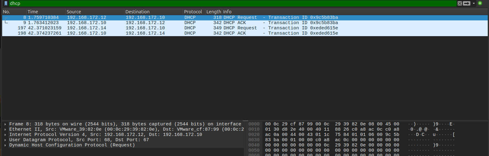
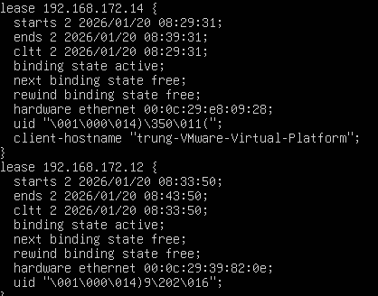
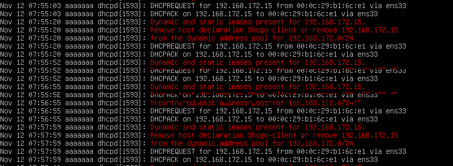

# Files logs DHCP



## DHCP server
### 1. Danh sách địa chỉ IP đã cấp phát bởi DHCP
- Mở file `dhcp.leases`:
```bash
sudo cat /var/lib/dhcp/dhcpd.leases
sudo less /var/lib/dhcp/dhcpd.leases
```



Mục đích : Xem IP đã cấp, xem MAC, thấy DHCP, Debug lỗi không cấp IP

- Lọc IP đang còn hiệu lực:
```bash
awk '/^lease/{ip=$2}/ends/{print ip,$0}' /var/lib/dhcpd/dhcpd.leases
```
### 2. Xem log DHCP server
#### Ubuntu
```bash
sudo journalctl -u isc-dhcp-server
```



- Xem log theo thời gian thực:
```bash
journalctl -u isc-dhcp-server -f
```
- Lọc riêng DHCP DISCOVER:
```bash
journalctl -u isc-dhcp-server | grep -Ei "discover|request|offer|ack"
```
#### Rocky Linux / CentOS 9 
```bash
sudo journalctl -u dhcpd
```
- Realtime
```bash
journalctl -u dhcpd -f
```
- Lọc
```bash
journalctl -u dhcpd | grep -Ei "discover | request | offer | ack"
```
## DHCP client
### Ubuntu Client
- NetworkManager(mặc định)
```bash
sudo journalctl -u NetworkManager
```
Lọc DHCP
```bash
journalctl -u NetworkManager | grep -i dhcp
```
Real time
```bash
journalctl -u NetworkManager -f
```
### Rocky Linux Client
Trên DHCP client xem file log với lệnh
```bash
sudo grep dhclient /var/log/messages
```

### File lease DHCP client
```bash
/var/lib/NetworkManager/dhclient-*.lease
```
## Debug DHCP
### 1. Kiểm tra client có gửi DHCP Discover không
```bash
tcpdump -i eth0 port 67 or port 68
```
### 2. Restart DHCP client
```bash
nmcli device disconnect eth0
nmcli device connect eth0
```
hoặc
```bash
dhclient -r eth0
dhclient -v eth0
```