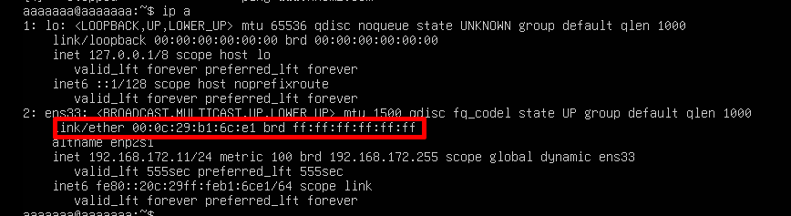
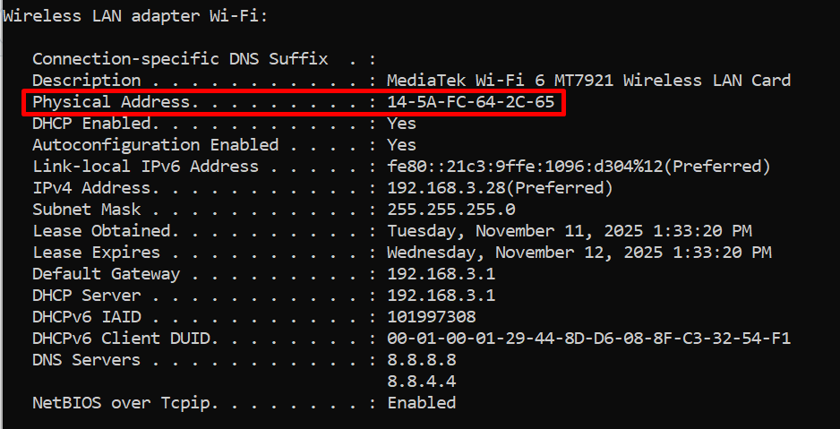

# Cấp phát IP theo địa chỉ MAC
## CentOS và Windows
### Xác định MAC của client
Kiểm tra địa chỉ MAC
- `ip a`: Ubuntu



- `ipconfig /all`: Window



### Chỉnh sửa file cấu hình DHCP server
Mở file cấu hình:
```plaintext
sudo nano /etc/dhcp/dhcpd.conf
```

Tìm đến phần khai báo subnet, thêm một đoạn cấu hình dạng sau vào bên trong hoặc ngay sau subnet:

```ruby
# Cho CentOS
host ubuntus-client {
    hardware ethernet 00:0c:29:b1:6c:e1;
    fixed-address 192.168.172.111;
}
# Cho windows
host windows-client {
    hardware ethernet 14:5A:FC:64:2C:65;
    fixed-address 192.168.172.112;
}