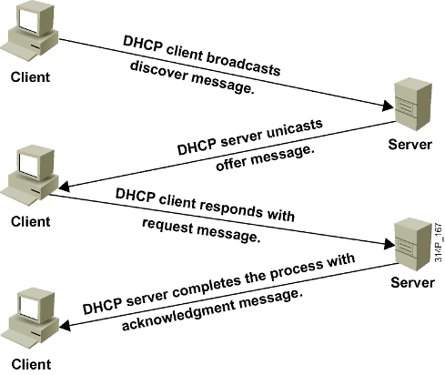
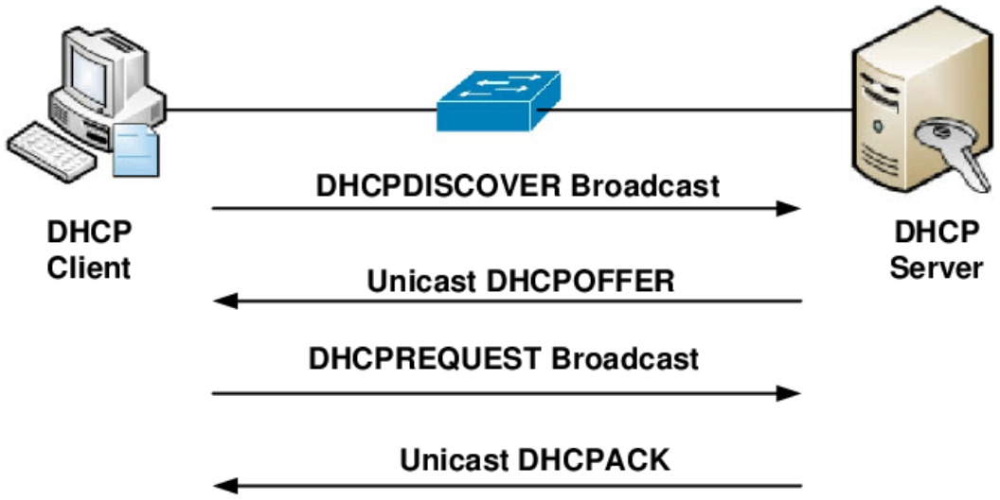
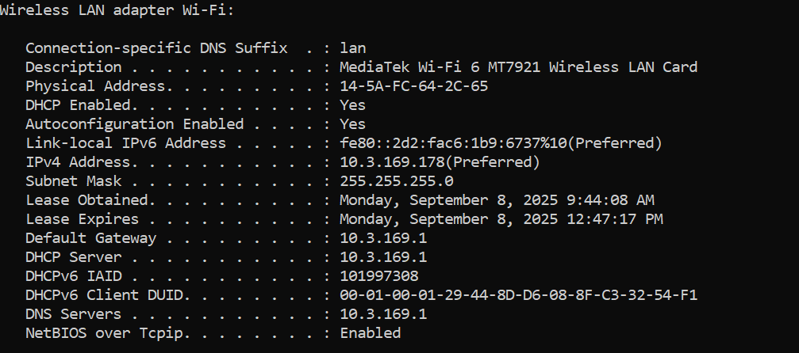

# DHCP

## 1. DHCP(Dynamic Host Configuration Protocol)
### 1.1 Khái niệm
- Giao thức DHCP - giao thức cấu hình máy chủ là một giao thức mạng được sử dụng để tự động cấp phát địa chỉ IP và các thông tin cấu hình mạng khác(như subnet mask, gateway mặc định, địa chỉ DNS) cho các thiết bị trong mạng. DHCP giúp đơn giản hoá việc quản lý mạng bằng cách loại bỏ nhu cầu cấu hình thủ công cho từng thiết bị.

### 1.2 DHCP Server
- DHCP server là máy chủ có chức năng kết nối mạng. Trả về thông tin khi máy trạm DHCP(DHCP Client) gửi yêu cầu. Ngoài việc trả thông tin hợp lý đến các thiết bị kết nối thì DHCP Server còn có nhiệm vụ thực hiện cấu hình cổng mặc định Default gateway cũng như Subnet Mask.

### 1.3 DHCP Client
- DHCP Client được định nghĩa là máy trạm chạy dịch vụ DHCP. DHCP Client được sử dụng để thực hiện đăng ký, cập nhật thông tin về địa chỉ IP cùng với những bản ghi DNS cho chính nó. Cụ thể, khi cần một địa chỉ IP hay tham số TCP/IP để làm việc trong hệ thống mạng, DHCP Client sẽ tiến hành gửi yêu cầu đến DHCP Server.

## 2. Cách thức hoạt động của DHCP

### 2.1 Trạng thái khởi tạo
- Client ở INIT (hoặc INIT-REBOOT nếu vừa khởi động lại và nhớ lease cũ).
- Client dùng UDP 68; Server dùng UDP 67
- Gói ban đầu đi broadcast vì client chưa có IP.
- Trường địa chỉ MAC/IP đặc biệt:
  - Src IP: 0.0.0.0 (client) -> Dst IP: 255.255.255.255 (broadcast) ở bước đầu.
  - Dựa trên MAC client (chaddr) để định danh.
### 2.2 Discovery(client -> broadcast)
- DHCP client gửi một gói tin broadcast (DHCPDISCOVER) tới toàn mạng để tìm kiếm DHCP server.
- Gói tin này được gửi tới địa chỉ 255.255.255.255:67, nguồn UDP 68 vì client chưa có địa chỉ IP.
- Trường/Option thường có:
  - Option 55- Parameter Request List: liệt kê những gì client muốn(ví dụ Option 1 mask, 3 gateway, 6 DNS, 15 domain, 51 lease time...).
  - Option 50- Requested IP (nếu client đề nghị IP cũ do off rồi khởi động lại). 
  - Flag broadcast: nếu bật, yêu cầu server trả lời broadcast.
### 2.3 Offer
- DHCP server nhận được DHCPDISCOVER và phản hồi bằng gói tin DHCPOFFER chứa:
  - Địa chỉ IP mà server gợi ý (yiaddr)
  - Các thông tin kèm theo(mask, gateway, DNS, lease,...)
  - Option 54 - Server Identifier: IP của server gửi OFFER
### 2.4 Request
- Client làm 2 việc quan trọng
  - **Chỉ định server nào nó chọn**
    - Trong REQUEST có Option 54 = IP của server đã chọn.
    - Nhờ vậy: Server được chọn hiểu là client đang xin IP của mình. Các server khác thấy không phải mình tự động thu hồi IP đã offer, không giữ nữa(nhờ broadcast).
  - **Client chọn một offer**( một địa chỉ IP mà nó muốn nhận dựa trên IP server X đã gợi ý) và phản hồi bằng gói tin DHCPREQUEST, xác nhận rằng nó chấp nhận địa chỉ IP được đề nghị.
### 2.5 Acknowledgement
- DHCP server gửi gói tin DHCPACK để xác nhận rằng địa chỉ IP đã được cấp phát cho client: ACK chứa yiaddr + toàn bộ options cấu hình(mask, gateway, DNS, lease...).
- Client sau đó chuyển sang trạng thái BOUND và cấu hình giao diện:
  - Đặt IP, Mask, Gateway, DNS...
  - Gửi ARP probe/gratuitous ARP để kiểm tra trùng IP (nếu thấy trùng sẽ gửi **DHCP DECLINE** để từ chối và xin lại).
- Nếu có vấn đề(sai mạng, lease hết hạn/ không hợp lệ), server gửi **DHCP NAK** -> client quay về INIT và lặp lại.

### 2.5.1 DHCP Negative Acknowledge (DHCP NAK)
- **Mục đích**: Thông điệp này được gửi bởi DHCP server để thông báo cho client rằng yêu cầu của nó không được chấp nhận. Điều này có thể xảy ra nếu địa chỉ IP mà client yêu cầu không còn hợp lệ (ví dụ: đã được cấp phát cho máy khác) hoặc nếu có lỗi trong quá trình gia hạn. Client sẽ yêu cầu lại IP mới.
- **Nguồn**: DHCP server (địa chỉ của server)
- **Đích**: Địa chỉ unicast đến DHCP client

### 2.6 DHCP Release - Giải phóng IP
- Thông điệp này được gửi bởi DHCP client để thông báo cho server biết rằng nó không còn sử dụng địa chỉ IP đã được cấp phát nữa. Điều này thường xảy ra khi client tắt máy hoặc ngắt kết nối mạng.
- **nguồn**: DHCP client(địa chỉ IP đã được cấp phát).
- **Đích**: Địa chỉ unicast đến DHCP server.

### 2.7 DHCP INFORM: 
- Các thiết bị không sử dụng DHCP để lấy địa chỉ IP vẫn có thể sử dụng khả năng cấu hình khác của nó. Một client có thể gửi một bản tin DHCP INFORM để yêu cầu bất kì máy chủ có sẵn nào gửi cho nó các thông số để mạng hoạt động.  DHCP server đáp ứng với các thông số yêu cầu – được điền trong phần tùy chọn của DHCP trong bản tin DHCP ACK.
  - Nguồn: DHCP client (địa chỉ IP đã được cấu hình).
  - Đích: Địa chỉ unicast đến DHCP server.

### 2.8 Gia hạn thuê IP (Lease Renewal)
- Mỗi lease có 2 mốc:
  - T1(50%): Client gửi DHCP REQUEST (unicast) trực tiếp đến server đã cấp(Option 54).
  - T2(87.5%): Nếu T1 thất bại, client broadcast REQUEST để bất kỳ server nào cùng scope có thể gia hạn.
- Nếu hết hạn mà không gia hạn được, client mất IP và quay về INIT (Discover lại).

### 2.9 DHCP Relay (qua Router)

- Khi clien và server khác VLAN/subnet, có nhiều mạng khacs tương ứng với nhiều router khác thì cần phải dùng DHCP Relay Agent vì Clients sử dụng địa chỉ broadcast để quảng bá yêu cầu cấp phát IP, khi gói tin gửi bằng broadcast đến Router thì sẽ bị loại bỏ, do vậy phải có cách để cho các router trung gian chấp nhận những gói tin broadcast này và gửi đến DHCP server cách này chính là DHCP Relay Agent.
- Relay nhận broadcast từ client, unicast đến DHCP và chèn:
  - giaddr = IP của interface relay -> giúp server biết scope nào phải cấp.
  - Option 82(Relay Agent Information) để mang thông tin switch/port/VLAN hỗ trỡ kiểm soát và ghi log.
- Server gửi OFFER/ACK về relay, relay chuyển tiếp lại cho client(thường broadcast trong VLAN đó).
- **LƯU Ý**:
  - Khi client mới xin IP, nó chưa có IP hợp lệ nên chưa thể nhận unicast theo địa chỉ đích của nó.
  - Relay chỉ biết MAC của client, không biết chắc client đã cấu hình được IP để nhận unicast.
  - Do đó, gói OFFER/ACK từ server thường được relay "thả" vào VLAN đó dưới dạn broadcast(255.255.255.255 hoặc broadcast của subnet), để đảm bảo mọi client đều nghe thấy, trong đó client đích sẽ xử lý gói dành cho nó.
  - Nếu client trong DISCOVER/REQUEST đã bật flag = unicast (thường là khi nó đã có IP hợp lệ, ví dụ giai đoạn gia hạn lease), thì server/relay có thể gửi unicast trực tiếp về địa chỉ IP đó.
  
### 2.10 Một số thông điệp khác của DHCP
- DHCP NAK: Từ chối/gỡ lease vì không hợp lệ (sai mạng, scope đổi…).
- DHCP DECLINE: Client phát hiện trùng IP (ARP thấy có thiết bị dùng IP) → từ chối IP đó; server đánh dấu IP bị nghi ngờ và không cấp trong một thời gian.
- DHCP RELEASE: Client chủ động trả lại IP trước khi tắt.
- DHCP INFORM: Client đã có IP tĩnh nhưng xin thêm options(DNS, domain...) từ DHCP.

### 2.11 Khi có nhiều DHCP servers
- Client sẽ nhận nhiều OFFER; thường chọn offer đến trước(không có chuẩn bắt buộc thứ tự khác).
- Client gửi REQUEST chỉ định rõ Server Identifier -> các server khác tự thu hồi đề nghị.

### 2.12 Bảo mật & vận hành
- DHCP Snooping (trên switch): chỉ cho phép gói DHCP hợp lệ tự cổng trusted( nối về server/relay); chặn DHCP giả mạo từ máy trạm.
- IP Source Guard, Dynamic ARP Inspection: kết hợp với bảng DHCP snooping binding để ngăn giả mạo IP/MAC/ARP.
- Ghi log: rất hữu ích để truy vết AI, MAC, port cấp phát.

### 2.13 DHCP Binding
- Là bản ghi ánh xạ hiện tại giữa các thông tin mà DHCP biết về client, Đây là cơ chế giúp DHCP Server ghi lại các thông tin cấp phát, đảm bảo tính nhất quán và minh bạch trong quản lý mạng: 
  - Địa chỉ MAC của client
  - Địa chỉ IP đã cấp
  - Thời gian lease
  - Có thể kèm thêm thông tin như VLAN, port( nếu có DHCP snooping/ relay Option 82).
  - Ví dụ:

| MacAddress         | IpAddress     | Lease (sec) | Type          | VLAN | Interface         |
|--------------------|---------------|-------------|---------------|------|-------------------|
| 00:1A:2B:3C:4D:5E  | 192.168.1.10  | 600         | dhcp-snooping | 10   | FastEthernet0/1   |

- DHCP Log là nhật ký sự kiện mà dịch vụ DHCP server hoặc relay ghi lại các hành động DISCOVER nhận từ MAC nào, OFFER gửi IP nào, REQ/ACK hoàn tất ra sao, Leae cấp, gian hạn, thu hồi, NAK, DEC
### Một số Option
- 1: Subnet Mask
- 3: Router(Default Gateway)
- 6: DNS Servers
- 15: Domain Name
- 28: Broadcast Address
- 42: NTP Servers
- 50: Client chủ động đề nghị DHCP server cấp cho một địa chỉ IP cụ thể ( mà client nhớ từ lease trước).
**Nếu máy hoàn toàn mới, chưa từng được cấp IP thì nó không có gì để nhớ → DISCOVER sẽ không chứa Option 50.**
- 51: IP Address Lease Time
- 53: DHCP Messeage Type (Discover/ Offer/ Request/ Ack/...)
- 54: Server Identifier
- 55: Parameter Request List
- 58/59: Renewal( T1)/ Rebinding(T2) Time

### Minh hoạ

    participant C as Client (no IP)
    participant R as Switch/Router (Relay)
    participant S as DHCP Server

    C->>R: DHCP DISCOVER (broadcast 255.255.255.255:67)
    R->>S: Forward DISCOVER (unicast via giaddr)
    S-->>R: DHCP OFFER (yiaddr, options)
    R-->>C: DHCP OFFER (broadcast/unicast tùy)
    C->>R: DHCP REQUEST (broadcast, chọn 1 server)
    R->>S: Forward REQUEST (unicast via giaddr)
    S-->>R: DHCP ACK (IP + mask + gw + DNS + lease)
    R-->>C: DHCP ACK (broadcast/unicast tùy)
    Note over C: Cấu hình IP, gửi ARP check, trạng thái BOUND

