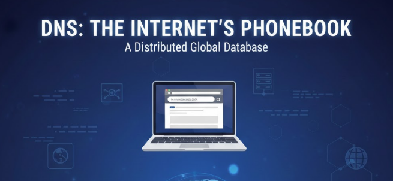

# DNS
### 1. Khái niệm
DNS (Domain Name System) là hệ thống dịch tên miền (human-readable) như example.com sang địa chỉ IP (ví dụ 93.184.216.34) mà máy tính và router dùng để định tuyến.

Nó hoạt động như “sổ địa chỉ” phân tán toàn cầu: bạn hỏi tên, DNS trả về địa chỉ tương ứng (cũng trả về mail servers, bản ghi xác thực, v.v.)

Khi người dùng đăng nhập vào một website bất kì mà không cần phải nhập một loạt số địa chỉ IP lưu trữ. Chỉ cần nhập tên của trang web và trình duyệt sẽ tự động nhận dạng trang web đó.



### 2. Chức năng của DNS
- **Phân giải tên miền thành địa chỉ IP**: Đây là chức năng chính. Khi bạn gõ một tên miền vào trình duyệt, hệ thống DNS sẽ tìm kiếm và trả về địa chỉ IP của máy chủ đang lưu trữ trang web đó. Nhờ có IP, trình duyệt mới biết phải kết nối đến đâu. Ngoài ra, cho phép các tổ chức quản lý tên miền bao gồm đăng kí, huỷ bỏ, cập nhật tên miền.
- **Phân giải ngược(Reverse DNS Lookup)**: DNS cũng có thể chuyển đổi ngược từ địa chỉ IP sang tên miền tương ứng (sử dụng bản ghi PTR). Điều này thường được dùng cho mục đích bảo mật, xác thực máy chủ email, hoặc ghi nhật ký.
- **Quản lý Lưu lượng Truy cập (Traffic Management)**:
  - Các bản ghi DNS cho phép nhà quản trị định tuyến (routing) lưu lượng truy cập cho các dịch vụ khác nhau như website, email, hoặc các dịch vụ phụ trợ đến các máy chủ cụ thể.
  - Nó còn hỗ trợ các kỹ thuật như cân bằng tải (Load Balancing) bằng cách luân phiên trả về nhiều địa chỉ IP khác nhau cho cùng một tên miền.
- **Quản lý các bản ghi DNS**:  DNS lưu trữ thông tin trong các bản ghi DNS, bao gồm các loại bản ghi như A (địa chỉ IPv4), AAAA (địa chỉ IPv6), CNAME (tên miền chấp nhận mệnh đề), MX (máy chủ thư điện tử) và nhiều loại khác.- được sử dụng cho mục đích xác minh quyền sở hữu tên miền, chống spam email, và các tính năng bảo mật khác.
### 4. Các bản ghi (record) quan trọng trong DNS
#### 1. A Record (Address Record)
- **Chức năng**: ánh xạ tên miền -> địa chỉ IPv4
```ruby
 example.com IN A 93.184.216.34
```
- Khi gõ `example.com`, trình duyệt sẽ dùng IP `93.184.216.34` để kết nối.
#### 2. AAAA Record (IPv6 Address Record)
- **Chức năng**: giống A record, nhưng dùng cho địa chỉ IPv6
```ruby
example.com     IN  AAAA    2606:2800:220:1:248:1893:25c8:1946
```
#### 3. CNAME Record (Canonical Name Record)
- **Chức năng**: trỏ một tên tới tên khác, dùng tạo bí danh (alias) cho một tên miền khác.
- Cấu trúc:
```ruby
Tên bí danh(Alias) IN CNAME Tên chuẩn(Canonical Name)
```
```ruby
www.example.com IN CNAME blog.example.com
```
Khi một người dùng hoặc hệ thống mạng yêu cầu địa chỉ IP của `www.example.com`, máy chủ DNS sẽ trả lời bằng cách nói: "`www.example.com` không có IP riêng, nó chỉ là bí danh của `blog.example.com`."
#### 4. MX Record (Mail Exchange Record)
- **Chức năng**: ánh xạ tên miền đến tên của máy chủ thư điện tử (Mail Server) mà máy chủ đó có thể tiếp nhận email.
```ruby
example.com IN MX 10 mail1.example.com.
example.com IN MX 20 mail1.example.com.
```
- Khi có email gửi đến example.com, máy chủ gửi sẽ thử gửi đến `mailserver1.example.com` trước vì nó có ưu tiên 10 (cao hơn).
- Nếu mailserver1.example.com không phản hồi, máy chủ gửi sẽ thử gửi đến `mailserver2.example.com` với ưu tiên 20 (dự phòng).
- Bản ghi MX luôn trỏ đến một tên miền khác, KHÔNG BAO GIỜ trỏ trực tiếp đến một địa chỉ IP.
#### 5.  TXT Record (Text Record)
- **Chức năng**: chứa dữ liệu văn bản, dùng cho:
  - Xác thực email(SPF, DKIM, DMARC).
- `NS`: Name server (delegation)
- `SOA`: Start of Authority (metadata zone: primary server, serial, refresh/retry/expire, TTL).
- `TXT`: văn bản (dùng cho SPF, DKIM, verifications)
- `SRV`: dịch vụ (service discovery, nội dung: priority, weight, port, target). 
- `PTR`: reverse lookup( IP -> tên)
- `DS, DNSKEY, RRSIG`: liên quan DNSSEC( chữ ký và khóa)
#### 6. CAA Record (Certification Authority Authorization)
- **Chức năng**: chỉ định tổ chức cấp chứng chỉ SSL/TLS cho tên miền, giúp bảo vệ chống chứng chỉ SSL giả mạo.
```bash
example.com       IN  CAA  0  issue "letsencrypt.org"
```
- Chỉ **Letsencrypt** được cấp phép SSL cho example.com
  - `0`: Không bắt buộc, cho phép Certification Authority(CA) giải thích hoặc bỏ qua bản ghi nếu nó không hiểu.
  - `1`: Critical( quan trọng) Nếu một CA không hiểu bản ghi CAA có flag = 1, nó phải từ chối cấp chứng chỉ.

#### 7 NS Record (Name Server Record)
- Chức năng: chỉ định DNS server nào quản lý bản ghi của tên miền.
```bash
example.com      IN    NS    ns1.cloudflare.com.
example.com      IN    NS    ns2.cloudflare.com.
```
Dùng để trỏ về nhà cung cấp DNS đang dùng (Cloudflare, GoDaddy, v.v.)
#### 8. SRV Record (Service Record)
- Dùng để định tuyến đến dịch vụ cụ thể, ví dụ: VoIP(SIP), IM(XMPP), LDAP, v.v. SRV Record này chứa thông tin về hostname, cổng(port), độ ưu tiên.
```bash
_sip._tcp.example.com   IN  SRV  10  60  5060  sipserver.example.com.
```
  - Dùng để trỏ về nhà cung cấp DNS đang dùng( Cloudflare, GoDaddy, v.v.)
  - `_sip` -> tên dịch vụ (SIP- Session Initiation Protocol, dùng trong VoIP, gói điện qua internet).
  - `_tcp` -> giao thức sử dụng (TCP)
  - `10` (Priority - mức ưu tiên): càng nhỏ càng ưu tiên
  - `60` (Weight - trọng số): nếu có cùng `priority`,`weight` quyết định tỉ lệ chia tải. `weight` cao hơn sẽ có xác suất được chọn nhiều hơn cao hơn.
  - `5060` (Port - cổng)
### 5. Các loại DNS
#### 5.1 ISP DNS
- Đây là các máy chủ DNS được tự động gán cho bạn khi bạn kết nối mạng thông qua Nhà cung cấp dịch vụ Internet(ISP) như VNPT, FPT, Vietel,... Chúng dễ sử dụng vì bạn không cần cấu hình gì cả.  Tuy nhiên, tốc độ và độ ổn định của ISP DNS có thể không phải lúc nào cũng tốt nhất, và đôi khi ISP có thể sử dụng DNS để chặn truy cập một số trang web hoặc ghi lại lịch sử duyệt web của người dùng.

#### 5.2 Public DNS
- Đây là các máy chủ DNS được cung cấp miễn phí cho cộng đồng bởi các tổ chức lớn, với mục tiêu cải thiện tốc độ, độ tin cậy và bảo mật khi duyệt web. Một số Public DNS phổ biến nhất bao gồm:
  - Google Public DNS: Địa chỉ 8.8.8.8 và 8.8.4.4 -> Tập trung vào sự ổn định
  - Cloudflare DNS: Địa chỉ 1.1.1.1 và 1.0.0.1 -> Tập trung mạnh vào quyền riêng tư và tốc độ, hỗ trợ các chuẩn bảo mật mới như DNS over HTTPS (DoH), DNS over TLS (DoT)
  - OpenDNS: Địa chỉ 208.67.222.222 và 208.67.220.220-> Cung cấp các tính năng lọc nội dung (ví dụ: chặn web độc hại, web người lớn) hữu ích cho gia đình và doanh nghiệp.

#### 5.3 Private DNS
Đây là các máy chủ DNS được thiết lập và quản lý bởi một tổ chức hoặc cá nhân cho mục đích sử dụng nội bộ. Ví dụ, một công ty lớn có thể có Private DNS Server để quản lý tên các máy chủ, máy in trong mạng nội bộ của họ.

| **Tiêu chí**              | **Public DNS**                                                   | **ISP DNS**                                                                     | **Private DNS**                                          |
| ------------------------- | ---------------------------------------------------------------- | ------------------------------------------------------------------------------- | -------------------------------------------------------- |
| **Khái niệm**             | DNS công cộng do bên thứ ba cung cấp cho mọi người dùng Internet | DNS do **nhà cung cấp dịch vụ Internet (ISP)** triển khai cho khách hàng của họ | DNS nội bộ dùng riêng cho **doanh nghiệp/mạng LAN**      |
| **Đơn vị vận hành**       | Google, Cloudflare, OpenDNS, Quad9…                              | VNPT, Viettel, FPT, CMC…                                                        | Doanh nghiệp, tổ chức, sysadmin                          |
| **Đối tượng sử dụng**     | Bất kỳ ai trên Internet                                          | Thuê bao của ISP                                                                | Thiết bị trong mạng nội bộ                               |
| **Phạm vi truy cập**      | Toàn cầu                                                         | Trong hạ tầng ISP (có thể ra Internet)                                          | Giới hạn trong mạng private                              |
| **Mục đích sử dụng**      | Phân giải tên miền Internet nhanh, ổn định, trung lập            | Phân giải tên miền cho thuê bao, tối ưu tuyến nội mạng                          | Quản lý tài nguyên nội bộ, bảo mật và kiểm soát truy cập |
| **Tính năng**             | Phân giải toàn cầu, cache lớn, Anycast, tốc độ cao               | Cache gần người dùng, tích hợp hệ thống ISP                                     | Tuỳ chỉnh sâu, split DNS, internal domain                |
| **Kiểm soát truy cập**    | Gần như không                                                    | Có kiểm soát mức ISP                                                            | Kiểm soát chặt chẽ theo policy                           |
| **Bảo mật**               | Cơ bản, có hỗ trợ DNSSEC, DoH/DoT                                | Trung bình, phụ thuộc ISP                                                       | Cao, hạn chế truy cập từ ngoài                           |
| **Quyền riêng tư**        | Có thể log truy vấn (tuỳ nhà cung cấp)                           | ISP **có toàn quyền log**                                                       | Dữ liệu nằm trong tổ chức                                |
| **Quản lý & triển khai**  | Rất đơn giản, chỉ cần cấu hình IP DNS                            | Tự động khi cấp mạng                                                            | Phức tạp, cần kiến thức DNS & hệ thống                   |
| **Truy cập từ bên ngoài** | Được phép                                                        | Được phép                                                                       | Không (trừ khi expose có kiểm soát)                      |
| **Ví dụ**                 | 8.8.8.8, 1.1.1.1                                                 | DNS của VNPT, Viettel                                                           | dns.local, cloud.test                                    |

### 6. Các thành phần chính trong quy trình DNS


`Picture source= geeksforgeeks.org`
#### 6.1 DNS Recursor(Recursive Resolver)
- Là máy chủ mà thiết bị người dùng gửi truy vấn đầu tiên. Máy chủ này hoạt động như 1 thư viện, nhận queries từ browsers người dùng, nếu không có sẵn cache, gửi tìm kiếm tới các server khác để tìm ra địa chỉ IP cuối cùng.
- Đây là máy chủ trung gian giữa người dùng và hệ thống phân giải tên miền toàn cầu, nó sẽ giúp bạn hỏi và tìm ra địa chỉ IP cuối cùng.
- Nhận yêu cầu từ client(browser) và đi lần lượt đến **Root**->**TLD**->**Authoritatives DNS** để lấy IP
- Lưu trữ kết quả tra cứu vào bộ nhớ cache để phục vụ các yêu cầu tiếp theo nhanh hơn.
- Ví dụ:
  - `8.8.8.8` (Google)
  - `1.1.1.1` (Cloudflare)
  - DNS của nhà mạng như VNPT, Viettel, FPT,...
#### 6.2 Root Server
- Là tầng cao nhất của hệ thống DNS. Root Server không lưu IP website mà chỉ định máy chủ TLD phù hợp (.com, .vn, .org…).
- Root server giống như danh bạ quốc tế:
  - `.com`: ở đâu
  - `.net`: ở đâu
  - `.org`: ở đâu
#### 6.3 TLD Name Server 
- Quản lý các tên miền cấp cao nhất. Chúng cung cấp thông tin về Authoritative DNS Server của domain cụ thể.
- TLD Name Server cho biết ai quản lý domain này, cho biết server nào đang giữ tên miền mà người dùng truy vấn.
- Ví dụ:
  - `ns1.example.com` quản lý `example.com`
  - `ns2.example2.com` quản lý `abcxyz.com`
#### 6.4 Authoritative Name Server
- Là nơi lưu trữ bản ghi DNS chính xác và đầy đủ nhất của một tên miền. Đây là điểm cuối trong chuỗi truy vấn DNS và là nguồn dữ liệu “chính thống”.
- Trả về câu trả lời cuối cùng cho truy vấn tên miền.
- Loại:
  - **Primary server(master)**: nơi lưu trữ dữ liệu gốc, có thể chỉnh sửa
  - **Secondary server(slave)**: bản sao của master, dùng để tăng độ ổn định và phân tải.
#### 6.5 DNS Zones
- Các khu vực điều khiển Administrative, bao gồm cả Forward Lookup Zones(name to IP) và Reverse Lookup Zones(IP to name).
#### 6.6 Caching DNS Server
- Là nơi lưu trữ tạm thời các records trong các bộ phân giải để tiết kiệm thời gian cho các lần yêu cầu tiếp theo.
- Có thể coi là một phần của recursive server
- Mỗi bản ghi được cache trong một khoảng thời gian gọi là TTL(Time-To-Live)
### 7. Cách hoạt động của DNS Server


- Người dùng nhập vào 1 tên miền `example.com` vào web browser, Query này sẽ được gửi lên Internet và được tiếp nhận bởi DNS recursive resolver(thường là DNS của ISP, router hoặc 8.8.8.8).
- The resolver kiểm tra cache, nếu không có, Server này truy vấn DNS root nameserver để tìm kiếm. Root không biết IP của `example.com`. Root chỉ biết `.com` nằm ở đâu.
- Resolver hỏi TLD server (`.com`). TLD trả về Nameserver của `example.com`.TLD vẫn không biết IP web, nó chỉ biết nameserver chính thức.
- Resolver hỏi Nameserver của `example.com`. Nameserver trả về IP thật. 
```ini
example.com = 93.184.216.34
```
- Resolver gửi IP về cho Browser
- Browser gửi HTTP request
```sql
GET / HTTP/1.1
Host: example.com
```
tới ip `93.184.216.34`
- Server trả về HTML