# Tổng quan về lệnh `dig`
### 1. Khái niệm `dig`
- `dig`(Domain Information groper) là công cụ dòng lệnh có sẵn của Linux, sử dụng với mục đích quản trị mạng, tra cứu thông tin về hệ thống tên miền DNS.
- `dig` cho phép gửi truy vấn DNS đến một máy chủ cụ thể và hiển thị kết quả chi tiết - bao gồm các bản ghi như A, AAAA, MX, NS, CNAME, PTR...
### 2. Chức năng chính
- **Tra cứu địa chỉ IP của tên miền**: Chức năng phổ biến nhất là tìm địa chỉ IPv4 (bản ghi A) và IPv6 (bản ghi AAAA) liên kết với một tên miền.
  - VD: `dig google.com` để xem dns của google

- So với những công cụ tra cứu DNS khác như `nslookup` hay `host`, `dig` có nhiều ưu điểm vượt trội:
  - Kết quả chi tiết
  - Có nhiều tuỳ chọn truy vấn hơn
  - Chọn máy chủ DNS cụ thể và theo dõi chi tiết toàn bộ quá trình phân giải tên miền.
- Lệnh `dig` có chức năng tra cứu mọi loạn bản ghi DNS: A, AAAA, MX, NS, TXT, SOA
- Kiểm tra phản hồi máy chủ cụ thể
- Debug lỗi:
  - Domain không vào được 
  - Mail không gửi/ nhận
  - DNS cache sai
  - DNS propagation
  - Split DNS

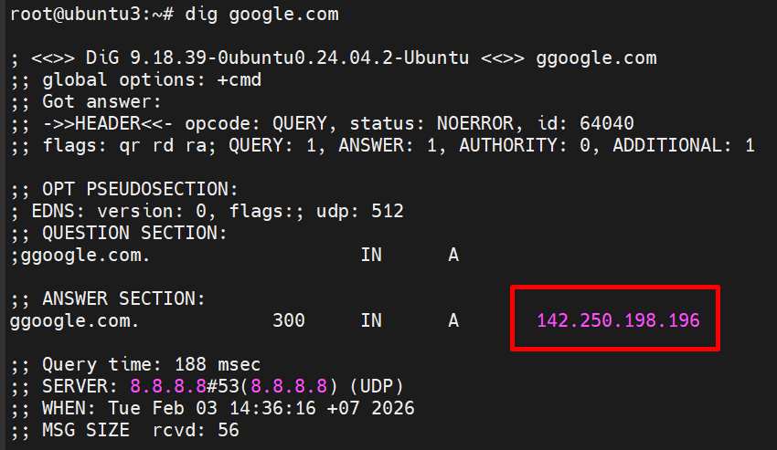

- **Lấy thông tin chi tiết về các bản ghi DNS**: dig có thể truy vấn các loại bản ghi DNS khác nhau như: MX, NS, CNAME,...
- **Kiểm tra một máy chủ DNS cụ thể**: Bạn có thể chỉ định dig gửi truy vấn đến một máy chủ DNS cụ thể thay vì máy chủ DNS mặc định của hệ thống. Dùng khi kiểm tra máy chủ DNS của riêng;
  - Ví dụ: `dig @<địa_chỉ_máy_chủ_dns> <tên_miền>`
  
  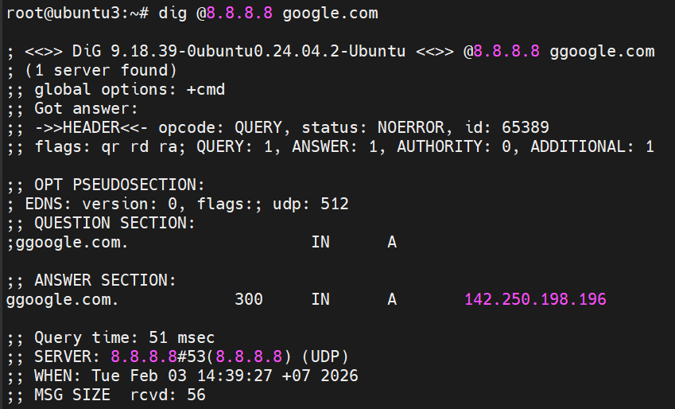

- **Chuẩn đoán và khắc phục sự cố dns**: Nhờ khả năng hiển thị chi tiết quá trình truy vấn và phản hồi (bao gồm máy chủ trả lời, thời gian truy vấn, TTL, các cờ - flags), dig là công cụ không thể thiếu để xác định vấn đề khi một tên miền không phân giải đúng cách hoặc khi cấu hình DNS có lỗi.

### 3. Cấu trúc cơ bản của lệnh `dig`
**a. Cú pháp câu lệnh**
```bash
dig [@DNS_SERVER] [DOMAIN] [RECORD_TYPE] [OPTIONS]
```
- Trong đó:
  - [@DNS_SERVER] : là DNS Server để hỏi (có `@` -> chỉ thẳng DNS Server còn không `@` là chỉ DNS Server mặc định)
  - [DOMAIN]: Tên miền cần truy vấn
  - [RECORD_TYPE]: Các loại bản ghi (A,AA,MX,...)

**b. Kết quả trả về**
Output được chia 5 phần lớn:

**HEADER (đầu gói tin)**
- Ví dụ:

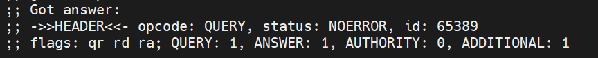

**opcode**

- Cho biết loại thao tác DNS
- Các giá trị phổ biến:

| opcode | Ý nghĩa                                        |
| ------ | ---------------------------------------------- |
| QUERY  | Truy vấn DNS bình thường (99% bạn gặp cái này) |
| IQUERY | Truy vấn ngược (cũ, gần như bỏ)                |
| STATUS | Hỏi trạng thái server                          |
| UPDATE | Dynamic DNS update                             |

**status**
- Đây là kết quả xử lý DNS của server
- Các status thường gặp

| status   | Nghĩa                  |
| -------- | ---------------------- |
| NOERROR  | Thành công             |
| NXDOMAIN | Domain không tồn tại   |
| SERVFAIL | DNS server lỗi         |
| REFUSED  | Server từ chối trả lời |
| FORMERR  | Gói tin sai format     |
| NOTIMP   | Server không hỗ trợ    |

**id**
- ID của truy vấn DNS
- Client gửi đi 1 số ngẫu nhiên -> server trả lại đúng số đó.

**Dòng 2: flags + số lượng record**
```text
;; flags: qr rd ra; QUERY: 1, ANSWER: 1, AUTHORITY: 0, ADDITIONAL: 1
```
- **A. flags**
```makefile
flags: qr rd ra
```
- Mỗi flag là 1 bit trong DNS header
  - **qr**: Query Response -> Đây là response, nếu không có đây là query.
  - **rd**: Recursion Desired -> Client yêu cầu DNS server truy vấn đệ quy, Browser luôn set flag này.
  - **ra**: Recursion Available -> Có hỗ trợ recursion, Nếu không có `ra` -> DNS đó chỉ authoritative.

- Các flag khác( có thể gặp):

| Flag | Nghĩa                             |
| ---- | --------------------------------- |
| aa   | Authoritative Answer              |
| tc   | Truncated (bị cắt do quá dài UDP) |
| ad   | Authenticated Data (DNSSEC)       |
| cd   | Checking Disabled                 |

**Số record trong từng section**
```yaml
QUERY: 1, ANSWER: 1, AUTHORITY: 0, ADDITIONAL: 1
```
- **QUERY**: Bao nhiêu câu hỏi
- **ANSWER**: Bao nhiêu bản ghi trả lời chính
- **AUTHORITY**: Số record authoritative
- **ADDITIONAL**: Thông tin phụ: IP của nameserver, OPT record (EDNS), glue record.

- **QUESTION SECTION**: Hiển thị nội dung câu hỏi DNS
- **ANSWER SECTION**: Trả về kết quả: IP của domain
- **AUTHORITY SECTION**: Máy chủ DNS có thẩm quyền (nếu có)
- **Query time**: Thời gian thực hiện truy vấn
- **SERVER**: DNS server được hỏi
- **WHEN**: Thời gian truy vấn

### 4. Các [OPTIONS] quan trọng của lệnh `dig`
| Option        | Ý nghĩa                     | Ví dụ                               |
| ------------- | --------------------------- | ----------------------------------- |
| `+short`      | Chỉ hiển thị kết quả gọn    | `dig google.com +short`             |
| `+noall`      | Ẩn toàn bộ output           | `dig google.com +noall`             |
| `+answer`     | Chỉ hiện ANSWER SECTION     | `dig google.com +noall +answer`     |
| `+question`   | Chỉ hiện QUESTION           | `dig google.com +noall +question`   |
| `+authority`  | Chỉ hiện AUTHORITY          | `dig google.com +noall +authority`  |
| `+additional` | Chỉ hiện ADDITIONAL         | `dig google.com +noall +additional` |
| `+comments`   | Hiện comment (mặc định bật) | `+nocomments`                       |
| `+stats`      | Hiện thống kê query         | `+nostats`                          |

##### Options điều khiển truy vấn (QUERY BEHAVIOR)

| Option       | Ý nghĩa                           | Khi dùng                   |
| ------------ | --------------------------------- | -------------------------- |
| `+trace`     | Trace DNS từ root → authoritative | Debug DNS propagation      |
| `+recurse`   | Cho phép đệ quy (mặc định)        | DNS client                 |
| `+norecurse` | Không đệ quy                      | Test DNS authoritative     |
| `+tcp`       | Dùng TCP thay UDP                 | Response lớn / DNS bị chặn |
| `+ignore`    | Bỏ qua truncate                   | Khi UDP bị cắt             |
| `+retry=N`   | Số lần retry                      | DNS chậm                   |
| `+time=N`    | Timeout (giây)                    | DNS lag                    |

##### Options liên quan DNSSEC

| Option      | Ý nghĩa            |
| ----------- | ------------------ |
| `+dnssec`   | Yêu cầu DNSSEC     |
| `+cdflag`   | Bỏ kiểm tra DNSSEC |
| `+sigchase` | Theo chữ ký DNSSEC |

##### Options về TTL & định dạng

| Option       | Ý nghĩa                    |
| ------------ | -------------------------- |
| `+ttlunits`  | Hiển thị TTL dạng phút/giờ |
| `+multiline` | Output nhiều dòng dễ đọc   |
| `+split=W`   | Cắt dòng độ rộng W         |

##### Options EDNS & kích thước gói

| Option          | Ý nghĩa        |
| --------------- | -------------- |
| `+edns=0`       | Bật EDNS0      |
| `+noedns`       | Tắt EDNS       |
| `+bufsize=SIZE` | Set buffer UDP |

##### Options chỉ định DNS server

| Cách dùng  | Ý nghĩa               |
| ---------- | --------------------- |
| `@8.8.8.8` | Hỏi DNS server cụ thể |
| `-b IP`    | Bind IP nguồn         |
| `-p PORT`  | Chỉ định port         |

##### Options debug / test nâng cao

| Option        | Ý nghĩa                      |
| ------------- | ---------------------------- |
| `+qr`         | Hiển thị query gửi đi        |
| `+fail`       | Ngừng khi lỗi                |
| `+besteffort` | Nhận câu trả lời chưa đầy đủ |

##### Các combo dùng nhiều trong thực tế

**Lấy IP nhanh**:

```bash
dig domain.com +short -4
```

**Debug DNS gọn**:

```bash
dig domain.com +noall +answer
```

**Trace DNS từ root**:

```bash
dig domain.com +trace
```

**Test DNS authoritative**:

```bash
dig @ns1.domain.com domain.com +norecurse
```

**Debug mail**:

```bash
dig domain.com MX +noall +answer
dig domain.com TXT +noall +answer
```

#### Truy vấn tới DNS Server dùng lệnh `dig`

Truy vấn tới DNS Server `Google`:

```bash
dig google.com
```


Trong đó:

- Output gồm các phần: **HEADER, ANSWER, QUESTION, NAME SERVER**:

- Phần **Header**: hiển thị một bản tóm tắt ngắn gọn về lệnh mà bạn đã chạy. Giá trị “opcode” hiển thị hành động mà dig đã thực hiện. Trong khi đó, giá trị "status" xuất kết quả tổng thể của truy vấn.

Phần **Question** hiển thị danh sách các truy vấn mà bạn đã thực hiện thông qua dig. Cột đầu tiên in tên miền hoàn chỉnh theo sau là lớp truy vấn và loại bản ghi DNS.

Phần **Answer** hiển thị kết quả truy vấn của bạn. Cột đầu tiên chứa tên miền hoàn chỉnh theo sau là giá trị “Time To Live” của nó. Cột thứ ba và thứ tư hiển thị loại truy vấn và loại bản ghi DNS, trong khi cột thứ năm xuất kết quả.

Phần **Nameserver** chứa thông tin chi tiết về DNS server được sử dụng cho lệnh này. `QUERY TIME` là lượng thời gian mà máy chủ cần để xử lý truy vấn. Giá trị `SERVER` là địa chỉ IP của nameserver và `MSG SIZE` hiển thị kích thước của truy vấn tính bằng byte.

#### Truy vấn DNSServer chỉ cần biết mỗi IP

Check nhanh địa chỉ IP của 1 **DNSServer** ta dùng lệnh sau

```bash
dig +short google.com
```

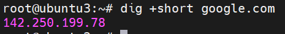

#### Truy vấn DNSServer chỉ cần biết mỗi Answer Section

```bash
dig google.com +noall +answer
```

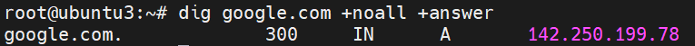

=> Tuỳ chọn này tắt tất cả section chỉ hiển thị mỗi **Answer Section**

#### Truy vấn ngược

Nếu ta chỉ nhớ mỗi địa chỉ IP mà quên tên miền thì ta cũng có thể dùng cú pháp truy vẫn ngược để truy xuất tên miền

```bash
dig -x 72.30.38.140 +short
```

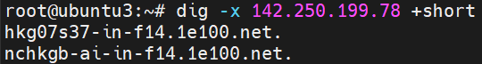

=> Dùng tuỳ chọn `-x` để truy vấn ngược

#### Truy vấn đường dẫn của gói tin tới DNSServer hay theo dõi đường đi truy vấn DNS(Trace)

Đây là một trong những tính năng mạnh mẽ nhất của `dig` để chẩn đoán sự cố. Tùy chọn `+trace` sẽ mô phỏng lại cách một trình phân giải DNS tìm kiếm thông tin, bắt đầu từ các **Máy chủ gốc (root servers)**.

Ví dụ:

```bash
dig google.com +trace -4 (Chỉ trace IPv4)
```

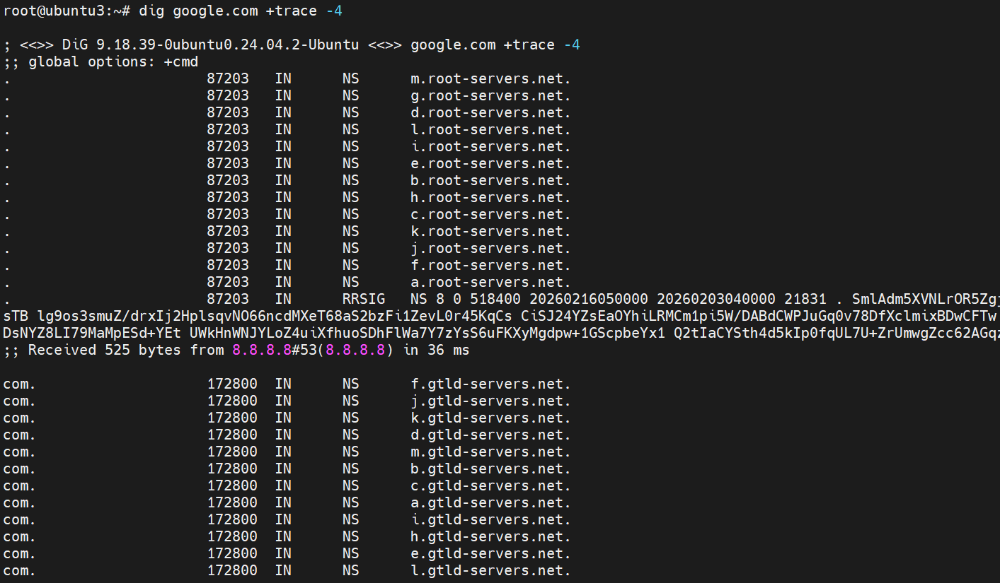

#### Kiểm tra DNSSEC

**DNSSEC** là extension tăng cường bảo mật cho DNS bằng cách xác thực các phản hồi. Cho nên, để xem 1 tên có kích hoạt **DNSSEC** thì ta dùng tuỳ chọn `+dnssec`

```bash
dig google.com +dnssec
```

#### Truy vấn A Record (IPv4)

```bash
dig google.com a
```

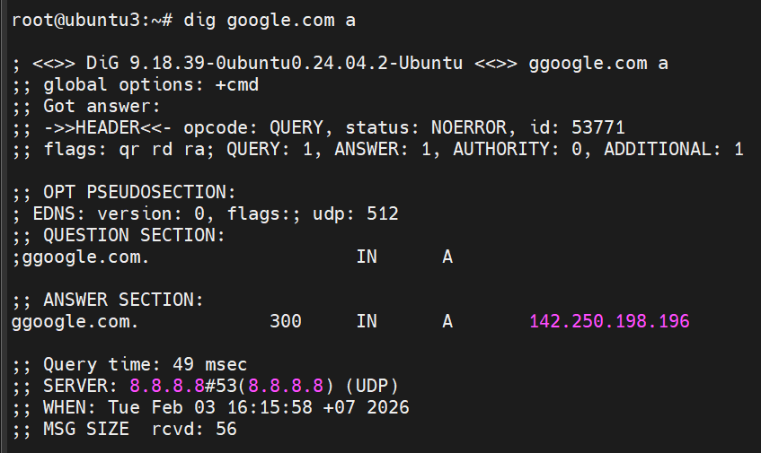

#### Truy vấn AAAA Record (IPv6)

```bash
dig google.com aaaa
```

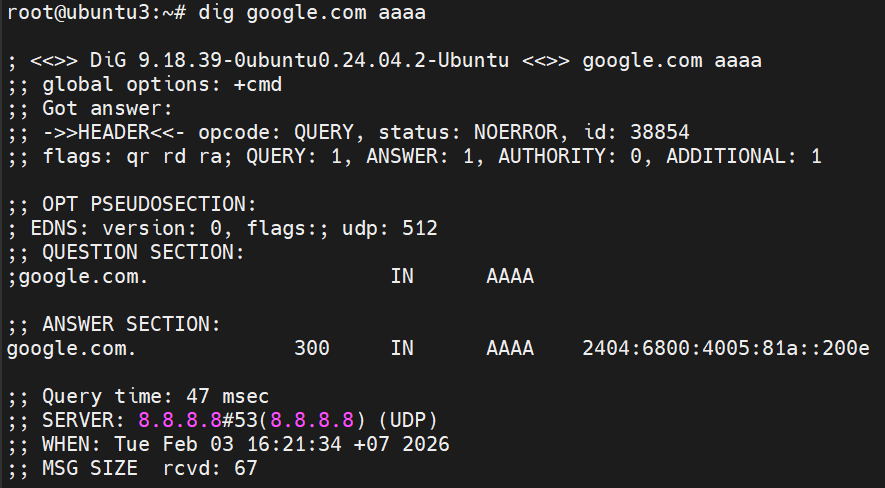

#### Truy vấn CN Record (Canonical Name)

Truy vấn bản ghi các tên miền phụ của **DNSSerrver**:

```bash
dig google.com cn
```

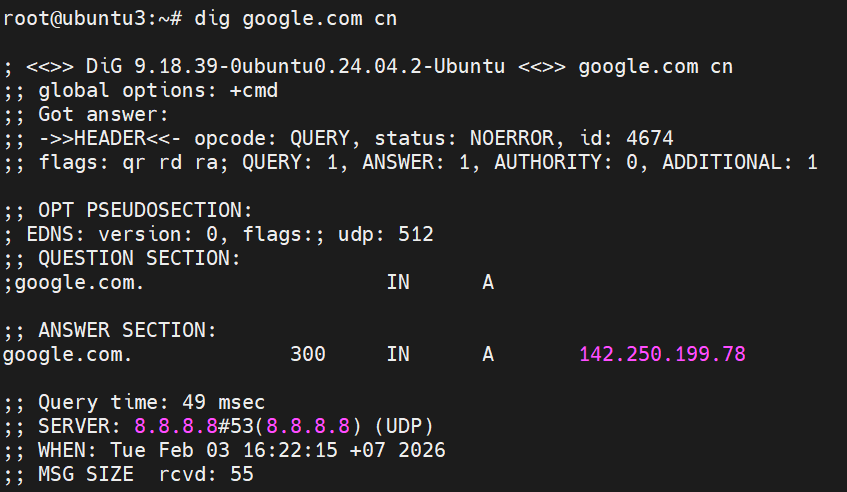

Trong đó:

- Phần **Question Section** ban đầu nó vẫn hỏi tên miên chính `google.com` và được reply bằng phần **Answer Section**
- Nhưng `dig` sẽ hỏi thêm để truy vấn `cn`(tên miền phụ)  
  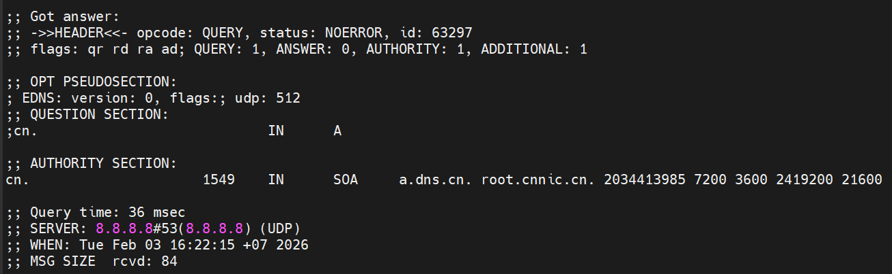
- Nhưng kết quả ra được đó là không có bản ghi (A Record) cho tên miền `cn`  

=> Vì `cn` là **TLD(Top-Level Domain)** cho nên nó không có A Record
- Phần **Authority Section** gửi lại bản ghi SOA
=> `google.com` chỉ có tên miền chính duy nhất không có tên miền phụ

#### Truy vấn NS Record

Truy vấn các NameServer mà tên miền `google.com` đang quản lí

```bash
dig google.com ns
```

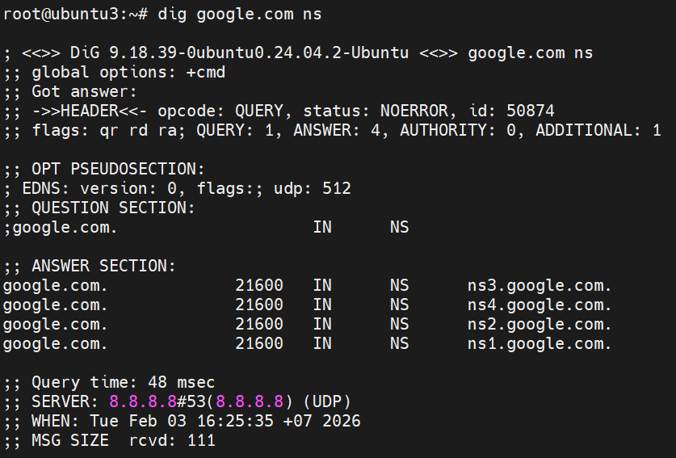

=> Trỏ về 4 hostname chứ không trỏ về IP `ns1.google.com`,..

#### Truy vấn MX Record

Nếu bạn muốn biết email gửi đến tên miền `google.com` sẽ được xử lý bởi máy chủ nào, hãy dùng lệnh sau:

```bash
dig google.com mx +noall +answer
```

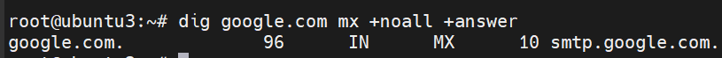

=> Kết quả sẽ hiện ra máy chủ thư và độ ưu tiên

#### Truy vấn TXT Record

Để truy cập dữ liệu văn bản được liên kết với một tên miền cụ thể, hãy truy xuất bản ghi TXT:

```bash
dig google.com txt +noall +answer
```

#### Truy vấn tất cả bản ghi cùng lúc

Để truy cập tất cả các bản ghi DNS cho một tên miền cụ thể cùng với địa chỉ IP, hãy sử dụng tùy chọn `any`:

```bash
dig google.com any +noall +answer
```

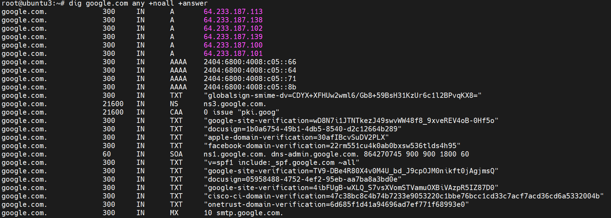

#### Tùy chỉnh đầu ra lệnh `dig`

Khi sử dụng công cụ `dig`, bạn có thể đặt các mục được sử dụng thường xuyên làm mặc định cho lệnh `dig` để tối ưu hóa đầu ra và đạt được kết quả mong muốn trong thời gian ngắn nhất. Cần lưu ý rằng thông tin do `dig` cung cấp được lưu trữ trong tệp `~/.digrc`. Tệp này có thể được chỉnh sửa. Do đó, hãy truy cập nội dung của tệp này bằng cách thực hiện lệnh sau bởi trình soạn thảo yêu thích của bạn:

```bash
sudo nano ~/.digrc
```

Sau đó, bạn có thể thêm các tùy chọn mong muốn vào nội dung của nó, ví dụ:

```text
+noall
+answer
```

Thoát khỏi tệp `(ctrl-x)`. Kết quả là, khi bạn thực thi lệnh `dig example.com`, đầu ra sẽ được hiển thị theo cách các tùy chọn `+noall` và `+answer` được thêm vào lệnh.

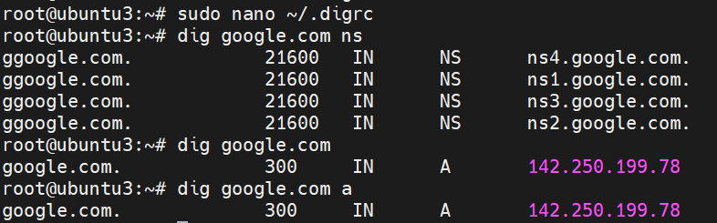

#### Truy vấn một số lượng lớn các tên miền

Một trong những ưu điểm của công cụ dig là nó cho phép bạn liệt kê một số lượng lớn tên miền trong một tệp (một tên miền trên mỗi dòng), và bằng cách sử dụng tệp đó, bạn có thể truy vấn một số lượng lớn tên miền. Với mục đích này, bạn phải sử dụng tùy chọn -f cùng với lệnh dig như sau:

```bash
dig -f test.txt
```

=>`test.txt` là một ví dụ về tệp chứa danh sách tên miền cần truy vấn. Thay thế test.txt bằng tệp mong muốn.