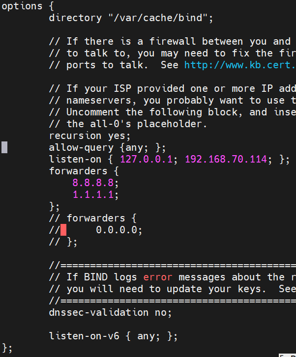
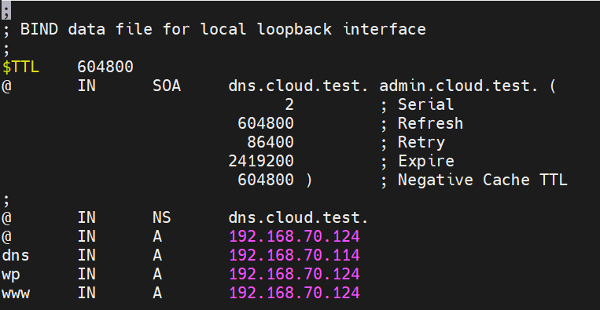

# CONFIG WORDPRESS PAGE WITH DOMAIN NAME
## 1. Mục tiêu
- Triển khai DNS Server nội bộ sử dụng BIND9
- Cấu hình domain name cloud.test cho website Wordpress
- Thực hiện phân giải thuận (A record) cho website
- Thực hiện phân giải ngược (PTR record) cho máy chủ web
- Kiểm tra và xác nhận DNS hoạt động đúng với WordPress

## 2. Mô hình Lab
### 2.1 Domain sử dụng
- Domain website: `cloud.test`
- FQDN website WordPress: `www.cloud.test`
  - `.test` là domain được RFC quy định dành riêng cho testing, an toàn và không gây xung đột mDNS

### 2.2 IP và vai trò các máy

| Máy        | Hostname            | IP              | Vai trò          |
| ---------- | ------------------- | --------------- | ---------------- |
| DNS Server | `dns.cloud.test`    | `192.168.70.114` | BIND9 DNS Server |
| Web Server | `wp.cloud.test`     | `192.168.70.121` | WordPress        |
| Client     | `client.cloud.test` | `192.168.70.122` | Truy vấn DNS     |

### 2.3 Thành phần trong hệ thống

| Thành phần           | Vai trò               |
| -------------------- | --------------------- |
| BIND9 (`named`)      | Phần mềm DNS server   |
| `named.conf.options` | Cấu hình toàn cục DNS |
| `named.conf.local`   | Khai báo zone         |
| Forward Zone         | Phân giải tên → IP    |
| Reverse Zone         | Phân giải IP → tên    |

## 3. Cài đặt DNS Server
```bash
sudo apt update
sudo apt install bind9 bind9utils bind9-dnsutils -y
```
Kiểm tra dịch vụ
```bash
systemctl status bind9
```


## 4. Cấu hình DNS toàn cục
Mở file cấu hình: `/etc/bind/named.conf.options`
```bash
sudo nano /etc/bind/named.conf.options
```
Chèn nội dung:
```conf
options {
    directory "/var/cache/bind";

    recursion yes;
    allow-query { any; };
    listen-on { 127.0.0.1; 192.168.70.0/24; };

    forwarders {
        8.8.8.8;
        1.1.1.1;
    };

    dnssec-validation no;
};
```



- `listen-on`: quyết định DNS có tồn tại trên IP đó không, máy có IP nào đc ghi trong listen on thì IP đó có DNS.
- `allow-query`: quyết định DNS có trả lời lại các IP đó không.
- `dnssec-validation`: Giúp xác thực dữ liệu DNS, tự động dùng trust anchor(root key ) kiểm tra chữ ký.

| Giá trị | Ý nghĩa                  |
| ------- | ------------------------ |
| `yes`   | Bắt buộc validate DNSSEC |
| `no`    |  Tắt DNSSEC             |
| `auto`  |  Tự động + an toàn nhất |
## 5. Khai báo Zone DNS 
Mở file cấu hình: `/etc/bind/named.conf.local`
```bash
nano /etc/bind/named.conf.local
```
Thêm nội dung:
```init
zone "cloud.test" {
    type master;
    file "/etc/bind/zones/db.cloud.test";
};

zone "70.168.192.in-addr.arpa" {
    type master;
    file "/etc/bind/zones/db.192.168.70";
};
```
## 6. Tạo Forward Zone(A Record)
Tạo thư mục Zone:
```bash 
sudo mkdir /etc/bind/zones
```
Phân quyền và bảo mật file:
```bash
sudo chown -R root:bind /etc/bind/zones
sudo chmod -R 755 /etc/bind/zones
```
Tạo Zone file cho tên miền:
```bash
sudo cp /etc/bind/db.local /etc/bind/db.cloud.test
sudo.nano /etc/bind/db.cloud.test
```
```bash
nano /etc/bind/zones/db.cloud.test
```


- `@` được BIND quy ước là origin hiện tại của Zone, đã được khai báo trong `name.conf`
- `dns` Bind hiểu là: `dns + .cloud.test`, vì không có dấu `.` ở cuối nên BIND tự nối Origin
- Tương tự wp sẽ là `wp.cloud.test.`
- Dấu `.` ở cuối tên domain -> Tên domain đó đã hoàn chỉnh, nếu không có BIND tự động nối origin

## 7. Tạo Reverse Zone (PTR Record)
Chỉnh sửa cấu hình file `/etc/bind/zones/db.192.168.70`
```bash 
sudo cp /etc/bind/db.127 /etc/bind/zones/db.192.168.70
sudo nano /etc/bind/zones/db.192.168.70
```
Chèn nội dung 
```bash
$TTL 86400
@   IN  SOA dns.cloud.test. admin.cloud.test. (
        2026012701
        3600
        1800
        604800
        86400
)

@       IN  NS      dns.cloud.test.
114      IN  PTR     dns.cloud.test.
124      IN  PTR     wp.cloud.test.
```

## 8. Kiểm tra cấu hình DNS
```bash
sudo named-checkconf
sudo named-checkzone cloud.test /etc/bind/zones/db.cloud.test
sudo named-checkzone 70.168.192.in-addr.arpa /etc/bind/zones/db.192.168.70
```
Restart DNS
```bash
sudo systemctl restart bind9
```

## 9. Chỉnh cấu hình DNS cho Client
```bash
sudo nano /etc/netplan/50-cloud-init.yaml
```
Thêm dòng
```bash
nameserver
  address:
    - 192.168.70.114
```

## 10. Kiểm tra phân giải DNS
Forward Lookup on DNS Server
```bash
dig @127.0.0.1 www.cloud.test
nslookup www.cloud.test
```
Reverse Lookup
```bash
dig -x 192.168.70.114
```

## 11. Cấu hình WordPress
Tạo VirtualHost:
```bash
sudo nano /etc/nginx/sites-enabled/wordpress.conf
```
```bash
<VirtualHost *:80>
    ServerName wp.cloud.test
    ServerAlias www.cloud.test
    DocumentRoot /var/www/html/wordpress

    <Directory /var/www/html/wordpress>
        AllowOverride All
        Require all granted
    </Directory>

    ErrorLog ${APACHE_LOG_DIR}/wordpress_error.log
    CustomLog ${APACHE_LOG_DIR}/wordpress_access.log combined
</VirtualHost>
```
Restart Apache:
```bash
sudo systemctl restart apache2
```
Mở port cho tất cả các địa chỉ IP ngoài máy"
```bash
nano /etc/mysql/mysql.conf.d/mysqld.cnf

# Sửa chỗ bind address
127.0.0.1 -> 0.0.0.0
```