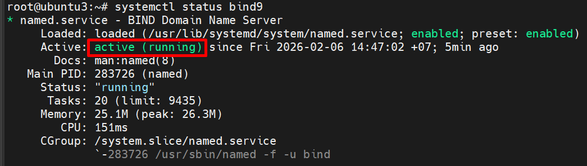

# CONFIG WORDPRESS PAGE WITH DOMAIN NAME
## 1. Mục tiêu
- Triển khai DNS Server nội bộ sử dụng BIND9
- Cấu hình domain name cloud.test cho website Wordpress
- Thực hiện phân giải thuận (A record) cho website
- Thực hiện phân giải ngược (PTR record) cho máy chủ web
- Kiểm tra và xác nhận DNS hoạt động đúng với WordPress

## 2. Mô hình Lab
### 2.1 Domain sử dụng
- Domain website: `cloud.test`
- FQDN website WordPress: `www.cloud.test`
  - `.test` là domain được RFC quy định dành riêng cho testing, an toàn và không gây xung đột mDNS

### 2.2 IP và vai trò các máy

| Máy        | Hostname            | IP              | Vai trò          |
| ---------- | ------------------- | --------------- | ---------------- |
| DNS Server | `dns.cloud.test`    | `192.168.70.114` | BIND9 DNS Server |
| Web Server | `wp.cloud.test`     | `192.168.70.121` | WordPress        |
| Client     | `client.cloud.test` | `192.168.70.122` | Truy vấn DNS     |

### 2.3 Thành phần trong hệ thống

| Thành phần           | Vai trò               |
| -------------------- | --------------------- |
| BIND9 (`named`)      | Phần mềm DNS server   |
| `named.conf.options` | Cấu hình toàn cục DNS |
| `named.conf.local`   | Khai báo zone         |
| Forward Zone         | Phân giải tên → IP    |
| Reverse Zone         | Phân giải IP → tên    |

## 3. Cài đặt DNS Server
```bash
sudo apt update
sudo apt install bind9 bind9utils bind9-dnsutils -y
```
Kiểm tra dịch vụ
```bash
systemctl status bind9
```



## 4. Cấu hình DNS toàn cục
Mở file cấu hình: `/etc/bind/named.conf.options`
```bash
sudo nano /etc/bind/named.conf.options
```
Chèn nội dung:
```conf
options {
    directory "/var/cache/bind";

    recursion yes;
    allow-query { any; };
    listen-on { 127.0.0.1; 192.168.70.74; };

    forwarders {
        8.8.8.8;
        1.1.1.1;
    };

    dnssec-validation no;
};
```