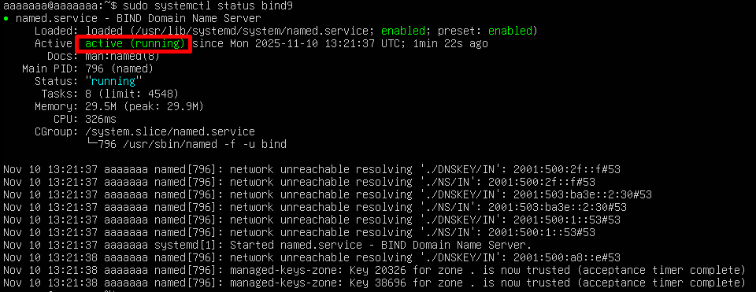
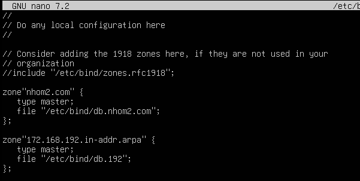
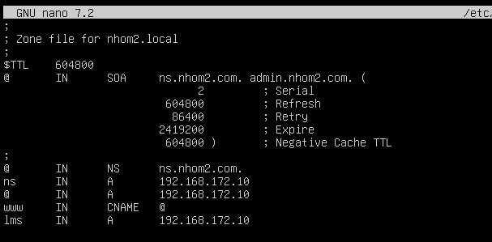
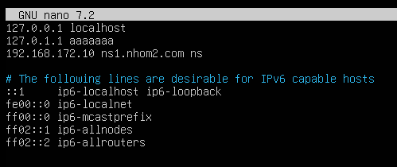
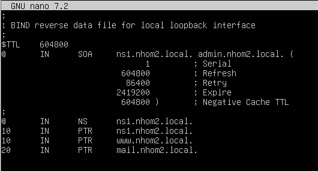
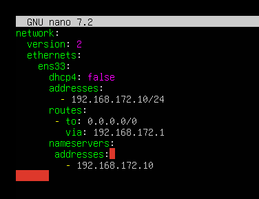
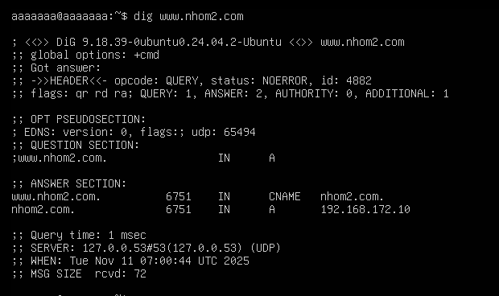

# Lab DNS
### Mục tiêu
- Triển khai DNS server nội bộ với domain: trung.local
- Máy chủ DNS có IP: `192.168.172.10`
- Có thể phân giải tên `www.nhom2.com` thành `192.168.172.112`
- Hỗ trợ cả phân giải thuận (A record) và phân giải ngược (PTR record)

### Khởi động dịch vụ DNS
```plaintext
sudo apt update
sudo apt install bind9 bind9utils bind9-doc -y
sudo systemctl status bind9
```


### Cấu hình zone (Vùng quản lý tên miền)

- Mở file khai báo zone:
```plaintext
sudo nano /etc/bind/named.conf.local
```
sửa file như sau:



### Tạo Zone file cho tên miền
```plaintext
sudo cp /etc/bind/db.local /etc/bind/db.nhom2.com
sudo.nano /etc/bind/db.nhom2.com
```
Sửa theo nội dung:



- Sửa nội dung file `/etc/hosts`
```plaintext
sudo nano /etc/hosts
```

Thêm dòng: **192.168.172.10 ns.nhom2.com ns**


### Tạo file phân giải ngược
```plaintext
sudo cp /etc/bind/db.127 /etc/bind/db.192
sudo nano /etc/bind/db.192
```
Sửa file theo cấu hình sau



| Thành phần             | Ý nghĩa                                                                                                         |
| ---------------------- | --------------------------------------------------------------------------------------------------------------- |
| `@`                    | Đại diện cho **zone root**, ở đây là `192.168.1.in-addr.arpa`.                                                  |
| `IN`                   | Class của record, `IN` = Internet.                                                                              |
| `SOA`                  | **Start of Authority**, bản ghi đầu tiên trong zone, xác định **DNS server chính và quản trị viên**.            |
| `ns1.example.local.`   | Tên của **DNS server chính** cho zone này. **Chấm cuối là quan trọng**, đánh dấu đây là FQDN (tên miền đầy đủ). |
| `admin.example.local.` | Email của admin, viết dạng DNS (`@` → `.`). VD: `admin@example.local`.                                          |
| `2`                    | **Serial number** của zone. Khi bạn chỉnh sửa file zone, tăng số này để server secondary nhận biết update.      |
| `604800`               | **Refresh** – số giây server secondary sẽ hỏi server chính xem có thay đổi không (7 ngày).                      |
| `86400`                | **Retry** – nếu server secondary không liên lạc được, thử lại sau 1 ngày.                                       |
| `2419200`              | **Expire** – nếu server secondary không nhận được zone mới quá 28 ngày, zone này sẽ bị coi là hết hạn.          |
| `604800`               | **Negative Cache TTL** – thời gian cache kết quả không tồn tại (NXDOMAIN) của record, 7 ngày.                   |

- **NS Record**: Xác định Name Server cho toàn bộ zone: `@       IN      NS      ns1.nhom2.local.`
- Tất cả máy khác muốn tra reverse lookup trong mạng `192.168.172.0/24` sẽ hỏi `ns1.nhom2.local`

- **PTR Record**
```plaintext
10      IN      PTR     ns1.example.local.
20      IN      PTR     www.example.local.
30      IN      PTR     mail.example.local.
```
Cấu trúc:
```plaintext
<last-octet-of-IP> IN PTR <fully-qualified-domain-name>.
```
Ý nghĩa trong file
| IP thực tế   | Dòng trong zone                 | Ý nghĩa                                                       |
| ------------ | ------------------------------- | ------------------------------------------------------------- |
| 192.168.1.10 | `10 IN PTR ns1.example.local.`  | Khi ai đó tra `192.168.1.10`, DNS trả về `ns1.example.local.` |
| 192.168.1.20 | `20 IN PTR www.example.local.`  | IP 192.168.1.20 → tên miền `www.example.local.`               |
| 192.168.1.30 | `30 IN PTR mail.example.local.` | IP 192.168.1.30 → `mail.example.local.`                       |
### Bảo mật và phân quyền file
```plaintext
sudo chown root:named /etc/bind/db.nhom2.com
sudo chown root:named /etc/bind/db.192
sudo restorecon -v /var/named/*
sudo systemctl restart named
```

### Cài đặt bổ sung
- `dig www.nhom2.com` : Không trả IP
- `dig @192.168.172.10`: Trả lại ip (hoặc toàn bộ zone)
- `ping www.nhom2.com`: không ping được

Đây là lỗi phổ biển, **DNS server hoạt động tốt, zone đúng, nhưng client chưa thực sự dùng DNS server đó khi truy vấn tự động.

#### Nguyên nhân
- Khi chạy `dig @192.168.172.10 nhom2.local`: là ép dig truy vấn trực tiếp đến DNS server 192.168..172.10, nên nó trả về đúng zone `nhom2.com`
- Khi chỉ gõ
```plaintext
dig www.nhom2.com
```
- `dig` (và hệ thống) sẽ hỏi DNS server mặc định trên máy client (ghi trong `/etc/resolv.conf).
- Nếu trong file `/etc/resolv.conf` không có dòng nameserver `192.168.172.10`, thì client sẽ hỏi một DNS khác (VD: 8.8.8.8 hoặc DNS router), mà DNS đó không biết zone nội bộ `nhom2.com` → nên trả về “not found”.
#### Cách sửa tạm thời: 
  - Chạy: `sudo nano /etc/resolv.conf`
  - Sửa: `nameserver 192.168.172.10`

#### Cách chỉnh sửa chuẩn nhất:
  - Chạy : `sudo nano /etc/netplan/50-cloud-init.yaml`
  - Sửa: 
```plaintext
  nameservers:
    - 192.168.172.10
```


`sudo netplan apply`

Kiểm tra lại là thành công nhận.

### Kiểm tra DNS
- Trên máy chủ:



- Nếu hiện ra IP như hình là OK