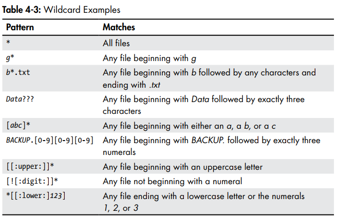

# Linux Command
## Khái niệm về Shell
- Shell là một chương trình giao diện dòng lệnh( command-line interface) cho phép người dùng tương tác với hệ điều hành bằng cách nhập các lệnh từ bàn phím. Nó là một phần mềm chạy ở cấp thấp, cho phép người dùng thực hiện các tác vụ như quản lý tệp, chạy chương trình, hoặc cấu hình hệ thống thông qua các lệnh văn bản. 
- Shell nhận các lệnh từ người dùng, chuyển chúng đến hệ điều hành để thực thi và trả về kết quả. Nó hoạt động như một cầu nối giữa người dùng và hệ thống.
### Khái niệm về Terminal Emulator
- Terminal emulator (trình giả lập thiết bị đầu cuối) là một chương trình trong môi trường giao diện đồ họa (GUI) cho phép người dùng truy cập và sử dụng Shell.
## 1. Khái niệm
- Linux Command(Lệnh Linux) là các lệnh được nhập vào Terminal( giao diện dòng lệnh - CLI) để tương tác với hệ thống Linux. Các lệnh này giúp người dùng quản lý tệp, thư mục, tiến trình, quyền truy cập, mạng, và nhiều chức năng khác của hệ điều hành.
## Các nhóm lệnh phổ biến trong Linux
### 1.Lệnh cơ bản trong hệ thống
| Lệnh | Chức năng | Hiển thị trong Linux |
|-------|---------|---------|
| `uname -a` | Hiển thị thông tin hệ thống|Linux aaaaaaa 6.14.0-29-generic|
| `hostname` | Hiển thị tên máy | Name of User|
| `uptime` | Hiển thị thời gian hệ thống đã chạy | 06:49:51 up 2:10, 3 users, load average |
| `date` | Hiển thị ngày và giờ hiện tại | Mon Sep 15 06:58:16 AM UTC 2025 |
| `cal 2025 `| Hiển thị lịch | Jan Feb May ...|
| `whoami `| Hiển thị tên người dùng hiện tại | aaaaaaa|
| `id ` | Hiển thị ID người dùng và nhóm mà user đó thuộc | uid=1000(aaaaaaa) gid=1000(aaaaaaa) groups=1000(aaaaaaa), 4(adm), 24(cdrom), 27(sudo), 30(dip), 46(plugdev), 101(lxd) |
| `passwd` | Đổi mật khẩu người dùng | change current password |
| `exit` | Logout | Logout |

### 2. Lệnh quản lý thư mục và tệp tin
| Lệnh | Chức năng | Chi tiết cách dùng |
|------|-----------|----------------------|
|`ls`| Liệt kê tệp/thư mục | `ls -a`, `ls -lha`, `ls`|
|`cd`| Chuyển đổi thư mục | `cd ..` `cd /home/aaaaaaa/` |
|`pwd`| Hiển thị đường dẫn thư mục hiện tại(print working directory) | home/aaaaaaa |
|`mkdir`| Tạo thư mục mới | `mkdir new_folder`|
|`rmdir`| Xóa thư mục trống | `rmdir old_folder`|
|`rm -r`| Xóa thư mục và tệp bên trong | `rm -r my_folder`|
|`touch`| Tạo tệp mới trống | `touch newfile.txt`|
|`echo`| Thêm nội dung vào tệp hoặc tạo tệp mới | `echo "contents" >/>> myfile.txt` |
|`cp`| Sao chép tệp hoặc thư mục | `cp document.txt /tmp/` |
|`mv`| Di chuyển hoặc đổi tên tệp/ thư mục| ` cp document.txt /tmp/` `cp document.txt new.txt`|
|`find`| Tìm kiếm tập tin hoặc thư mục và tất cả các file bên trong| `find /home - name "*.txt"/"abc.txt"` |
|`locate`| Tìm kiếm tệp tin nhanh | `locate example.txt`|

### 3. Lệnh xem nội dung tập tin 
| Lệnh| Chức năng | Chi tiết |
|------|----------|----------|
| `cat`| Hiển thị nội dung tệp| `cat /etc/os-release`|
|`tac`| Hiển thị nội dung tệp theo thứ tự ngược| `tac file.txt`|
|`file`| Xem định dạng file | picture.jpg: JPEG image data, JFIF standard 1.01|
|`less`| Xem nội dung tệp theo trang | `less /var/log/syslog`|
|`more`| Xem nội dung tệp (giống less nhưng ít tính năng hơn)| `more file.txt`|
|`head`| Hiển thị n dòng đầu tiên của tệp | `head -n 5 file.txt`|
|`tail`| Hiển thị n dòng cuối cùng của tệp | `tail -n 5 file.txt`|
|`nano`| Mở trình soạn thảo văn bản Nano | `nano file.txt`|
|`vim`| Mở trình soạn thảo văn bản Vim | `vim file.txt`|
|`grep`| Tìm kiếm chuỗi trong tệp | `grep "error" /var/log/syslog`|

### 4. Lệnh quản lý tiến trình
|Lệnh| Chức năng | Chi tiết |
|-----|-----------|------------|
| `ps aux`| Hiển thị danh sách tiến trình đang chạy | `ps aux`|
|`top`| Hiển thị tiến trình theo thời gian thực| `top`|
|`htop`| Công cụ thay thế `top` dễ đọc hơn| `htop`|
|`kill`| Dừng tiến trình theo PID| `kill -9 1234`|
|`pkill`| Dừng tiến trình theo tên | `pkill firefox`|
|`jobs`| Hiển thị tiến trình chạy nền | `jobs`|
|`bg`| Tiếp tục chạy tiến trình ở chế độ nền | `bg %1`|
|`fg`| Đưa tiến trình chạy nền ra foreground| `fg %1`|

### 5. Lệnh quản lý người dùng và quyền
| Lệnh | Chức năng | Chi tiết |
|-------|-----------|---------|
|`who`| Xem danh sách người dùng đang đăng nhập| `who`|
|`adduser`| Tạo người dùng mới | `sudo adduser new_user`|
|`deluser`| Xóa người dùng | `sudo deluser old_user`|
|`chmod`| Thay đổi quyền tệp/thư mục | `chmod 755 script.sh`|
|`chown`| Thay đổi chủ sở hữu tệp/thư mục | `chown user1 file.txt`|
|`chgrp`| Thay đổi nhóm của tệp/thư mục| `chgrp group1 file.txt`|

### 6. Lệnh quản lý phần mềm
|Lệnh | Chức năng | Chi tiết |
|-----|-----------|----------|
|`apt install`| Cài đặt phần mềm trên Ubuntu/Debian | `sudo apt install`|
|`yum install`| Cài đặt phần mềm trên CentOS/RHEL | `sudo yum install nano`|
|`dnf install`| Cài đặt phần mềm trên Fedora | `sudo dnf install tree`|
|`pacman -S`| Cài đặt phần mềm trên Arch Linux| `sudo pacman -S htop`|
|`snap install`| Cài đặt ứng dụng từ Snap | `sudo snap install vlc`|
|`flatpak install`| Cài đặt ứng dụng từ Flatpak | `flatpak install flathub org.gimp.GIMP`|

### 7. Quản lý mạng
| Lệnh | Chức năng | Chi tiết |
|-------|---------|----------|
| `ifconfig`| Hiển thị thông tin mạng | `ifconfig`|
| `ip a`| Hiển thị địa chỉ IP |`ip a`|
|`ping`| Kiểm tra kết nối đến máy chủ| `ping google.com`|
|`netstat - tulnp` hoặc `ss -tulnp`| Hiển thị cổng mạng đang mở | `ss -tulnp`|
|`curl`| Lấy dữ liệu từ URL | `curl https://example.com`|
|`wget`| Tải tệp từ URL | `wget https://example.com/file.zip`|
|`scp`| Sao chép tệp qua SSH | `scp file.txt user@remote:/home/user/`|
|`rsync`|Đồng bộ tệp giữa hai máy| `rsync -avz /source/user@remote:/destination/`|
