## Advanced Linux Installation Concepts
### Installation Modes
- **Minimal Install**: Core system only, reduces attack surface, một số gói phần mềm cơ bản nhất cần để hệ thống khởi động và chạy.
- **Full Install**: Cài toàn bộ các gói phần mềm đi kèm hệ điều hành: giao diện đồ hoạ(GUI), tiện ích văn phòng,... Complete desktop
environment with application
- **Server Install**: Optimized for headless server deployment. Đây là chế độ tập trung vào các dịch vụ server như web server (Apache, Nginx), database (MySQL, MariaDB, PostgreSQL), SSH, DNS, mail server… 
  - **Mục đích**: Dành cho các hệ thống cần phục vụ client qua mạng (website, dịch vụ mạng, ứng dụng…).

### Installation Roadmap
- **Pre-flight Check:**
  - **System Requirements**: Does your
hardware meet the minimum CPU,
RAM, and disk space needs.
  - **Installation Media**: Create a bootable USB drive or set up a virtual machine with the .iso file.
- **The Installer:**
  - The most modern installers (like Ubuntu's) guide you through:
  - Language, Keyboard Layout, and
Network Configuration.
  - Disk Partitioning: The most critical step. This is where you tell Linux how to organize the hard drive.
  - User Creation & Hostname.
  - Software Selection( e.g., install as a minimal server or with specific tools like Docker).
- **Post-Installation:**
  - First boot, update all packages (sudo apt update && sudo apt upgrade).

### Decoding Disk Partitioning
#### Why we need?
- Separate the OS from user data(e.g., putting/ home on its own partition).
- Improve performance and security.
- Use different file systems for different purposes.
#### Partitioning Schemes:
- **MBR (Master Boot Record)**: Là chuẩn phân vùng cũ ra đời từ năm 1983 (cùng với PC BIOS). Thông tin về phân vùng được lưu trong sector đầu tiên của ổ đĩa (sector 0). Sector này gọi là MBR.
  - **Đặc điểm**:
    - Hỗ trợ tối đa 4 primary partitions (nếu muốn nhiều hơn phải dùng 1 “extended partition” rồi chia nhỏ thành “logical partitions”).
    - Giới hạn dung lượng ổ cứng: tối đa 2TB (nếu ổ lớn hơn, phần dư sẽ không sử dụng được).
    - Chỉ dùng tốt với hệ thống khởi động bằng BIOS truyền thống.
- **GPT (GUID Partition Table)**: Là chuẩn phân vùng mới (ra đời cùng với chuẩn UEFI). Dùng GUID (Globally Unique Identifier) để định danh phân vùng.
  - **Đặc điểm**:
    - Cho phép tạo lên đến 128 phân vùng (trên Windows, Linux có thể còn nhiều hơn).
    - Hỗ trợ ổ cứng có dung lượng rất lớn (lý thuyết đến 9.4 ZB ~ không giới hạn thực tế).
    - Lưu thông tin phân vùng ở nhiều nơi (đầu và cuối ổ) → tăng độ an toàn.
    - Yêu cầu máy hỗ trợ UEFI firmware để boot trực tiếp (nhưng có thể dùng kết hợp với BIOS trong một số trường hợp).

#### So sánh nhanh

| Tiêu chí          | MBR                        | GPT                                 |
| ----------------- | -------------------------- | ----------------------------------- |
| Năm ra đời        | 1983                       | 2000s (chuẩn UEFI)                  |
| Dung lượng tối đa | 2 TB                       | ~9.4 ZB (gần như vô hạn)            |
| Số phân vùng      | 4 primary (tối đa)         | 128 (Windows), nhiều hơn trên Linux |
| Cơ chế boot       | BIOS                       | UEFI                                |
| Độ an toàn        | Thấp (1 bảng MBR duy nhất) | Cao (có backup, CRC check)          |
| Ứng dụng hiện nay | Máy cũ, ổ < 2TB            | Máy mới, ổ > 2TB, chuẩn khuyến nghị |

### Installation Troubleshooting
- **GRUB Boot Issues**: Boot from live USB, mount root partition, reinstall GRUB
bootloader using `grub-install` and `update-grub`.
- **Network Configuration**: Configure static IP with `netplan`(Ubuntu) or `nmcli`(Red Hat). verify DNS resolution.
- **Disk Recognition Errors**: Check BIOS/UEFI settings, verify SATA connections, use `fdisk -l` to detect available drives.
- **Post-Install Validation**: Run system updates, enable essential services, configure firewall, and verify hardware detection.

### Linux Storage Systems Overview
- **Disk Management Tools**:
  - `lsblk`(List Block Devices) displays block devices in tree format
    - Hiển thị danh sách thiết bị lưu trữ dạng khối như HDD, SSD, USB 
    - Nó cho bạn thấy cấu trúc dạng cây của tất cả ổ đĩa và phân vùng.
  - While `fdisk` and `parted` create and modify partitions.
    - “Phân vùng” = chia ổ đĩa thành các phần riêng biệt, mỗi phần có thể dùng cho hệ điều hành, dữ liệu, hoán đổi (swap), v.v.
    - Công cụ `fdisk` (dòng lệnh) hoặc `parted` (tương tự, có thể hỗ trợ GPT tốt hơn) giúp bạn: Tạo phân vùng mới, Xóa phân vùng cũ, Xem bảng phân vùng hiện có.
    - Ví dụ trong menu tương tác: `sudo fdisk /dev/sdb`
    - `n`: Tạo phân vùng mới, `p`: xem bảng phân vùng, `d`: xóa phân vùng. `w`: lưu thay đổi
- **File System Types**:
  - `ext4`: Default for most Linux distros, `XFS`: High-performance for large files, `Btrfs`: Modern with snapshots.
- **Mount Operations**:
  - Temporarily attach file systems with `mount`, make permanent with `/etc/fstab` entries

- Once your OS is installed, you'll need to manage storage. This is a three-step process:
  - **Identify the device**: 
    - Linux names storage devices as files in /dev. For example: `/dev/sda, /dev/sdb (SATA/SCSI/USB drives)` or `/dev/nvme0n1 (NVMe SSDs)`.
    - Use `lsblk` (List Block Devices) to see a tree of all your storage.

  - **Partition the Device**: 
    - Use a tool like `fdisk` or `parted` to create partitions on the disk (e.g., `/dev/sdb1`).
  - **Create a File System(Format)**:
    - A file system is the structure that organizes how data is stored. You create one with the mkfs (Make File System) command.
    - `sudo mkfs.ext4 /dev/sdb1 `- Formats the partition `/dev/sdb1` with the popular ext4 file system.
    - `mkfs`: make file system: định dạng phân vùng, tạo cấu trúc quản lý file bên trong.
    - `ext4`: kiểu hệ thống tập tin phổ biến trên Linux
    - `/dev/sdb1`: phân vùng bạn vừa tạo.
    - Hệ điều hành sẽ xóa toàn bộ dữ liệu cũ trên `dev/sdb1`
    - Gắn vào nó cấu trúc quản lý file (superblock, inode table, journal, …)
    - Chuẩn bị để có thể “mount” và sử dụng như một thư mục.
  - **Gắn phân vùng để sử dụng (Mount)**
    ```plaintext
    sudo mkdir /mnt/usb
    sudo mount /dev/sdb1 /mnt/usb
    ```
    - Sau khi định dạng, bạn có thể “mount” phân vùng để truy cập
    - Bây giờ bạn có thể vào /mnt/usb để đọc/ghi file trên ổ USB mới định dạng. Khi xong, “tháo” (`unmount`):
    - Persistent Mount

    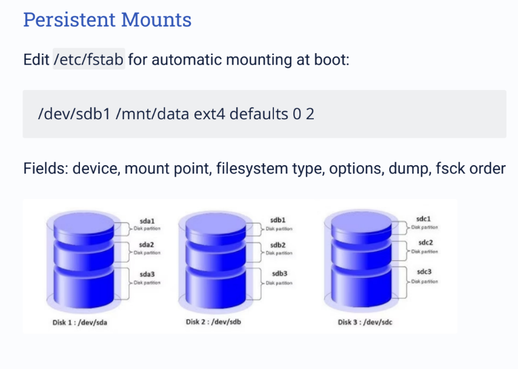
### LAB part1
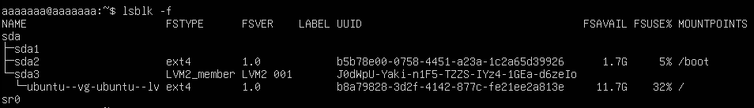

- Lưu ý khi dùng lệnh: `sudo fdisk /dev/sdb` , sẽ báo là No such file or directory.
- Không thể “tự tạo” `/dev/sdb` bằng lệnh thông thường, vì `/dev/sdb` không phải là file bình thường — mà là thiết bị phần cứng thật do kernel (nhân Linux) tự nhận dạng và tạo ra.
- Cắm thêm ổ hoặc USB thật: Khi bạn cắm USB mới → kernel nhận dạng nó → tự động xuất hiện `/dev/sdb`, `/dev/sdc`, ...
- Nếu đang sử dụng máy ảo Bạn cần gắn thêm ổ ảo trong phần cài đặt của máy ảo.

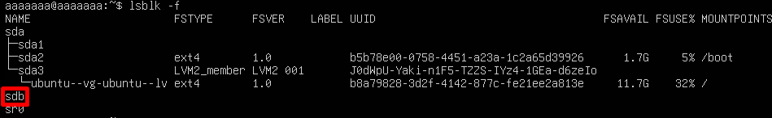

Partition a disk

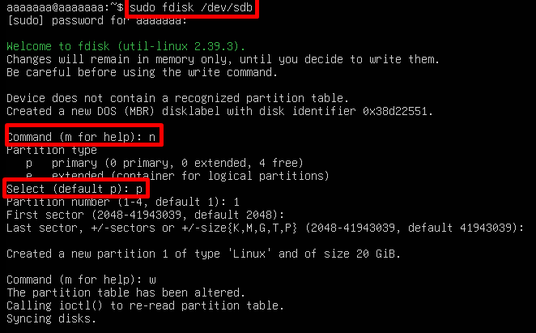

Create ext4 filesystem

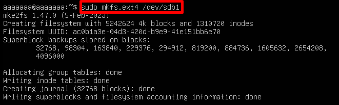

Mount filesystem

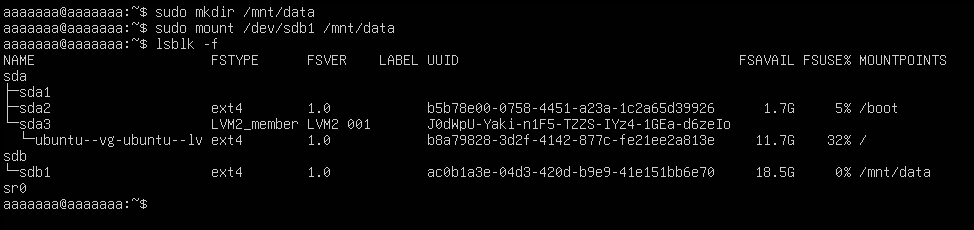

Unmount filesystem safely

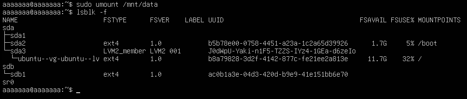

## Logical Volume Manager (LVM)
### Tại sao chúng ta cần LVM
- Trong Linux, bình thường khi bạn cài đặt, bạn chia ổ đĩa vật lý (`/dev/sda`, `/dev/sdb`, …) thành các phân vùng (partitions) cố định: `/dev/sda1`, `/dev/sda2`, v.v.
  - Khi chia như vậy, nếu sau này bạn muốn tăng kích thước partition, rất khó hoặc phải xoá rồi tạo lại.
  - Logical Volume Management (LVM) ra đời để giải quyết vấn đề này.
- Mục đích của LVM: 
  - Giúp bạn quản lý không gian lưu trữ linh hoạt — có thể mở rộng, thu nhỏ, gộp, tách, di chuyển dữ liệu mà không cần format lại ổ.
### 1. Khái niệm
- LVM (Logical Volume Manager) là hệ thống quản lý ổ đĩa logic trong Linux. Nó cho phép bạn:
  - Gộp nhiều ổ đĩa vật lý lại thành một không gian lưu trữ duy nhất.
  - Chia nhỏ không gian đó thành các “ổ đĩa logic” (logical volumes).
  - Thay đổi kích thước, di chuyển, snapshot dễ dàng mà không cần format lại.
  - LVM giúp bạn “ảo hóa” ổ đĩa — giống như quản lý ổ đĩa bằng phần mềm thay vì cứng nhắc như bảng phân vùng truyền thống.

### 2. Cấu trúc LVM (3 tầng chính)  

Physical Volumes (PVs): Raw disk partitions or entire disks that LVM can use as building blocks.
- Là ổ đĩa vật lý hoặc phân vùng mà bạn “đăng ký” với LVM.

Volume Groups (VGs): A collection of one or more PVs that act as a single pool of storage. All LVs are created from this pool.
- Là nhóm chứa nhiều PV.

Logical Volumes (LVs): Flexible, resizable "partitions" that are created from the VG. These are what the operating system interacts with.
- Là phân vùng logic được tạo ra từ VG (volume group).
- Nó hoạt động giống như 1 partition bình thường mà bạn có thể format, mount, resize.

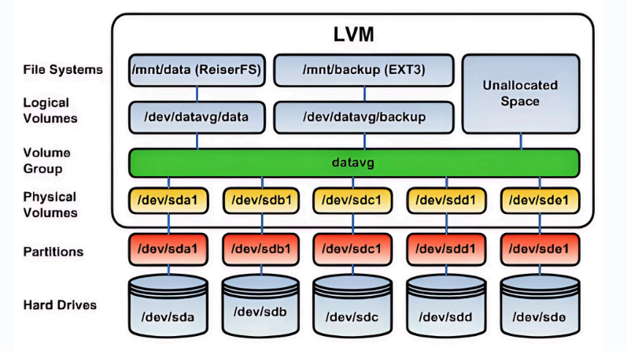

### 3. Triển khai LVM
- **Prepare Physical Volumes**: Identify raw disk partitions or entire disks and initialize them as PVs using `pvcreate`.
- **Create a Volume Group**: Combine multiple PVs into a single storage pool (VG) with the `vgcreate` command.
- **Define Logical Volumes**: Allocate portions of the VG into flexible LVs, analogous to traditional partitions, using `lvcreate`.
- **Format & Mount LVs**: Apply a filesystem (e.g., ext4, xfs) to your new LVs and mount them for use by the operating system.

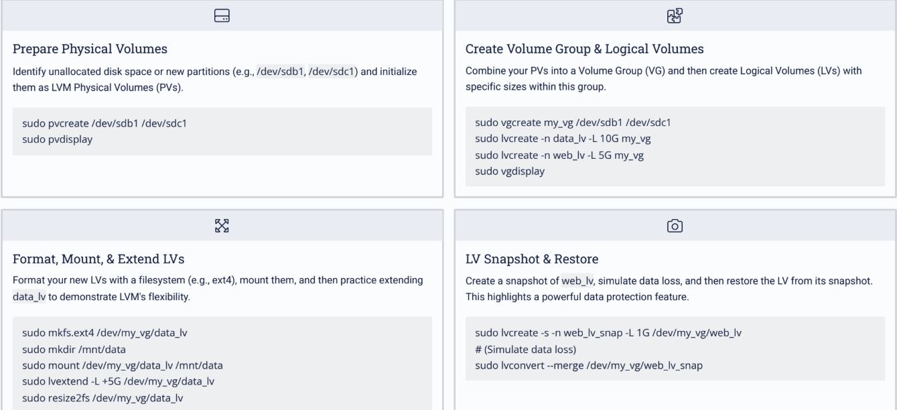

### Device Driver Administration in Linux
- In Linux, device drivers are implemented as kernel modules - loadable pieces of code that extend kernel functionality without requiring a system reboot.
  - **View Modules**: `lsmod` lists all currently loaded kernel modules with usage counts

  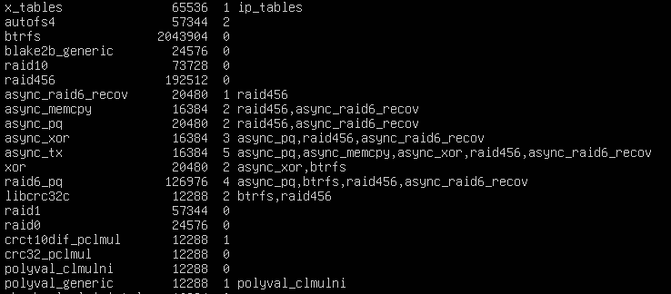

  - **Load/Unload**: `modprobe[module]` loads modules with dependencies, `rmmod` removes them.
  - **Hardware Detection**: `lspci` and `lsusb` identify connected PCI and USB devices.

### Linux Software Installation Methods
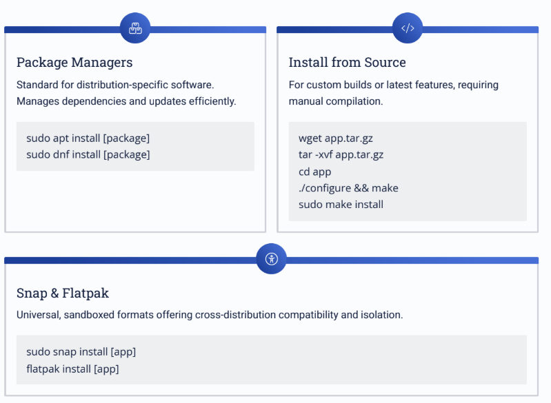

### LAB Part 2
**Manual partitioning: separate `/`, `/home`, and `/var partitions`.**

**Phân tích trạng thái hiện tại**
