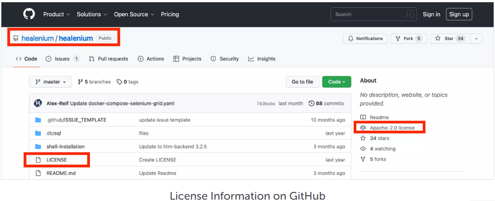
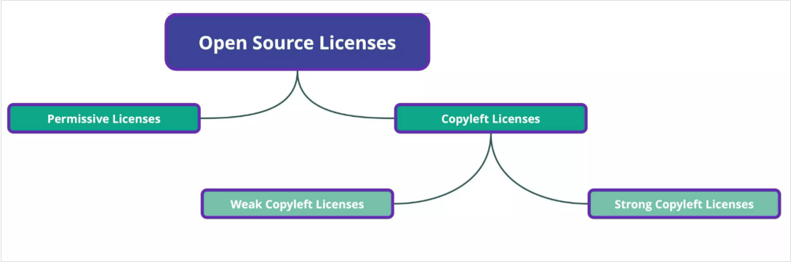
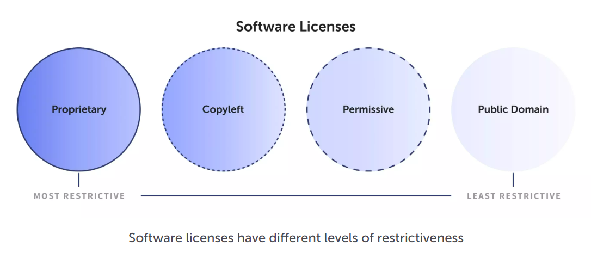

# Giấy phép mã nguồn mở
## Khái niệm Giấy phép mã nguồn mở
### Khái niệm

- Giấy phép nguồn mở là một loại giấy phép pháp lý được sử dụng để quản lý việc sử dụng, phân phối, và sửa đổi mã nguồn của phần mềm nguồn mở. Phần mềm nguồn mở( open source software) là phần mềm mà mã nguồn của nó được công khai, cho phép bất kỳ ai xem, sử dụng, sửa đổi, hoặc phân phối mã nguồn theo các điều khoản của giấy phép.
### Xác định rõ giấy phép mã nguồn mở
- Thường là một tệp văn bản thuần túy( text file ) với các đuôi phổ biến như .txt .md hoặc đôi khi không có đuôi, thường được nêu trong tệp `LICENSE`, `COPYING`, `README` trong thư mục dự án.
- Có thể được nhúng trực tiếp vào đầu tệp mã nguồn (thường là dưới dạng comment).

### Đặc điểm chính
- **Tự do truy cập mã nguồn**: Mã nguồn phải được cung cấp công khai.
- **Quyền sửa đổi**: Người dùng có thể chỉnh sửa mã nguồn để đáp ứng nhu cầu của họ.
- **Quyền phân phối**: Cho phép chia sẻ phần mềm hoặc phiên bản sửa đổi của nó.
- **Không phân biệt đối xử**: Giấy phép không được giới hạn quyền sử dụng dựa trên đối tượng hoặc mục đích.
Định nghĩa chính thức: Theo Open Source Initiative (OSI), một giấy phép nguồn mở phải đáp ứng 10 tiêu chí của Định nghĩa Nguồn Mở (Open Source Definition), bao gồm:
- Phân phối tự do.
- Cung cấp mã nguồn.
- Cho phép sửa đổi và tạo ra sản phẩm phái sinh.
- Không hạn chế phân phối mã nguồn sửa đổi.
- Không phân biệt đối xử với cá nhân hoặc nhóm.
- Không phân biệt lĩnh vực sử dụng.
- Quyền được cấp tự động khi phân phối.
- Không giới hạn ở một sản phẩm cụ thể.
- Không hạn chế các phần mềm khác.
- Giấy phép phải trung lập về công nghệ.

### Yêu cầu chung khi sử dụng giấy phép nguồn mở
- **Ghi công tác giả (Attribution)**: Yêu cầu giữ lại thông báo bản quyền (copyright notice), điều khoản từ chối trách nhiệm(disclaimer), và thông tin giấy phép trong mã nguồn hoặc tài liệu đi kèm.
- **Cung cấp mã nguồn (nếu yêu cầu)**: Một số giấy phép, đặc biệt là giấy phép copyleft (như GPL), yêu cầu công khai mãi nguồn của phần mềm hoặc các sản phẩm phái sinh khi phân phối.
- **Tôn trọng điều khoản phân phối**: Với các giấy phép như GPL, AGPL, hoặc MPL, các sản phẩm phái sinh phải được phân phối dưới cùng giấy phép. Với các giấy phép như MIT, Apache, hoặc BSD, bạn có thể phân phối mã nguồn hoặc sản phẩm phái sinh dưới bất kỳ giấy phép nào, miễn là giữ lại thông báo bản quyền.
- **Không sửa đổi giấy phép**: Không được xóa hoặc thay đổi điều khoản giấy phép trong mã nguồn.
- **Tôn trọng quyền sáng chế**: Một số giấy phép (như Apache License 2.0) bao gồm điều khoản cấp quyền sáng chế (patent grant), nghĩa là bạn được cấp quyền sử dụng các sáng chế liên quan đến phần mềm. Bạn cần tuân thủ và không được vi phạm các quyền này.

### Tại sao giấy phép nguồn mở quan trọng
- **Thúc đẩy hợp tác**: Cho phép cộng đồng phát triển phần mềm cùng nhau.
- **Tăng cường bảo mật**: Mã nguồn công khai giúp cộng đồng phát hiện và sửa lỗi nhanh chóng.
- **Tiết kiệm chi phí**: Người dùng có thể sử dụng phần mềm miễn phí hoặc với chi phí thấp.
- **Khuyến khích đổi mới**: Việc chia sẻ mã nguồn thúc đẩy sự đổi mới và phát triển nhanh chóng của phần mềm.
- **Tính minh bạch**: Mã nguồn mở giúp người dùng kiểm tra được cách phần mềm hoạt động, tránh các rủi ro như mã độc.

## Các loại giấy phép mã nguồn mở
Giấy phép nguồn mở có thể chia thành hai loại chính: **Bản quyền cho dùng (Copyleft)** và **Cấp phép (Permissive)**. Sự phân chia này dựa trên các yêu cầu và hạn chế của giấy phép đối với người dùng.

### 1. Copyleft
- **Copyright**: “quyền tác giả”, mặc định ai sáng tạo ra tác phẩm (phần mềm, sách, nhạc, hình ảnh, …) sẽ có toàn quyền kiểm soát việc sử dụng, sao chép, phân phối, chỉnh sửa. Người khác muốn dùng phải xin phép.

- **Copyleft**: Copyleft là một cách dùng copyright để trao quyền tự do: Cho phép mọi người tự do sử dụng, sửa đổi, phân phối tác phẩm. Nhưng có một điều kiện quan trọng: mọi bản chỉnh sửa hay sản phẩm phái sinh cũng phải được phát hành dưới cùng giấy phép Copyleft. Nhờ đó, tác phẩm luôn “mở” và các phiên bản sau này cũng tiếp tục mở.

**Cách hoạt động:**

- Nếu bạn sửa đổi hoặc mở rộng một phần mềm có giấy phép Copyleft, bạn phải công khai mã nguồn của phiên bản mới.
- Nếu bạn tích hợp phần mềm vào một sản phẩm lớn hơn, thì sản phẩm đó cũng phải tuân theo giấy phép Copyleft (tùy mức độ Copyleft mạnh hay yếu).

**Ví dụ về giấy phép Copyleft:**

- **GNU General Public License (GPL):** Phần mềm sửa đổi phải được công khai với cùng giấy phép.
- **GNU Lesser General Public License (LGPL):** Nhẹ hơn GPL, cho phép liên kết với phần mềm độc quyền.
- **AGPL (Affero GPL):** Bắt buộc công khai mã nguồn kể cả khi phần mềm chạy trên máy chủ.

**Các loại Copyleft**
- **Strong copyleft**: Yêu cầu toàn bộ phần mềm phái sinh hoặc phần mềm liên kết với mã nguồn gốc phải tuân theo cùng một giấy phép. Hệ quả: bạn không thể kết hợp mã GPL với phần mềm “đóng” rồi giữ kín mã được.
- **Weak Copyleft**: Yêu cầu chỉ những phần mã được sửa đổi hoặc trực tiếp dùng lại mới phải mở. Các phần khác (ví dụ code độc lập, phần mềm thương mại liên kết) không bắt buộc phải mở.

**Ví dụ**
- Copyright = “Đây là của tôi, muốn dùng thì phải xin phép.”
- Copyleft = “Đây là của tôi, tôi cho mọi người tự do dùng, nhưng nhớ rằng nếu bạn chỉnh sửa thì phải tiếp tục chia sẻ lại cho mọi người.”

### 2. Permissive

**Định nghĩa:**

Giấy phép Permissive không áp đặt yêu cầu khắt khe như Copyleft. Người dùng có thể sử dụng, sửa đổi và tích hợp phần mềm vào phần mềm độc quyền mà không cần công khai mã nguồn.

**Cách hoạt động:**

- Người dùng có thể sửa đổi mã nguồn mà không cần công khai thay đổi.
- Phần mềm có thể được tích hợp vào sản phẩm thương mại hoặc độc quyền.
- Chỉ yêu cầu giữ lại thông tin bản quyền khi phân phối.

**Ví dụ về giấy phép Permissive:**

- **MIT License:** Giấy phép đơn giản, chỉ yêu cầu giữ lại thông tin bản quyền.
- **Apache License 2.0:** Bổ sung điều khoản về bằng sáng chế.
- **BSD License (Berkeley Software Distribution):** Có nhiều biến thể, BSD 3-Clause và BSD 2-Clause là phổ biến nhất.

## Một số giấy phép nguồn mở phổ biến

### 1. GNU General Public License (GPL)
Giấy phép GNU General Public License (GPL) là một loại giấy phép được phát hành vào năm 2007. Đây là một phiên bản sửa đổi của GPL, tuy nhiên giấy phép này thường hạn chế đối với các thư viện phần mềm. Nhưng điều này cho phép các chương trình không phải là Open source có thể truy cập hoặc liên kết tới các thư viện nguồn mở mà không phải công khai mã nguồn như giấy phép GPL.

### 2. Giấy phép Apache license 2.0
Apache License 2.0 được phát hành vào tháng 1 năm 2004 của Quỹ phần mềm Apache (Apache Software Foundation – ASF). Giấy phép này cho người dùng phần mềm nguồn mở, quyền tự do sử dụng phần mềm với bất kỳ mục đích nào, phân phối chỉnh sửa và phân sửa đổi theo các điều khoản của giấy phép mà không lo vấn đề bản quyền.

Các điều kiện của giấy phép Apache License 2.0:

- Apache License 2.0 cho phép người dùng tự do sử dụng phần mềm với bất kỳ mục đích nào, tự do phân phối, sửa đổi.
- Giấy phép không yêu cầu bản sửa đổi của phần mềm phải được phân phối dưới cùng giấy phép với bản gốc và không yêu cầu bản sửa đổi phải được phân phối dưới dạng mã nguồn mở.

### 3. Giấy phép MIT License
Giấy phép mã nguồn mở này được phát hành bởi Massachusetts Institute of Technology (MIT). Đây là một trong những giấy phép cho phép người dùng tự do nhất, nó có thể kết hợp với các mã nguồn khác và đảm bảo tương thích theo điều kiện của mọi loại giấy phép khác.

Với MIT License bạn có thể sử dụng , sao chép , sửa đổi , hợp nhất , xuất bản , phân phối và/hoặc bán các bản sao của phần mềm mà không vi phạm bản quyền. Chỉ cần tuân thủ điều kiện thông báo cho phép của phần mềm gốc sử dụng giấy phép MIT.

### 4. Mozilla Public License 2.0 (MPL)
Mozilla Public License 2.0 (MPL) phát hành vào ngày 03-01-2012 bởi phần mềm tự do của Quỹ Mozilla. Giấy phép này là sự kết hợp giữa giữa giấy phép BSD có chỉnh sửa và giấy phép GNU. MPL cho phép người dùng hoạt động tự do và yêu cầu việc công bố mã nguồn của mọi thay đổi được đưa ra công chúng.

## Tài liệu tham khảo
- https://solutionshub.epam.com/blog/post/open-source-licenses-definition-types-and-comparison
- https://lanit.com.vn/giay-phep-ma-nguon-mo-pho-bien.html#ftoc-heading-3
- https://opensource.org/licenses?utm_source=chatgpt.com