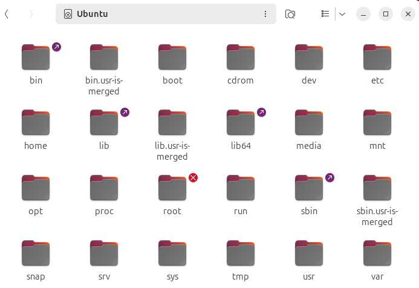
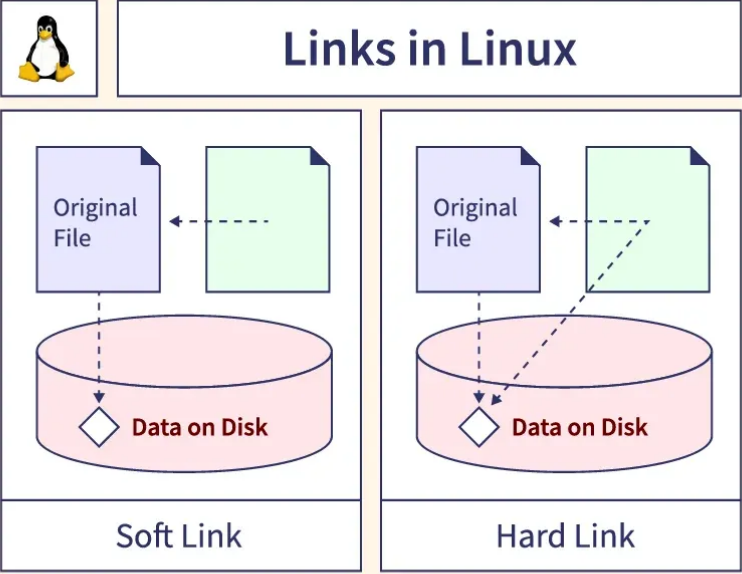
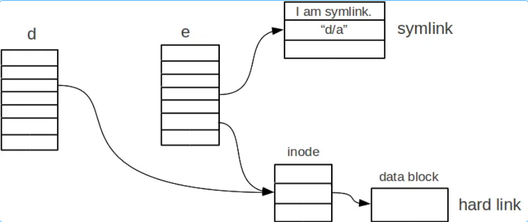

# TỔNG QUAN VỀ LINUX
## Linux là gì
### 1. Khái niệm
- **Linux** là một hệ điều hành (Operating System - OS) mã nguồn mở (open-source), được phát triển dựa trên nhân(kernel) Linux do Linus Torvalds tạo ra năm 1991. Linux có nguồn gốc từ hệ điều hành Unix. Tương tự như Windows hay macOS, nhưng khác biệt ở chỗ hoàn toàn miễn phí và cho phép bất kỳ ai chỉnh sửa, phân phối lại.
- Thuật ngữ **Linux** được sử dụng để chỉ Nhân Linux.
### 2. Kiến trúc thành phần Linux

#### 2.0 Hardware (Phần cứng)

- **Không phải là một thành phần của hệ điều hành Linux**, nhưng là nền tảng để hệ điều hành hoạt động.
- Gồm CPU, RAM, ổ cứng, card mạng, bo mạch chủ và các thiết bị ngoại vi khác.
- Kernel của Linux sẽ giao tiếp với phần cứng thông qua trình điều khiển thiết bị (drivers).

#### 2.1 Kernel (Nhân)
- Là lõi, quản lý tài nguyên phần cứng(CPU, RAM, ổ đĩa, thiết bị ngoại vi) và phân phối chúng cho các tiến trình và ứng dụng.
- Cung cấp giao diện giữa phần cứng và phần mềm.
- Có các module như, thực thi các tiến trình:
  - Quản lý tiến trình(process management): Kernel là người điều phối CPU: Chia sẻ thời gian CPU cho các tiến trình. Quyết định mức độ ưu tiên ai chạy trước. Bảo vệ hệ thống khỏi tiến trình độc hại/ chiếm CPU. Tiến trình không biết mình đang bị quản lý thế nào, nó chỉ nghĩ CPU đang chạy cho riêng nó.
  - Quản lý bộ nhớ(memory management): Theo dõi vùng nhớ nào đang được sử dụng, vùng nào rảnh. Cấp phát và thu hồi bộ nhớ cho process. Bảo vệ không cho process này đọc/ ghi bộ nhớ của process khác. Thực hiện phân trang( paging), hoán đổi( swapping) để tối ưu RAM.
  - Quản lý gọi hệ thống file(system call): Đề cập đến khả năng của một lập trình viên yêu cầu viết một truy vấn hoặc yêu cầu hạt nhân thực hiện một tác vụ.
  - Driver thiết bị(Device drivers): Nhiều thiết bị được kết nối với một hệ thông, chẳng hạn như CPU, card âm thanh, thiết bị nhớ, card đồ họa,... Trong trình điều khiển thiết bị, một nhân lưu trữ tất cả dữ liệu liên quan đến tất cả các thiết bị( nếu không có nhân này thì không thể điều khiển thiết bị).
#### 2.2 Shell
- Là chương trình cho phép người dùng giao tiếp với Kernel thông qua dòng lệnh (CLI) như một liên kết giữa Application và Kernel, diễn giải các lệnh được gửi từ Application đến kernel để thực thi.
- Nó là thành phần thực thi các command (lệnh) do người dùng đưa ra hoặc các ứng dụng yêu cầu và được chuyển đến Kernel để xử lý.
- Các loại Shell phổ biến nhất:
  - Sh (the Bourne shell)
  - csh (C shell)
  - bash (Bourne-again shell): On most Linux distributions.
  - tsh (TENEX C shell)
  - ash (Almquist shell)
  - zsh (Z shell)

#### 2.3 Application
- Đây là phần mà chúng ta đã rất quen thuộc, nó là phần mà người dùng cài đặt và chạy các ứng dụng để đáp ứng nhu cầu của họ.

#### 2.4 Thư viện hệ thống
- Đây là tập hợp các hàm giúp chương trình người dùng giao tiếp với Kernel.
- Lập trình viên không gọi trực tiếp system call(vì phức tạp) -> thay vào đó dùng thư viện C chuẩn (glibc).
- Ví dụ: bạn viết printf() → thực chất glibc sẽ gọi system call write()
#### 2.5 Công cụ hệ thống
**System Utilities**
- Là các chương trình nhỏ đi kèm Linux, dùng để quản trị và vận hành. 
  - Quản lý file: `cp`,`mv`,`ls`,`rm`.
  - Quản lý tiến trình: `ps`, `kill`, `top`.
  - Quản trị hệ thống: `ifconfig`, `systemctl`, `mout`.

**Init System(Hệ thống khởi tạo)**
- Khi máy bật, sau kernel, Linux cần một init system để khởi động dịch vụ: `System V init`, `systemd` như `systemctl start nginx` để bật dịch vụ web.
- Init system là tiến trình đầu tiên (PID 1) → khởi động và quản lý toàn bộ dịch vụ hệ thống. Nói đơn giản: init giống như “quản đốc”, mọi tiến trình khác trong Linux đều là con cháu của nó.

**Daemons(Trình nền)**
- Là các process chạy ngầm, thường bắt đầu cùng hệ thống: `sshd`: dịch vụ SSH, `cron`: lập lịch chạy lệnh, `httpd`: web server Apache.

**Graphical Server(X Window System/ Wayland)**
- Giao diện đồ họa(GUI) cần một display server.
- Wayland: hệ thống mới đồ họa new.

**Desktop Environment(DE)**
- Là lớp ngoài cùng để người dùng tương tác với GUI.
- Bao gồn: cửa sổ, thanh taskbar, icon, ứng dụng cơ bản: GNOME, KDE Plasma,...

**Package Manager(Trình quản lý gói)**
- Dùng để cài đặt, cập nhật, gỡ bỏ phần mềm
- Mỗi distro có hệ thống riêng: APT(Debian/Ubuntu), YUM/DNF(RHEL/CentOS/Fedora), PACMAN(Arch Linux).

**Bootloader**
- Là chương trình nhỏ được nạp ngay sau BIOS/UEFI khi máy khởi động.
- Nhiệm vụ chính: tìm và nạp kernel của hệ điều hành vào RAM, sau đó trao quyền điều khiển cho kernel.

## Cấu trúc file, thư mục trong Linux
- Mọi thứ trong Linux đều là file. Chúng được phân cấp theo tiêu chuẩn FHS(Filesystem Hierarchy Standard)
- Linux represents system resources — including hardware and communication channels — as files.
- All hardware devices are represented under the directory: 📂 `/dev` → stands for “device files”
- For example:

| Device                  | File in `/dev`                | Description              |
| ----------------------- | ----------------------------- | ------------------------ |
| Hard drive              | `/dev/sda`, `/dev/nvme0n1`    | Represents storage disks |
| USB device              | `/dev/ttyUSB0`                | Serial USB device        |
| Sound card              | `/dev/snd/`                   | Audio devices            |
| CD-ROM                  | `/dev/sr0`                    | Optical drive            |
| Keyboard/Mouse          | `/dev/input/`                 | Input devices            |
| Random number generator | `/dev/random`, `/dev/urandom` | Kernel entropy sources   |

- Cấu trúc thư mục trong Linux được tổ chức theo dạng cây (tree), với thư mục gốc (/) là điểm bắt đầu, từ đó các thư mục và thư mục con phân nhánh ra.
- Để xem các thư mục ở mức gốc, bạn có thể dùng lệnh `ls /` trong terminal, nó sẽ liệt kê tất cả các thư mục trực tiếp dưới /, bao gồm /home.


### 1. / - Root
- Đây là thư mục gốc, người dùng có quyền cao nhất trong hệ thống Linux.
- Chỉ người dùng root mới có quyền ghi trong thư mục này.
- Đây là nơi bắt đầu của tất cả các file và thư mục.
- Lưu ý: thư mục /root là thư mục của người dùng root chứ không phải là thư mục /.

|Thư mục| Mô tả|
|--------|-------|
|/bin   | Chứa các tệp thực thi(binary) của các lệnh cơ bản mà người dùng và hệ thống cần: `ls`,`cp`,`mv`,`cat`. Các lệnh này có sẵn cho cả người dùng thường và root, sử dụng trong chế độ single-user mode|
|/boot   | Chứa các tệp cần thiết để khởi động hệ thống, như kernel Linux(`vmlinuz`), tệp cấu hình bootloader (`grub`), và initramfs.|
|/dev    | Chứa các tệp thiết bị(device files), đại diện cho phần cứng như ổ địa (`/dev/sda`), thiết bị USB, hoặc thiết bị giả như `/dev/null`.| 
|/etc   | Chứa các tệp cấu hình hệ thống, ví dụ: cấu hình mạng( `/etc/network`), tệp mật khẩu (`/etc/passwd`), hoặc cấu hình phần mềm(`/etc/apache2`)|
|/home | Thư mục cá nhân của người dùng, mỗi người dùng có một thư mục riêng(ví dụ: `/home/username`) để lưu trữ dữ liệu cá nhân, tệp cấu hình, và tài liệu.|
|/lib,/lib64| Chứa các thư viện (libraries) cần thiết cho các chương trình trong `/bin` ,`/sbin`. `/lib64` dành cho hệ thống 64-bit.|
|/media| Điểm gắn(mount point) cho các thiết bị lưu trữ di động như USB, ổ CD/DVD. Thường được quản lý tự động bởi hệ thống.|
|/mnt  | Cho phép gắn kết tạm thời các thiết bị hoặc hệ thống tập tin từ các thiết bị khác nhau, chẳng hạn như ổ cứng ngoài, ổ mạng NAS, v.v được gắn thủ công bởi quản trị viên.|
|/opt | Additional software packages (some programs are installed here, not as common)|
|/proc| Hệ thống tệp ảo, chứa thông tin về các tiến trình đang chạy và trạng thái hệ thống(thông tin kernel).|
|/root| Thư mục cá nhân của người dùng `root` (quản trị viên), không nằm trong `/home`.|
|/run| Hệ thống tệp tạm thời (tmpfs) chứa thông tin tráng thái runtime của hệ thống sau khi hệ thống khởi động, như PID của các dịch vụ hoặc socket.|
|/sbin | Chứa các tệp thực thi hệ thống, thường dành cho quản trị viên, ví dụ: `fdisk`, `ifconfig`, `reboot`|
| /srv| Chứa dữ liệu cho các dịch vụ chạy trên hệ thống, như website(`/srv/www`) hoặc FTP(`/srv/ftp`).|
|/sys | Hệ thống tệp ảo, cung cấp giao diện để tương tác với kernel và phần cứng( tập trung vào cấu trúc thiết bị và driver `/sys/devices`).|
|/tmp | Thư mục tạm thời, chứa các tệp tạm được tạo bởi ứng dụng hoặc người dùng. Nội dung thường bị xóa khi khởi động lại.|
|/usr | Tập trung các tập tin, thư viện cho các chương trình của người dùng nhưng ở một cấp khác ít quan trọng hơn. /usr/bin, /usr/lib, /usr/share|
|/var | Lưu trữ các tập tin ghi lại trạng thái của hệ thống hoặc của ứng dụng. Vd: /var/log: Nhật ký hệ thống, /var/cache: Bộ nhớ đệm của ứng dụng. |

### Cây minh họa
```
├── bin
│   ├── ls
│   ├── cp
│   └── mv
├── boot
│   ├── vmlinuz
│   └── grub
├── dev
│   ├── sda
│   └── null
├── etc
│   ├── passwd
│   └── network
├── home
│   └── username
│       ├── .bashrc
│       └── Documents
├── lib
├── media
├── mnt
├── opt
├── proc
│   ├── cpuinfo
│   └── meminfo
├── root
├── run
├── sbin
├── srv
├── sys
├── tmp
├── usr
│   ├── bin
│   ├── lib
│   ├── share
│   └── local
└── var
    ├── log
    │   ├── syslog
    │   └── messages
    ├── cache
    └── www
  
```
### Một số thư mục đặc biệt
- `.` (dấu chấm): Đại diện cho thư mục hiện tại
- `..`(2 dấu chấm): Đại diện cho thư mục cha
- `~` (dấu ngã): Đại diện cho thư mục home của người dùng hiện tại.
- `-`: Thư mục đã làm việc trước đó.
- `/lost+found`: Dành cho file bị lỗi sau khi kiểm tra hệ thống(chỉ có trong phân vùng ext4)

### Inode
- Khi bạn tạo 1 file trong Linux, hệ thống sẽ lưu 2 phần riêng biệt:

| Phần                         | Lưu gì                                                                                                                          |
| ---------------------------- | ------------------------------------------------------------------------------------------------------------------------------- |
| 🧱 **Dữ liệu (data blocks)** | Nội dung thực sự của file (ví dụ: chữ, hình, mã nguồn, …)                                                                       |
| 📇 **inode**                 | Thông tin *về* file (metadata) — ai là chủ sở hữu, quyền truy cập, thời gian tạo/sửa, vị trí dữ liệu nằm ở đâu trên ổ đĩa, v.v. |

- In Linux file systems, the primary function of an inode is to store metadata (information about a file) — not the file’s name or its data, but details about the file.
- Một Inode chứa rất nhiều thông tin quan trọng:

| Thông tin                                | Ví dụ                                       |
| ---------------------------------------- | ------------------------------------------- |
| Loại file                                | file thường, thư mục, link, v.v.            |
| Quyền (permissions)                      | `rwxr-xr--`                                 |
| Số liên kết (hard link count)            | 1, 2, …                                     |
| Chủ sở hữu (UID)                         | user: `trungg`                              |
| Nhóm (GID)                               | group: `trungg`                             |
| Kích thước file                          | 2048 bytes                                  |
| Thời gian tạo / sửa / truy cập           | `ctime`, `mtime`, `atime`                   |
| Các con trỏ (pointers) đến block dữ liệu | Chỉ nơi lưu nội dung thật của file trên đĩa |

- Xem số Inode: `ls -i`
- inode = “thẻ căn cước” của file trong Linux
- Lưu thông tin (metadata) và vị trí dữ liệu trên đĩa
- Không lưu tên file — tên nằm trong thư mục (directory)
## Ưu điểm và hạn chế của hệ điều hành Linux
### Ưu điểm
#### 1. Mã nguồn mở và miễn phí
- Linux được phát triển bởi cộng đồng toàn cầu, cho phép người dùng xem, sửa đổi và phân phối mã nguồn mà không mất phí bản quyền.
#### 2. Ổn định và bảo mật cao:
- Hệ thống bảo mật mạnh mẽ nhờ quyền truy cập hạn chế(user permisions), tường lửa tích hợp, và cộng đồng lớn giúp phát hiện và nhanh chóng vá lỗi bảo mật. Linux ít bị virus và mã độc tấn công. Nó ngăn chặn các mối đe dọa từ bên ngoài hiệu quả hơn.
#### 3. Tùy chỉnh linh hoạt
- Người dùng có thể tùy chỉnh giao diện(KDE, GNOME, Unity), chỉnh sửa hệ thống theo nhu cầu và sử dụng cho nhiều mục đích từ cá nhân đến doanh nghiệp, IoT, Server.
#### 4. Hiệu suất tốt, tiêu thụ ít tài nguyên
- Linux chạy mượt mà trên phần cứng cũ hoặc cấu hình thấp, ít crash và phù hợp cho máy chủ với uptime cao(99.99%), tiêu thụ ít RAM và CPU hơn so với các hệ điều hành thương mại. Nó tối ưu hóa cho đa nhiệm và xử lý dữ liệu lớn.
#### 5. Cộng đồng hỗ trợ mạnh mẽ
- Cộng đồng toàn cầu lớn, với diễn đàn, tài liệu phong phú, giúp giải quyết vấn đề nhanh chóng. Phù hợp cho lập trình viên, quản trị mạng.
#### 6. Khả năng tương thích và đa nền tảng
- Linux hỗ trợ nhiều kiến trúc phần cứng(x86, ARM, RISC-V) và có thể chạy trên server, desktop, mobile(Android dựa trên Linux), và embedded systems. Nó tích hợp tốt với các công nghệ đám mấy như AWS, Google Cloud.
#### 7. Cập nhập thường xuyên và hỗ trợ dài hạn
- Các bản phân phối (distro) như Ubuntu LTS cung cấp hỗ trợ lên đến 5-10 năm, với cập nhật bảo mật tự động.

### Hạn chế của Hệ điều hành Linux
### 1. Hạn chế về phần mềm và ứng dụng
- Số lượng phần mềm chuyên dụng (như thiết kế đồ họa, kỹ thuật, hoặc game) còn ít, nhiều ứng dụng không hỗ trợ hoặc có phiên bản hạn chế so với Windows/macOS.
### 2. Yêu cầu kiến thức kỹ thuật cao
- Giao diện dòng lệnh (CLI) phức tạp, đòi hỏi người dùng phải học hỏi nhiều, không thân thiện với người mới bắt đầu. Việc cấu hình hệ thống có thể khó khăn.
### 3. Hỗ trợ phần cứng hạn chế
- Một số nhà sản xuất không phát triển driver (trình điều khiển) cho Linux, dẫn đến vấn đề tương thích với phần cứng mới hoặc chuyên dụng.
### 4. Ít phổ biến với người dùng thông thường
- Thị phần trên desktop thấp, giao diện chưa đa dạng và thân thiện bằng Windows, khiến việc chuyển đổi từ hệ điều hành khác mất thời gian.
### 5. Giao diện người dùng không thân thiện với người mới
- Các desktop environment đa dạng nhưng không nhất quán, và việc cập nhật hệ thống đôi khi gây xung đột gói phần mềm.

## Linux Distro 
### 1. Khái niệm 
- Linux Distro( Linux Distribution) là một phiên bản hệ điều hành Linux hoàn chỉnh, được xây dựng từ Kernel Linux + các gói phần mềm bổ sung(libraries, công cụ quản trị, trình quản lý gói, môi trường desktop, ứng dụng mặc định).
- Mỗi Distro có cách quản lý, tối ưu và mục đích sử dụng khác nhau, phù hợp với nhiều đối tượng từ người mới dùng đến lập trình viên và quản trị hệ thống.

### 2. Thành phần chính của một bản phân phối Linux

#### Lớp lõi (Core) - Trung tâm hệ thống
- Kernel: nhân hệ điều hành, quản lý tài nguyên hệ thống và giao tiếp với phần cứng.
- Quản lý tài nguyên như CPU, RAM, thiết bị ngoại vi, và hệ thống tệp.
- Các distro có thể sử dụng các phiên bản kernel khác nhau, tùy chính theo mục đích( ví dụ: kernel tối ưu cho hiệu năng hoặc tiết kiệm năng lượng).

#### Lớp hệ thống( System Layer) - Cung cấp công cụ nền tảng(GNU Tools & Libraries)
- **Shell**: Giao diện dòng lệnh(CLI) giúp người dùng giao tiếp với hệ thống.
- **glibc(GNU C Library)**: Thư viện C tiêu chuẩn mà hầu hết các chương trình trong Linux sử dụng.
- **Libraries**: Các thư viện phần mềm mà ứng dụng cần để chạy.
- **coreutils**: Bộ công cụ dòng lệnh cơ bản( ls,cat,cp,mv,rm, etc.).

#### Lớp ứng dụng và quản lý phần mềm:
- **Package Manager:** Hệ thống quản lý gói phần mềm, giúp cài đặt và cập nhật ứng dụng(ví dụ: `apt`,`dnf`,`pacman`).
- **LAMP(Linux, Apache, MySQL,PHP/Python/Perl):** Bộ công cụ cho máy chủ web.
- **GUI(Graphical User Interface):** Giao diện đồ họa, giúp người dùng thao tác dễ dàng hơn(Gnome, KDE, XFCE...).
- **Browser:** Trình duyệt web được cài sẵn trong nhiều bản phân phối.

### Phân loại Linux Distro
**Theo nguồn gốc(Dựa trên Distro gốc)**: Hầu hết các bản phân phối Linux đều phát triển từ một số ít các bản gốc, tạo thành các nhánh chính:

- `Debian Family`(dựa trên Debian)
  - Ổn định, dễ dùng, quản lý gói bằng `APT`(`.deb`).
  - Ứng dụng: Phổ biến cho cả server và desktop.
  - Tiêu biểu: Debian, Ubuntu, Linux Mint, Elementary OS, Kali Linux
- `Red Hat Family`
  - Xuất phát từ Red Hat, có các bản cộng động thay thế bản thương mại.
  - Ứng dụng: Tập trung vào enterprise, server, cloud.
  - Tiêu biểu: Fedora, CentOS, AlmaLinux, Rocky Linux
- `Slackware Family`
  - Một trong những distro lâu đời nhất, tối giản, gần với Unix nguyên thủy, người dùng phải tự tay cấu hình nhiều.
  - Phù hợp với người dùng thích học sâu về Linux.
  - Tiêu biểu: Slackware, Salix
- `Arch Family`
  - Đơn giản, tối thiếu, chỉ cài những gì cần thiết
  - Dành cho người dùng muốn tùy biến toàn bộ hệ thống từ đầu. Rolling release(cập nhật liên tục, không cần cài lại bản mới).
  - Tiêu biểu: Arch Linux(gốc, cần cài thủ công). Manjaro, EndeavourOS
- `Gentoo Family`
  - Dựa trên mã nguồn(source-based)-> người dùng tự biên dịch phần mềm để tối ưu cho hệ thống.
  - Rất mạnh mẽ, tùy biến cao, nhưng mất nhiều thời gian cài đặt và bảo trì.
  - Phù hợp cho người dùng nâng cao hoặc những ai muốn hệ thống được tối ưu tuyệt đối.
  - Tiêu biểu: Gentoo, Sabayon, Calculate Linux
### Phân loại theo mô hình phát hành(Release Model)
- `Fixed Release` (Phát hành cố định)
  - Tiêu biểu: Ubuntu, Debian, Fedora, RHEL
  - Đặc điểm: Cập nhật định kỳ(6 tháng - 2 năm), ổn định hơn.
  - Ứng dụng: Người dùng phổ thông, doanh nghiệp
- `Rolling Release` (Phát hành liên tục)
  - Tiêu biểu: Arch, Linux, Manjaro, OpenSUSE, Tumbleweed.
  - Luôn cập nhật phiên bản mới nhất, ít cần cài đặt lại.
  - Ứng dụng: Lập trình viên, người thích cập nhật công nghệ mới.

## Hard Link & Soft Link
### Khái niệm Hard Link
- Là một liên kết trực tiếp đến inode(thực thể lưu trữ dữ liệu) của một file.
- Khi tạo hard link, cả file gốc và hard link đều trỏ đến cùng inode, tức là cùng dữ liệu.
- File chỉ bị xóa thật sự khỏi ổ đĩa khi tất cả các hard link trỏ đến inode đó đều bị xóa.
### Khái niệm Soft Link(Symbolic Link/ Symlink)
- Là một file đặc biệt chứa đường dẫn đến file gốc
- Hoạt động giống như shortcut trong windows.
- Nếu xóa file gốc, soft link sẽ bị "gãy" (broken link), không dùng được.


### Tác dụng của symlink
- Giúp hạn chế việc phải thao tác với những đường dẫn dài dòng, phức tạp. Chỉ cần một tên liên kết tượng trưng để trỏ đến.
- Symlink còn giúp truy cập và lưu trữ file ở nhiều vị trí khác nhau mà không cần phải tạo nhiều bản sao.

