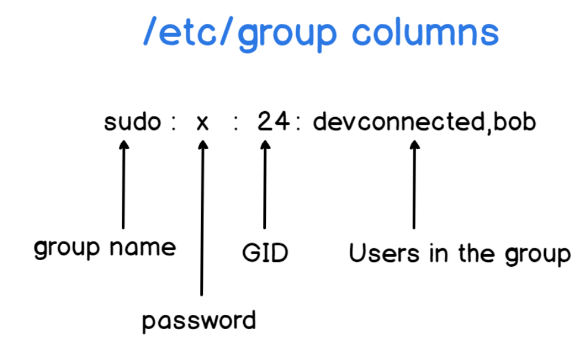

# User và Group trong Linux
## Khái niệm User trong Linux
- User đại diện cho một thực thể( thường là một người) hoặc một tiến trình có thể tương tác với hệ thống. Mỗi user có một danh tính duy nhất và có các quyền truy cập cụ thể vào tài nguyên hệ thống.
- **User ID(UID)**: Mỗi user được gán một số định danh duy nhất gọi là User ID(UID). UID được sử dụng bởi kernel để xác định user khi thực hiện các hoạt động liên quan đến quyền truy cập.
  - UID 0: Thường dành cho root user (superuser).
  - UID 1-999 (hoặc một khoảng tương tự): Thường dành cho các system user và service account, được hệ thống hoặc các ứng dụng tạo ra để chạy các dịch vụ.
  - UID 1000 trở lên (hoặc một khoảng tương tự): Thường dành cho các regular user (người dùng thông thường).
- **Username**: Đây là tên mà người dùng sử dụng để đăng nhập vào hệ thống. Username thường dễ nhớ và có ý nghĩa hơn so với UID.
- **Home Directory**: Mỗi regular user thường có một thư mục riêng gọi là home directory. Đây là nơi người dùng lưu trữ các tệp và thư mục cá nhân của họ. Đường dẫn thường là `/home/<username>`.
### Thông tin về User trong Linux
Mỗi User trong Linux được mô tả bởi một số thông tin được lưu trữ trong các tệp hệ thống
#### a. Tệp cấu hình chính
- **/etc/passwd**:
  - Chứa thông tin cơ bản về user, bao gồm: **Username**, **Password**, **UID**, **GID**, **GECOS**, **HomeDirectory**, **Shell**
  - Định dạng: `username:x:UID:GID:GECOS:home_directory:shell`

  
- **/etc/shadow**:
  - Lưu thông tin mật khẩu được mã hóa và các thông tin liên quan như ngày hết hạn mật khẩu, số ngày tối thiểu/ trước khi thay đổi mật khẩu, v.v.
  - Chỉ root hoặc các tiến trình đặc quyền mới đọc được tệp này.
- **/etc/group**:
  - Lưu thông tin về các nhóm mà user thuộc về.
  - Định dạng: `group_name:x:GID:user_list`.


## Các loại user trong Linux
- Trong linux, có 3 loại người dùng chính:
### a. Root User (Siêu người dùng)
- Root là tài khoản quản trị với quyền kiểm soát toàn bộ hệ thống. Nó có thể truy cập, sửa đổi, hoặc xóa bất kỳ tệp nào, thực thi mọi lệnh, và thay đổi cấu hình hệ thống.
- UID: 0 (luôn luôn)
- Tên tài khoản: `root`
- Vai trò: Dùng để quản trị hệ thống, cài đặt phần mềm, cấu hình dịch vụ, hoặc khắc phục sự cố. Tuy nhiên, sử dụng tài khoản root cần cẩn thận vì có thể gây ra lỗi nghiêm trọng nếu sai sót.
- Có thể đăng nhập trực tiếp (ít khuyến khích vì rủi ro bảo mật). Hoặc sử dụng lệnh `sudo` để tạm thời thực thi lệnh với quyền root từ tài khoản user thông thường.
### b. Regular User (Người dùng thông thường)
- Đây là các tài khoản được tạo cho người dùng thực tế hoặc ứng dụng, với quyền hạn bị giới hạn, Regular user chi có thể truy cập các tệp/ thư mục mà họ được cấp quyền.
- UID: Thường bắt đầu từ 1000 trở lên (tùy cấu hình hệ thống).
- Vai trò: Sử dụng để thực hiện các công việc hàng ngày như chạy ứng dụng, chỉnh sửa tệp cá nhân, hoặc truy cập tài nguyên được phép.
- Ví dụ: Một tài khoản như `john` hoặc `Aaaaaaa`
### c. System User (Người dùng hệ thống)
- Được tạo để chạy các dịch vụ hoặc tiến trình hệ thống( daemon), không dùng cho con người. System user thường không có khả năng đăng nhập tương tác.
- UID: Thường nằm trong khoảng 1 đến 999( tùy hệ thống).
- Các user như `www-data`( cho web server), `mysql`( cho vơ sở dữ liệu), hoặc `nobody`( cho các tiến trình không cần quyền cụ thể).
- Đảm bảo các dịch vụ chạy với quyền hạn tối thiểu, tăng cường bảo mật.

### d. Guest User (Người dùng khách - Tạm thời)
- Có quyền hạn thấp nhất, thường được dùng trên hệ thống chia sẻ công khai.
- Không thể cài đặt phần mềm hoặc thay đổi cài đặt hệ thống
- Thư mục /home/guest có thể bị xóa khi đăng xuất.

### `useradd` Command: Creating New User
## Group trong Linux
- Một group là tập hợp các user có chung quyền truy cập đến các tài nguyên trong hệ thống(tệp, thư mục, thiết bị, v.v).
- **GroupID**: Mỗi group được gán một GID( group ID) duy nhất.
- Mục đích chính:
  - Quản lý quyền truy cập tập thể cho nhiều User.
  - Tăng cường bảo mật bằng cách cấp quyền 
- **Group Name**: Đây là tên được sử dụng để tham chiếu đến group.
- **Primary Group**: Khi một user được tạo, họ sẽ được gán một group chính(primary group). Thông thường, primary group có cùng tên với username. Khi user tạo một tệp mới, group sở hữu tệp đó sẽ là primary group của user.
- **Secondary Groups**: Một user có thể thuộc nhiều group khác nhau ngoài primary group. Các group này được gọi là secondary groups.
- **Thông tin group**: Thông tin về group được lưu trữ trong tệp `/etc/group`. Tệp này chứa thông tin về group name, GID, và danh sách các user là thành viên của group đó.
## 2. Mối quan hệ giữa User và Group trong quản lý quyền
- **Quyền sở hữu tệp và thư mục**: Mỗi tệp và thư mục trong Linux đều có thông tin về owner(chủ sở hữu): là một user và group owner(nhóm sở hữu): là một group.
- **Quyền truy cập**: Hệ thống Linux sử dụng ba loại quyền truy cập cơ bản cho mỗi tệp và thư mục, áp dụng cho ba đối tượng:
  - **Owner**: User sở hữu tệp/thư mục
  - **Group**: Group sở hữu tệp/thư mục
  - **Others**: Tất cả các user khác không phải là owner và không thuộc group sở hữu.
- **Các loại quyền**:
  - **Read(r)**: cho phép xem nội dung của tệp hoặc nội dung của thư mục.
  - **Wrte(w)**: Cho phép sửa đổi nội dung của tệp hoặc tạo, xóa, đổi tên tệp trong thư mục.
  - **Execute(x)**: Cho phép chạy tệp (nếu là một chương trình) hoặc truy cập vào thư mục (để truy cập các tệp bên trong).

- Lệnh `chmod`: Được sử dụng để thay đổi quyền truy cập của tệp và thư mục.
- Lệnh `chown`: Được sử dụng để thay đổi owner của tệp và thư mục.
- Lệnh `chgrp`: Được sử dụng để thay đổi group owner của tệp và thư mục

## Quản lý User và Group
**Quản lý User:**
| Chức năng | Câu lệnh |
|-----------|----------|
| Tạo mới user | `sudo adduser username`|
| Xóa user | `sudo deluser username`|
| Đổi mật khẩu user | `sudo passwd username`|
| Liệt kê User | `cat /etc/passwd`|
| Kiểm tra user hiện tại | `whoami`|


**Quản lý Group**
| Chức năng | Câu lệnh |
|-----------|----------|
| Tạo group mới | `sudo groupadd groupname`|
| Xóa group| `sudo groupdel groupname`|
|Thêm user vào group| `sudo usermod -aG groupname username`|
| Liệt kê nhóm của user| `group username`|
|Xem danh sách group| `cat /etc/group`|
| Truy cập vào user| `su username`|


### Phân quyền của một file trong thư mục
Xem phân quyền của một file/thư mục:


  - **Permission**: các quyền của file
  - **Owner**: chủ sở hữu của file
  - **Group**: nhóm mà owner thuộc vào
  - **Date Created**: ngày tạo file
  - **Name**: Tên file
### Quản lý file trong Ubuntu


Trong Permission, có chi tiết các quyền cho các loại User khác:


  - **file type**: có ba loại là Tệp thông thường (-)/ Thư mục (d) / Liên kết (i).
  - **user**: quyền đối với người dùng (chủ sở hữu).
  - **group**: quyền đối với nhóm của chủ sở hữu.
  - **other**: quyền đối với những người dùng khác.
- Lấy ví dụ với bức ảnh trên: **d: Directory**, **rwx: User có  quyền read write và execute**, **r-x: Group và others chỉ có thể đọc và excute**
- Các chế độ chỉnh sửa phân quyền:
  - Quy ước ký tự:
    - User (u)
    - Group (g)
    - Other (o)
    - All (a)
    - Read (r)
    - Write (w)
    - Execute (x)
    - +: thêm quyền lên đầu các quyền hiện có
    - -: xoá quyền khỏi các quyền hiện có
    - =: ghi đè lên các quyền hiện có
  - `Syntax: $ chmod [user_type][signs][permission] [file_name]`

**Numeric mode**: Sử dụng mã bát phân để phân quyền


**Quyền chi tiết -- Nghĩa của rwx cho file và thư mục**
- **File**
  - `r`= đọc nội dung file
  - `w`= sửa ghi vào file
  - `x`= chạy file(thực thi) như chương trình
- **Directory**
  - `r`= liệt kê tên file(ls)
  - `w`= tạo, xoá, đổi tên file trong thư mục
  - `x`= cho phép cd vào thư mục, truy cập inode của các file nếu biết tên
  - Ví dụ: nếu một thư mục có --x (chỉ x, không r), bạn có thể cd vào và truy cập file nếu biết tên chính xác nhưng không thể ls để xem danh sách.

**Lệnh cấp quyền sudo cho User**:
```plaintext
sudo usermod -aG sudo username
```
**Kiểm tra lại**
```plaintext
groups username
```
- Cách chỉnh trực tiếp trong file sudoers (cách nâng cao):
```plaintext
sudo visudo
```
Thêm dòng
```bash
username ALL=(ALL:ALL) ALL
```