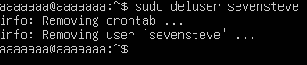
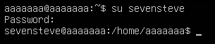

# Quản lý User và Group in Production
## Quản lý User và Group
**Quản lý User:**
| Chức năng | Câu lệnh |
|-----------|----------|
| Tạo mới user | `sudo adduser username`|
| Xóa user | `sudo deluser username`|
| Đổi mật khẩu user | `sudo passwd username`|
| Liệt kê User | `cat /etc/passwd`|
| Kiểm tra user hiện tại | `whoami`|


**Quản lý Group**
| Chức năng | Câu lệnh |
|-----------|----------|
| Tạo group mới | `sudo groupadd groupname`|
| Xóa group| `sudo groupdel groupname`|
|Thêm user vào group| `sudo usermod -aG groupname username`|
| Liệt kê nhóm của user| `group username`|
|Xem danh sách group| `cat /etc/group`|
| Truy cập vào user| `su username`|



### Xem tất cả groups của User hiện tại
```bash
groups
```
hoặc dùng 
```bash
id
```
Xem primary group của user
```bash
id -gn
```
ngược lại:
```bash
id -Gn
```
### Xem user hiện tại
```bash
whoami
```
### Xem các thành viên trong 1 group
```bash
getent group <tên_group>
```
### Quản lý những ai có quyền sudoers
```bash
sudo cat /etc/sudoes
```
### Liệt kê tất cả những user
```bash
getent passwd
```
### Chỉ xem những user người dùng
```bash
awk -F: '$3 >= 1000 {print $1}' /etc/passwd
```
### Liệt kê toàn bộ group 
```bash
getent group 
```

## Quản trị User 
- Một admin gần như không bao giờ ngồi đọc toàn bộ `/etc/passwd`.
- Chỉ cần quan tâm User người dùng
```bash
awk -F: '$3>=1000{print $1,$3,$7}' /etc/passwd
```
- Lọc:
```bash
getent passwd | awk -F: '
{
    uid=$3
    shell=$7

    if(uid==0)
        type="ROOT"
    else if(uid<1000)
        type="SYSTEM"
    else
        type="HUMAN"

    printf "%-20s UID=%-5s %-8s %s\n",$1,uid,type,shell
}'
```