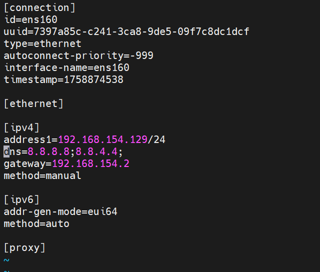

## Trên Ubuntu 24.04

Mở file cấu hình `netplan` (thường nằm trong `/etc/netplan/`):

```plaintext
sudo vim /etc/netplan/50-cloud-init.yaml
```

Kết quả:


Ấn `i` để chỉnh sửa nội dung, chỉnh sửa nội dung trong [ipv4] thành:


- `ens33`: Tên card mạng.
- `dhcl3: no`: tắt DHCP để dùng IP tĩnh.
- `addresses: - 192.168.154.128/24` địa chỉ IP và subnet mask.
- `gateway4: 192.168.154.2` gateway: bởi địa chỉ 192.168.154.1 là địa chỉ IP của máy tính thật đóng vai trò là NAT.

Chỉnh sửa xong, ấn `Esc` để thoát khỏi chế độ `Insert`. Tiếp đó nhập `:wq` và `Enter` để lưu cấu hình.

Sau khi thực hiện thay đổi, cần restart để áp dụng thay đổi:

```plaintext
sudo netplan apply
```

## Trên CentOS 9
`Cách 1`:
Mở cấu hình mạng (ens160)

`sudo vim /etc/NetworkManager/system-connections/ens160.nmconnection`

Kết quả



Ấn i để chỉnh sửa nội dung như trên
- `method=manual`: Chỉ định địa chỉ IP tĩnh.
- `address1= 192.168.154.129/24` : địa chỉ IP.

Sau khi chỉnh sửa xong, ấn `esc` để thoát khỏi chế độ `Insert`. Tiếp đó nhập `:wq` và `Enter` để lưu cấu hình.

Sau khi thực hiện thay đổi, cần restart để áp dụng thay đổi:

`sudo systemctl restart NetworkManager`

`Cách 2`: Dùng nmcli (NetworkManager CLI)

Vì trong CentOS 9, User không có quyền dùng sudo nên phải về trạng thái root:
- `su -`: Chuyển từ trạng thái User -> Root
- `nmcli connection show`: Xem danh sách card mạng ( Ở đây chỉ có mình card ens160).
- `sudo nmcli connection modify ens160 ipv4.address 192.168.154.129/24`: đặt IP tĩnh
- `sudo nmcli connection modify ens160 ipv4.gateway 192.168.154.3`: Đặt Gateway
- `sudo nmcli connection modify ens160 ipv4.method manual`: chuyển chế độ IP tĩnh
- `sudo nmcli connection up ens160`: Áp dụng thay đổi.

### Một số lỗi gặp phải khi fix CentOS 9
- Đây là lỗi DNS/network → máy CentOS không phân giải được tên miền mirrors.centos.org.

Khi chạy dnf install, dnf cần kết nối internet để tải metadata của repo. Nếu không ping/resolve được host thì sẽ báo lỗi này.
- Nguyên nhân: Cấu hình IP/DNS sai hoặc không có DNS (thường khi đặt IP tĩnh mà quên thêm nameserver).
- Khi dùng IP tĩnh với nmcli, nhớ phải khai bảo DNS nếu không sẽ lỗi.
```plaintext
nmcli con mod ens33 ipv4.dns "8.8.8.8 8.8.4.4"
nmcli con up ens33
```
