# VM Ware Workstation
## Switch ảo (Virtual Switch _ VMnet0, VMnet1, VMnet8)
- Đây là thiết bị mạng ảo do VMware tạo ra trên máy Host.
- Nó giống như Switch vậy lý logic trong mạng LAN, nhiệm vụ là kết nối các card mạng ảo (của VM) với nhau và/hoặc với card mạng thật của Host.
- Một số switch ảo mặc định trong VMware:
  - VMnet0: cho chế độ Bridged (kết nối thẳng với switch/ vLan ngoài).
  - VMnet1: cho chế độ Host-only (switch riêng, không nối Internet).
  - VMnet8: cho chế độ NAT (switch riêng, có gateway NAT đi Internet).

  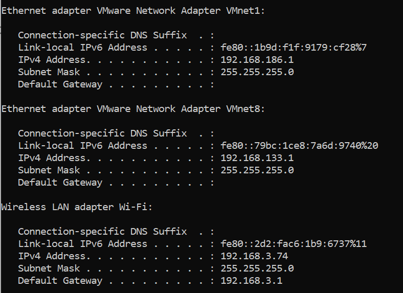

## Phân biệt 3 chế độ network trong VMware: NAT, Bridget, Host-only
🔑 **Tóm tắt nhanh:**
| **Tính năng** | **NAT** | **Bridged**| **Host-Only**|
|---------------|---------|------------|--------------| 
| **IP VM**     | Máy ảo lấy IP từ VMware DHCP(VMnet 8) | Máy ảo lấy IP từ router của mạng LAN | Máy ảo lấy IP từ VMware riêng biệt(VMnet 1)|
| **Kết nối Internet** | Có(qua host) | Có (trực tiếp) | Không |
| **Kết nối LAN ngoài** | Không (bị ẩn sau host) | Có ( như mọi máy tính thật trong mạng) | Không( chỉ liên lạc được với host và máy ảo VM khác) |
| **Kết nối với Host** | Có | Có | Có |
| **Bảo mật**| Cao( máy ảo ẩn khỏi mạng bên ngoài) | Thấp (máy ảo lộ trực tiếp ra ngoài mạng) | Rất cao (máy ảo hoàn toàn cách ly) |
| **Tính ứng dụng** | Truy cập internet mà không lộ IP thật | Test mạng như máy thật, cần IP tĩnh | Môi trường cô lập, thử nghiệm nội bộ |

 🖊️  **Chi tiết từng chế độ**

### 1. NAT (Network Address Translation)

 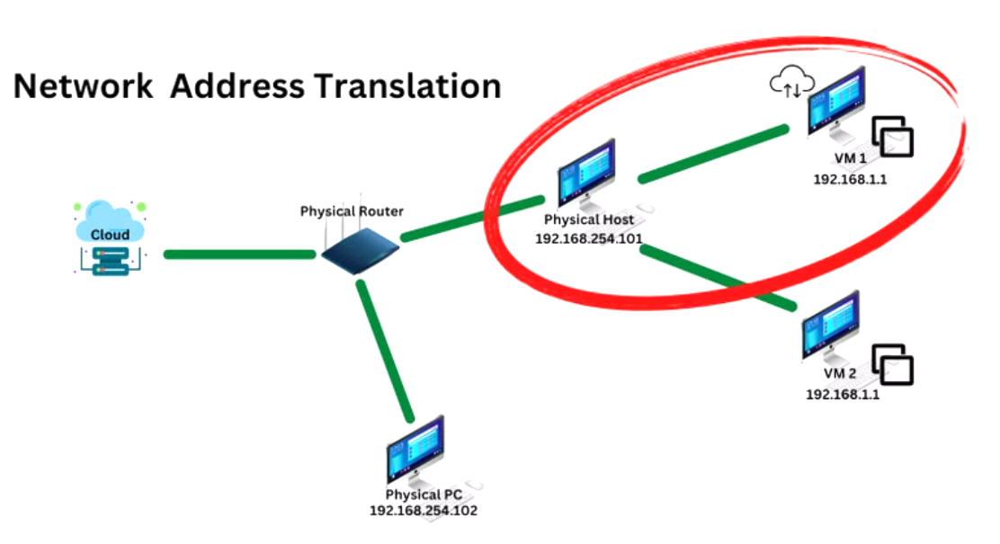

#### 1.1 Khái niệm
- NAT (Network Address Translation): dịch địa chỉ mạng.
- Khi chọn chế độ NAT cho máy ảo (VM), VMware sẽ tạo ra một card mạng ảo (VMnet8).
- Máy ảo sẽ nhận một IP Private trong dải do VMware quản lý. Lúc này, các máy ảo sẽ kết nối với máy thật qua switch ảo VMnet8, máy thật sẽ đóng vai trò NAT server cho các máy ảo.
- Khi máy ảo truy cập Internet, Vmware sẽ dịch IP Private của VM sang IP của máy Host.

👉 Nghĩa là với mạng bên ngoài, tất cả VM chạy NAT sẽ "núp bóng" sau máy Host.
#### Cách hoạt động
- **Máy ảo (VM) gửi yêu cầu truy cập mạng:** Khi máy ảo muốn truy cập một địa chỉ trên mạng (ví dụ: một trang web), nó sẽ gửi một gói tin đi. Gói tin này sẽ có địa chỉ iP nguồn là địa chỉ IP riêng (private IP) của máy ảo.
- **Máy thật (Host) thực hiện NAT**: Máy thật đóng vai trò là NAT device cho máy ảo. Khi gói tin từ máy ảo đến, máy thật sẽ thực hiện các bước sau:
  - Thay đổi địa chỉ IP nguồn trong gói tin từ địa chỉ IP riêng của máy ảo thành địa chỉ IP riêng của chính máy thật.
  - Ghi lại thông tin về kết nối này (địa chỉ IP và port của máy ảo, địa chỉ IP và port mới của máy thật) vào bảng NAT của nó. Thông tin này sẽ được dùng để theo dõi các phản hồi sau này.
- **Router thực hiện NAT lần 2**: Gói tin sau khi đã được NAT bởi máy thật sẽ tiếp tục được gửi đến router. Router, là thiết bị kết nối mạng nội bộ với internet, sẽ thực hiện NAT lần thứ hai:
  - Thay đổi địa chỉ IP nguồn trong gói tin từ địa chỉ IP riêng của máy thật thành địa chỉ IP công cộng (public IP) được cấp bởi nhà cung cấp dịch vụ internet (ISP).
  - Tương tự, router cũng sẽ ghi lại thông tin về kết nối này vào bảng NAT của nó( địa chri IP và port của máy thật, địa chỉ IP và port mới sau khi NAT ra IP public).
- **Phản hồi từ internet**: Khi máy chủ web hoặc dịch vụ mà máy ảo đang cố gắng truy cập gửi phản hồi, gói tin sẽ có địa chỉ IP đích là địa chỉ của IP công cộng của router.
- **Router chuyển phản hồi về máy thật**: Router sẽ xem xét bảng NAT của nó và xác định rằng gói tin này là phản hồi cho một kết nối đã được khởi tạo từ địa chỉ IP riêng của máy thật. Do đó, router sẽ thay đổi địa chỉ IP đích trong gói tin từ địa chỉ IP công cộng trở lại địa chỉ IP riêng của máy thật và gửi gói tin này về máy thật.
- **Máy thật chuyển phản hồi về máy ảo**: Khi máy thật nhận được gói tin phản hồi, nó sẽ xem xét bảng NAT của mình và xác định rằng gói tin này là phản hồi cho một kết nối đã được khởi tảo từ địa chỉ IP riêng của máy ảo.

**Lưu ý**: Nếu cấu hình IP tĩnh cho máy ảo ví dụ 10.0.0.5 mà IP không thuộc dải VMnet8:
  - Máy ảo không thể giao tiếp với gateway(máy chủ) -> mất khả năng truy cập Internet cũng như không giao tiếp được với các máy ảo khác trong cụng mạng NAT.
  - Máy chủ có IP tĩnh ngoài dải VMnet8, nó không thuộc cùng subnet với gateway, không lk đưới tới máy chủ. Kết quả sẽ là hoàn toàn mất kết nối mạng. Điều tương tự cũng sẽ xảy ra với Host Only hay Bridged.

### Bridged Networking
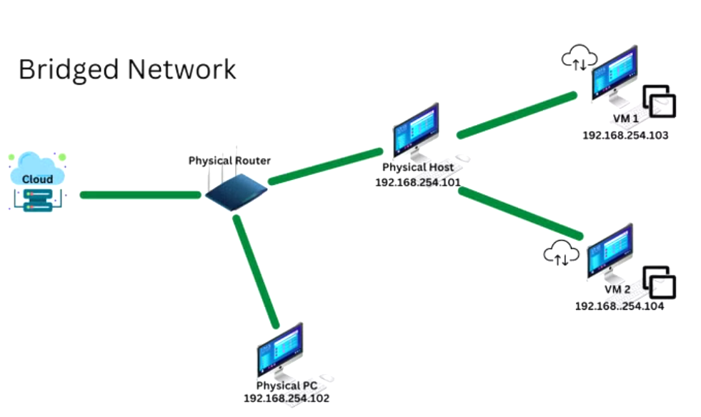
#### Khái niệm
- Khi chọn chế độ này, card mạng ảo (NIC của VM) sẽ được nối trực tiếp(bridge) với card mạng thật của Host(Ethernet hoặc WiFi).
- Kết quả: Máy ảo sẽ xuất hiện trong mạng LAN như một máy tính vật lý độc lập, có IP trong cùng dải mạng với các máy khác.
- Máy ảo lúc này = 1 máy tính thật mới trong mạng LAN.
#### Cách hoạt động
- Máy ảo kết nối trực tiếp vào mạng LAN thông qua card mạng vật lý của máy host.
  - VMware tạo một Virtual Bridge giữa adapter Ethernet/WiFI của router ngoài đời thực và VMnet0 (cấu nối ảo).
  - Máy ảo hoạt động như một thiết bị độc lập trong mạng LAN, giống như một máy tính thật.
  - Máy ảo có thể lấy IP từ DHCP trong mạng LAN, giống như máy host và các thiết bị khác trong mạng.
- Khi máy ảo gửi gói tin, nó đi qua Virtual Ethernet Adapter -> VMnet0 -> card mạng vật lý của máy host -. mạng LAN.
- Khi máy ảo nhận gói tin, dữ liệu từ mạng LAN đi vào card mạng vật lý của máy host -> VMnet0 -> máy ảo.
### Host-Only
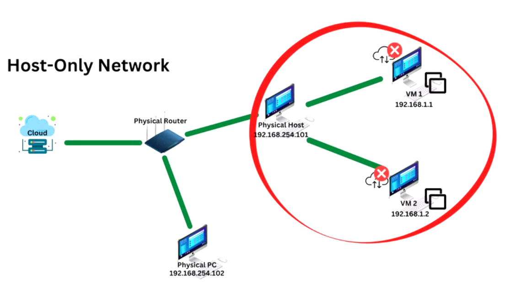

Host-only là một loại mạng ảo nơi các VM và máy Host( thông qua một virtual network adapter trên Host - VMnet1) nằm cùng một mạng riêng không lối ra Internet hoặc LAN bên ngoài theo mặc định. Nó tạo một mạng nội bộ (private virtual network) chỉ dành cho Host và các VM được gán vào mạng đó.

**Lấy IP tự động từ DHCP:**

**Cách hoạt động:**
- VM ware tạo một mạng ảo riêng biệt (VMnet1)
  - VMnet1 là một mạng nội bộ chỉ có giữa máy host và các máy ảo host-only.
  - Máy host có một Host Virtual Adapter để giao tiếp với mạng VMnet1.
  - Không có kết nối với card mạng vật lý của máy host, nên máy ảo không thể ra Internet hoặc truy cập mạng LAN bên ngoài.
- Luồng dữ liệu khi máy ảo giao tiếp:
  - Khi máy ảo gửi gói tin, nó đi qua Virtual Ethernet Adapter hay Virtual NIC -> VMnet1 -> máy host hoặc máy ảo khác trong cùng VMnet1.
  - Nếu máy host chạy một dịch vụ (VD: SSH, HTTP), máy ảo có thể kết nối đến dịch vụ đó thông qua IP của Host Virtual Adapter.

## Sử dụng chế độ NAT để truy cập Internet
### Các cách cấu hình địa chỉ IP cho Virtual Machine
**Ubuntu Server**: Nhập lệnh `sudo dhcpcd` sau đó nhập `ip addr` để kiểm tra ip được cấp phát.

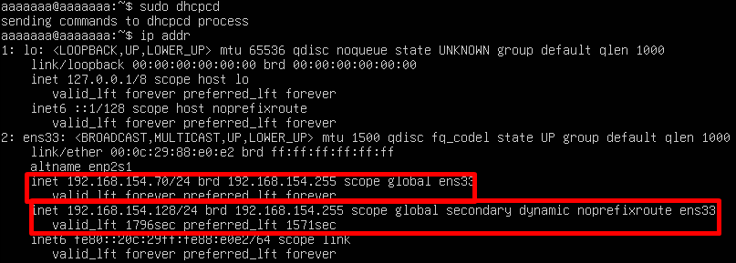

- `inet 192.168.1.100/24 scop global ens33`
  - Đây là địa chỉ IPv4 chính (primary address) gán cho interface `ens33`.
  - `scope global` nghĩa là địa chỉ này dùng được trong toàn mạng (LAN, Internet), không phải chỉ trong loopback hay link-local.
- `inet 192.168.1.101/24 scope global secondary dynamic noprefixroute ens33`
  - `secondary`: Nghĩa là đây là địa chỉ IP phụ (alias) trên cùng interface `ens33`. Một card mạng có thể có nhiều IP.
  - `dynamic` : địa chỉ này được cấp bởi DHCP, không phải bạn gán tĩnh.
  - `noprefixroute`: hệ thống không tự động tạo route cho subnet này. Route sẽ chỉ có cho IP chính, IP phụ không thêm route riêng.
  - `scope global` : cũng có hiệu lực trong toàn mạng.

**CentOS9**:
- User không nằm trong nhóm có quyền sudo. Chỉ user `root` mới có toàn quyền.
  - Đăng nhập lại bằng root: `su -`
  - Có thể thêm user vào nhóm: `usermod -aG wheel aaaaaaa`
  - Kiểm tra file sudoers: mở file `/etc/sudoers` -> `visudo` Đảm bảo dòng `%wheel ALL = (ALL) ` không bị comment -> Đăng xuất rồi đăng nhập lại `newgrp wheel`
- **Công cụ dòng lệnh của NetworkManager**: Chuẩn CentOS 9
  - `sudo nmcli device reapply ens33` hoặc `sudo nmcli device connect ens33`
  - Kiểm tra giao diện interface nếu không có interface thông dụng `ens33`: `ip link` hoặc `nmcli device status` hoặc `nmcli connection show`:
   
  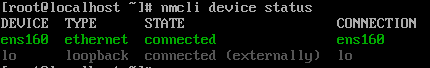
  
  - Từ CentOS 8 trở đi, Red Hat bỏ hẳn cơ chế cũ (`/etc/sysconfig/network-scripts/`) vốn dùng trong CentOS 6/7.
  - Thay vào đó, NetworkManager quản lý toàn bộ kết nối mạng. Cấu hình mạng lưu ở: `/etc/NetworkManager/system-connetions/`(file `.nmconnection`) cần phải tiếp cận qua công cụ nmcli, nmtui, cockpit.

  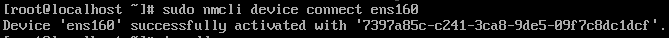 

  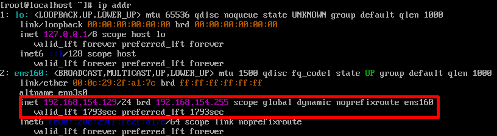

  - **Lưu cấu hình DHCP (xin IP động sau mỗi lần boot)**
    - `sudo nmcli connection modify ens160 ipv4.method auto` và `sudo nmcli connection up ens160`
    - Mỗi lần khởi động, interface sẽ tự động xin IP từ DHCP server và lưu vào trong profile.

    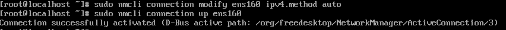
### Chọn chế độ card mạng trên VMware
  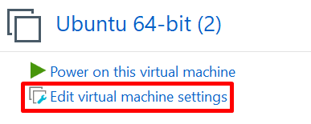 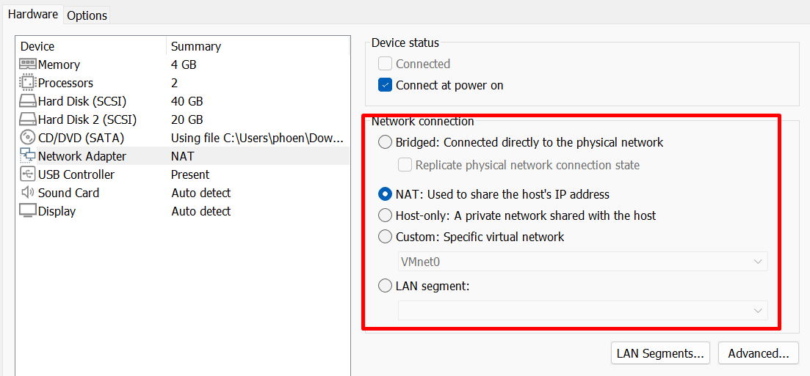

### Kiểm tra kết nối Internet khi ở chế độ NAT
  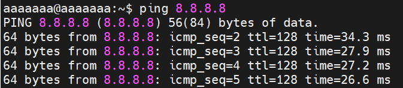

  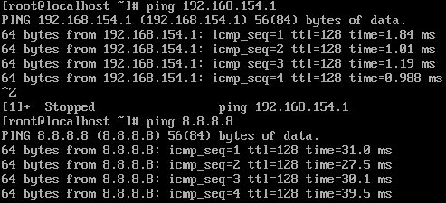

### Kiểm tra kết nối Internet khi ở chế độ Bridged
**Lưu ý**: Chế độ Replicate physical network connection state = đồng bộ trạng thái kết nối mạng vật lý của host vào VM.
- Tuỳ chọn Replicate physical network connection state
  - VM ware theo dõi trạng thái mạng của card vật lý host (được bridged). 
  - Nếu rút cáp mạng / tắt Wi-Fi trên host -> VMware cũng ngắt kết nối mạng ảo tương ứng của VM.
  - Khi host kết nối lại mạng -> VM cũng có thể "theo" lại trạng thái đó.
  - Đồng bộ các thông số kết nối lớp thấp hơn( link state, tốc độ, duplex) để VM hoạt động sát thực tế hơn.

  - Khi không có kết nối mạng

  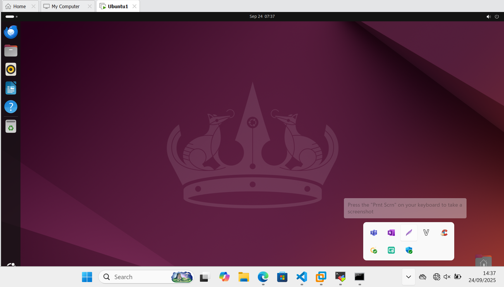
  
  - Khi có kết nối mạng

  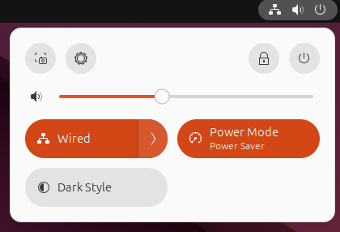
  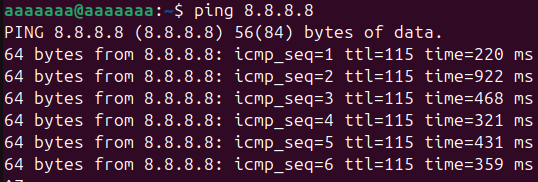

  - Địa chỉ IP của CentOS xin cấp phát lại 
  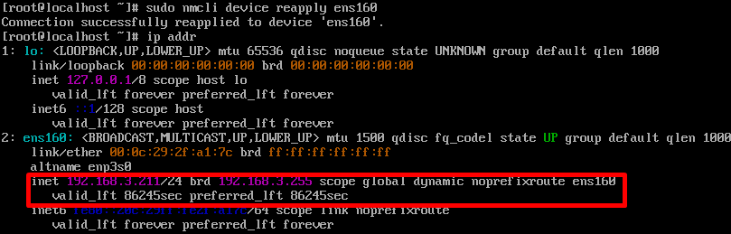

### Kiểm tra kết nối Internet khi ở chế độ Host-Only

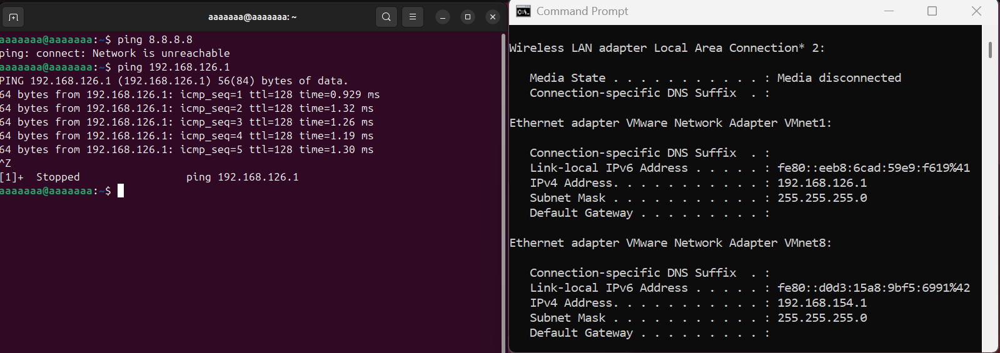

Tương tự như 2 cái trên.

