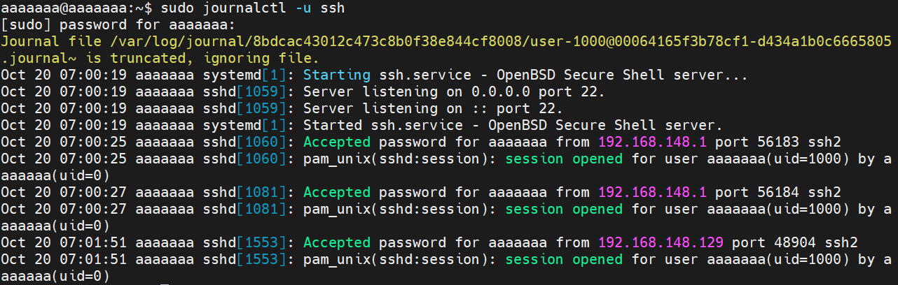
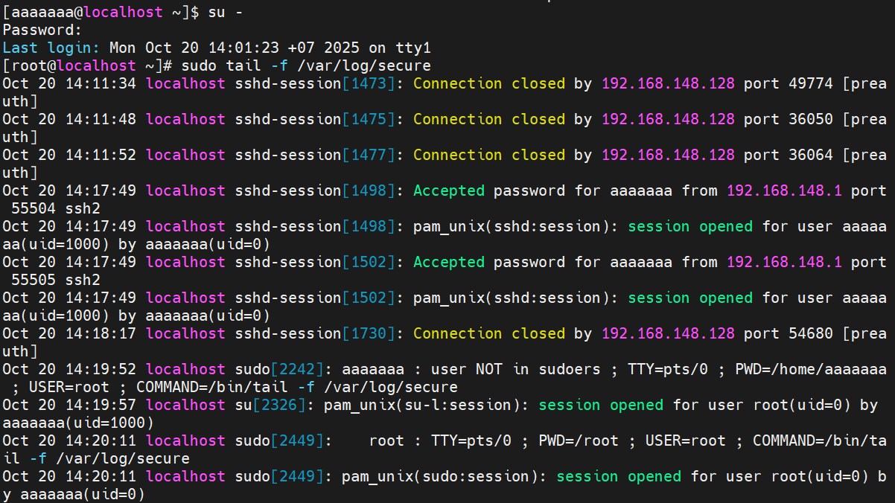

# Tìm hiểu File Log SSH
## Mục đích của file log SSH
File log SSH ghi lại các sự kiện liên quan đến hoạt động của SSH server, bao gồm:
  - Các nỗ lực kết nối đến (thành công và thất bại).
  - Thông tin về người dùng đã đăng nhập.
  - Các lỗi hoặc cảnh báo liên quan đến dịch vụ SSH.
  - Hoạt động của các kênh SSH (ví dụ: chuyển tiếp cổng).
  
File log này rất hữu ích cho việc giám sát bảo mật, khắc phục sự cố kết nối và kiểm tra các hoạt động bất thường.

## Vị trí của file log SSH trên Ubuntu và CentOS 9
### 1. Ubuntu
- Ubuntu 24.04 đã thay đổi hệ thống log truyền thống và chuyển sang `journald`.
### 2. CentOS 9
- Log chính của SSH: /var/log/secure
- log dịch vụ SSH: journalctl -u sshd --no-pager
- log chung của hệ thống: /var/log/messages

## Đọc file log SSH
### 1. Kiểm tra log SSH
#### Ubuntu
```plaintext
sudo journalctl -u ssh --no-pager
sudo journalctl -u sshd
```
- `journalctl`: công cụ dòng lệnh được sử dụng để truy vấn và hiển thị nhật ký được thu thập bởi systemd journal.
- `-u ssh`: Tùy chọn -u (unit) được sử dụng để lọc nhật ký theo một đơn vị systemd cụ thể. Trong trường hợp này, ssh thường là tên của đơn vị quản lý dịch vụ SSH server (thường là ssh.service). Lệnh này sẽ hiện thị chỉ những nhật ký liên quan đến dịch vụ SSH.
- `--no-pager`: Tùy chọn --no-pager yêu cầu journalctl hiển thị toàn bộ nhật ký trực tiếp ra terminal mà không cần sử dụng pager.



### CentOS 9
```plaintext
sudo tail -f /var/log/secure
```


- Lọc log đăng nhập thành công/ thất bại:

```plaintext
sudo grep "Accepted" /var/log/secure
sudo grep "Failed" /var/log/secure
```
## Kiểm tra tấn công SSH (Brute-force, Failed Login)
**Ubuntu**
```plaintext
sudo journalctl -u ssh --no-pager | grep "Failed"
```
***CentOS 9**
```plaintext
sudo grep "Failed" /var/log/secure
```

## Phân tích log đăng nhập
**Log khi đăng nhập thành công**
```plaintext
Oct 20 14:17:49 localhost sshd-session[1498]: Accepted password for aaaaaaa from 192.168.148.1 port 55504 ssh2
```
- `Accepted password`: Đăng nhập thành công.
- `user`: Tên user.
- `192.168.1.10`: IP của client.
- `port 53422`: Cổng kết nối

**Log khi đăng nhập thất bại:**

```plaintext
Oct 20 14:33:18 localhost sshd-session[6943]: Failed password for root from 192.168.148.128 port 57452 ssh2
Oct 20 14:33:21 localhost unix_chkpwd[7000]: password check failed for user (root)
```

- `Failed password`: Đăng nhập thất bại
- `for root`: đăng nhập vào root user.
- `192.168.148.128`: IP của thiết bị đang cố đăng nhập.

#### Sửa lỗi bổ sung 
```plaintext
@@@@@@@@@@@@@@@@@@@@@@@@@@@@@@@@@@@@@@@@@@@@@@@@@@@@@@@@@@@
@ WARNING: REMOTE HOST IDENTIFICATION HAS CHANGED!         @
@@@@@@@@@@@@@@@@@@@@@@@@@@@@@@@@@@@@@@@@@@@@@@@@@@@@@@@@@@@
IT IS POSSIBLE THAT SOMEONE IS DOING SOMETHING NASTY!
Offending ECDSA key in /home/username/.ssh/known_hosts:12
Host key for 192.168.x.x has changed and you have requested strict checking.
```
- SSH hiển thị lỗi này khi khóa định danh (host key) của máy bạn đang kết nối đến không còn khớp với khóa mà SSH đã lưu từ lần trước.
- Khi bạn SSH đến một máy (ví dụ CentOS 9), SSH client trên Ubuntu sẽ lưu “dấu vân tay” (host key fingerprint) của máy đó vào file: `~/.ssh/known_hosts`
- Lần sau khi bạn SSH lại, nó sẽ so sánh khóa hiện tại của máy đích với khóa đã lưu trong `known_hosts`.
- Nếu khác nhau → SSH nghi ngờ bị tấn công → chặn kết nối và báo lỗi.
- Cách sửa lỗi: truy cập `nano ~/.ssh/known_hosts`: xóa dòng tương ứng IP/hostname của máy mà mình đang truy cập đến
- Cách 2: `ssh-keygen -R <ip hoặc hostname>` tự động xóa host key cũ