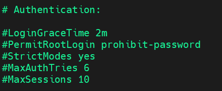
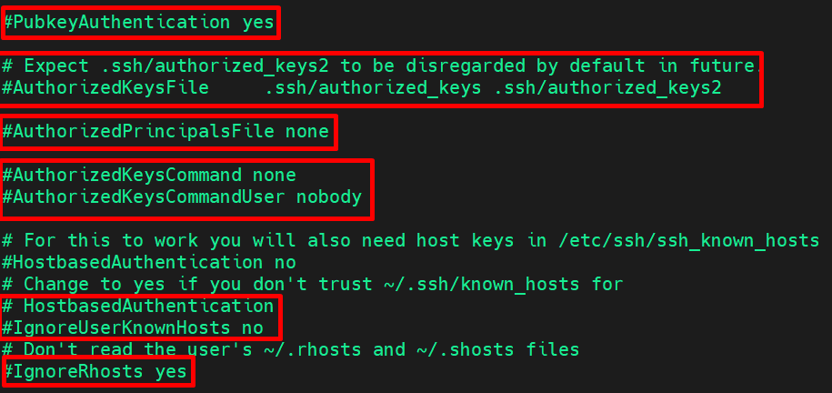

# Thông số cấu hình SSH
## Cấu hình SSH Server (`/etc/ssh/sshd_config`)
- `sudo nano /etc/ssh/sshd_config`: truy cập vào để sửa.
- **Lưu ý** nếu sửa file bỏ dấu #


- Bức ảnh trên là đoạn hướng dẫn sử dụng, File này được giải thích chi tiết trong manual page `sshd_config(5)`
- SSH server được biên dịch với PATH cụ thể: `/usr/local/sbin:/usr/local/bin:/usr/sbin:/usr/bin:/sbin:/bin:/usr/games`
- Các tùy chọn có giá trị mặc định được để dạng comment (có dấu #), Chỉ những tùy chọn không comment mới ghi đè giá trị mặc định.
- Lưu ý quan trọng với systemd: Khi dùng socket activation (mặc định), nếu thay đổi: `Port`, `AddressFamily`, `ListenAddress`.
  - Phải tái tạo cấu hình socket bằng lệnh:
  ```python
    systemctl daemon-reload
    systemctl restart ssh.socket
  ```


`Port 22`
  - Cổng mặc định mà SSH server lắng nghe kết nối
  - Hiện đang bị comment (#) nên SSH vẫn dùng cổng 22 mặc định
  - Nếu muốn đổi cổng khác (ví dụ 2222), bỏ dấu # và ghi: `Port 2222`

`AddressFamily any`
  - Quyết định phiên bản IP được sử dụng:  
    - `any`: Chấp nhận cả IPv4 và IPv6
    - `inet`: Chỉ IPv4
    - `inet6`: Chỉ IPv6

`ListenAddress 0.0.0.0`
  - Địa chỉ IPv4 mà SSH server lắng nghe:
    - `0.0.0.0` = lắng nghe trên tất cả interface mạng IPv4
    - Có thể thay bằng IP cụ thể nếu muốn SSH chỉ bind vào 1 interface

`ListenAddress ::`
  - Địa chỉ IPv6 mà SSH server lắng nghe:
    - `::` = lắng nghe trên tất cả interface mạng IPv6
    - Tương đương với `0.0.0.0` nhưng cho IPv6

`HostKey`: Khóa định danh duy nhất cho SSH server
  - Các loại khoá: 
    - `rsa_key`: Khóa RSA (truyền thống, mạnh)
    - `ecdsa_key`: Khóa ECDSA (hiệu suất tốt)
    - `ed25519_key`: Khóa Ed25519 (hiện đại, bảo mật cao)

`Ciphers and Keying` (Mã hóa)
  - RekeyLimit: Giới hạn tái tạo khóa phiên
    - `default none`: Không giới hạn (dùng giá trị mặc định)
    - Có thể set: `Rekey Limit 1G 1h` (Rekey sau 1GB data hoặc 1 giờ)

### Nhật ký giám sát
  - `SyslogFacility AUTH`: Gửi log đến facility "AUTH" trong syslog
  - `LogLevel INFO`: Mức độ ghi log (các mức: QUIET, FATAL, ERROR, INFO, VERBOSE, DEBUG...)
  - INFO là mức phù hợp cho production

  | Mức                                  | Ý nghĩa                                                                       | Ghi chú                                                                               |
| ------------------------------------ | ----------------------------------------------------------------------------- | ------------------------------------------------------------------------------------- |
| **QUIET**                            | Ghi rất ít thông tin, chỉ log lỗi nghiêm trọng                                | Dùng khi không muốn log nhiều                                                         |
| **FATAL**                            | Chỉ ghi lỗi nghiêm trọng khiến SSH dừng hoạt động                             |                                                                                       |
| **ERROR**                            | Ghi lỗi nhưng không dừng dịch vụ                                              |                                                                                       |
| **INFO** ✅                           | Mức mặc định — ghi thông tin đăng nhập, logout, IP client, lỗi xác thực, v.v. | **Thường được khuyên dùng**                                                           |
| **VERBOSE**                          | Ghi chi tiết hơn (từng bước xác thực, key, v.v.)                              | Dùng để **debug lỗi đăng nhập**                                                       |
| **DEBUG / DEBUG1 / DEBUG2 / DEBUG3** | Ghi cực kỳ chi tiết (mọi gói tin, quá trình xác thực, mã hóa, ...).           | Dùng **tạm thời để chẩn đoán lỗi**, **không nên bật thường xuyên** vì log sẽ rất lớn. |

Ví dụ: 
```plaintext
Oct 10 12:34:56 ubuntu sshd[1234]: Accepted password for trung from 192.168.1.5 port 54722 ssh2
Oct 10 12:35:01 ubuntu sshd[1234]: session opened for user trung by (uid=0)
```

### Cấu hình xác thực SSH Server



- `LoginGraceTime 2m`: 
  - Thời gian chờ đăng nhập: 2 phút
  - Sau khi kết nối TCP thành công, client có 2 phút để hoàn thành xác thực.( chỉ đc đăng nhập trong 2 phút)
  - Nếu quá thời gian này, kết nối sẽ bị ngắt.
  - Chống tấn công brute-force và chiếm kết nối.
- `PermitRootLogin prohibit-password`
  - Cho phép đăng nhập root nhưng Không cho dùng password mà chỉ được phép đăng nhập bằng key-based authentication (SSH keys).
  - Các lựa chọn khác: `yes`: cho phép cả password và key -> **NGUY HIỂM**, `no`: cấm hoàn toàn đăng nhập root, `prohibit-password`: chỉ cho phép key.
- `StrictModes yes`:
  - SSH sẽ kiểm tra permissions của file ~/.ssh, authorized_keys,...
  - Nếu permissions không an toàn (ví dụ: file config có thể ghi bởi others), từ chối kết nối
  - Bảo vệ, ngăn truy cập trái phép vào key files.
- `MaxAuthTries 6`:
  - Số lần thử xác thực tối đa: 6 lần
  - Sau 6 lần thử đăng nhập thất bại trong 1 kết nối, session sẽ bị ngắt.
  - Chống brute-force: Hạn chế thử nhiều password.
- `MaxSessions 10`:
  - Số session đồng thời tối đa: 10 sessions
  - Một kết nối SSH có thể mở tối đa 10 session multiplexed
  - Ngăn chặn: Lạm dụng tài nguyên từ 1 kết nối



- `PubbkeyAuthentication yes`:
  - Xác thực bằng Public Key: Cho phép đăng nhập bằng SSH keys, `yes` = bật xác thực public key.
- `AuthorizedKeysFile`: File chứa authorized keys( Public keys which are allowed):
  - Mặc định: `~/.ssh/authorized_keys`
  - Dự phòng: `~/.ssh/authorized_keys2`
- `AuthorizedPrincipalsFile none`: File chứa principals (tên người dùng được ủy quyền)
  - `none` = Không sử dụng principals file
  - Dùng trong các hệ thống phức tạp với certificate authentication
- `AuthorizedKeysCommand none`: 
  - `AuthorizedKeysCommand`: Đây là tùy chọn nâng cao cho phép SSH server chạy một lệnh tùy chỉnh để lấy danh sách public key hợp lệ (thay vì chỉ đọc từ file `authorized_keys`)
  - `none` = Không dùng lệnh tùy chỉnh
  - Có thể set script để lấy keys từ LDAP, database,.. ví dụ : `AuthorizedKeysCommand /usr/bin/sss_ssh_authorizedkeys`
- `AuthorizedKeysCommandUser nobody`:
  - Tùy chọn này chỉ định người dùng hệ thống (user) mà SSH server sẽ chạy lệnh dưới quyền của ai - User chạy lệnh.
  - `nobody` = User ít đặc quyền, `sshkeys` = User custom chuyên dụng, `www-data` = Script chạy web service
- `HostbasedAuthentication no`
  - Xác thực dựa trên host: Cho phép đăng nhập dựa trên trust giữa các máy
  - `no` = Tắt tính năng vì kém bảo mật
  - Nếu máy A nằm trong danh sách đáng tin cậy `/etc/ssh/ssh_known_hosts` hoặc `~/.ssh/known_hosts` và hợp lệ host key,... cho phép connect SSH mà không cần nhập mật khẩu.
- `IgnoreUserKnownHosts no`
  - `no` = Vẫn đọc file `~/.ssh/known_hosts` của user
  - Nếu `yes` = Bỏ qua file `known_hosts` của user
- `IgnoreRhosts yes`
  - `yes` = KHÔNG đọc file `~/.rhosts` và `~/.shosts`
  - Bảo mật: Ngăn sử dụng các file rhosts cũ, Rhosts là "cửa hậu" bảo mật từ thời kỳ internet ít nguy hiểm. Ngày nay nó là mối nguy hiểm cần vô hiệu hóa hoàn toàn!

### Xác thực Password


- `PasswordAuthentication yes`: Cho phép đăng nhập bằng password.
- `PermitEmptyPasswords no`: Cấm password trống (rất nguy hiểm nếu bật)

### Xác thực tương tác (CHallenge-Response)
`KbdInteractiveAuthentication no`
- Tắt xác thực challenge-response
- Thường dùng với PAM modules, có thể gây vấn đề với một số PAM.

### Kerberos Authentication
```plaintext
#KerberosAuthentication no
#KerberosOrLocalPasswd yes
#KerberosTicketCleanup yes
```
- Kerberos là một giao thức xác thực mạng (network authentication protocol)
- Đang tắt, chỉ dùng trong môi trường enterprise có Kerberos setup

### GSSAPI Authentication
```plaintext
#GSSAPIAuthentication no
#GSSAPICleanupCredentials yes
```
- GSSAPI(Generic Security Services API) - Dùng cho xác thực trong môi trường mạng phức tạp.

### PAM (Pluggable Authentication Modules)
`UsePAM yes`: là trái tim của cơ chế xác thực trong Linux và Unix-like systems
- PAM là “lớp trung gian” giữa ứng dụng cần xác thực (như `login`, `sudo`, `ssh`, `gdm`,`passwd`, v.v.) và các cơ chế xác thực thật sự (như mật khẩu `local`, `LDAP`, `fingerprint`, `smart card`…).
- Hỗ trợ: MFA, password policies, LDAP, etc.

### Forwarding & Tunneling
- `X11Forwarding yes`: Cho phép chạy GUI applications qua SSH
- `AllowTcpForwarding`: Chuyển tiếp cổng TCP (mặc định bật)
- `AllowAgentForwarding`: Chuyển tiếp SSH agent

### Các tùy chọn phiên làm việc
- `PrintMotd no`: KHÔNG hiển thị Message of the Day
- `PrintLastLog yes`: Hiển thị lần đăng nhập cuối (mặc định)
- `TCPKeepAlive`: Giữ kết nối sống

### CLient Management
- `ClientAliveInterval`: Thời gian kiểm tra client còn sống
- `UseDNS`: Resolve DNS cho client (có thể gây chậm)

### Subsystem & Environment


- `AcceptEnv`: Chấp nhận biến môi trường locale
- `Subsystem sftp`: Định nghĩa SFTP server

### Per-User Settings (Match Block)