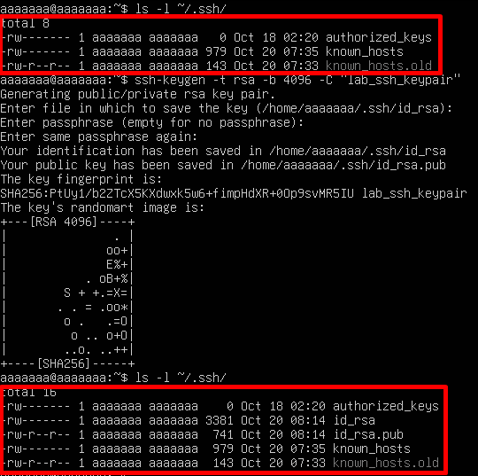
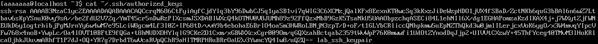
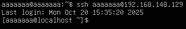
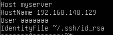

# Tìm hiểu SSH keypair
## Keypair là gì?
### 1. Khái niệm
SSH key pair (cặp khoá SSH) là một cơ chế xác thực an toàn cho giao thức SSH, bao gồm hai file khoá riêng biệt nhưng có liên quan mật thiết.
  - **Private key(Khoá riêng tư)**: Khoá này phải được giữ bí mật và an toàn trên máy tính của bạn. Nó tương tự như chiếc chìa khoá duy nhất có thể mở ổ khoá mà khoá công khai đã khoá.
  - **Public key(Khoá công khai)**: Khoá này được chia sẻ với các máy chủ mà bạn muốn truy cập. Bạn có thể coi nó như một ổ khoá mà bất kỳ ai cũng có thể nhìn thấy và sử dụng để khoá một hộp thư.

Khi kết nối SSH, máy host sẽ kiểm tra public key được gửi từ máy client và gửi số ngẫu nhiên được mã hoá bằng public key để máy client giải mã bằng private key.
### 2. Mục đích của SSH Keypair
Cung cấp một phương thức xác thực an toàn và tiện lợi hơn so với việc sử dụng mật khẩu truyền thống. Với key pair, có thể đăng nhập vào máy chủ SSH mà không cần nhập mật khẩu mỗi lần.
### 3. Cách thức hoạt động
`Bước 1`: Tạo keypair
- Sử dụng một công cụ (thường là `ssh-keygen`) để tạo một cặp khoá( public key và private key) trên máy tính.

`Bước 2`: Phân phối public key
- Sao chép khoá công khai lên máy chủ SSH muốn truy cập.
- khóa này thường được thêm vào file `~/.ssh/authorized_keys` trong thư mục home của người dùng trên máy host.

`Bước 3`: Yêu cầu đăng nhập
- Khi cố gắng SSH vào máy host, SSH client sẽ gửi yêu cầu đăng nhập.

`Bước 4` : Thử thách = Phản hồi
- Máy host sẽ kiểm tra file `authorized_keys` để tìm public key tương ứng với máy đang cố gắng đăng nhập. Nếu tìm thấy, máy host sẽ tạo ra một số ngẫu nhiên và mã hóa bằng public key của máy đăng nhập, sau đó gửi mã đi.

`Bước 5`: Giải mã và phản hồi
- Máy client sẽ giải mã bằng private key và gửi lại cho máy host

`Bước 6`: Xác minh
- Máy host so sánh số ngẫu nhiên đã nhận được với số ban đầu. Nếu trùng khớp -> cho phép đăng nhập mà không cần mật khẩu.

### 4. Ưu điểm khi dùng Key pair
- Không cần nhập mật khẩu mỗi lần SSH.
- Bảo mật hơn vì không dễ bị brute-force.
- Dễ dàng quản lý và tự động hóa kết nối SSH.
- Nếu server cài lại hoặc đổi IP, fingerprint đổi → SSH cảnh báo để tránh bị giả mạo server (man-in-the-middle attack).
```plaintext
ssh-keygen -R <ip>     # Xóa key cũ
```
## Lab Keypair
### Mô hình Lab
Tạo SSH Keypair và sử dụng nó để SSH từ máy client Ubuntu vào máy server CentOS 9.
### Lab
` Bước 1`: Kiểm tra SSH key trên client
```plaintext
ls -l ~/.ssh/
```
Nếu có 2 file: 
| Loại           | Vị trí                                           | Vai trò                                                               |
| -------------- | ------------------------------------------------ | --------------------------------------------------------------------- |
| 🔑 Private key | `~/.ssh/id_rsa` hoặc `~/.ssh/id_ed25519`         | Giữ bí mật, nằm trên **máy client** (máy bạn)                         |
| 🔓 Public key  | `~/.ssh/id_rsa.pub` hoặc `~/.ssh/id_ed25519.pub` | Copy sang **máy server**, nằm trong `/home/user/.ssh/authorized_keys` |

--> Đã có SSH key.
- Nếu chưa có, tạo mới:
```plaintext
ssh-keygen -t rsa -b 4096 -C "lab_ssh_keypair"
```
- Sau đó cứ nhấn Enter liên tục 3 lần (để nhận giá trị mặc định).
```plaintext
Generating public/private ed25519 key pair.
Enter file in which to save the key (/home/aaaa/.ssh/id_ed25519):
Enter passphrase (empty for no passphrase):
Your identification has been saved in /home/aaaa/.ssh/id_ed25519
Your public key has been saved in /home/aaaa/.ssh/id_ed25519.pub
```
  - `ssh-keygen`: lệnh dùng để tạo, quản lý và chuyển đổi các khóa SSH.
  - `-t rsa`: Tùy chọn `-t `(type) chỉ định loại thuật toán mã hóa sẽ được sử dụng để tạo khóa.
  - `-b 4096`: Tùy chọn `-b` (bits) chỉ định số lượng bit cho khóa. Đối với thuật toán RSA, số lượng bit càng cao thì khóa càng mạnh và an toàn hơn, nhưng cũng có thể mất nhiều thời gian hơn để tạo và sử dụng. 4096 là một kích thước khóa mạnh và được khuyến nghị sử dụng hiện nay.
  - `-C "lab_ssh_keypair"`: Tùy chọn `-C` (comment) thêm một dòng chú thích vào file khóa công khai.
- Nhấn `Enter` để lưu key vào đường dẫn mặc định (`~/.ssh/id_rsa`).



` Bước 2`: Copy public key qua máy server (CentOS 9)
- Chạy lệnh sau trên máy client (ubuntu):
    ```plaintext
    ssh-copy-id -i ~/.ssh/id_rsa.pub aaaaaaa@192.168.148.129
    ```
    - `-i`: Tùy chọn `-i` (identity file) chỉ định đường dẫn đến file chứa khóa công khai mong muốn sao chép lên máy chủ.
    - `aaaaaaa`: Tên user trên máy server (centos).
    - `192.168.148.129`: địa chỉ IP máy server (centos).
- File cp sẽ đc tự generate và lưu ở `~/.ssh/authorized_keys` của chính user đó



` Bước 3`:  SSH từ client (ubuntu) vào server (centos) bằng SSH Key
```plaintext
ssh aaaaaaa@192.168.148.129
```
  - Nếu có passphrase, sẽ cần nhập rõ. Nhưng như ở bước 1 tạo keypair không dùng passphrase.

  

` Bước 4`: Cấu hình nâng cao
- **Sửa chỉ cho phép truy cập bằng SSH Key**
```plaintext
PasswordAuthentication no
PubkeyAuthentication yes
```
- Lưu và khởi động lại SSH:
```plaintext
sudo systemctl restart sshd
```

- **Cấu hình SSH client để dễ dàng quản lý**
  - Trên máy client (ubuntu), chỉnh file `~/.ssh/config`:
  ```plaintext
  vim ~/.ssh/config:
  ```
  - Thêm nội dung
  ```plaintext
  Host myserver
  HostName 192.168.148.129
  User aaaaaaa
  IdentityFile ~/.ssh/id_rsa
  ``` 
  - Lưu file 
  ```plaintext
  ssh myserver
  ```
  - Lưu ý không phải ssh aaaaaaa
  