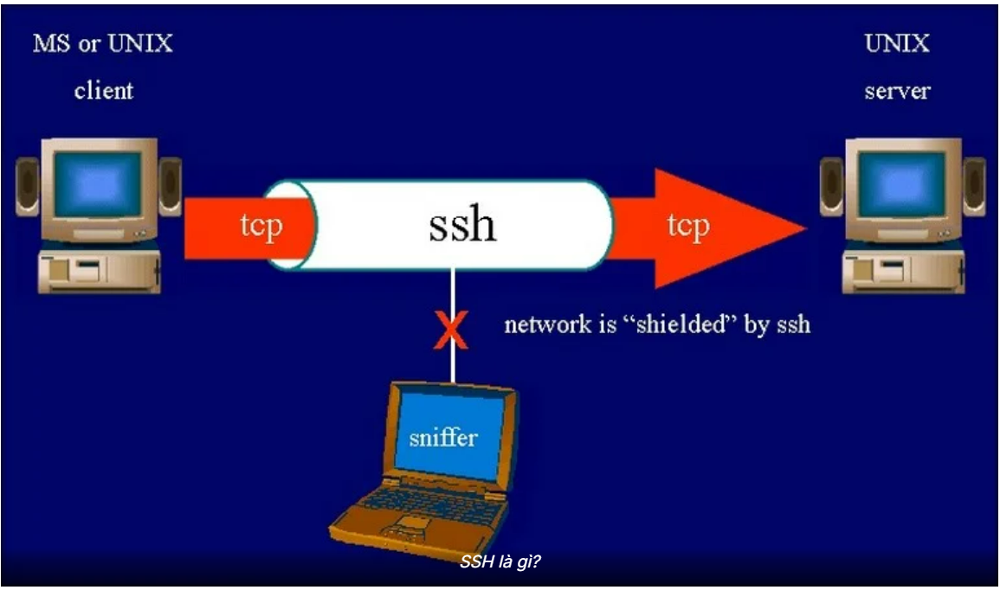
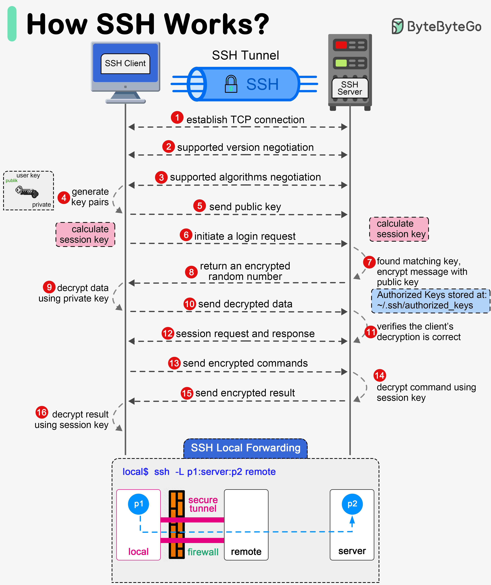
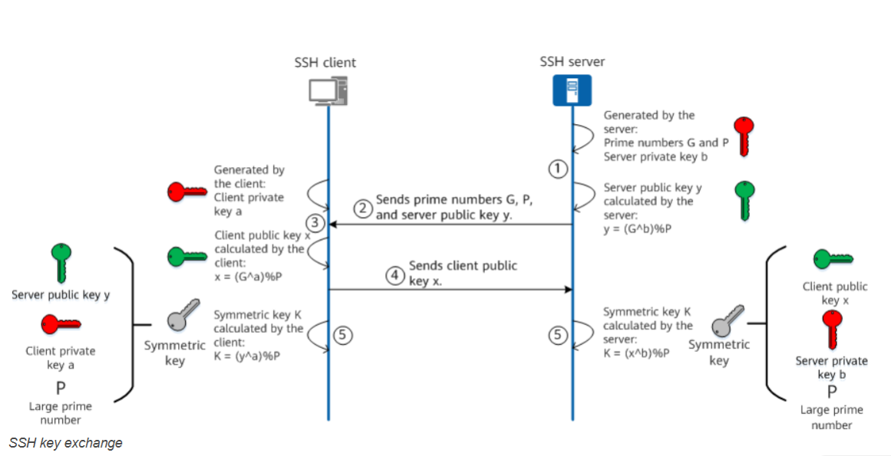

# Tổng quan về SSH

## Khái niệm SSH
- SSH( Secure Shell) là một **giao thức mạng** cho phép bạn **truy cập và quản lý máy tính từ xa** một cách bảo mật thông qua dòng lệnh hoặc các kênh mã hóa. 
- SSH đặt ra tiêu chuẩn cao về đảm bảo thông tin, ngăn chặn các rủi ro an ninh mạng.
- SSH dùng mã hoá để đảm bảo tính bảo mật, toàn vẹn và xác thực khi giao tiếp.
### 1.1 Khi nào sử dụng SSH
- Khi đăng nhập vào một máy chủ Linux (VPS, Raspberry Pi, server nội bộ, cloud như AWS, Azure, Google Cloud...) để:
  - Quản lý hệ thống, cài đặt phần mềm
  - Kiểm tra log, reboot hệ thống
  - Chạy ứng dụng, service, web server
🛡️ Lý do: SSH mã hóa toàn bộ dữ liệu, giúp bạn không bị nghe lén hoặc đánh cắp mật khẩu (khác với Telnet vốn gửi plaintext).
- Khi cần sao chép file giữa máy cá nhân ↔ máy chủ mà vẫn đảm bảo bảo mật và toàn vẹn dữ liệu.
(SCP và SFTP đều chạy trên nền SSH.)
- SSH được sử dụng rộng rãi trong hầu hết các trung tâm dữ liệu. Nó cho phép quản trị viên truy cập và kiểm soát từ xa các máy chủ và hệ thống mạng một cách an toàn.
- SSO cho phép người dùng đăng nhập vào nhiều ứng dụng và hệ thống khác nhau chỉ bằng một lần đăng nhập duy nhất. SSH có thể là một phương pháp xác thực trong quy trình SSO, trong đó người dùng sử dụng kết nối SSH để xác thực vào một máy chủ trung gian. 
- Khi triển khai IoT hoặc hệ thống nhúng: Cấu hình và debug thiết bị từ xa. Truyền file firmware hoặc log. Giám sát hoạt động thiết bị an toàn
## 2. Các chức năng chính của SSH

### 2.1 Core Functions

| Chức năng                             | Mô tả                                                                                      | Ví dụ / Công cụ                    |
| ------------------------------------- | ------------------------------------------------------------------------------------------ | ---------------------------------- |
| **1. Remote Login (Đăng nhập từ xa)** | Kết nối từ máy client đến máy chủ (server) để điều khiển bằng dòng lệnh.                   | `ssh user@server`                  |
| **2. Remote Command Execution**       | Chạy lệnh hoặc script trên máy chủ mà không cần đăng nhập tương tác.                       | `ssh user@server "ls -l /var/log"` |
| **3. Secure File Transfer**           | Truyền file an toàn giữa client ↔ server thông qua kết nối mã hóa.                         | `scp`, `sftp`                      |
| **4. Port Forwarding / Tunneling**    | Chuyển tiếp lưu lượng mạng (network traffic) qua kết nối SSH, để bảo mật các dịch vụ khác. | `ssh -L`, `ssh -R`, `ssh -D`       |
| **5. Proxy & Jump Host Access**       | Sử dụng một máy SSH trung gian để truy cập nhiều máy khác (proxy hoặc jump server).        | `ssh -J jump_host target_host`     |
| **6. X11 Forwarding**                 | Truyền ứng dụng GUI (x11 apps) từ máy chủ về hiển thị ở client.                            | `ssh -X user@server`               |

### 2.2 Port Forwarding (Chuyển tiếp cổng)
- SSH cho phép bạn chuyển tiếp lưu lượng mạng (network traffic) qua một đường hầm mã hóa (encrypted tunnel). Có 3 loại chính:

| Loại               | Hướng chuyển tiếp                                        | Mục đích              | Ví dụ |
| -------------------------------- | --------------------- | --------------------------- |--------------------|
| **Local Port Forwarding (-L)**   | Từ máy cục bộ → qua SSH server → đến dịch vụ bên trong mạng server. | Dùng khi bạn muốn **truy cập dịch vụ nội bộ** phía server (ví dụ database nội bộ). | `ssh -L 8080:localhost:80 user@server`|
| **Remote Port Forwarding (-R)**  | Từ SSH server → quay lại client → tới dịch vụ trên máy bạn.         | Dùng khi bạn muốn **chia sẻ dịch vụ cục bộ** ra ngoài thông qua SSH.               | `ssh -R 9090:localhost:3000 user@server`|
| **Dynamic Port Forwarding (-D)** | Biến SSH thành một proxy SOCKS (cho phép duyệt web hoặc ứng dụng qua SSH tunnel).        | Dùng để **ẩn IP, vượt tường lửa, hoặc bảo mật duyệt web**.                         | `ssh -D 1080 user@server`|

### 2.3 Giao thức truyền file trong SSH

| Giao thức                             | Mô tả                                                      | Ưu điểm                              |
| ------------------------------------- | ---------------------------------------------------------- | ------------------------------------ |
| **SCP (Secure Copy)**                 | Truyền file nhanh, copy file giữa client và server, qua SSH.                    | Đơn giản, nhanh, mã hóa toàn bộ.     |
| **SFTP (SSH File Transfer Protocol)** | Truyền file nâng cao: resume, đổi tên, xóa, duyệt thư mục. | Ổn định, có thể dùng như FTP client. |

### 2.4 Bảo mật 

| Tính năng                     | Mô tả                                                                                   |
| ----------------------------- | --------------------------------------------------------------------------------------- |
| **Encryption (Mã hóa)**       | Mọi dữ liệu được mã hóa giữa client ↔ server để chống nghe lén.                         |
| **Authentication (Xác thực)** | Hỗ trợ xác thực bằng mật khẩu, khóa công khai (public key), hoặc certificate.           |
| **Integrity Check**           | Dùng thuật toán hash để đảm bảo dữ liệu không bị thay đổi giữa đường.                   |
| **Host Key Verification**     | Xác minh danh tính của máy chủ để tránh tấn công “giả mạo máy chủ” (man-in-the-middle). |
| **Session Re-keying**         | Tự động thay đổi khóa định kỳ để tăng bảo mật.                                          |
## 3. Cách SSH hoạt động 

**Giai đoạn 1 - Thiết lập kết nối TCP** 
  - Client mở một kết nối TCP tới server SSH (mặc định port 22).
  - Đây là handshake TCP 3-way (SYN/SYN-ACK/ACK). Trước khi SSH hoạt động, cần lớp vận chuyển TCP ổn định.
  - **Mục đích**: Tạo kênh truyền vật lý ổn định giữa hai thiết bị để SSH có thể gửi gói tin. SSH là giao thức tầng ứng dụng (Application Layer), nó cần TCP làm nền để đảm bảo tính tin cậy (reliable transmission).

**Giai đoạn 2- Protocol/version exchange**
  - Hai bên trao đổi chuỗi phiên bản (ví dụ SSH-2.0-OpenSSH_8.4) để biết phiên bản SSH (thường SSH-2.0).
  - Gửi thông tin phiên bản SSH được server hỗ trợ cho client.
  - Client nhận nội dung, quyết định sử dụng phiên bản nào trong phạm vi hỗ trợ và gửi đến máy chủ.
  - Đảm bảo client và server cùng nói “một ngôn ngữ giao thức” (phiên bản SSH).

**Giai đoạn 3 - Algorithms negotiation (KEXINIT)**
  - Client và server gửi gói `KEXINIT` chứa danh sách thuật toán mà họ hỗ trợ:
    - thuật toán trao đổi khóa (KEX algorithms: e.g., diffie-hellman-group14-sha1, ecdh-sha2-nistp256),
    - thuật toán host key (rsa, ecdsa),
    - cipher (symmetric encryption: AES256-ctr, chacha20),
    - MAC (HMAC-sha2-256),
    - compression
  - Hai bên so khớp và đồng ý một bộ thuật toán chung, thống nhất bộ thuật toán bảo mật sẽ dùng cho toàn phiên (session)

**Giai đoạn 4,5 Key Exchange**
  - **Host key (khóa dài hạn của server)** đã tồn tại trên server (ví dụ /etc/ssh/ssh_host_rsa_key). Dùng để server chứng minh mình là ai.
  - **Ephemeral key pair** được tạo tức thời cho quá trình KEX (ví dụ ECDH/DH ephemeral). 
  - Cả SSH client và server dùng thuật toán trao đổi khóa (Key Exchange Algorithm – KEX) để tạo ra một khóa phiên (session key) và mã định danh phiên (session ID).
    - Session key → dùng để mã hóa/giải mã dữ liệu trong suốt phiên làm việc.
    - Session ID → định danh phiên, đảm bảo khi xác thực người dùng (login), server biết bạn thuộc phiên nào.
  - Ngoài ra, client có thể đã có user key pair (ví dụ ~/.ssh/id_rsa) dùng để xác thực người dùng sau này.
  - Mục đích: Tạo ra một “mật khẩu tạm thời” dùng chung, được sinh ngẫu nhiên cho từng phiên kết nối — giúp bảo mật, không reuse khóa giữa các phiên.
  - Trong giai đoạn trao đổi khóa, client cũng xác thực danh tính của server.
    - Server dùng private key của nó để ký (sign) một phần thông điệp trao đổi khóa.
    - Client dùng public key của server (đã biết trước hoặc được lưu trong known_hosts) để xác minh chữ ký.
    - Đảm bảo client đang nói chuyện với đúng server thật, không phải hacker (ngăn “man-in-the-middle attack”).
  - Đây là quá trình xác thực server:
    - Server ký bằng private key → chứng minh “tôi là chính chủ”.
    - Client xác minh bằng public key → đảm bảo chữ ký hợp lệ.
  - Sau khi trao đổi khóa thành công, cả hai bên cùng tạo ra cùng một session key (dù không hề gửi trực tiếp cho nhau).
    - Giúp họ có thể dùng mã hóa đối xứng (symmetric encryption) — nhanh và hiệu quả hơn — cho phần còn lại của phiên.
    - SSH không gửi trực tiếp khóa qua mạng.
  - Thay vào đó, nó dùng thuật toán trao đổi khóa an toàn, phổ biến là:
    - Diffie–Hellman (DH)
    - ECDH (Elliptic Curve Diffie–Hellman)
    - Hai bên có thể cùng tính ra một bí mật chung (shared secret) mà hacker nghe lén không thể tính ra được, vì chỉ có một phần dữ liệu công khai được trao đổi.
  - Dựa vào toán học (số mũ modulo, đường cong elliptic…), thuật toán trao đổi khóa đảm bảo rằng:
    - Không ai có thể đoán được khóa thực.
    - Không cần truyền khóa qua mạng.
    - Đảm bảo tính bí mật của session key dù toàn bộ quá trình diễn ra qua Internet không an toàn.
  - Không có khóa nào được gửi trực tiếp. Cả hai tự tính ra cùng một kết quả bằng công thức toán học, dựa trên giá trị công khai và khóa riêng của chính mình.
    - **Mục đích**: Ngăn chặn kẻ tấn công “nghe trộm” (eavesdropping) hoặc “chèn khóa giả”.
  
  

  - Máy chủ tạo ra số nguyên tố G,P và khóa riêng của máy chủ b, đồng thời tạo khóa công khai y của server bằng công thức `y=(G^b)%P`.
  - SSH Server chuyển số nguyên tố G, P và Public key y cho SSH client.
  - SSH Client tạo private key **a** và tính toán Public key **x** của client dựa trên công thức: `x = (G^a)%P.`
  - SSH Client gửi Public key **x** tới SSH Server.
  - SSH server tính toán Symmertric key K dựa trên công thức `K = (x^b)%P`, SSH Client cũng tính symmertric key K dựa trên công thức `K = (y^a)%P`
  - Luật toán này đảm bảo Symmetric keys được tạo ra bởi SSH server và client là 1. 

**Giai đoạn 6 - Initiate a login request (start userauth service)**
  - Sau KEX hoàn tất và cả hai đã chuyển sang kênh mã hóa bằng session key, client gửi yêu cầu khởi động service `ssh-userauth`.

  - Bắt đầu tiến trình xác thực: client nói muốn đăng nhập dưới user `alice` và thử từng phương pháp (publickey, password, keyboard-interactive...).

**Giai đoạn 7 - Server checks public key / decide authentication method**
  - Nếu client đề nghị public-key auth, server kiểm tra xem public key đó có khớp entry trong `~/.ssh/authorized_keys` của user trên server không.

  - Nếu có, server sẽ báo “OK” (trong giao thức SSH2 server trả về `USERAUTH_PK_OK`) — tức server chấp nhận public key này là có thể dùng để đăng nhập (nhưng phải chứng minh quyền sở hữu private key).
    - Có 2 biến thể lịch sử để chứng minh sở hữu private key:
      - Signature-based (hiện đại): client ký một chuỗi (session identifier + dữ liệu) bằng private key and gửi signature; server kiểm tra bằng public key.
      - Challenge-response (mã hóa challenge): server gửi một challenge mã hóa bằng public key và client giải mã bằng private key → chứng minh quyền sở hữu. (phần lớn triển khai SSH2 hiện nay dùng signature, không mã hóa trực tiếp.)

**Giai đoạn 8 - Server provides challenge / returns encrypted random (or PK_OK)**
  - server gửi `USERAUTH_PK_OK`, rồi client kí (signature) trên một giá trị liên quan tới KEX/session id (không gửi private key). Cả 2 đều dùng session id để liên kết xác thực với KEX.

**Giai đoạn 9 - Client proves key possession (decrypt or sign using private key)**
  - Client dùng private key để:
    - hoặc giải mã challenge (nếu dùng challenge-response),
    - hoặc ký đoạn dữ liệu (nhiều triển khai hiện dùng ký).
  - Kết quả (signature hoặc decrypted challenge) được gửi về server.

**Giai đoạn 10 - Client sends decrypted data / signature**
  - Client gửi kết quả chứng minh lên server qua kênh đã mã hóa (vì KEX xong rồi).
  - Nếu dùng password auth thì client sẽ gửi password tại bước này (luôn qua kênh đã mã hóa).

**Giai đoạn 11 - Server verifies client's proof**
  - Server dùng public key (trong `authorized_keys`) để kiểm tra signature hoặc xác thực password.
  - Nếu hợp lệ → server chấp nhận authentication; nếu không → từ chối (có thể yêu cầu phương pháp khác).

**Giai đoạn 12 - Session request and response (open session/channel)**
  - Sau khi xác thực, client mở SSH channel (ví dụ: `session` channel), rồi gửi request: `shell` (muốn một shell tương tác), hoặc `exec` (chạy 1 lệnh), hoặc `subsystem` (ví dụ sftp), hoặc tạo forwarding channel (`direct-tcpip` cho port forwarding).
  - Server trả lời accept/deny cho từng request.

**Giai đoạn 13 - Send encrypted commands (data flows over channels)**
  - Khi kênh được mở, mọi dữ liệu (lệnh, stdin/stdout/stderr, file) được đóng gói thành SSH_MSG_CHANNEL_DATA và mã hóa bằng symmetric cipher (session key) + MAC.
  - Ví dụ: client gửi các kí tự gõ vào shell; server nhận và thực thi.

**Giai đoạn 14 - Server decrypts commands using session key and executes**
  - Server giải mã gói chứa lệnh bằng session key, thực thi lệnh trên shell hoặc service tương ứng.
  - Kết quả chuẩn (stdout/stderr) được thu lại.

**Giai đoạn 15 - Server sends encrypted result back**
  - Kết quả thực thi (output) được mã hóa tương tự và gửi ngược lại client trong các gói dữ liệu SSH.

**Giai đoạn 16 - Client decrypts result using session key**
  - Client giải mã và hiển thị output cho người dùng.
  - Vòng đời này (gửi lệnh → thực thi → trả kết quả) lặp lại cho đến khi session đóng.

