# Connect SSH Linux(Client) - CentOS9(Server)
### 1. Cài đặt OpenSSH Server
- Kiểm tra: `sudo dnf list installed openssh-server`
và cài đặt OpenSSH-Server nếu chưa có:
`sudo dnf install openssh-server`
- Nếu `dnf` không có, tải gói RPM từ mirror.centos.org:
```plaintext
wget http://mirror.centos.org/centos/9-stream/BaseOS/x86_64/os/Packages/dnf-4.14.0-9.el9.noarch.rpm
sudo rpm -ivh dnf-4.14.0-9.el9.noarch.rpm
```
### 2. Kiểm tra địa chỉ IP 
- Kiểm tra địa chỉ IP: `ip addr`

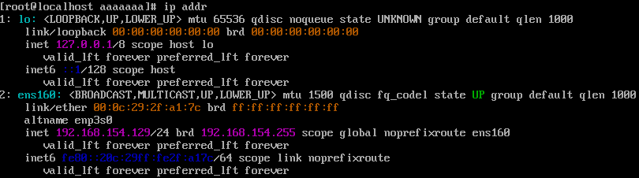

### 3. Kiểm tra trạng thái dịch vụ SSH
- Dịch vụ SSH trên CentOS 9 được gọi là `sshd`. Kiểm tra trạng thái của nó:
```plaintext
sudo systemctl status sshd
```
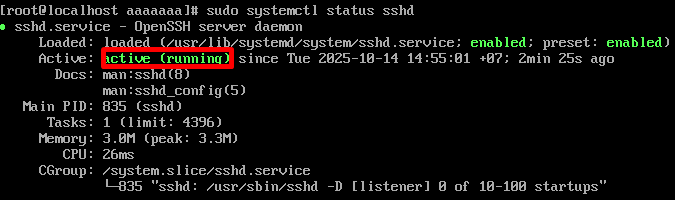

- Đảm bảo trạng thái là active (running).
- Nếu chưa chạy khởi động dịch vụ SSH: `sudo systemctl start sshd`
- Kích hoạt dịch vụ để tự động chạy khi khởi động: `sudo systemctl enable sshd`

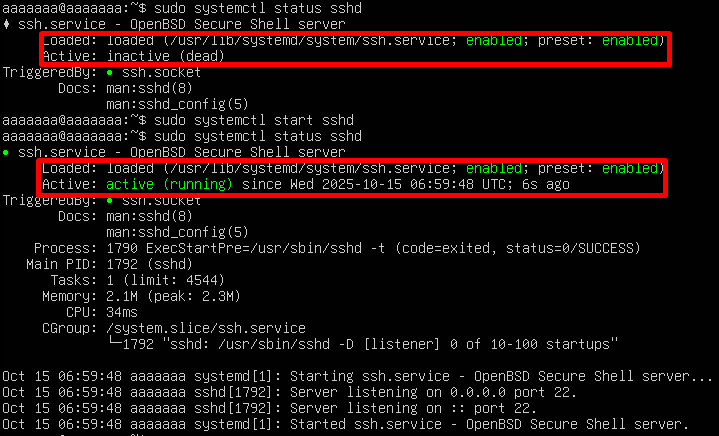

### 4. Xem cấu hình Firewall
- Kiểm tra xem cổng SSH(mặc định 22) có mở không: `sudo firewall-cmd --list-all`

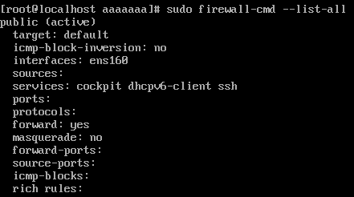

- Nếu có dòng `ssh` trong danh sách services là OK.
- Nếu cổng 22 chưa được mở, thêm dịch vụ SSH:
```plaintext
sudo firewall-cmd --permanent --add-service=ssh
sudo firewall-cmd --reload
```
- Thực hiện kiểm tra lại list: `sudo firewall-cmd --list-all`
- Kiểm tra firewall(nếu sử dụng UFW): `sudo ufw status`
- Nếu SSH không được phép, thêm nó:
```plaintext
sudo ufw allow ssh
sudo ufw reload
```
### 5. Cấu hình SSH-Client trên Ubuntu
- Mở terminal trên máy Ubuntu
- Kiểm tra và cài đặt OpenSSH Client nếu chưa có: `dpkg -l | grep openssh-server`
- Nếu thấy gói `openssh-server` trong danh sách, nó đã được cài đặt. Nếu không, cài đặt bằng:
```plaintext
sudo apt update
sudo apt install openssh-server
```
- Kiểm tra cổng 22 có đang lắng nghe không: `sudo ss -tuln | grep :22`

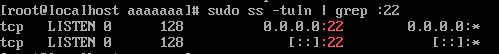

- SSH đang hoạt động trên cổng 22.

### 6. Kết nối SSH từ Ubuntu đến CentOS9
- Mở terminal chạy trên Ubuntu
`ssh root@192.168.154.129`
  - root: tài khoản root trên CentOS 9
  - 192.168.154.129: IP của máy CentOS 9

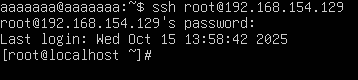

- Kết nối ngược lại từ CentOS 9 tới Ubuntu

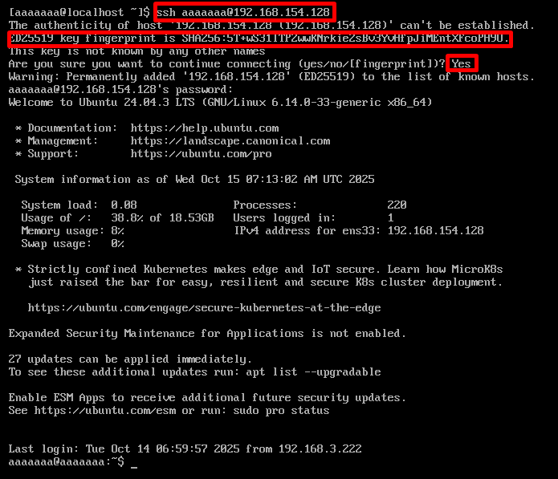

- Kết nối từ Windows tới CentOS 9

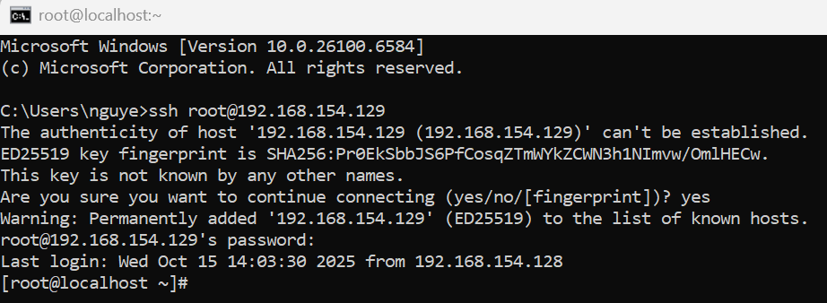

# Port SSH
## Chuyển port trên Ubuntu và CentOS 9
### 1. Kiểm tra SSH đang chạy trên cổng nào 
```plaintext
 sudo ss -tulnp | grep ssh 
```
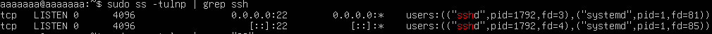

### 2. Mở file cấu hình SSH server để sửa cổng
```plaintext
 sudo nano /etc/ssh/sshd_config
```
Tìm dòng `#Port 22` xoá dấu # và đổi thành `Port 2222`
- Có thể chọn một cổng cao hơn, ví dụ 2222, 2223, 50022..., miễn là nó không bị xung đột với dịch vụ khác.
- Tránh các cổng phổ biến như 80, 443, 3306, 8080...

Nhấn `Ctrl O` - `Enter` - `Ctrl X` để lưu và thoát

### 3. Mở cổng trên Firewall
- Kiểm tra trạng thái firewall trên Ubuntu: `sudo ufw status` nếu không đc active thì active lên `sudo ufw enable`

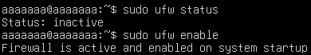

- Nếu chưa thiết lập quy tắc nào, hãy thêm các quy tắc cần thiết trước khi kích hoạt: `sudo ufw allow ssh`, `sudo ufw allow 22`, `sudo ufw allow 443`, `sudo ufw allow http`..., hoặc xoá bằng `sudo ufw delete allow 2222`, hoặc kiểm tra `sudo ufw status numbered` rồi xoá `sudo ufw delete numbers`
- Thêm cổng vừa thiết lập: `sudo ufw allow 2222/tcp`
- Kiểm tra

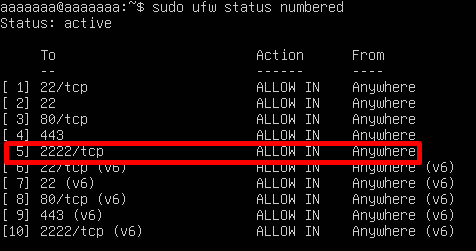

- **Trên CentOS 9**
```plaintext
sudo firewall-cmd --permanent --add-port=2222/tcp
sudo firewall-cmd --reload
```
- Kiểm tra lại trạng thái firewall:

`sudo firewall-cmd --list-ports`

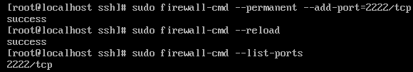

### 4. Khởi động lại SSH để áp dụng thay đổi
```plaintext
sudo systemctl restart sshd
```
- Kiểm tra lại xem ssh đã lắng nghe trên cổng 2222 chưa:
```plaintext
sudo ss -tulnp | grep ssh 
```
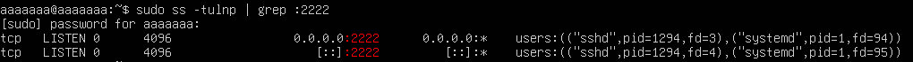

### 5. (Tuỳ chọn) - Chặn cổng 22 để tăng bảo mật
- Sau khi SSH trên cổng mới hoạt động, chặn cổng 22:
```plaintext
sudo firewall-cmd --permanent --remove-port=22/tcp
sudo firewall-cmd --reload
```
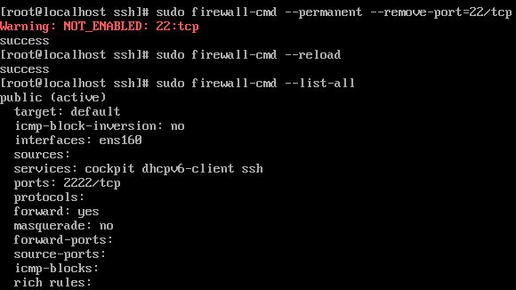

### 6. Thực hiện SSH
- Sử dụng lệnh để SSH vào máy chủ

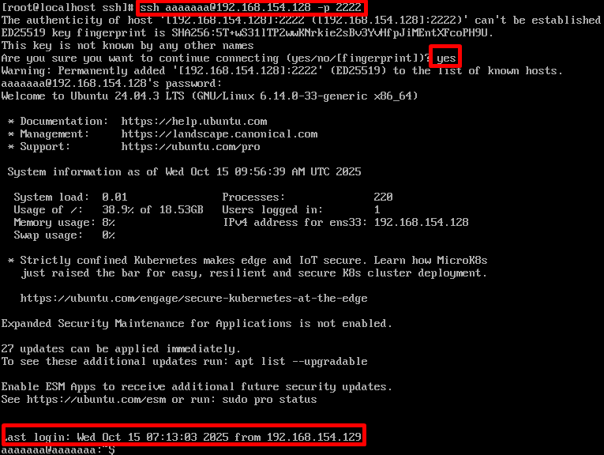

# Cấu hình không cho SSH bằng Root
- **Truy cập vào tài khoản root**
### 1. Chỉnh sửa file cấu hình SSH Server
- Mở file cấu hình
```plaintext
sudo vim /etc/ssh/sshd_config
```
- Tại dòng `PermitRootLogin`, bỏ dấu `#` và chuyển thành `prohibit-password` thành `no`

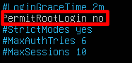

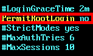
### 2. Restart SSH để áp dụng thay đổi
```plaintext
sudo systemctl restart ssh
```
### 3. Kiểm tra 
- Tại windows 
```plaintext
sh root@192.168.154.128 -p 2222
```
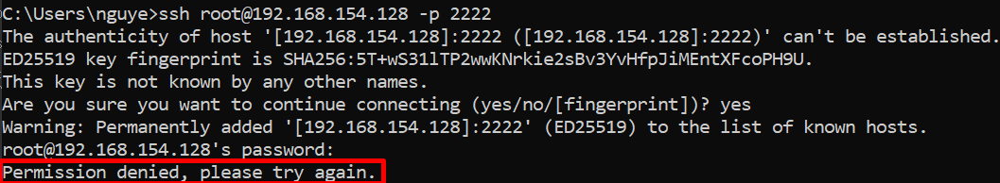

- **Lưu ý**: Ở CentOS 9 nếu bị lỗi, dùng câu lệnh `sudo sentenforce 0`
  - `setenforce` dùng để chuyển đổi chế độ hoạt động của SELinux giữa:

| Giá trị               | Chế độ           | Mô tả                                                |
| --------------------- | ---------------- | ---------------------------------------------------- |
| `1` hoặc `Enforcing`  | **Bật SELinux**  | SELinux kiểm soát và chặn hành vi vi phạm chính sách |
| `0` hoặc `Permissive` | **Tắt tạm thời** | SELinux chỉ ghi log, không chặn                      |
- Hoặc chỉnh trực tiếp tại `sudo nano /etc/selinux/config` chỉnh dòng `SELINUX=enforcing` -> `SELINUX=permissive`

- Nếu thấy lỗi `Permission denied` hoặc `Connection refused` -> OK
- Đăng nhập tài khoản thường
```plaintext
ssh aaaaaaa@192.168.154.128
```
- Khi đăng nhập, nếu cần quyền root, dùng:
```plaintext
su -
```
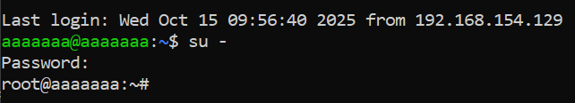
