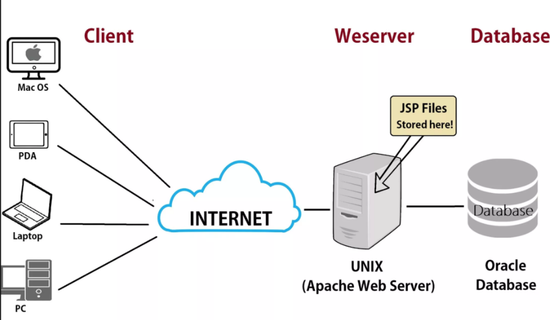
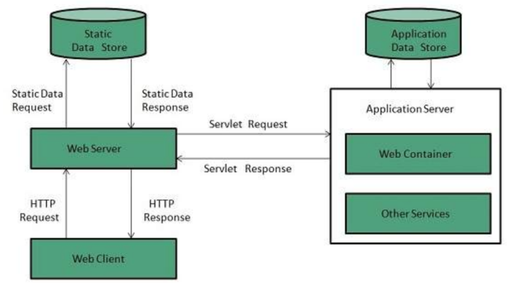

# Web Server
### 1. Khái niệm
Web Server (máy chủ web) là một phần mềm hoặc máy tính có nhiệm vụ lưu trữ, xử lý và phân phối nội dung web (HTML, CSS, JS, hình ảnh, video...) đến trình duyệt của người dùng qua giao thức HTTP hoặc HTTPS. 

### 2. Cấu trúc của Web Server
| Phần                     | Mô tả                                                                      |
| ------------------------ | -------------------------------------------------------------------------- |
| **Phần cứng (Hardware)** | Là máy tính vật lý hoặc máy ảo, có cấu hình mạnh, lưu trữ dữ liệu website. |
| **Phần mềm (Software)**  | Là chương trình xử lý yêu cầu web (ví dụ: NGINX, Apache, LiteSpeed, IIS).  |

### 3. Cách thức hoạt động của Web Server

- **Client gửi request**: Trình duyệt gửi một yêu cầu HTTP/HTTPS đến địa chỉ IP của máy chủ (ví dụ: `GET /index.html`).
- **DNS phân giải tên miền**: Tên miền (`example.com`) được chuyển thành địa chỉ IP của server.
  - Tìm kiếm ở trong cache
  - Gửi các yêu cầu tìm kiếm tới DNS Servers. ( Bất kì website nào đều phải đăng kkys địa chỉ IP khi tạo trên webserver)
- **Trình duyệt yêu cầu full URL**: Sau khi biết địa chỉ IP, trình duyệt yêu cầu full URL từ web server.
- **Kết nối TCP/SSL**: Trình duyệt thiết lập kết nối với web server qua cổng: 80 (HTTP),  443 (HTTPS)
- **Web Server nhận yêu cầu**: Phần mềm (NGINX, Apache...) đọc yêu cầu và xác định file hoặc dịch vụ cần trả về.
- **Xử lý yêu cầu**: Nếu là file tĩnh (HTML, ảnh, video): gửi thẳng về.
  - Nếu là nội dung động (PHP, Python, Node.js...): chuyển cho Application Server xử lý (qua CGI, FastCGI, proxy...).

  

- **Trả phản hồi (Response)**: Server gửi lại nội dung + mã trạng thái HTTP (ví dụ: `200 OK`, `404 Not Found`).
- **Client hiển thị nội dung**: Trình duyệt hiển thị trang web cho người dùng.

### 4. Chức năng của WebServer

- **Lưu trữ nội dung web**: Tài liệu HTML, CSS, JavaScript, hình ảnh, video…
- **Phản hồi yêu cầu HTTP/HTTPs**: Giao tiếp với trình duyệt của người dùng.
- **Phân phối nội dung tới người dùng và thực hiện các WebService**: Web Server gửi về các file hoặc dữ liệu cần thiết để trình duyệt hiển thị website cho người dùng cuối dưới dạng cả trang tĩnh lẫn trang động và thực hiện các dịch vụ web như truy xuất API để trích xuất **DATA** từ **DATABASE** or **Application Sever**
- **Xử lý tập lệnh động (Dynamic Content)**: Kết hợp với các ngôn ngữ lập trình (PHP, Python, Node.js, Java…) để xử lý nội dung động.
- **Bảo mật thông tin:** Hỗ trợ SSL/TLS để mã hóa dữ liệu truyền tải (HTTPS).
-**Ghi log & giám sát**: Theo dõi truy cập, ghi nhận lỗi và hiệu suất.

### 5. Web Server xử lý loại dữ liệu
| Loại dữ liệu      | Ví dụ                                    | Xử lý bởi                                           |
| ----------------- | ---------------------------------------- | --------------------------------------------------- |
| **File tĩnh**     | HTML, CSS, JS, PNG, JPG                  | Web Server (ví dụ NGINX)                            |
| **Nội dung động** | Trang PHP, Python Flask, Node.js Express | Application Server (chạy qua web server trung gian) |

https://www.linkedin.com/pulse/how-do-web-servers-work-priyanka-kumari/

### 6. Cơ chế tối ưu và bảo mật của WebSever

Quy trình này diễn ra rất nhanh (chỉ trong vài phần nghìn giây), cho phép Web Server xử lý đồng thời hàng ngàn yêu cầu từ nhiều người dùng khác nhau. Máy chủ web còn đảm bảo bảo mật, quản lý phiên và kết nối linh hoạt với nhiều dịch vụ khác để duy trì hiệu suất website ổn định vè để tối ưu được vậy thì WebSever phải sử dụng các giải pháp sau:

1. **Caching (Bộ nhớ đệm)**: Lưu trữ tạm thời các phản hồi để phục vụ lại nhanh hơn.

2. **Load Balancing (Cân bằng tải)**: Phân phối yêu cầu giữa nhiều máy chủ backend để giảm tải.

3. **SSL/TLS Encryption:** Mã hóa thông tin bằng HTTPS để bảo mật dữ liệu.

4. **Access Control (Kiểm soát truy cập)**: Xác thực người dùng, giới hạn IP truy cập.

5. **Logging & Monitoring**: Ghi nhật ký yêu cầu (Access log, Error log) để theo dõi hoạt động.

### 7. Các loại WebSever phổ biến

- **Apache HTTP server**: Apache là web server được sử dụng rộng rãi nhất thế giới. Apache được phát triển và duy trì bởi một cộng đồng mã nguồn mở dưới sự bảo trợ của Apache Software Foundation. Apache được phát hành với giấy phép Apache License là được sử dụng tự do, miễn phí.

- **Nginx**: là một web server nhẹ, không chiếm nhiều tài nguyên của hệ thống. Nginx còn là một reserse proxy mã nguồn mở. Nginx khá là ổn định, cấu hình đơn giản và hiệu suất cao.

- **Internet Information Services (IIS)**: IIS do Microsoft phát triển, sản phẩm này được tích hợp cùng với hệ điều hành Windows Server. Trong IIS bao gồm nhiều dịch vụ như: dịch vụ Web Server, dịch vụ FTP Server.

**Apache Tomcat**: là một Java Servlet được phát triển bởi Apache Software Foundation. Tomcat thực thi các ứng dụng Java Servlet và JavaServer Pages (JSP). Tomcat cung cấp một máy chủ HTTP cho ngôn ngữ Java thuần túy.

**Lighttpd**: là một phần mềm mã nguồn mở, an toàn và linh hoạt, đặc biệt miễn phí và được phân phối theo giấy phép BSD. Lighttpd được viết bởi Jan Kneschke. Lighttpd chiếm ít tài nguyên, memory thấp, CPU nhỏ. Lighttpd được phát triển bằng ngôn ngữ C. chạy trên hệ điều hành Linux, Windows, Mac OS,…

### 8. So sánh giữa 2 loại WebSever phổ biến nhất hiện nay Apache và Nginx

| Tiêu chí | Apache | Nginx |
|-----------|-------------|---------|
| Hiệu suất | Tốt với nội dung động. | Tốt với nội dung tĩnh, tốc độ cao. |
| Cách xử lý | Quy trình (Process-based). | Sự kiện (Event-based). |
| Tính linh hoạt | Hỗ trợ nhiều module. | Ít module hơn, tối ưu hơn. |
| Dễ cấu hình | Cấu hình linh hoạt. | Cấu hình phức tạp hơn. |
| Ứng dụng phổ biến | Hosting PHP, WordPress. | Proxy ngược, CDN, microservices. |