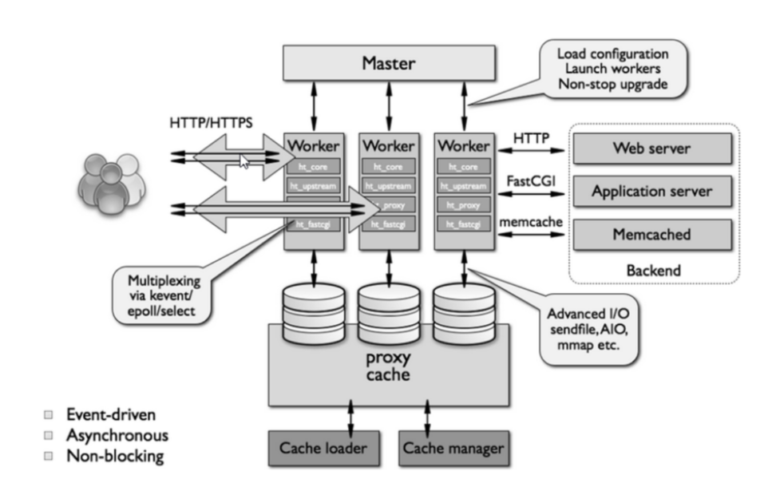
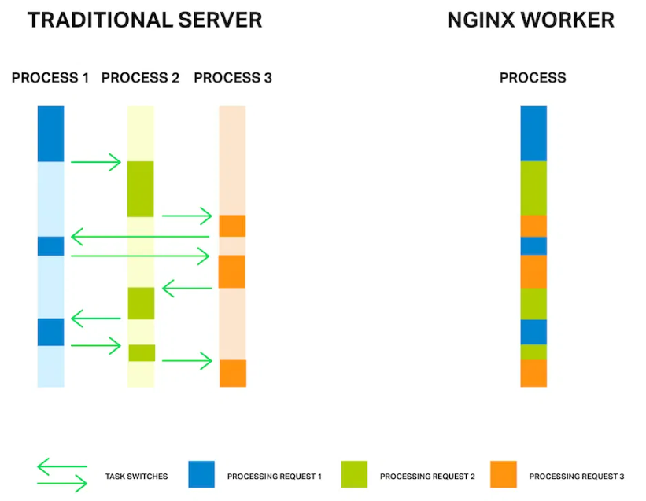
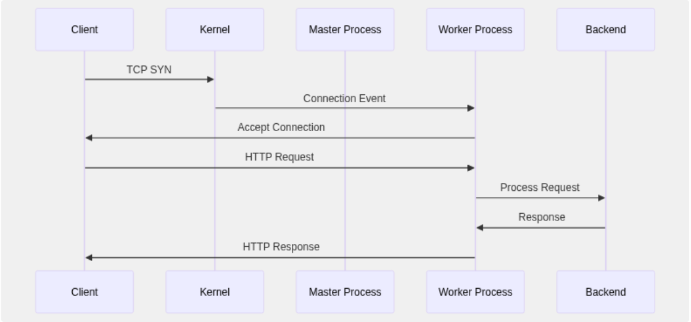

# NGINX
### 1. Khái niệm Nginx
**Nginx** (Engine-X) là một máy chủ **web server** mã nguồn mở, dùng để:
- Phục vụ **web tĩnh (HTML, CSS, JS, ảnh, video,...)**
- Làm **reverse proxy**(chuyển tiếp request đến backend như Node.js, PHP-FPM,...)
- Làm **load balancer** (cân bằng tải giữa nhiều server)
- Làm **HTTP cache**
- Làm **mail proxy(SMTP, IMAP, POP3)**
- Nginx còn là 1 trong số ít những máy chủ được viết để giải quyết vấn đề C10K.
### 2. Cơ chế hoạt động của Nginx

#### 2.1 Master Process
- Master process là tiến trình trung tâm điều khiển toàn bộ Nginx, nhưng không xử lý request trực tiếp.
  - **Đọc & kiểm tra file cấu hình** (`nginx.conf`), xác thực cú pháp.
  - **Khởi tạo socket lắng nghe** (mở cổng 80, 443, …).
  - **Tạo (fork) các worker process** sau khi cấu hình đã hợp lệ.
  - **Quản lý vòng đời của worker**:
    - Reload (nạp lại cấu hình mà không cần dừng dịch vụ).
    - Restart (khi worker chết).
    - Stop/shutdown khi nhận tín hiệu (`SIGTERM`, `SIGHUP`, …).

Master chỉ điều phối — không “gửi phản hồi” cho client.

#### 2.2 Worker process
- Mỗi worker là một tiến trình OS (process), thường chạy single-threaded để giữ đơn giản cho event loop, dùng một event loop (vòng lặp sự kiện) để xử lý rất nhiều kết nối đồng thời.
- Mỗi worker chạy vòng lặp sự kiện riêng, gọi kernel để biết socket nào có event (readable/writable) rồi xử lý.
- Thường ta đặt `worker_processes` ≈ số lõi CPU.
- `worker_connections`: Số kết nối đồng thời tối đa mà một worker có thể quản lý
- Nó dựa trên cơ chế **I/O không đồng bộ** như:
  - `epoll` (Linux),
  - `kqueue` (FreeBSD),
  - `select` hoặc `poll` (trên hệ khác).

**Cách Worker nhận request**
- Tất cả worker chia sẻ cùng một socket lắng nghe (do master tạo).
- Khi có kết nối mới, Nginx dùng cơ chế `accept_mutex` để tránh việc nhiều worker cùng tranh accept() một lúc (“thundering herd problem”).
- Một worker sẽ nhận request, xử lý toàn bộ vòng đời (read request → xử lý module → gửi response).
- Sau đó, nó quay lại event loop để xử lý kết nối khác.
#### 2.3 Cache
Cache giúp tăng tốc độ phản hồi và giảm tải cho backend.
- Lần đầu tiên client yêu cầu một tài nguyên (ví dụ `/news.html`), Nginx proxy request đó đến backend (PHP, API, ...).
- Nginx lưu bản sao của response vào bộ nhớ đệm (`proxy_cache_path`, `proxy_cache_key` chỉ định nơi lưu).
- Những lần sau, nếu cùng URI được yêu cầu lại và cache chưa hết hạn (`proxy_cache_valid`), Nginx phục vụ trực tiếp từ cache mà không cần hỏi backend.

**Loại cache**: 
  - **Memory cache (RAM)**: cực nhanh, lưu tạm trong worker.
  - **Disk cache**: chậm hơn nhưng lưu được lâu hơn, dùng khi dữ liệu lớn
#### 2.4 Request/Response

Nginx sử dụng kiến trúc bất đồng bộ dựa trên sự kiện (event-based), nghĩa là nó không tạo ra một luồng (thread) riêng cho mỗi yêu cầu như Apache hoặc IIS, mà quản lý các kết nối theo sự kiện, giúp nó có thể xử lý nhiều yêu cầu cùng lúc mà không gây tắc nghẽn.
-  **Apache và IIS (đa luồng)**: Với các máy chủ như Apache, mỗi khi có một yêu cầu (request) từ người dùng, máy chủ sẽ tạo ra một luồng (thread) hoặc một tiến trình riêng (process) để xử lý yêu cầu đó. Mỗi kết nối sẽ chiếm một phần tài nguyên hệ thống (CPU, bộ nhớ), và khi số lượng yêu cầu lớn (ví dụ: hàng ngàn kết nối đồng thời), máy chủ có thể bị quá tải, gây tắc nghẽn và chậm chạp.
- **Nginx (bất đồng bộ)**: Nginx không tạo ra một luồng riêng cho mỗi yêu cầu mà sử dụng một cơ chế gọi là **event loop (vòng lặp sự kiện)**. Với cơ chế này, một luồng chính của Nginx sẽ lắng nghe tất cả các sự kiện (yêu cầu từ người dùng) và phản hồi lại dựa trên từng sự kiện, thay vì phải tạo ra luồng riêng. Điều này giúp Nginx có thể xử lý hàng ngàn kết nối đồng thời mà không cần tăng thêm tài nguyên nhiều như Apache.

#### 2.5 Luồng xử lý một kết nối (lifecycle)

- **TCP handshake** (kernel xử lý SYN/SYN-ACK). Sau khi connection established, kết nối nằm trong accept queue của socket. Worker sẽ accept() khi được kernel báo. 
- **Read request**: worker nhận dữ liệu vào buffer (non-blocking).
- **Parse request**: phân tích request line, headers.
- **Route/Location matching**: Nginx so khớp URI với cấu hình server / location để xác định handler phù hợp.
(`http://example.com/products/item1?color=red`, URI = `/products/item1?color=red` phần đường dẫn + tham số)
- **Phases xử lý Request**: request đi qua một chuỗi các phases (rewrite → post-rewrite → access → try_files / content → log, v.v.), mỗi phase có thể có nhiều handlers do các module đăng ký. Tại phase content sẽ gọi handler trả nội dung (static file, proxy_pass → backend, FastCGI, ê.). 
- **Các Module xử lý Content (Content Handlers)**

|Module|Chức năng|
|------|---------|
|`ngx_http_static_module`|"Phục vụ file tĩnh (HTML, CSS, JS)"|
|`ngx_http_proxy_module`|"Reverse proxy đến backend (Node.js, PHP, etc.)"|
|`ngx_http_fastcgi_module`| Chuyển request đến PHP-FPM |
|`ngx_http_uwsgi_module`| uWSGI (Python) |
|`ngx_http_grpc_module` |gRPC proxy |
|`ngx_http_memcached_module`|Lấy dữ liệu từ Memcached|

- **Ghi response:** nội dung được ghi trả về client (không đồng bộ — dùng send buffers, có thể chunked).
- **Reverse Proxy & Load Balancing**: 
  - Client → Nginx
  - Nginx mở kết nối mới đến backend (hoặc dùng keepalive pool)
  - Chuyển request → nhận response → trả về client
  - Không cần buffer toàn bộ → streaming (hiệu quả với file lớn)
- **Keep-alive / Connection close**: giữ kết nối mở nếu client/server đồng ý keepalive; worker sẽ quản lý timeout (keepalive_timeout) trước khi đóng.
- **Event loop**:
  - Lắng nghe tất cả các kết nối trong 1 vòng lặp
  - Khi có ai đó gửi dữ liệu, nó ghi nhận sự kiện đó.
  - Xử lý phần việc cần làm( ví dụ gửi file HTML về).
  - Rồi quay lại vòng lặp để xem ai khác cần phục vụ
  - Lặp lại liên tục, **non-blocking I/O** — tức là không chờ một người xong rồi mới tới người khác.
