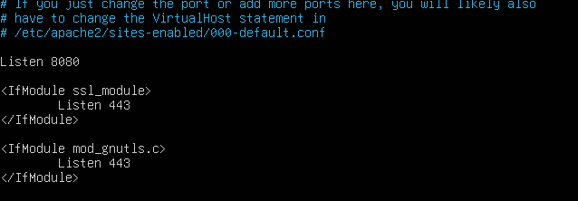
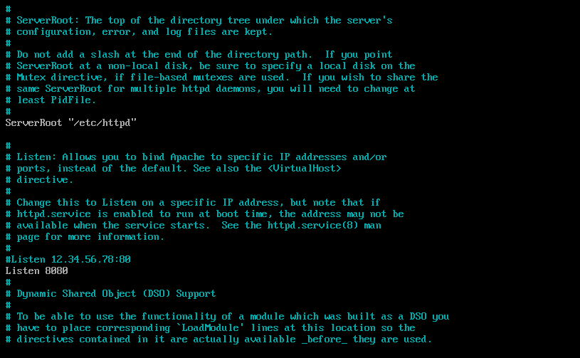
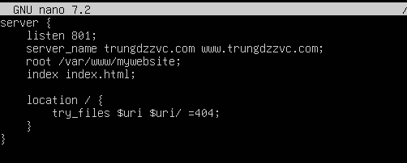

# CÁC BƯỚC ĐỔI PORT MẶC ĐỊNH CHẠY APACHE
## Apache2
- Nếu máy bạn duy trì nhiều web service, việc thay đổi port là cần thiết để tránh bị trùng lặp - gây ra lỗi.
### Ubuntu
```plaintext
sudo nano /etc/apache2/ports.conf
```
- Thay bằng Port khác:



- Chỉnh sửa trong file virtualhost: `sudo nano /etc/apache2/sites-available/name.conf`

```plaintext
<VirtualHost *:8080>
```

- Restart Apache:
```plaintext
sudo systemctl restart apache2
```

### CentOS 
```plaintext
sudo nano /etc/httpd/conf/httpd.conf
```
- Thay bằng port khác



- Chỉnh sửa trong file virtualhost: `sudo nano /etc/httpd/sites-available/name.conf`

```plaintext
<VirtualHost *:8080>
```

- Restart Apache:
```plaintext
sudo systemctl restart httpd
```

### Lưu ý quan trọng
- Bạn có thể Listen bao nhiêu cổng tùy thích. Ví dụ
```plaintext
Listen 8080
Listen 8008
```
- SELinux không cho httpd listen port lạ
- Trên CentOS/RHEL/Fedora, httpd CHỈ ĐƯỢC PHÉP chạy trên các port đã được SELinux đánh dấu là http_port_t.
Mặc định SELinux chỉ cho phép:

80

443

8080

8008

8443
- Nếu thêm `Listen 801`: lỗi ngay lập tức "could not bind to address"
#### Cách sửa nếu bạn muốn thêm Permission cho Port trong SELinux
**Cài đặt `semanage`**
```plaintext
sudo dnf install policycoreutils-python-utils
```

**Kiểm tra port được phép**
```plaintext
sudo semanage port -l | grep http
```

**Thêm Port**
```plaintext
sudo semanage port -a -t http_port_t -p tcp 801
```

**Nếu port đã tồn tại nhưng sai type**
```plaintext
sudo semanage port -m -t http_port_t -p tcp 801
```
## Nginx
Thuộc SELinux domain: httpd_t như Apache nhưng CentOS mặc định thêm nhiều rule cho Nginx hơn, cho phép listen nhiều port
| Web Server | File khai báo port                                                                             |
| ---------- | ---------------------------------------------------------------------------------------------- |
| **Apache** | `/etc/httpd/conf/ports.conf` + VirtualHost                                                     |
| **Nginx**  | **Không có ports.conf** → port nằm trong từng file server block tại `/etc/nginx/conf.d/*.conf` |

- Bạn chỉ cần chỉnh trong các file
```plaintext
/etc/nginx/conf.d/*.conf
```

