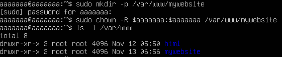
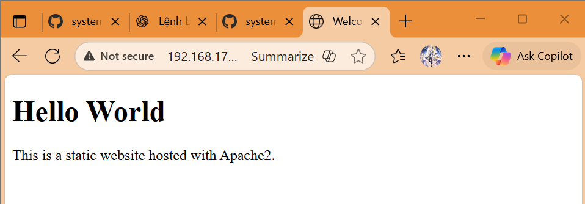

# CONFIG STATIC WEB
## I. Tổng quan
Mặc định, Apache sử dụng thư mục `/var/www/html/` để lưu trữ website( hay còn gọi **website mặc định**). Có thể tạo một trang web và add nội dung tĩnh trong thư mục này hoặc cấu hình thư mục riêng.

Thông thường, website sẽ ưu tiên chạy vào file có trên index (ví dụ: `index.html`, `index.css`, `index.js`)

VD: Trong folder html có 3 file html như: `dashboard.html`, `card.html`, `index.html` thì khi đứng tại thư mục dashboard trên trình duyệt, file `index.html` sẽ được hiển thị.

## II. Các bước cấu hình 1 web tĩnh
### 1. Trên Ubuntu
#### 1. Cài sẵn 1 webserver ở trên Ubuntu.
#### 2. Tạo thư mục chứa file tĩnh
```plaintext
sudo mkdir -p /var/www/mywebsite
```
- Phân quyền cho User hiện tại:
```plaintext
sudo chown -R $Aaaaaaa:$root /var/www/mywebsite
```


#### 3. Tạo file chứa nội dung web tĩnh
```plaintext
sudo touch /var/www/mywebsite/index.html
```
#### 4. Tạo file Virtual Host riêng
Apache mặc định có site /etc/apache2/sites-available/000-default.conf. Ta tạo site riêng để quản lý dễ hơn:
```plaintext
sudo nano /etc/apache2/sites-available/mywebsite.conf
```

Thêm nội dung
```html
<VirtualHost *:8080>
    ServerAdmin admin@mywebsite.com
    ServerName mywebsite.com
    Server Alias www.mywebsite.com
    DocumentRoot /var/www/mywebsite

    <Directory /var/www/mywebsite>
        Options Indexes FollowSymLinks
        AllowOVerride None
        Require all granted
    </Directory>
    
    ErrorLog ${APACHE_LOG_DIR}/mywebsite_error.log
    CustomLog ${APACHE_LOG_DIR}/mywebsite_access.log combined
</VirtualHost>
```
#### 5. Kích hoạt website `mywebsite` và tắt site mặc định
```plaintext
sudo a2ensite mywebsite.conf
sudo a2dissite 000-default.conf
sudo systemctl reload apache2
```
#### 6. Kiểm tra cấu hình trước khi khởi động lại
```plaintext
sudo apache2ctl configtest
```
#### 7. Check firewall (ufw)
- Kiểm tra xem apache2 đang nghe port nào: sudo apache2ctl -S
```plaintext
sudo ufw allow 8080/tcp
sudo systemctl restart apache2
```

#### 8. Kiểm tra hoạt động


#### 9. Cấu hình Website theo cấu trúc thư mục chuẩn cho web tĩnh
```plaintext
/var/www/mywebsite/
├── index.html
├── css/
│   └── style.css
├── js/
│   └── script.js
└── images/
    └── logo.png
```
### 2. Trên CentOS 9
#### 1. Tạo thư mục chứa website tĩnh
```plaintext
sudo mkdir -p /var/www/mywebsite
```

Phân quyền để dễ chỉnh sửa và bảo mật

```plaintext
sudo chown -R $root:$root /var/www/mywebsite
```
#### 2. Tạo file `index.html`
```plaintext
sudo touch /var/www/mywebsite/index.html
sudo nano /var/www/mywebsite/index.html
```
#### 3. Tạo file cấu hình Virtual Host
Trên CentOS, file cấu hình Apache mặc định nằm ở: `/etc/httpd/conf.d/`

Tạo file mới: 
```plaintext
sudo touch /etc/httpd/conf.d/mywebsite.conf
sudo nano /etc/httpd/conf.d/mywebsite.conf
```
Chỉnh sửa theo nội dung
```html
<VirtualHost *:8080>
    ServerAdmin admin@mywebsite.com
    ServerName mywebsite.com
    ServerAlias www.mywebsite.com
    DocumentRoot /var/www/mywebsite

    <Directory /var/www/mywebsite>
        Options Indexes FollowSymLinks
        AllowOverride None
        Require all granted
    </Directory>

    ErrorLog /var/log/httpd/mywebsite_error.log
    CustomLog /var/log/httpd/mywebsite_access.log combined
</VirtualHost>
```
#### 4. Kiểm tra cấu hình Apache
```plaintext
sudo apachectl configtest
```
#### 5. Khởi động lại Apache
```plaintext
sudo systemctl restart httpd
```
#### 6. Mở cổng tường lửa( firewall)
```bash
sudo firewall-cmd --permanent --add-service=http
sudo firewall-cmd --permanent --add-service=https
sudo firewall-cmd --reload
```
