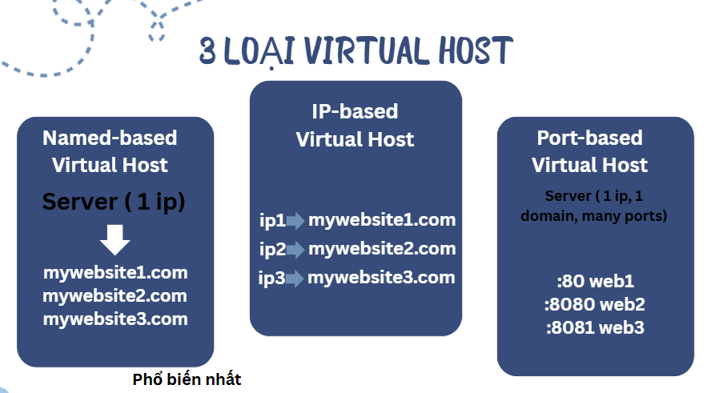

# I. Tìm hiểu về Virtual Host
### 1. Khái niệm

Virtual Host (Máy chủ Ảo) là một phương thức cấu hình trên máy chủ web (như Apache, Nginx) cho phép một máy chủ vật lý hoặc máy chủ ảo duy nhất có thể chạy và quản lý nhiều website hoặc tên miền khác nhau một cách độc lập.

Khi một yêu cầu truy cập đến máy chủ, máy chủ sẽ dùng tên miền để xác định và chuyển hướng đến đúng trang web cụ thể. Đây là giải pháp hiệu quả về chi phí và tài nguyên để quản lý nhiều website. 

### 2. Chức năng chính của Virtual Hosts
- **Phân biệt và định tuyến yêu cầu**: Dựa vào tên miền, địa chỉ IP hoặc cổng trong yêu cầu truy cập từ người dùng (client), web server sẽ xác định Virtual Host nào chịu trách nhiệm xử lý và trả về nội dung website tương ứng.
- **Quản lý tài nguyên**: 
  - Tận dụng tối đa phần cứng: Thay vì mua nhiều máy chủ riêng biệt cho mỗi website, bạn chỉ cần một máy chủ duy nhất để chạy nhiều trang web.
  - Tiết kiệm địa chỉ IP (Name-based Virtual Host): Hầu hết các Virtual Host dựa trên tên miền chỉ cần một địa chỉ IP công cộng duy nhất cho hàng trăm website.
- **Phục vụ nội dung độc lập**: Mỗi Virtual Host có thể có thư mục chứa mã nguồn (document root), file log và các thiết lập cấu hình riêng biệt.

### 3. Phân loại

#### 3.1 Name-Based Virtual Host
Nhiều tên miền khác nhau cùng trỏ về một địa chỉ IP duy nhất của máy chủ. 

Khi web server nhận được yêu cầu, nó sẽ kiểm tra trường `Host header` trong gói tin HTTP để xác định tên miền mà client yêu cầu và phục vụ website tương ứng.

#### 3.2 IP-based Virtual Host
Mỗi website (hoặc Virtual Host) được gán một địa chỉ IP riêng biệt. Web server sẽ dựa vào địa chỉ IP đích của yêu cầu để xác định website cần phục vụ.

Rất tốn kém tài nguyên địa chỉ IP. Hiện nay ít được sử dụng cho các website công cộng do sự khan hiếm địa chỉ IPv4.
#### 3.3 Port-Based Virtual Host
Các website khác nhau chia sẻ cùng một địa chỉ IP (và có thể cùng tên miền) nhưng được truy cập qua các cổng (port) khác nhau.

Ví dụ:
```bash
http://example.com:80 cho website A  
http://example.com:8080 cho website B.
```
### 4. Cơ chế hoạt động của VirtualHosts


**A. Phân giải DNS**
- Người dùng nhập Tên miền (ví dụ: `websiteA.com`) vào trình duyệt.
- Trình duyệt truy vấn hệ thống DNS để tìm địa chỉ IP công cộng của tên miền đó.
- DNS trả về cùng một địa chỉ IP cho tất cả các tên miền (ví dụ: `websiteA.com`, `websiteB.net`) được lưu trữ trên máy chủ đó.

**Yêu cầu HTTP/HTTPS**
- Trình duyệt tạo một yêu cầu kết nối đến địa chỉ IP đã nhận được ở Bước A.
- Trong tiêu đề của yêu cầu HTTP/HTTPS, trình duyệt bắt buộc phải gửi kèm thông tin tên miền mà người dùng muốn truy cập. Đây được gọi là tiêu đề Host.
 
 Ví dụ:
```plaintext
GET /index.html HTTP/1.1
Host: websiteA.com
User-Agent: ...
```

**Điều hướng nội bộ(Xử lý Web Server)**
- **Tiếp nhận yêu cầu**: Web Server (Apache/Nginx) nhận yêu cầu kết nối đến cổng 80 (HTTP) hoặc 443 (HTTPS) trên địa chỉ IP chung.
- **Kiểm tra tiêu đề Host**: Web Server tiến hành đọc và phân tích tiêu đề Host trong yêu cầu.
- **So khớp cấu hình**: Web Server so sánh tên miền nhận được (ví dụ: `websiteA.com`) với danh sách các Virtual Host đã được cấu hình trước.
- **Điều hướng**: 
  - Khi tìm thấy cấu hình Virtual Host phù hợp (Ví dụ: `Virtual Host cho websiteA.com`), Web Server sẽ sử dụng các thiết lập của Virtual Host đó.
  - Nó sẽ tìm đến Thư mục Gốc (Document Root) cụ thể được chỉ định cho `websiteA.com` (ví dụ: `/var/www/html/websiteA`).
- **Phản hồi**: Web Server lấy nội dung (ví dụ: index.html) từ thư mục đó và gửi lại phản hồi cho trình duyệt.
### 5. Ưu điểm của Virtual Hosts
- Tiết kiệm chi phí và tài nguyên: Virtual Host cho phép chạy nhiều website trên cùng một máy chủ vật lý hoặc địa chỉ IP, giúp tối ưu hóa việc sử dụng tài nguyên và giảm chi phí so với việc thuê nhiều máy chủ riêng biệt.
- Tiết kiệm chi phí và tài nguyên: Virtual Host cho phép chạy nhiều website trên cùng một máy chủ vật lý hoặc địa chỉ IP, giúp tối ưu hóa việc sử dụng tài nguyên và giảm chi phí so với việc thuê nhiều máy chủ riêng biệt.
- Quản lý tập trung, linh hoạt: Dễ dàng quản lý nhiều website từ một server duy nhất, thuận tiện cho việc thêm, bớt hoặc chỉnh sửa các website mà không ảnh hưởng đến hạ tầng vật lý.
- Tối ưu hóa hiệu suất: Nếu cấu hình hợp lý, Virtual Host giúp phân bổ lưu lượng truy cập và tài nguyên giữa các website, tăng hiệu suất và độ tin cậy của máy chủ.
- Dễ dàng bảo trì và sao lưu: Việc tổ chức mã nguồn và dữ liệu theo từng thư mục riêng biệt giúp đơn giản hóa quá trình bảo trì, sao lưu và phục hồi dữ liệu.
- Mở rộng dễ dàng: Khi cần phát triển thêm website mới, chỉ cần tạo thêm Virtual Host mà không phải thay đổi hạ tầng hoặc đầu tư thêm máy chủ mới.

### 6. Phân biệt Server, Host, Virtual Host và VPS

| **Khái niệm** | **Định nghĩa** | **Đặc điểm chính** | **Mối quan hệ** |
|----------------|----------------|--------------------|-----------------|
| **Server (Máy chủ)** | Một máy tính (vật lý hoặc ảo) mạnh mẽ, được thiết kế để lưu trữ, xử lý và cung cấp dữ liệu hoặc dịch vụ cho các máy tính khác (clients) qua mạng. | Cung cấp tài nguyên và dịch vụ. | Là nền tảng vật lý hoặc hạ tầng cơ bản. |
| **Host (trong hosting)** | Thường dùng để chỉ hành động hoặc dịch vụ cung cấp không gian lưu trữ và tài nguyên cần thiết để một website có thể hoạt động trên Internet. | Có thể là *shared hosting*, *VPS hosting*, *dedicated server hosting*. | Là dịch vụ được cung cấp trên một Server. |
| **VPS (Máy chủ riêng ảo)** | Một môi trường máy chủ ảo được tạo ra bằng cách phân chia một máy chủ vật lý thành nhiều máy chủ ảo độc lập. | Có tài nguyên riêng biệt, hệ điều hành riêng và quyền quản trị cao nhất (*root/administrator*). | Một Server vật lý có thể chứa nhiều VPS. VPS là một lựa chọn phổ biến để người dùng có toàn quyền cấu hình Virtual Hosts. |
| **Virtual Host** | Một cấu hình phần mềm trên web server cho phép một Server hoặc một VPS phục vụ nhiều website/tên miền khác nhau. | Không phải là một máy chủ vật lý hay VPS riêng biệt. Là một thiết lập logic trên web server. | Được cấu hình bên trong một web server chạy trên một Server vật lý hoặc một VPS. Mỗi VPS/Server có thể cấu hình nhiều Virtual Hosts. |
# II. Cấu hình Virtual Host trong Apache (Cấu hình nhiều website trên 1 web server)
## 1. Trên Ubuntu
#### 1. Tạo thư mục cấu trúc
- Cấu trúc thư mục sẽ lưu trữ dữ liệu của người dùng khi truy cập vào website. Bạn cần tạo thư mục gốc(`/var/www/directory`) cho mỗi tên miền, ví dụ: `mywebsite1.com` và `mywebsite2.com`:
```plaintext
sudo mkdir -p /var/www/mywebsite1.com
sudo mkdir -p /var/www/mywebsite1.com
```
#### 2. Cấp quyền truy cập
```plaintext
sudo chown -R $Aaaaaaa:$Aaaaaaa /var/www/mywebsite1.com
sudo chown -R $Aaaaaaa:$Aaaaaaa /var/www/mywebsite2.com
sudo chmod -R 755 /var/www
```
#### 3. Tạo file `index.html`
```plaintext
sudo touch /var/www/mywebsite1/index.html
sudo touch /var/www/mywebsite2/index.html
```
#### 4. Tạo file cấu hình cho VirtualHosts
Apache mặc định có site `/etc/apache2/sites-available/000-default.conf`. Ta tạo site riêng để quản lý dễ hơn:

```plaintext
sudo nano /etc/apache2/sites-available/mywebsite1.conf
sudo nano /etc/apache2/sites-available/mywebsite2.conf
```
- Thêm nội dung ở `mywebsite1.com`
```html
<VirtualHost *:8080>
    ServerAdmin admin@mywebsite1.com
    ServerName mywebsite1.com
    ServerAlias www.mywebsite1.com
    DocumentRoot /var/www/mywebsite1.com

    <Directory /var/www/mywebsite1.com>
        Options Indexes FollowSymLinks
        AllowOverride None
        Require all granted
    </Directory>

    ErrorLog ${APACHE_LOG_DIR}/mywebsite1_error.log
    CustomLog ${APACHE_LOG_DIR}/mywebsite1_access.log combined
</VirtualHost>
```
- Thêm nội dung ở `mywebsite2.com`
```html
<VirtualHost *:8080>
    ServerAdmin admin@mywebsite2.com
    ServerName mywebsite2.com
    ServerAlias www.mywebsite2.com
    DocumentRoot /var/www/mywebsite2.com

    <Directory /var/www/mywebsite2.com>
        Options Indexes FollowSymLinks
        AllowOverride None
        Require all granted
    </Directory>

    ErrorLog ${APACHE_LOG_DIR}/mywebsite2_error.log
    CustomLog ${APACHE_LOG_DIR}/mywebsite2_access.log combined
</VirtualHost>
```

#### 5. Kích hoạt VirtualHost
- **Chạy lệnh cấu hình**
```plaintext
sudo a2ensite mywebsite1.conf
sudo a2ensite mywebsite2.conf
```
- `a2ensite`: viết tắt của "Apache 2 enable site".
tạo các liên kết tượng trưng (symbolic links) từ các tệp cấu hình Virtual Host trong thư mục `/etc/apache2/sites-available/` đến thư mục `/etc/apache2/sites-enabled/`.
- Apache chỉ đọc các tệp cấu hình trong thư mục `sites-enabled/`, do đó, việc tạo liên kết tượng trưng này kích hoạt cấu hình Virtual Host.
- Tắt site mặc định( Nếu cần):
```plaintext
sudo a2dissite 000-default.conf
```
- **Cho phép tường lửa nếu bị chặn**:
```bash
sudo ufw allow 801/tcp
```
- Kiểm tra lỗi cú pháp:
```plaintext
sudo apachectl configtest
```
- Khởi động lại Apache:
```plaintext
sudo systemctl restart apache2
```
#### 6. Cấu hình file hosts(Trên máy cục bộ vì truy cập website tại đó hoặc trên con VM)
**Trên máy cục bộ (Windows)**:

Mở file `C:\Windows\System32\drivers\etc\hosts` trên Notepad với quyền Admin.

Thêm vào cuối file
```bash
192.168.60.133 mywebsite1.com
192.168.60.133 mywebsite2.com
```
## 2. Trên CentOS 9
#### 1. Active Apache
```plaintext
sudo dnf update -y
sudo dnf install httpd -y
sudo systemctl enable --now httpd
sudo systemctl status httpd
```
#### 2. Tạo thư mục web + phân quyền
```plaintext
sudo mkdir -p /var/www/mywebsite1.com
sudo mkdir -p /var/www/mywebsite2.com
sudo chown -R Aaaaaaa:root /var/www/mywebsite1.com
sudo chown -R Aaaaaaa:root /var/www/mywebsite2.com
sudo chmod -R 755 /var/www
```
#### 3. Tạo file cấu hình VirtualHost
Trên CentOS, file cấu hình Apache mặc định nằm ở: /`etc/httpd/conf.d/`.Ta tạo 2 file conf của 2 website cho ta dễ quản lí :
```bash
sudo touch /etc/httpd/conf.d/mywebsite1.com.conf
sudo nano /etc/httpd/conf.d/mywebsite1.com.conf
```
Thêm nội dung:
```apache
<VirtualHost *:8080>
    ServerAdmin admin@mywebsite1.com
    ServerName mywebsite1.com
    ServerAlias www.mywebsite1.com
    DocumentRoot /var/www/mywebsite1.com

    <Directory /var/www/mywebsite1.com>
        Options Indexes FollowSymLinks
        AllowOverride None
        Require all granted
    </Directory>

    ErrorLog /var/log/httpd/mywebsite1_error.log
    CustomLog /var/log/httpd/mywebsite1_access.log combined
</VirtualHost>
```
```bash
sudo touch /etc/httpd/conf.d/mywebsite2.com.conf
sudo nano /etc/httpd/conf.d/mywebsite2.com.conf
```
Thêm nội dung:
```apache
<VirtualHost *:8080>
    ServerAdmin admin@mywebsite1.com
    ServerName mywebsite1.com
    ServerAlias www.mywebsite1.com
    DocumentRoot /var/www/mywebsite1.com

    <Directory /var/www/mywebsite1.com>
        Options Indexes FollowSymLinks
        AllowOverride None
        Require all granted
    </Directory>

    ErrorLog /var/log/httpd/mywebsite1_error.log
    CustomLog /var/log/httpd/mywebsite1_access.log combined
</VirtualHost>
```
#### 4. Kiểm tra cấu hình Apache + chạy khởi động lại
```bash
sudo apachectl configtest
sudo systemctl restart httpd
```
#### 5. Mở port trên firewall
```bash
sudo firewall-cmd --permanent --add-service=http
sudo firewall-cmd --reload
```
#### 6. Cập nhập hosts lên máy Windows(client)
- Truy cập 
```bash
C:\Windows\System32\drivers\etc\hosts
```
Cập nhập ip của web server: `192.168.172.10`
```bash
192.168.172.11 mywebsite1.com
192.168.172.11 mywebsite2.com
```
Chạy Notepad dưới quyền Administrator.

#### 7. Test truy cập

