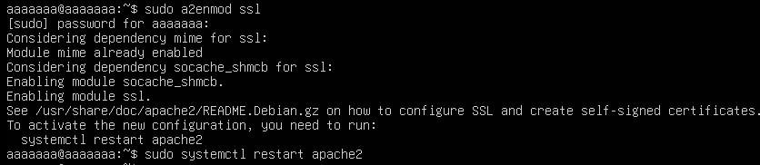

# Chuyển Website Apache từ HTTP sang HTTPS bằng Open SSL
### 1. Active Module SSL and Install OpenSSL
```bash
sudo a2enmod ssl
sudo systemctl restart apache2
```


### 2. Tạo thư mục chứa CRT
```bash
sudo mkdir -p /etc/ssl/mywebsite
```

### 3. Tạo Self-Signed CA
**a. Tạo private key cho CA**
```bash
sudo mkdir -p /etc/ssl/myCA
sudo openssl genrsa -out /etc/ssl/myCA/myCA.key 4096
```
**b. Tạo Self-signed Cer cho CA**
```bash
sudo openssl req -x509 -new -nodes -key /etc/ssl/myCA/myCA.key \
 -sha256 -days 3650 -out /etc/ssl/myCA/myCA.crt \
 -subj "/C=VN/ST=HN/L=Hanoi/O=mywebsite/OU=DevOps/CN=mywebsite.com"
```
`myCA.crt`: public certificate, dùng để import vào client

`myCA.key`: Private key, giữ trên server.
### 4. Tạo Private Key + CSR cho website
```bash
sudo openssl genrsa -out /etc/ssl/mywebsite/mywebsite.key 2048
sudo openssl req -new -key /etc/ssl/mywebsite/mywebsite.key \
 -out /etc/ssl/mywebsite1/mywebsite1.csr \
 -subj "/C=VN/ST=HN/L=Hanoi/O=mywebsite/OU=DevOps/CN=mywebsite.com"
```
### 5. CA ký Certificate(CRT) cho từng website
```bash
sudo openssl x509 -req -in /etc/ssl/mywebsite/mywebsite.csr \
 -CA /etc/ssl/myCA/myCA.crt -CAkey /etc/ssl/myCA/myCA.key \
 -CAcreateserial -out /etc/ssl/mywebsite/mywebsite.crt \
 -days 365 -sha256
```
Kết quả mỗi website sẽ có:
  - key → private key
  - crt → cert được CA ký

### 6. Tạo VirtualHosts HTTPS(port 443)
```plaintext
sudo nano /etc/apache2/sites-available/mywebsite-ssl.conf
```
```bash
<VirtualHost *:443>
    ServerName mywebsite1.com
    ServerAlias www.mywebsite1.com
    DocumentRoot /var/www/mywebsite1.com

    SSLEngine on
    SSLCertificateFile /etc/ssl/mywebsite1/mywebsite1.crt
    SSLCertificateKeyFile /etc/ssl/mywebsite1/mywebsite1.key

    <Directory /var/www/mywebsite1.com>
        AllowOverride All
        Require all granted
    </Directory>

    ErrorLog ${APACHE_LOG_DIR}/mywebsite1-ssl-error.log
    CustomLog ${APACHE_LOG_DIR}/mywebsite1-ssl-access.log combined
</VirtualHost>
```
### 7. Import CERTIFICATE vào TRUSTROOT CA để tránh cảnh báo
```plaintext
sudo cp /etc/ssl/myCA/myCA.crt /usr/local/share/ca-certificates/myCA.crt
sudo update-ca-certificates
```
Lưu ý: Không copy file .key sang client. Và chỉ làm cách này khi ta đang tạo cert trực tiếp cho từng website, nhưng không có CA, nên client sẽ luôn báo ERR_CERT_AUTHORITY_INVALID => Nếu mục đích internal / test thì để browser tin tưởng, cần tạo một self-signed CA, sau đó ký certificate cho từng site.

Nếu dùng nhiều website, nên tạo 1 self-signed CA → ký certificate cho tất cả website → chỉ cần import 1 CA vào client (Không copy file .key sang client)
### 8. Bật cả 2 Site HTTPS
```plaintext
sudo a2ensite mywebsite1-ssl.conf
sudo a2ensite mywebsite2-ssl.conf
```
### 9. Redirect HTTP -> HTTPS nếu chưa bật
**Sửa VirtualHost HTTP (port 80):**
```plaintext
sudo nano /etc/apache2/sites-available/mywebsite.conf
```
Sửa 
```bash
<VirtualHost *:80>
    ServerName mywebsite.com
    ServerAlias www.mywebsite.com
    Redirect permanent / https://mywebsite.com/
</VirtualHost>
```
**Reload**
```bash
sudo systemctl reload apache2
```
**Kiểm tra lại cú pháp**
```bash
sudo apache2ctl configtest
```

### 10. Allow Firewall
```plaintext
sudo ufw enable
sudo ufw allow 443
sudo systemctl restart apache2
```
### 11. Truy cập thử

Trang web vẫn hiện Not Secure do ở phía backend (cụ thể WordPress) site URL vẫn để là http thay vì của https

## NHIỀU SITE SẼ DÙNG CHUNG 1 FILE .CRT (SAN certificate)
### 1. Tạo private key chung cho nhiều site
```plaintext
sudo mkdir -p /etc/ssl/multisite
sudo openssl genrsa -out /etc/ssl/multisite/multisite.key 2048
```
### 2. Tạo file cấu hình SAN (rất quan trọng)
```plaintext
sudo nano /etc/ssl/multisite/san.cnf
```
**Dán vào**
```plaintext
[ req ]
default_bits       = 2048
prompt             = no
default_md         = sha256
req_extensions     = req_ext
distinguished_name = dn

[ dn ]
C  = VN
ST = HN
L  = Hanoi
O  = mywebsite
OU = DevOps
CN = mywebsite.com

[ req_ext ]
subjectAltName = @alt_names

[ alt_names ]
DNS.1 = mywebsite1.com
DNS.2 = www.mywebsite1.com
DNS.3 = mywebsite2.com
DNS.4 = www.mywebsite2.com
```

=> File này tạo 1 cert chung chứa cả 2 domain.
### 3. Tạo CSR từ Key + SAN config
```plaintext
sudo openssl req -new -key /etc/ssl/multisite/multisite.key \
 -out /etc/ssl/multisite/multisite.csr \
 -config /etc/ssl/multisite/san.cnf
```

### 4. CA ký MULTI-DOMAIN CERT
- Giả sử đã có CA rồi (`myCA.key`+`myCA.crt`)
```plaintext
sudo openssl x509 -req \
 -in /etc/ssl/multisite/multisite.csr \
 -CA /etc/ssl/myCA/myCA.crt \
 -CAkey /etc/ssl/myCA/myCA.key \
 -CAcreateserial \
 -out /etc/ssl/multisite/multisite.crt \
 -days 365 \
 -sha256 \
 -extfile /etc/ssl/multisite/san.cnf \
 -extensions req_ext
```
**Kết quả**:
- `multisite.key` (key dùng chung)
- `multisite.crt` (cert chứa cả 2 domain)

### 5. Cấu hình VirtualHosts
**Website1:** (port 443)
```bash
<VirtualHost *:443>
    ServerName mywebsite1.com
    DocumentRoot /var/www/mywebsite1.com

    SSLEngine on
    SSLCertificateFile /etc/ssl/multisite/multisite.crt
    SSLCertificateKeyFile /etc/ssl/multisite/multisite.key
</VirtualHost>
```

**Website2:** (port 443)
```bash
<VirtualHost *:443>
    ServerName mywebsite2.com
    DocumentRoot /var/www/mywebsite2.com

    SSLEngine on
    SSLCertificateFile /etc/ssl/multisite/multisite.crt
    SSLCertificateKeyFile /etc/ssl/multisite/multisite.key
</VirtualHost>
```
=> Cả 2 website dùng chung cert & key

**Quan trọng:**

Browser sẽ không lỗi nếu:
  - cert chứa SAN của 2 domain
  - client đã importa myCA.crt (CA duy nhất)