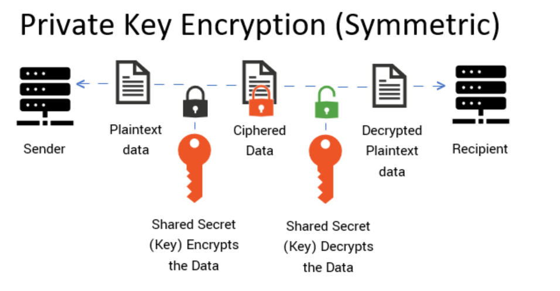

# SSL/TLS cert, CSR, Pub/Private Key, CA
## Private Key - Khóa bị mật | Public Key - Khóa công khai
### 1. Public Key và Private Key
Hệ thống CA (Certificate Authority) sử dụng mật mã bất đối xứng (Asymmetric Encryption) để mã hóa và giải mã dữ liệu. Hai thành phần chính của hệ thống này là:

**Public Key (Khóa công khai)**
- Được cấp cùng với chứng chỉ SSL/TLS.
- Mọi người đều có thể sử dụng nó để mã hóa dữ liệu.
- Không thể dùng để giải mã dữ liệu đã được mã hóa bằng nó.

**Private Key (Khóa bí mật)**
- Chỉ thuộc về chủ sở hữu chứng chỉ (webserver).
- Được dùng để giải mã dữ liệu đã được mã hóa bằng Public Key.
- Server có thể bị giả mạo nếu bị lộ.
### 2. Cách hoạt động



- Khi truy cập https://mydomain.com, trình duyệt nhận Public Key từ chứng chỉ SSL của webserver.
- Trình duyệt dùng Public Key để mã hóa dữ liệu gửi đi.
- Chỉ Private Key trên webserver mới có thể giải mã dữ liệu đó.

Hệ thống này đảm bảo dữ liệu được mã hóa trước khi gửi qua mạng và chỉ có webserver mới có thể đọc được nó.

### 3. Public Key và Private Key trong SSL/TLS
Tạo Private Key & Public Key bằng OpenSSL:

Có thể tạo cặp khóa bằng lệnh sau:
```plaintext
openssl genrsa -out mydomain.key 2048
```
`mydomain.key`: Private Key (Chỉ máy chủ mới có quyền truy cập).

Tiếp theo, tạo `Public Key` từ `Private Key`:
```plaintext
openssl rsa -in mydomain.key -pubout -out mydomain.pub
```
`mydomain.pub`: Public Key

Lưu ý:
- Private Key tuyệt đối không được chia sẻ.
- Public Key có thể chia sẻ công khai (nằm trong chứng chỉ SSL).

## CSR (Certificate Signing Request) - Yêu cầu cấp chứng chỉ

CSR (Certificate Signing Request) là một tệp chứa thông tin quan trọng được gửi đến CA (Certificate Authority) để yêu cầu cấp chứng chỉ SSL/TLS.
### 1. CSR chứa những thông tin gì?
- Tên miền (Common Name - CN): Ví dụ: `<www.example.com>`
- Tên tổ chức (Organization - O): Ví dụ: `Example Inc`.
- Bộ phận (Organizational Unit - OU): Ví dụ:` IT Department`
- Thành phố (Locality - L): Ví dụ: `Hanoi`
- Bang/Tỉnh (State - ST): Ví dụ: `Hanoi`
- Quốc gia (Country - C): Ví dụ: `VN`
- Public Key (Khóa công khai)
- Chữ ký số (Được tạo bằng Private Key)

Lưu ý: CSR không chứa Private Key.
### 2. Cách tạo CSR
Trên webserver (Ubuntu, CentOS), có thể tạo CSR (Certificate Signing Request) bằng OpenSSL theo các bước sau:

`Bước 1`: Tạo Private Key

Đầu tiên, tạo Private Key với độ dài 2048-bit:
```ruby
openssl genrsa -out mydomain.key 2048
```
Tạo ra file` mydomain.key` -> Private Key

` Bước 2`: Tạo CSR từ Private Key
```ruby
openssl req -new -key mydomain.key -out mydomain.csr
```
Hệ thống sẽ yêu cầu nhập thông tin:
```ruby
Country Name (2 letter code) [US]: VN
State or Province Name (full name) [Some-State]: Hanoi
Locality Name (eg, city) []: Hanoi
Organization Name (eg, company) [Internet Widgits Pty Ltd]: My Company
Organizational Unit Name (eg, section) []: IT Department
Common Name (e.g. server FQDN or YOUR name) []: www.example.com
Email Address []: admin@example.com
```
- Tạo ra file `mydomain.csr` -> CSR, gửi cho CA để cấp chứng chỉ SSL.

` Bước 3`: Kiểm tra CSR

Xác minh nội dung của CSR vừa tạo:
```ruby
openssl req -noout -text -in mydomain.csr
```
Bạn sẽ thấy thông tin về Public Key, CN (Common Name), O (Organization), v.v.

` Bước 4`: Gửi CSR cho CA để cấp chứng chỉ
Nếu dùng Let’s Encrypt, có thể dùng Certbot để tự động cấp SSL:
```plaintext
certbot certonly --webroot -w /var/www/html -d example.com
```
Nếu dùng DigiCert, Sectigo, GlobalSign, hãy gửi file mydomain.csr đến CA.

CA sẽ cấp file chứng chỉ SSL (.crt), bạn cài đặt vào webserver.