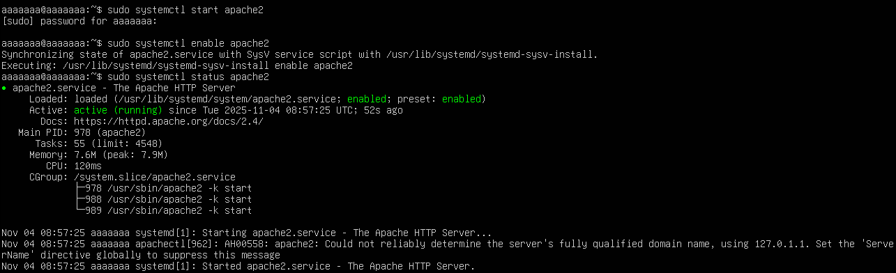
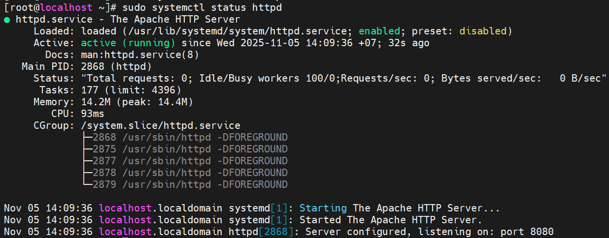

# Cài đặt web server Apache trên CentOS và Ubuntu
## Trên Ubuntu
Cài đặt và khởi động Apache:
```plaintext
sudo apt install apache2 -y
sudo systemctl start apache2
sudo systemctl enable apache2
sudo systemctl status apache2
```


```plaintext
sudo ufw allow 80/tcp
```

## Trên CentOS 9
Cài đặt và khởi động Apache
```plaintext
sudo dnf install httpd -y
sudo systemctl start httpd
sudo systemctl enable httpd
sudo systemctl status httpd
```



## 2. Một số lỗi gặp phải khi cài đặt Apache trên Linux và Ubuntu
### 2.1 Máy tải bị đứt quãng, chưa tải xong hết được các gói
```plaintext
config variable ${APACHE_RUN_DIR} is not defined
```
- không phải lỗi bình thường → vì trên Ubuntu, Apache mặc định có biến này, và nó được khai báo trong file: `/etc/apache2/envvars`
- Chạy đúng lệnh: `sudo systemctl restart apache2`
- Kiểm tra biến có tồn tại trong envars: `grep APACHE_RUN_DIR /etc/apache2/envvars` -> `export APACHE_RUN_DIR=/var/run/apache2$SUFFIX`
- Nếu file này bị xóa, chạy: `sudo apt reinstall apache2 -y`
- Kiểm tra thông báo lỗi chính xác: `sudo apache2ctl configtest` or `apache2ctl -V`
- Nếu thiếu khai báo: `echo 'export APACHE_RUN_DIR=/var/run/apache2' | sudo tee -a /etc/apache2/envvars` thêm thủ công.
### 2.2 Lỗi trên CentOS 9
```plaintext
AH00558: httpd: Could not reliably determine the server's fully qualified domain name, using localhost.localdomain. Set the 'ServerName' directive globally to suppress this message
```
Apache cần một giá trị ServerName (domain hoặc IP) trong file cấu hình, nhưng:
- Bạn chưa cấu hình `ServerName` trong `/etc/httpd/conf/httpd.conf`
- Hostname của server không được khai báo trong `/etc/hosts`

Sửa file cấu hình Apache : `sudo nano /etc/httpd/conf/httpd.conf`. Thêm dòng `ServerName localhost`
- Lưu lại: `sudo systemctl restart httpd`

Fix hostname trong `/etc/hosts`: Kiểm tra: `hostname -f` -> sửa file `sudo nano /etc/hosts`
- Khởi động lại Apache:
```plaintext
sudo systemctl restart httpd
sudo systemctl status httpd
```

**Xem lỗi chi tiết**
```plaintext
sudo systemctl status httpd -l (sudo journalctl -xeu httpd)
```
- Kiểm tra lỗi cú pháp config: `sudo apachectl configtest`
```plaintext
AH00072: make_sock: coul> Nov 05 14:02:34 localhost.localdomain httpd[1534]: (98)Address already in use: AH00072: make_sock: coul> Nov 05 14:02:34 localhost.localdomain httpd[1534]: no listening sockets available, shutting down
```
- NGUYÊN NHÂN 100%: Port 80 đang bị chiếm bởi dịch vụ khác, nên Apache không thể khởi động.
- Apache cần port 80 (HTTP) và/hoặc 443 (HTTPS). Nếu dịch vụ khác đang dùng port này, Apache sẽ fail ngay khi start.
- Kiểm tra port 80: `sudo ss -tulnp | grep :80`
```plaintext
sudo systemctl stop nginx
sudo systemctl disable nginx
sudo systemctl restart httpd
```
- Đổi port cho Apache: `sudo nano /etc/httpd/conf/httpd.conf`
- Sửa dòng: `Listen 80` -> `Listen 8080`
- Restart: `sudo systemctl restart httpd`