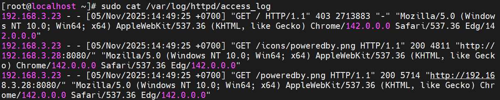
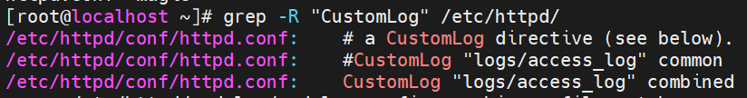
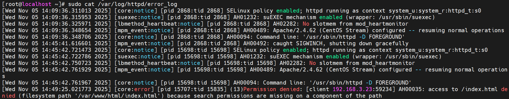

# File log apache  "Nhật Ký Hành Trình" Của Mọi Yêu Cầu Web

Về cơ bản, mỗi khi có một yêu cầu được gửi đến máy chủ Apache (ví dụ: một người dùng truy cập trang web, một con bot của Google quét qua bài viết), máy chủ sẽ ghi lại một hoặc nhiều dòng thông tin về sự kiện đó vào các file log. Hai loại file log quan trọng nhất mà bạn cần phải biết là:

- `/var/log/apache/access.log` (Ubuntu and Debian).
- `/etc/httpd/logs/access_log` (RedHat, CentOS, and Fedora).

Bao gồm 2 file chính:  

- access.log (Nhật ký truy cập): Ghi lại thông tin về MỌI yêu cầu được gửi đến máy chủ. Ai đã truy cập, họ đến từ đâu, họ yêu cầu tài nguyên nào, máy chủ đã phản hồi ra sao. Đây là nguồn dữ liệu chính cho việc phân tích lưu lượng truy cập và hành vi người dùng.

- error.log (Nhật ký lỗi): Chỉ ghi lại các sự kiện lỗi xảy ra. Từ các lỗi "Page Not Found" (404) quen thuộc đến các lỗi cấu hình nghiêm trọng của máy chủ (5xx), tất cả đều được ghi nhận tại đây. Đây là điểm đến đầu tiên của bất kỳ quản trị viên hệ thống nào khi website gặp sự cố.

## 1. Access log 



(Tail. The tail command shows the last few entries in a log file. Add the -f option to enable real-time updates in the terminal window. )

**The Acess Log**: contains information about requests made to your web server. Each request entry includes details such as the IP address of the visitor, request date and time, HTTP method, URL accessed, HTTP status code, and bytes sent.

File log được lưu trữ tại /var/log/httpd/access_log (hoặc /var/log/apache2/access.log)

- Apache cung cấp 1 vài predefined log formats:
  - **Common Log Format (CLF):**  The basic format showing client IP, timestamp, request, status code, and size
  - **Combined Log Format:**  Extends CLF with referrer and user agent information
  - **Custom Formats:** You can create your own using format strings

```ruby
LogFormat "%h %l %u %t \"%r\" %>s %b \"%{Referer}i\" \"%{User-agent}i\"" common
```

```plaintext
127.0.0.1 - frank [10/Oct/2000:13:55:36 -0700] "GET /apache_pb.gif HTTP/1.0" 200 2326 "http://www.example.com/start.html" "Mozilla/4.08 [en] (Win98; I ;Nav)"
```

| Thành phần  |Ví dụ | Ý nghĩa |         
|-------------------|----------|--------------|
| **IP máy khách(`%h`)**    | 127.0.0.1 | Địa chỉ IP của người dùng hoặc bot đã gửi yêu cầu. |
| **Client ID (`%l`)** | - | Thường không được sử dụng và hiển thị là dấu gạch ngang. |
| **User ID(`%u`)** | frank | ID người dùng nếu yêu cầu xác thực. Thường là dấu gạch ngang. |
|**Thời gian(`%t`)**|[10/Oct/2000:...] | Thời điểm chính xác máy chủ nhận được yêu cầu.|
|**Dòng yêu cầu(`"%r"`)** | "GET /apache_pb.gif ..."| Phương thức (GET, POST), tài nguyên được yêu cầu, và giao thức HTTP.
|**Mã trạng thái(`%>s`)**| 200 | Mã phản hồi của máy chủ. (200: OK, 404: Not Found, 500: Server Error).|
|**Kích thước phản hồi(`%b`)**| 2326| Kích thước (tính bằng byte) của tài nguyên được trả về.(không tính header, - nếu không có dữ liệu)|
|**Referer(`"%{Referer}i"`)**| "http://www.example.com/..." | URL của trang web mà người dùng đã đến từ đó.|               |
|**User-Agent(`"%{User-Agent}i"`)**| "Mozilla/4.08 ..."| Thông tin về trình duyệt và hệ điều hành của người dùng.|

### 1.1 Cấu hình Access Log

Trong file cấu hình (ví dụ `/etc/httpd/conf/httpd.conf` hoặc file VirtualHost riêng) thêm:
```plaintext
LogFormat "%h %l %u %t \"%r\" %>s %b \"%{Referer}i\" \"%{User-Agent}i\"" combined
CustomLog "/var/log/httpd/example.com_access.log" combined
```
- `LogFormat … combined`: định nghĩa format log với nickname là `combined`
- `CustomLog "/var/log/httpd/example.com_access.log" combined` : ghi log truy cập vào file example.com_access.log theo định dạng `combined`
- Bạn có thể thay đường dẫn, nickname, hoặc format riêng

### 1.2 Cách tạo File cấu hình Virtual Host riêng - Custom log
#### 1.2.1 Kiểm tra
```ruby
grep -R "CustomLog" /etc/httpd/
```



Nếu hiện ra như trên -> Apache đã được cấu hình để ghi log custom (thường là mặc định) -> Nếu không có: reinstall Apache
#### 1.2.2 Tạo file chứa cấu hình VirtualHost riêng
```ruby
sudo nano /etc/httpd/conf.d/example.conf
```
Thêm đoạn 
```ruby
<VirtualHost *:80>
    ServerName example.com
    DocumentRoot /var/www/example.com

    LogFormat "%h %l %u %t \"%r\" %>s %b \"%{Referer}i\" \"%{User-Agent}i\"" vhost_combined
    CustomLog "/var/log/httpd/example.com_access.log" vhost_combined
    ErrorLog "/var/log/httpd/example.com_error.log"
</VirtualHost>
```
- Tạo thư mục chứa web:
```ruby
sudo mkdir -p /var/www/example.com
echo "<h1>Hello from example.com</h1>" | sudo tee /var/www/example.com/index.html
```
- Lưu lại: `sudo systemctl restart httpd`
- Test log có hoạt động khôgn
```ruby
curl http://example.com
tail -f /var/log/httpd/example.com_access.log
```

#### 1.2.3 Cơ chế hoạt động của Apache

| Bước | Apache làm gì                                           |
| ---- | ------------------------------------------------------- |
| 1    | Client gửi request đến IP server                        |
| 2    | Apache đọc header `Host: example.com`                   |
| 3    | Apache tìm VirtualHost nào có `ServerName example.com`  |
| 4    | Nếu đúng, Apache load cấu hình trong `<VirtualHost>` đó |
| 5    | Apache lấy file từ `DocumentRoot` chỉ định              |
| 6    | Ghi log theo `CustomLog` / `ErrorLog` của site đó       |

**Apache có 2 kiểu cấu hình**
| Cách cấu hình                                    | Đặc điểm                                            |
| ------------------------------------------------ | --------------------------------------------------- |
| **Cấu hình chung trong `httpd.conf`**            | Tất cả website dùng chung 1 file duy nhất           |
| **Cấu hình VirtualHost riêng (mỗi site 1 file)** | Mỗi domain có file cấu hình độc lập, dễ quản lý hơn |

Khi Apache(httpd) khởi động, nó mở file chính: `/etc/httpd/conf/httpd.conf`
- Trong `httpd.conf` thường có các dòng `Include`/`IncludeOptional` trỏ tới thư mục con:
```plaintext
IncludeOptional conf.d/*.conf
IncludeOptional conf.modules.d/*.conf
```
- Apache tiếp tục load toàn bộ file trong `/etc/httpd/conf.d/*.conf`
- Gộp lại thành 1 bộ cấu hình duy nhất
- Sau đó Apache chọn VirtualHost phù hợp khi có request đến
- Nếu chạy nhiều web (multi-site) tạo nhiều file cấu hình trong /etc/httpd/conf.d/, mỗi file 1 web.

Khi có nhiều VirtualHost, Apache chọn VirtualHost:
  - Apache nhìn vào IP:port mà request đến (ví dụ `*:80` cho tất cả IP trên port 80 hoặc `192.168.1.2:80` nếu vhost bind cố định IP).
  - Trong nhóm các <`VirtualHost`> match cùng IP:port, Apache dùng Host header từ HTTP request (`Host: example.com`) để so khớp `ServerName` hoặc `ServerAlias` của từng VirtualHost.
  - Nếu có match trên ServerName/ServerAlias → dùng VirtualHost tương ứng.
  - Nếu không có match → Apache dùng virtualhost đầu tiên mà nó đã đọc (tức file .conf có thứ tự đọc đầu tiên) làm default vhost cho IP:port đó.

**Ví dụ**
  - Khi trình duyệt truy cập http://example.com (Host header = example.com) → Apache chọn example.com.vhost → lấy file từ /var/www/example.com.

  - Khi truy cập http://shop.com → Apache chọn shop.com.vhost.

Cấu hình
## 2. Error log



- `/var/log/apache/error.log` (Ubuntu and Debian).
- `/etc/httpd/logs/error_log` (RedHat, CentOS, and Fedora).

Chứa thông tin về lỗi, cảnh báo, và sự kiện hệ thống mà máy chủ web gặp phải khi xử lý các yêu cầu.

Là nơi đầu tiên để xem xét khi xảy ra sự cố khi khởi động máy chủ hoặc với hoạt động của máy chủ vì nó thường chứa thông tin chi tiết về những gì xảy ra và cách khắc phục

Định dạng: 

    [time] [level] [client IP] message


- time: Thời gian lỗi [day month year hour:minute:second.microsecond year]. 

- level: Mức độ (error, warn, info, debug).

- client IP: Địa chỉ client (nếu liên quan).

- message: Mô tả lỗi.

**Ví dụ về cấu trúc của 1 Error Log**:

```ruby
[Fri Feb 09 15:35:24.252107 2024] [core:notice] [pid 6672:tid 139657266624384] AH00094: Command line: '/usr/sbin/apache2'
```

- `[Fri Feb 09 15:35:24.252107 2024]`: Dấu thời gian khi bản ghi được thêm vào tệp nhật ký lỗi. Định dạng dấu thời gian là [Weekday Month Day Hour:Minute:Second.Microsecond Year].
- `[core:notice]`: Thành phần tạo ra mục nhập nhật ký ( core) và mức độ nghiêm trọng ( notice).
- `[pid 6672:tid 139657266624384]`: ID tiến trình ( pid 6672) và ID luồng ( tid 139657266624384) liên quan đến mục nhập.
- `AH00094: Command line: '/usr/sbin/apache2'`: Thông báo lỗi (Thông báo ví dụ cho biết Apache đang hiển thị thông tin dòng lệnh)

## 3. Mục đích của Log Apache
### 3.1 Bảo mật
- **Phát hiện tấn công dò mật khẩu (Brute-force)**: Tìm kiếm các địa chỉ IP có số lượng lớn yêu cầu đăng nhập thất bại trong một thời gian ngắn.

- **Nhận diện hoạt động quét lỗ hổng**: Các công cụ của hacker thường để lại "dấu chân" đặc trưng trong log khi chúng quét các URL nhạy cảm (ví dụ: /wp-admin, /phpmyadmin ).

- **Truy vết các truy cập trái phép**: Xác định các IP lạ đang cố gắng truy cập vào các tài nguyên bị hạn chế.

### 3.2 Gỡ lỗi và tói ưu hiệu năng(Performance Tuning)
- **Tìm kiếm các mã lỗi 5xx**: Các lỗi này (500, 502, 503) cho thấy máy chủ đang gặp vấn đề nghiêm trọng. Log lỗi sẽ chỉ ra chính xác script hoặc tiến trình nào gây ra sự cố.

- **Xác định các trang có thời gian phản hồi cao**: Bằng cách phân tích thời gian xử lý yêu cầu, bạn có thể tìm ra những trang nào đang là "nút thắt cổ chai" của hệ thống.

- **Phát hiện các liên kết gãy (Broken Links)**: Lọc ra tất cả các yêu cầu có mã trạng thái 404 để tìm và sửa các liên kết không còn tồn tại, cải thiện trải nghiệm người dùng.

## 4. CUSTOM LOG
Đối với Ubuntu và Debian: `/var/log/apache2/custom_access.log`
Đối với CentOS 9 và RHEL : `/var/log/httpd/custom_access_log`

- Custom log trong Apache là một tính năng cho phép bạn kiểm soát chính xác thông tin nào được ghi lại khi máy chủ web xử lý yêu cầu. 
- Mặc định, Apache ghi lại thông tin cơ bản về các yêu cầu (như IP người dùng, thời gian, URL đã truy cập), nhưng "custom log" cho phép bạn tùy chỉnh định dạng và nội dung của các dòng nhật ký này để phù hợp với nhu cầu phân tích cụ thể của bạn.
- Có thể coi Custom Log là một "Access Log tùy chỉnh".

### 4.1 Công dụng chính
- Phân tích hành vi người dùng: Ghi riêng `IP`, `URL`, `User-Agent`
- Theo dõi hiệu suất: Thêm `%D` để xem thời gian xử lý request
- Theo dõi API: Tạo log riêng chỉ cho các route `/api/`
- Tích hợp với `ELK` / `Graylog` / `Loki`: Ghi log JSON để hệ - thống đọc dễ hơn
- Ghi cho từng VirtualHost riêng biệt.

# FILE LOG NGINX

## PHÂN LOẠI

Nginx có 2 loại file log chính:

- **Access Log** (`access.log`): Ghi lại các yêu cầu HTTP mà máy chủ nhận được.
- **Error Log** (`error.log`): Ghi lại các lỗi xảy ra khi Nginx hoạt động.

## STRUCTURE OF NGINX LOG

### 1. Access Log (`/var/log/nginx/access.log`)

File `access log` của Nginx lưu các yêu cầu HTTP với định dạng mặc định là **Combined Log Format**, bao gồm:

```plaintext
127.0.0.1 - - [20/Mar/2025:10:00:00 +0000] "GET /index.html HTTP/1.1" 200 612 "-" "Mozilla/5.0 (Windows NT 10.0; Win64; x64)"
```

| Thành phần | Ý nghĩa |
|-----------|-------------|
| `127.0.0.1` | Địa chỉ IP của client gửi request |
| `-` | User identifier (thường bỏ trống) |
| `-` | Tên user (nếu có xác thực) |
| `[20/Mar/2025:10:00:00 +0000]` | Thời gian yêu cầu được gửi |
| `"GET /index.html HTTP/1.1"` | Phương thức HTTP, đường dẫn, phiên bản HTTP |
| `200` | Mã trạng thái HTTP (200: OK, 404: Not Found, 500: Internal Server Error,...) |
| `612` | Kích thước của phản hồi (bytes) |
| `-` | Referrer (nguồn trang web, nếu có) |
| `"Mozilla/5.0 (Windows NT 10.0; Win64; x64)"` | User-Agent (trình duyệt hoặc bot gửi yêu cầu) |

### 2. Error Log (`/var/log/nginx/error.log`)

File `error.log` ghi lại các lỗi xảy ra khi Nginx hoạt động. Mức độ log có thể là `debug`, `info`, `notice`, `warn`, `error`, `crit`, `alert`, `emerg`.

```plaintext
2025/03/20 10:05:23 [error] 1234#1234: *1 open() "/usr/share/nginx/html/missing.html" failed (2: No such file or directory), client: 192.168.1.100, server: localhost, request: "GET /missing.html HTTP/1.1", host: "example.com"
```

| Thành phần | Ý nghĩa |
|-----------|-------------|
| `2025/03/20 10:05:23` | Thời gian xảy ra lỗi |
| `[error]` | Mức độ lỗi |
| `1234#1234` | ID tiến trình Nginx |
| `open() "/usr/share/nginx/html/missing.html" failed (2: No such file or directory)` | Mô tả lỗi |
| `client: 192.168.1.100` | Địa chỉ IP của client gửi request |
| `server: localhost` | Máy chủ được truy vấn |
| `"GET /missing.html HTTP/1.1"` | Yêu cầu HTTP |

**Các mức độ log (error_log):**

| **Mức độ** | **Mô tả** | **Ví dụ lỗi** |
|-----------|-------------|---------|
| `debug` | Ghi lại tất cả thông tin chi tiết, thường chỉ dùng để debug lỗi. Rất nhiều log. | Kết nối đến backend, proxy, cache, quá trình xử lý request. |
| `info` | Thông tin chung về quá trình hoạt động, không phải lỗi. | Server khởi động thành công, tải lại cấu hình. |
| `notice` | Thông báo quan trọng nhưng không gây gián đoạn dịch vụ. | Một tính năng bị vô hiệu hóa, Nginx bỏ qua một tùy chọn. |
| `warn` | Cảnh báo có thể gây lỗi trong tương lai nhưng chưa gây gián đoạn ngay. | Quá nhiều request từ một IP, bộ nhớ cache sắp đầy. |
| `error` | Lỗi xảy ra nhưng Nginx vẫn tiếp tục chạy. Đây là mức phổ biến nhất. | File cấu hình sai, file không tồn tại, lỗi truy cập file. |
| `crit` | Lỗi nghiêm trọng, có thể ảnh hưởng đến dịch vụ. | Không thể kết nối đến backend, tài nguyên bị thiếu. |
| `alert` | Lỗi rất nghiêm trọng, cần xử lý ngay lập tức. | Lỗi phân quyền, lỗi nghiêm trọng khi ghi file. |
| `emerg` | Lỗi cấp độ khẩn cấp, Nginx không thể tiếp tục chạy. | Port bị chiếm, cấu hình lỗi nặng khiến Nginx không khởi động được. |

## So sánh log của Nginx và Apache

| **Tiêu chí** | **Nginx** (`access.log`, `error.log`) | **Apache** (`access.log`, `error.log`) |
|-----------|-------------|---------|
| **Vị trí log mặc định** | `/var/log/nginx/` | `/var/log/httpd/` (CentOS) / /`var/log/apache2/` (Ubuntu) |
| **Định dạng mặc định** | Combined Log Format | Common Log Format (có thể dùng Combined) |
| **Access Log mặc định** | `/var/log/nginx/access.log` | `/var/log/httpd/access_log` hoặc `/var/log/apache2/access.log` |
| **Error Log mặc định** | /var/log/nginx/error.log | `/var/log/httpd/error_log` hoặc `/var/log/apache2/error.log` |
| **Mức độ error log** | `debug`, `info`, `notice`, `warn`, `error`, `crit`, `alert`, `emerg` | `debug`, `info`, `notice`, `warn`, `error`, `crit`, `alert`, `emerg` |
| **Cấu trúc log** | Ghi theo từng dòng, đơn giản hơn | Có thêm lỗi từ module Apache (VD: mod_rewrite, mod_ssl) |
| **Hiệu suất ghi log** | Ghi log nhanh hơn do kiến trúc non-blocking | Có thể bị chậm hơn khi ghi log nhiều request cùng lúc |

## Kiểm tra log và debug lỗi

Kiểm tra log real-time:

```plaintext
sudo tail -f /var/log/nginx/access.log
```

Kiểm tra lỗi:

```plaintext
sudo tail -f /var/log/nginx/error.log
```

Lọc lỗi `error` hoặc `warn`:

```plaintext
grep 'error' /var/log/nginx/error.log
grep 'warn' /var/log/nginx/error.log
```