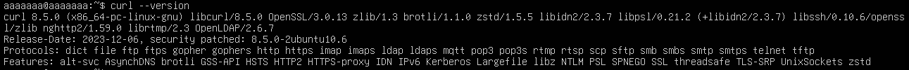
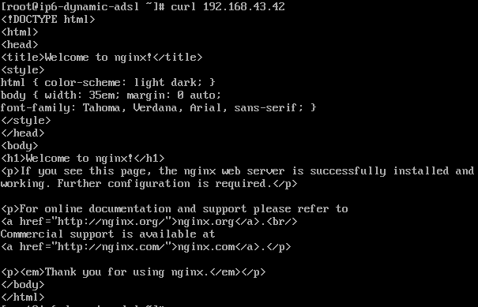

# cURL
### 1. Khái niệm
**cURL**( Client URL) là một dự án phần mềm máy tính cung cấp: 
- Công cụ dòng lện (`curl`) để truyền dữ liệu qua mạng.
- Một thư viện phần mềm(`libcurl`) dùng để kiểm tra kết nối từ URL, truyền và nhận dữ liệu qua mạng bằng các giao thức khác.
- cURL cho phép bạn gửi yêu cầu và nhận phản hồi từ máy chủ - tương tự như trình duyệt nhưng chạy bằng dòng lệnh.


### 2. Các chức năng chính của cURL
cURL được thiết kế để hoạt động mà không cần tương tác của người dùng, làm cho nó trở nên lý tưởng để sử dụng trong các script (tập lệnh) và các ứng dụng tự động hóa.

Chức năng của cURL là giúp người dùng tải xuống trang web hay hình ảnh từ mạng internet. Đồng thời, nó cũng hỗ trợ vận chuyển tập tin, dữ liệu, hình ảnh và truyền dữ liệu giữa client và server. Bên cạnh đó, cURL còn cho phép người dùng kiểm tra các Cookie được tải trên URL.
- **Tính linh hoạt cao**: cURL linh hoạt trong việc thực hiện nhiều chức năng khác nhau như gửi yêu cầu, tải xuống dữ liệu, kiểm tra thông tin từ các máy chủ và URL khác nhau.
- **Khả năng tương thích rộng**: Công cụ này tương thích với hầu hết các hệ điều hành và thiết bị được kết nối với mạng internet, giúp người dùng có trải nghiệm mượt mà trên nhiều nền tảng khác nhau.
- **Kiểm tra Endpoint**: cURL rất hữu ích trong việc kiểm tra tính hoạt động của các điểm kết nối (endpoint), giúp người dùng xác định xem chúng có hoạt động đúng như mong muốn hay không.
- **Đáng tin cậy và chi tiết**: Mặc dù có thể tạo ra kết quả dài, nhưng cURL cũng cung cấp thông tin chính xác về dữ liệu gửi hoặc nhận, hỗ trợ trong việc phân tích lỗi và sửa chữa.
- **Ghi log lỗi tốt**: cURL cung cấp khả năng ghi log lỗi tốt, giúp người dùng theo dõi và giải quyết vấn đề một cách hiệu quả.
- **Khả năng giới hạn tỷ lệ**: Công cụ này có thể được cấu hình để giới hạn tỷ lệ truy cập, điều này hữu ích khi cần kiểm soát lưu lượng hoặc truy cập đến một tài nguyên cụ thể.
- **Kiểm thử và Tương tác với API**: Đây là ứng dụng phổ biến nhất. Developer sử dụng curl để gửi các yêu cầu HTTP (như `GET`, `POST`, `PUT`, `DELETE`) đến các dịch vụ web và API, giúp kiểm tra chức năng của API.
- **Giao thức đa dạng**: cURL hỗ trợ nhiều giao thức mạng khác nhau, bao gồm:
  - **HTTP**, **HTTPS**, **FTP**, **FTPS**, **SCP**, **SFTP**, **LDAP**, **LDAPS**, **POP3**,**SMTP**,...

- **Xác thực và Phiên làm việc**: Hỗ trợ xác thực người dùng, quản lý **cookies**, duy trì phiên làm việc, hỗ trợ proxy, và kết nối an toàn qua **SSL/TLS**.
- **Debug mạnh mẽ**: Cung cấp các tùy chọn để hiển thị thông tin chi tiết về quá trình truyền tải (header, kết nối, lỗi...), giúp dễ dàng gỡ lỗi (debug) các vấn đề mạng hoặc API.

### 3. Các lệnh cơ bản cURL
**Kiểm tra phiên bản cURL**: `curl --version`



**Cú pháp và lệnh cURL cơ bản**: 
```plaintext
curl [OPTIONS] [URL]
```

Các Options phổ biến

| **Tùy chọn** | **Mô tả**| **Ví dụ** |
|--------------|----------|-------|
| `-X <method>` | Chỉ định phương thức HTTP (GET, POST, PUT, DELETE, v.v.).| `curl -X POST https://api.example.com/data`|
| `d <data>` | Gửi dữ liệu theo phương thức POST (thường dùng để gửi form hoặc JSON). |` curl -d "key=value" https://api.example.com/post`|
| `- H <header>` | Thêm header tùy chỉnh vào yêu cầu. | `curl -H "Content-Type: application/json" https://api.example.com` | 
| `-L `| Theo dõi chuyển hướng (redirects) của HTTP | `curl -L http://bit.ly/example`| 
| `- v` | Hiển thị thông tin chi tiết (verbose) về quá trình truyền tải (rất hữu ích khi debug).| `curl -v https://example.com`|
| `-I`| Chỉ lấy header của phản hồi. | `curl -I https://example.com`|
| `-o <file> ` | Lưu file phản hồi vào  với tên do người dùng chỉ định | `curl -o output.html https://example.com`|
| `-u`| Gửi thông tin xác thực( Basic Auth) | `curl -u user:pass https://api.example.com` | 
| `-O`| Tải nội dung phản hồi vào tệp với tên gốc lấy từ URL và lưu ở thư mục hiện tại bạn đang làm việc.| `curl -O http://example.com/file1.zip -O http://example.com/file2.zip`|
| `--user <user:pass>`| Gửi thông tin xác thực theo kiểu Basic Authentication | `curl --user aaaaaaa:192.168.148.129 https://example.com` |



### 4. Bổ sung cài đặt trong CentOS 9
- Lệnh cài đặt gói phần mềm trong CentOS 9: `sudo dnf install <tên_góí>`
- Cập nhập hệ thống: `sudo dnf/yum update -y`
- Tìm kiếm gói: `dnf/yum search <tên_gói>`
- Xem thông tin gói: `dnf/yum info <tên_gói>`
- Xóa gói: `sudo dnf/yum remove <tên_gói> -y`
- Liệt kê tất cả các gói đã cài: `dnf/yum list installed` 
- Kích hoạt kho EPEL( nhiều package cần tới): `sudo dnf/yum install epel-release -y`

### 5. Sửa lỗi kết nối tới cURL `Connection Refused`
**Kiểm tra server có mở port 80 không**
- Chạy trên máy đích(server mà bạn curl đến): `sudo ss -tulnp |grep :80`. Nếu không thấy dịch vụ nào đang LISTEN port 80 → nghĩa là chưa có web server chạy (Apache, Nginx...). -> Cài và khởi động dịch vụ web: `sudo systemctl enable --now nginx`

**Firewall chặn cổng 80(Trên CentOS 9)**
- Kiểm tra firewall: `sudo firewall-cmd --list-all`
- Nếu thiếu HTTP, mở cổng:
```plaintext
sudo firewall-cmd --add-service=http --permanent
sudo firewall-cmd --reload
```

**SELinux chặn (chỉ gặp nếu bật enforcing)**
- Kiểm tra: `getenforce`
- Nếu trả về `Enforcing`, thử cho phép HTTP: `sudo setsebool -P httpd_can_network_connect 1`

**Bật dịch vụ webserver**
- `sudo systemctl enable nginx` -> `sudo systemctl restart nginx`
- Nếu bị lỗi Nginx: Xem trạng thái lỗi chi tiết: `sudo systemctl status nginx.service`
- Xem Log lỗi: `sudo jounalctl -xeu nginx.service`

| Nguyên nhân                                                               | Cách kiểm tra                                   | Cách khắc phục                                          |                                      |
| ------------------------------------------------------------------------- | ----------------------------------------------- | ------------------------------------------------------- | ------------------------------------ |
| **Cấu hình Nginx bị sai** (`nginx.conf` lỗi syntax)                       | `sudo nginx -t`                                 | Sửa file theo báo lỗi rồi restart                       |                                      |
| **Port 80 bị chiếm bởi service khác** (Apache, another Nginx instance...) | `sudo ss -tulnp grep :80`   | Tắt service chiếm cổng hoặc đổi cổng |
| **Thiếu thư mục web root**                                                | Lỗi log: `directory index ... not found`        | Tạo thư mục: `mkdir -p /usr/share/nginx/html`           |                                      |
| **SELinux chặn** (CentOS/RHEL)                                            | `getenforce`                                    | `sudo setsebool -P httpd_can_network_connect 1`         |                                      |
| **File cấu hình site include bị sai**                                     | `nginx -t` báo lỗi ở `/etc/nginx/conf.d/*.conf` | Xóa file cấu hình sai hoặc sửa lại                      |                                      |
| **Không đủ quyền truy cập (permission denied)**                           | Log xuất hiện `permission denied`               | `chown -R nginx:nginx /var/www/html` hoặc chỉnh SELinux |                                      |
