# HTTP
### 1. Khái niệm
Giao thức HTTP, viết tắt của HyperText Transfer Protocol, là giao thức truyền tải siêu văn bản, dùng để trao đổi dữ liệu giữa client (máy người dùng, trình duyệt) và server (máy chủ web) trên World Wide Web.
- Đây là cầu nối giữa người dùng và các trang web, cho phép người dùng truy cập nội dung như văn bản, hình ảnh, video một cách dễ dàng.
- 1 doc hoàn chỉnh được tái tạo từ các doc con khác nhau được fetch – tìm nạp, chẳng hạn như văn bản, mô tả layout, hình ảnh, video, script v..v..

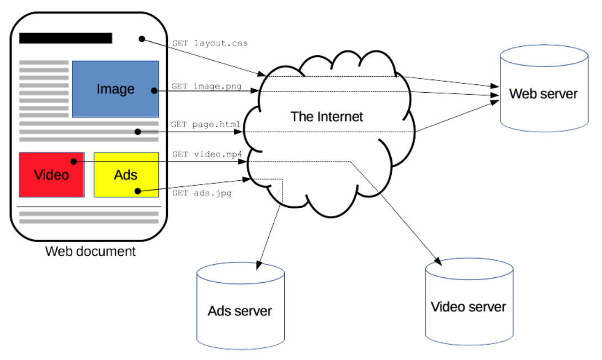

### 2. Đặc điểm cơ bản của HTTP
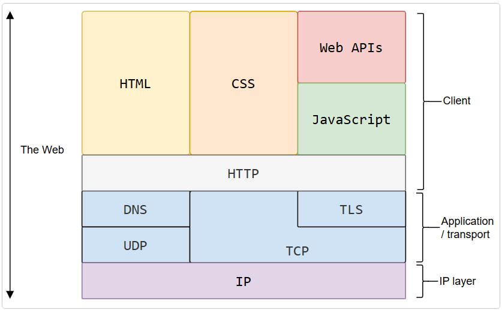

- **Text-Based – Dạng văn bản**: toàn bộ các thông điệp HTTP (request và response) đều được ghi dưới dạng văn bản thuần (plain text) — bao gồm dòng lệnh, tiêu đề (header), và phần nội dung (body). 
  - Điều này giúp con người dễ đọc, dễ hiểu và dễ gỡ lỗi (debug) khi cần kiểm tra dữ liệu trao đổi giữa client và server.
- **HTTP là giao thức connectionless** (kết nối không liên tục) : ví dụ như HTTP Client khởi tạo 1 request, Client sẽ ngắt kết nối từ Server và đợi cho 1 phản hồi, Server xử lí request và thiết lập lại sự kết nối với Client để gửi phản hồi trở lại.
- **Client-Server Model**
  - Client (trình duyệt, ứng dụng di động, công cụ gọi API, v.v.) là bên gửi yêu cầu (request).
  - Server (máy chủ web hoặc ứng dụng) là bên xử lý yêu cầu và gửi phản hồi (response).
  - Mô hình này giúp phân tách rõ ràng vai trò của hai bên, giúp hệ thống dễ mở rộng và quản lý.
- **Request-Response**
  - Client gửi một yêu cầu (request) chứa thông tin cần truy cập hoặc thao tác.
  - Server xử lý và gửi một phản hồi (response) chứa kết quả hoặc dữ liệu tương ứng.
  - Đây là chu trình giao tiếp cơ bản nhất của HTTP, đảm bảo rằng mọi tương tác đều có tính xác định: một yêu cầu → một phản hồi.
- **HTTP là một phương tiện độc lập** : Bất cứ loại dữ liệu nào cũng có thể được gửi bởi HTTP, miễn là Server và Client biết cách kiểm soát nội dung dữ liệu. Nó được yêu cầu cho Client cũng như Server để xác định kiểu nội dung bởi sử dụng kiểu MIME (Multipurpose Internet Mail Extensions - Giao thức mở rộng thư điện tử Internet đa mục đích) thích hợp.
- **HTTP là stateless(không trạng thái), nhưng không sessionless** : Tính stateless (không trạng thái) có nghĩa là mỗi yêu cầu HTTP được thực hiện độc lập và không có bất kỳ liên kết nào với các yêu cầu trước đó. Điều này tạo ra sự linh hoạt, nhưng cũng đòi hỏi các kỹ thuật bổ sung như sử dụng cookie hoặc session để giữ lại trạng thái người dùng trong các tương tác phức tạp như giỏ hàng.
  - Ví dụ: Khi bạn tải một trang web gồm nhiều hình ảnh, mỗi hình ảnh là một request riêng biệt — server không tự động “nhớ” rằng chúng đến từ cùng một người dùng trừ khi ta dùng cookie, session hoặc token để bổ sung trạng thái.
### 3. Cơ chế hoạt động HTTp
#### 3.1 Thiết lập kết nối
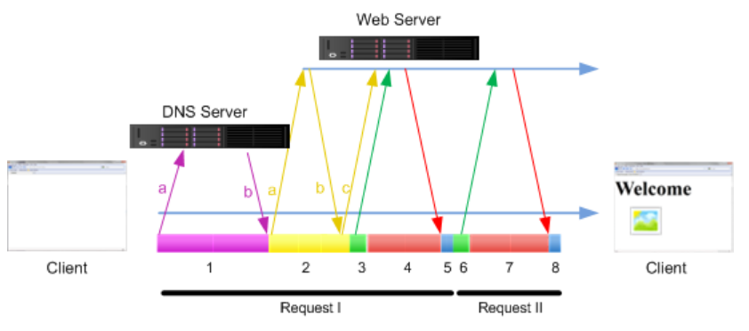
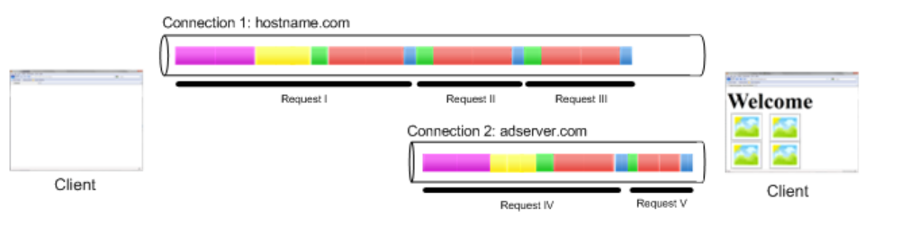

- **DNS Lookup**: The client uses the domain name (e.g., www.example.com) to find the server's IP address.
- Client sends DNS Query to local ISP DNS server.
- DNS server responds with the IP address for hostname.com
- **TCP Connection**: The client and server establish a Transmission Control Protocol (TCP) connection with the IP address of hostname.com to ensure reliable data transfer. This often involves a TCP three-way handshake. The default port for this is port 80 for HTTP, or port 443 for HTTPS.
- Web server sends SYN-ACK packet.
- Client answers with ACK packet, concluding the three-way TCP connection establishment.
- **TLS/SSL Handshake (for HTTPS)**: If the connection is secure (HTTPS), a Transport Layer Security/Secure Sockets Layer (TLS/SSL) handshake is performed to encrypt the connection.
- **HTTP Request**: Once the connection is ready, the client sends the HTTP request (e.g., GET, POST) to the server.
- Waits: Client waits for the server to respond to the request.
- **HTTP Response**: The server processes the request and sends an HTTP response back to the client.
- Loads: Client loads the content of the response.
- **Connection Closing**: The connection is then closed, although in modern HTTP/1.1 and later, connections can be kept open (persistent connections) to improve performance.                               

#### 3.2 Bắt đầu giao tiếp

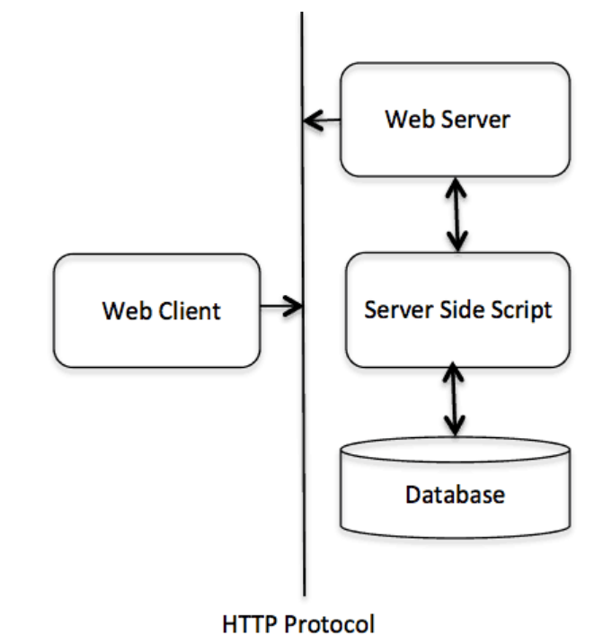

HTTP (HyperText Transfer Protocol) là một giao thức truyền thông hoạt động theo mô hình Client – Server và cơ chế Yêu cầu – Phản hồi (Request – Response).

Trong HTTP, Client — thường là trình duyệt web hoặc ứng dụng — sẽ gửi một yêu cầu (Request) đến Server để truy cập hoặc xử lý một tài nguyên nào đó (ví dụ: trang HTML, hình ảnh, hoặc dữ liệu API). Request này bao gồm 1 phương thức request (GET, POST, PUT, DELETE, etc.), the target URL(Uniform Resource Identifier, e.g., a URL), headers and an optional request body.

Server nhận được yêu cầu và xử lý dựa trên requested methods và tài nguyên tương ứng, nó có thể bao gồm lấy dữ liệu từ database, thực thi các tập lệnh phía máy chủ hoặc thực hiện các hoạt động khác.

Server gửi HTTP response: Sau khi xử lý xong request, Server gửi HTTP response lại client. This response bao gồm a status code (e.g., 200OK, 404 Not Found), response headers và body phản hồi lựa chọn chứa nội dung hoặc dữ liệu đc yêu cầu.

Client nhận phản hồi từ server và xử lý chúng theo đó. Ví dụ nếu phản hồi chứa HTML page, the browser sẽ diễn giải và hiển thị nó. Nếu đó là ảnh hoặc media file, the browser sẽ hiển thị hoặc xử lý chúng thích hợp.

Quá trình này diễn ra thông qua việc trao đổi các thông điệp độc lập, thay vì là một luồng dữ liệu liên tục. Mỗi yêu cầu và phản hồi là một phiên làm việc riêng biệt, đảm bảo tính đơn giản và dễ mở rộng của HTTP.

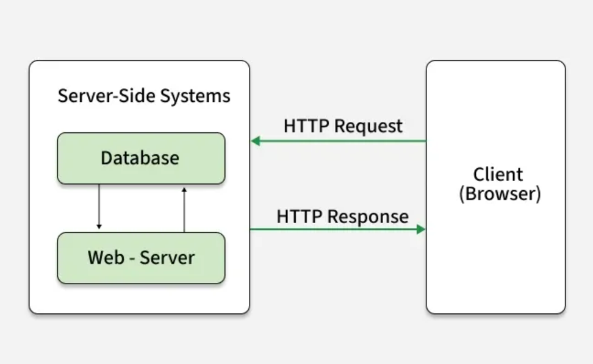

#### 3.3 Các thành phần chính của HTTP

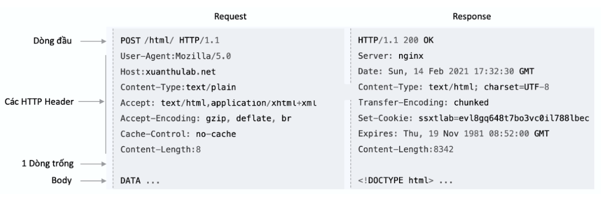

| **Khái niệm (Concept)**                              | **Mô tả chi tiết (Description)**                                                                                                                                                                                                                                                                                                                                                                      |
| ---------------------------------------------------- | ----------------------------------------------------------------------------------------------------------------------------------------------------------------------------------------------------------------------------------------------------------------------------------------------------------------------------------------------------------------------------------------------------- |
| **HTTP Request Headers**<br>(Tiêu đề yêu cầu HTTP)   | Là phần **thông tin dạng cặp khóa – giá trị (key-value pairs)** được gửi kèm trong mỗi **yêu cầu HTTP**. Các header này chứa dữ liệu bổ sung như: loại trình duyệt của client (`User-Agent`), loại dữ liệu mong muốn (`Accept`), thông tin xác thực (`Authorization`), hoặc địa chỉ máy chủ (`Host`).<br> Giúp server hiểu cách xử lý và phản hồi phù hợp với yêu cầu của client.                   |
| **HTTP Request Body**<br>(Thân yêu cầu HTTP)         | Là phần **dữ liệu chính mà client gửi lên server** — thường chứa thông tin người dùng nhập từ biểu mẫu (form), dữ liệu xác thực, hoặc payload của API (ví dụ: JSON, XML, file upload).<br> Thường xuất hiện trong các phương thức **POST**, **PUT** hoặc **PATCH**.                                                                                                                                 |
| **HTTP Response**<br>(Phản hồi HTTP)                 | Là **kết quả mà server gửi lại** sau khi xử lý yêu cầu của client. Mỗi phản hồi gồm 3 phần chính:<br>1️⃣ **Mã trạng thái (Status Code)** – cho biết kết quả xử lý.<br>2️⃣ **Header phản hồi (Response Headers)** – cung cấp thông tin về dữ liệu trả về.<br>3️⃣ **Body phản hồi (Response Body)** – chứa nội dung dữ liệu thực tế.                                                                    |
| **HTTP Status Codes**<br>(Mã trạng thái HTTP)        | Là **mã gồm 3 chữ số** thể hiện kết quả xử lý yêu cầu. Các mã này được chia thành 5 nhóm:<br>• **1xx – Informational:** Thông tin tạm thời.<br>• **2xx – Success:** Thành công (ví dụ: `200 OK`).<br>• **3xx – Redirection:** Chuyển hướng.<br>• **4xx – Client Error:** Lỗi phía client (ví dụ: `404 Not Found`).<br>• **5xx – Server Error:** Lỗi phía server (ví dụ: `500 Internal Server Error`).<br>• (https://developer.mozilla.org/en-US/docs/Web/HTTP/Reference/Status) |
| **HTTP Response Headers**<br>(Tiêu đề phản hồi HTTP) | Là **thông tin bổ sung** đi kèm phản hồi, giúp client **hiểu rõ cách xử lý dữ liệu**. Ví dụ:<br>• `Content-Type`: Loại dữ liệu trả về (HTML, JSON, XML…).<br>• `Content-Language`: Ngôn ngữ của nội dung.<br>• `Cache-Control`: Quy tắc bộ nhớ đệm.<br>👉 Các header này định hướng cho trình duyệt hoặc ứng dụng hiểu đúng nội dung phản hồi.                                                        |
| **HTTP Response Body**<br>(Thân phản hồi HTTP)       | Là **phần dữ liệu chính mà server gửi lại cho client**, tùy thuộc vào yêu cầu ban đầu. Ví dụ:<br>• Trang HTML khi người dùng truy cập website.<br>• Dữ liệu JSON khi gọi API.<br>• Hình ảnh, video hoặc file tải về khi được yêu cầu.                                                                                                                  
- **1xx (Thông tin)**: Yêu cầu đang được tiếp tục xử lý.
  - 100 Continue: Máy chủ chấp nhận yêu cầu sơ bộ.
- **2xx (Thành công)**: Yêu cầu đã được xử lý thành công.
  - 200 OK: Yêu cầu thành công.
  - 201 Created: Tài nguyên đã được tạo thành công.
- **3xx (Chuyển hướng)**: Yêu cầu cần chuyển hướng tới URL khác.
  - 301 Moved Permanently: URL đã chuyển vĩnh viễn.
  - 302 Found: Chuyển hướng tạm thời.
- **4xx (Lỗi client)**: Có lỗi từ phía người dùng.
  - 400 Bad Request: Yêu cầu không hợp lệ.
  - 401 Unauthorized: Không có quyền truy cập.
  - 404 Not Found: Không tìm thấy tài nguyên.
- **5xx (Lỗi server)**: Có lỗi từ phía máy chủ.
  - 500 Internal Server Error: Lỗi máy chủ.
  - 502 Bad Gateway: Máy chủ phản hồi không hợp lệ.                                               

### 4. Địa chỉ tài nguyên (URL - Uniform Resource Locator)
URL (Uniform Resource Locator) hay còn gọi là địa chỉ web, là một chuỗi ký tự dùng để định vị một tài nguyên trên Internet. Nó giống như địa chỉ nhà của bạn trên thế giới ảo. Mỗi trang web, mỗi hình ảnh, mỗi video đều có một URL riêng biệt giúp trình duyệt tìm kiếm và hiển thị chúng.

Một URL tiêu chuẩn bao gồm:

- Scheme (HTTP/HTTPS): Định nghĩa giao thức truyền tải.
- Host (Tên miền): Địa chỉ của máy chủ lưu trữ tài nguyên.
- Path (Đường dẫn): Vị trí cụ thể của tài nguyên trên máy chủ.

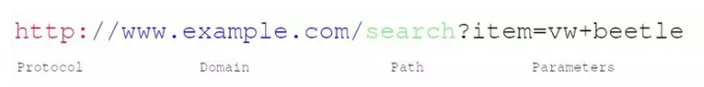

- **Protocol**: Thường là phương thức HTTP (hoặc HTTPs - phương thức bảo mật nâng cấp của HTTP). Các phương thức đáng chú ý khác: FTP (File Transfer Protocal), SMTP (Simple Mail Transfer Protocol) ...
- **Domain**: Tên dùng để định danh một hoặc nhiều địa chỉ IP, nơi mà tài nguyên đang được lưu trữ.
- **Port**: Cổng giao tiếp (HTTP sử dụng cổng mặc định là 80, HTTPS dùng 443).
- **Path**: Chỉ định vị trí tài nguyên trên máy chủ. Nó sử dụng chung logic như vị trí tài nguyên được sử dụng trên thiết bị (máy chủ server)
- **Query Parameters**: Các dữ liệu thêm được sử dụng để xác định hoặc sàng lọc tài nguyên trên server.
- **Fragment**: chỉ định vị trí cụ thể trên trang.

### 5. Phương thức HTTP (HTTP Methods)
HTTP hỗ trợ nhiều phương thức yêu cầu khác nhau, mỗi phương thức có mục đích riêng trong việc xử lý tài nguyên trên máy chủ:
  - `GET`: Yêu cầu truy xuất tài nguyên từ máy chủ (ví dụ: một trang web).
  - `POST`: Gửi dữ liệu đến máy chủ để tạo mới hoặc cập nhật tài nguyên.
  - `PUT`: Tương tự POST, nhưng thường dùng để cập nhật toàn bộ tài nguyên.
  - `DELETE`: Xóa tài nguyên trên máy chủ
  - `HEAD`: Tương tự GET nhưng không trả về phần nội dung chính của tài nguyên, chỉ trả về các tiêu đề.
  - `PATCH`: Cập nhật một phần tài nguyên (khác với PUT cập nhật toàn bộ).
  - `OPTIONS`: Lấy thông tin về các phương thức HTTP mà máy chủ hỗ trợ cho tài nguyên cụ thể.
  - `TRACE`: Dùng cho mục đích debug để vọng lại yêu cầu nhận từ Client, hiếm khi dùng vì lý do bảo mật.
  - `CONNECT`: Sử dụng để thiết lập kênh tới Server qua HTTP Proxy, thường sử dụng cho kết nối SSL/TLS 

### 6. HTTP Requests
**Request Line**
```plaintext
GET/adds/search-result?item=vw+beetle HTTP/1.1
```
Khi một URL chứa một ký tự "?", nghĩa là nó chứa một câu truy vấn. Điều đó nghĩa là nó gửi các tham số cho việc yêu cầu tài nguyên cần thiết.
  - Phần đầu tiên là một phương thức HTTP.
  - Phần thứ 2 là một requested URL
  - Phần thứ 3 là một phiên bản HTTP được sử dụng. Phiên bản 1.1 là phiên bản phổ biến nhất cho các trình duyệt, tuy nhiên 2.0 đang trở nên dần phổ biến.

**Request Headers**: Các thông tin bổ sung
  - Host: Tên miền của máy chủ (vd: example.com).
  - User-Agent: Thông tin về trình duyệt, hệ điều hành của client (vd: Mozilla/5.0).
  - Accept: Các loại dữ liệu mà client có thể xử lý (HTML, JSON, XML,...) (vd: text/html).
  - Content-Type: Loại dữ liệu gửi đi (ví dụ: JSON, XML).

**Request Body (tuỳ chọn)**: Dữ liệu gửi lên (thường gặp trong POST, PUT).
VD: 
```ruby
GET /index.html HTTP/1.1
Host: example.com
User-Agent: Mozilla/5.0
Accept: text/html
```

Một vài thứ quan trọng khác của HTTP request:
- **Referer header**: cho biết URL nguồn từ đâu.
- **User-Agent header**: thông tin thêm về trình duyệt được sử dụng để tạo ra request.
- **Host header**: xác định duy nhất của tên host, nó rất cần thiết khi nhiều trang web được host trên cùng một server.
- **Cookie header**: submit thêm các tham số từ cookie tới server.
- (https://developer.mozilla.org/en-US/docs/Web/HTTP/Reference/Methods)
### 7. HTTP Responses
```plaintext
HTTP/1.1 200 OK
Content-Type: text/html; charset=utf-8
Content-Length: 55743
Connection: keep-alive
Cache-Control: s-maxage=300, public, max-age=0
Content-Language: en-US
Date: Thu, 06 Dec 2018 17:37:18 GMT
ETag: "2e77ad1dc6ab0b53a2996dfd4653c1c3"
Server: meinheld/0.6.1
Strict-Transport-Security: max-age=63072000
X-Content-Type-Options: nosniff
X-Frame-Options: DENY
X-XSS-Protection: 1; mode=block
Vary: Accept-Encoding,Cookie
Age: 7

<!doctype html>
<html lang="en">
<head>
  <meta charset="utf-8">
  <title>A basic webpage</title>
</head>
<body>
  <h1>Basic HTML webpage</h1>
  <p>Hello, world!</p>
</body>
</html>
```
- Phần đầu tiên là phiên bản HTTP được sử dụng
- phần thứ 2 là mã code thể hiện trạng thái của request
- Phần thứ 3 là diễn giải bằng text của mã code phần 2
- Phần thứ 4 là Response Headers
  - Content-Type: Loại dữ liệu
  - Content-Length: Kích thước nội dung phản hồi (tính bằng byte).
  - Date: Thời gian phản hồi.
- Phần thứ 5 là Body: html, css, ...

Một vài thứ quan trọng khác của HTTP reponse:
- **Server header**: thông tin về ngôn ngữ (framework) web server đang sử dụng.
- **Set-Cookie header**: lưu các tham số vào cookie của trình duyệt.
- **Message body**: chuẩn chung của một HTTP response là message body
- **Content-Length header**: cho biết dung lượng của message body.

### HTTP Headers
HTTP headers được thêm vào sau "first line" và được khai báo theo kiểu các cặp: name-value, phân tách bởi dấu chấm phẩy. HTTP headers được sử dụng để gửi thêm các tham số trong các request/response.

Có các loại headers khác nhau và chúng được nhóm thành 4 loại lớn dựa trên cách sử dụng chúng:
  - **General header** - các Headers có thể được sử dụng trong cả request hoặc response và chúng độc lập với data được trao đổi.
  - **Request header** - các Headers định nghĩa các tham số dùng cho việc data requested hoặc đưa ra các thông tin quan trọng trong việc giúp client tạo request.
  - **Response header** - Các tham số chứa thông tin về các response trả về.
  - **Entity header** -  Chứa thông tin về body message.

  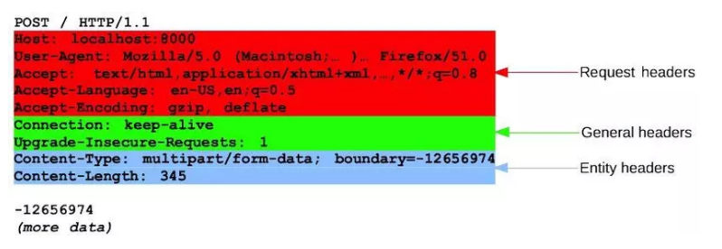

  ### HTTP Session
  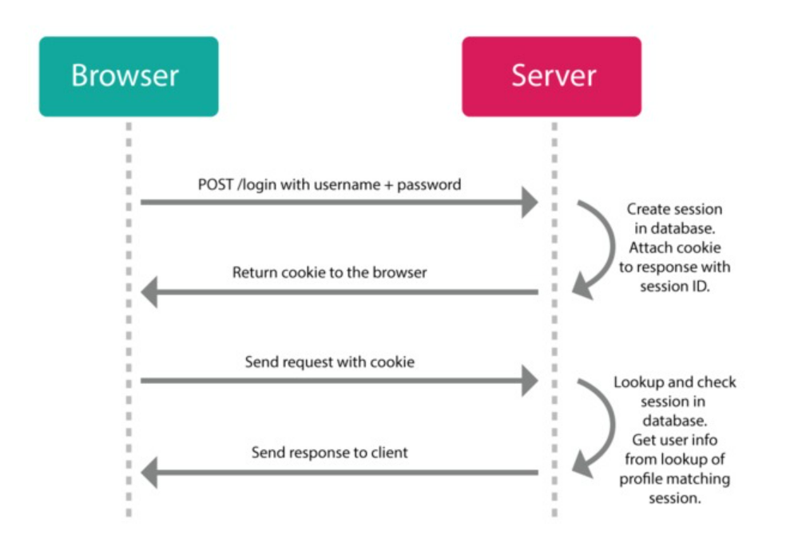

| **Bước**    | **Hành động** |   
| ------------------------------------------------------------------- | ---------------------------------------------------------------------------------------------------------------------------------------------------------------------------------------------------------------------------------------------- |
| **Browser → Server:** `POST /login` với **username + password** | Trình duyệt (client) gửi yêu cầu đăng nhập đến server qua phương thức **POST**, trong phần **body** có thông tin đăng nhập.  |                                                                                                                  
| **Server xử lý:** Tạo **Session** trong database                | Server kiểm tra thông tin đăng nhập (username & password). Nếu đúng:<br>→ Tạo **một bản ghi session** trong cơ sở dữ liệu (ví dụ `session_id = 123abc`).<br>→ Gắn session này với tài khoản người dùng.|                                       
| **Server → Browser:** Gửi **cookie chứa session ID**            | Server trả về phản hồi (Response) và thêm vào **header `Set-Cookie`** — ví dụ: `Set-Cookie: session_id=123abc; HttpOnly; Secure`.<br> Trình duyệt tự động lưu cookie này.|                                                                   
| **Browser → Server:** Gửi yêu cầu khác **kèm cookie**           | Ở các request tiếp theo (ví dụ: truy cập trang cá nhân), trình duyệt sẽ tự động **gửi kèm cookie** trong header:<br>`Cookie: session_id=123abc`.<br> Đây là cách để server biết “người gửi request này chính là user đã đăng nhập trước đó”.|
| **Server xử lý cookie:** Tra cứu session trong database         | Server nhận được `session_id` → tra trong database:<br> Nếu tồn tại và hợp lệ → lấy thông tin user tương ứng.<br> Nếu không tồn tại / hết hạn → yêu cầu đăng nhập lại. |                                                                     
| **Server → Browser:** Trả về phản hồi                           | Sau khi xác thực thành công session, server gửi lại **phản hồi (response)** chứa nội dung yêu cầu (ví dụ: thông tin hồ sơ người dùng). | 

### HTTP Cookie
Cookie HTTP là một phần dữ liệu mà máy chủ gửi đến trình duyệt web. Sau đó, trình duyệt web lưu trữ cookie HTTP trên máy tính của người dùng và gửi nó trở lại cùng một máy chủ trong các yêu cầu sau này, nó được sử dụng để xác định khách hàng và hoạt động như một cách để duy trì thông tin.

Cookie HTTP còn được gọi là web cookie hoặc browser cookie. Và nó thường được gọi là cookie.

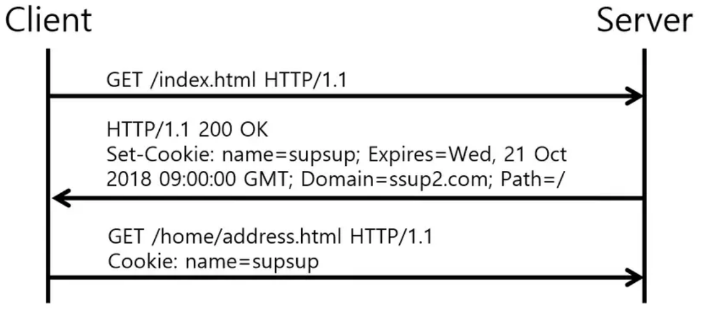

Như ta biết HTTP request chỉ là stateless, vì khi ta gửi hai yêu cầu HTTP tuần tự đến máy chủ, không có liên kết nào giữa chúng. Nói cách khác, máy chủ không thể biết liệu hai yêu cầu có phải từ cùng một trình duyệt web hay không.

Do đó, Cookie được sử dụng để cho biết liệu hai yêu cầu có đến từ cùng một trình duyệt web hay không. Cookie phục vụ các mục đích sau:
- Quản lý Session - cookie cho phép bạn quản lý và duy trì bất kỳ lịch sử browsing nào mà máy chủ(client) cần ghi nhớ. chẳng hạn như thông tin đăng nhập, giỏ hàng, v.v.
- Cá nhân hóa - cookie cho phép bạn lưu trữ thông tin người dùng, chủ đề và cài đặt cụ thể cho người dùng.
- Cookie xác thực - được sử dụng để lưu trữ thông tin liên quan đến trạng thái của người dùng hiện đang đăng nhập vào máy chủ. Loại cookie này lưu trữ thông tin về tài khoản của người dùng, được sử dụng để tiếp tục phiên làm việc. Nếu không có cookie này, người dùng sẽ phải xác thực lại mỗi khi thực hiện yêu cầu HTTP.
- Theo dõi - cookie giúp ghi lại và phân tích các hành vi của người dùng trong quảng cáo.

#### Chi tiết về Cookie

| Thông tin|	Giải thích|
|----------|------------|
| Name |	Tên duy nhất xác định cookie. Tên cookie không phân biệt chữ hoa chữ thường. Nó có nghĩa là Username và username là các cookie giống nhau |
| Value |	Giá trị chuỗi của cookie. Nó phải được mã hóa URL. |
| Domain |	Domain để xác nhận cookie hợp lệ |
| Path | đường dẫn không có tên miền mà cookie sẽ được gửi đến máy chủ. Ví dụ: bạn có thể chỉ định rằng cookie chỉ có thể truy cập được từ trang https://www.yourwebsite.com/dom. Như vậy tại https://www.yourwebsite.com sẽ không gửi thông tin của cookie. |
| Expiration |	Khoảng thời gian cho biết khi nào trình duyệt web sẽ xóa cookie. Ngày hết hạn được đặt thành một ngày ở định dạng GMT: "Wdy, DD-Mon-YYYY HH: MM: SS GMT". Ngày hết hạn cho phép cookie được lưu trữ trong trình duyệt web của người dùng ngay cả sau khi người dùng đóng trình duyệt web. |
| Secure flag |	Nếu được chỉ định, trình duyệt web chỉ gửi cookie đến máy chủ thông qua kết nối SSL (https, không phải http)|

#### Khởi tạo Cookie
- Khi người dùng truy cập vào trang web lần đầu tiên, header mà trình duyệt gửi lên sẽ có dạng sau:
```plaintext
GET /index.html HTTP/1.1
Host: www.example.org
```
Đồng thời, lúc này server không tìm thấy cookie trên request người dùng, chính vì vậy nó sẽ khởi tạo cookie bằng cách gửi lại header như sau:
```plaintext
HTTP/1.0 200 OK
Content-type: text/html
Set-Cookie: theme=light
Set-Cookie: sessionToken=abc123; Expires=Wed, 09 Jun 2021 10:18:14 GMT
Set-Cookie: status=active; Max-Age: 300
Set-Cookie: name=tien; Expires=Wed, 09 Jun 2021 10:18:14 GMT; Max-Age: 300
```
Có thể thấy có 2 cookie được tạo ra:
- Cookie `theme` không có **Expires**, có nghĩa là nó sẽ bị mất sau khi đóng trình duyệt.
- Cookie `sessionToken` có thêm **Expires**, có nghĩa là nó sẽ chỉ bị mất khi hết thời gian hoặc bị xóa bơi người dùng.
- Cookie `status` có trường **Max-Age**, có nghĩa là cookie sẽ bị mất sau: 300 giây.
Trong trường hợp cả **Expire** và **Max-Age** đều có trong cookie thì Max-Age sẽ được ưu tiên hơn.

Sau khi cookie được khởi tạo trên trình duyệt người dùng, các request khác của người dùng lên server sẽ có header dạng như sau:( Trình duyệt chỉ gửi lại cho server keyvalue)
```plaintext
GET /spec.html HTTP/1.1
Host: www.example.org
Cookie: theme=light; sessionToken=abc123
```

**Domain và Path**

2 giá trị này dùng để nói cho trình duyệt biết nơi cookie thuộc về. Vì lý do bảo mật nên cookie chỉ được set domain là domain hiện tại mà trình duyệt truy cập.
  - `Domain` chỉ định tên miền (website) mà cookie này “thuộc về”, tức là chỉ được gửi lại cho các request thuộc domain đó.
  - `Path` chỉ định đường dẫn (path) trên domain mà cookie được gửi kèm khi truy cập.
```plaintext
HTTP/1.0 200 OK
Set-Cookie: LSID=DQAAAK…Eaem_vYg; Path=/accounts; Expires=Wed, 13 Jan 2021 22:23:01 GMT; Secure; HttpOnly
Set-Cookie: HSID=AYQEVn…DKrdst; Domain=.foo.com; Path=/; Expires=Wed, 13 Jan 2021 22:23:01 GMT; HttpOnly
Set-Cookie: SSID=Ap4P…GTEq; Domain=foo.com; Path=/; Expires=Wed, 13 Jan 2021 22:23:01 GMT; Secure; HttpOnly
```
Với dòng đầu tiên có cookie `LSID`, ta có thể thấy rằng:

  - Không có trường Domain, trường Path=/accounts. Điều này có nghĩa là Domain sẽ tự được lấy từ request
  - Dòng thứ 2 và dòng thứ 3 có Domain=.foo.com hay Domain=foo.com và có cùng Path=/. Điều này có nghĩa là domain foo.com hay bất cứ sub-domain nào dạng: sub.foo.com hay tien.foo.com đều có quyền thao tác đến cookie này.

| Thuộc tính | Giá trị mặc định                                       |
| ---------- | ------------------------------------------------------ |
| `Domain`   | Domain của trang hiện tại (ví dụ đang ở `example.com`) |
| `Path`     | Đường dẫn của URL hiện tại (ví dụ `/account/login`)    |

### Proxy

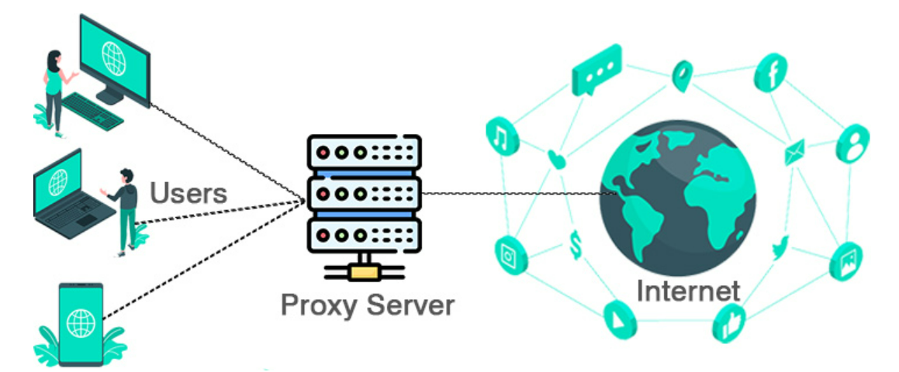


Proxy là một máy chủ trung gian kết nối giữa người dùng và Internet. Khi người dùng truy cập một trang web thông qua Proxy, yêu cầu này sẽ được gửi đến Proxy server trước, sau đó Proxy server sẽ gửi yêu cầu đến trang web đích và nhận kết quả trả về.  Proxy có chức năng tương tự như một bức tường lửa (firewall) hay một hệ thống lọc truy cập trang web nhằm quản lý và đảm bảo tính bảo mật khi sử dụng.

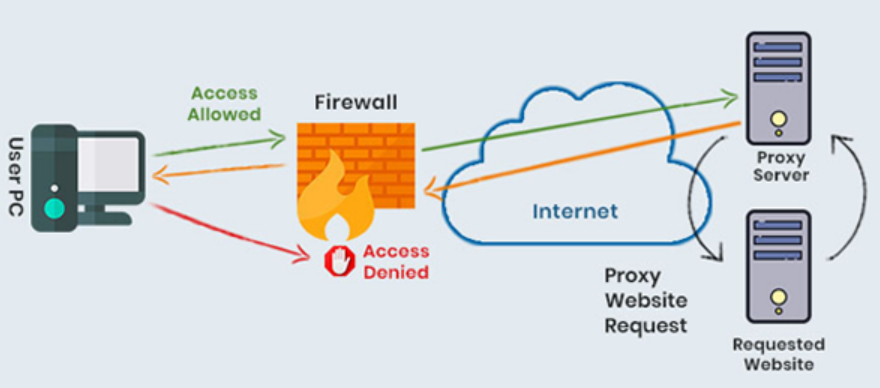

Proxy Server về cơ bản là một máy tính trên Internet với địa chỉ IP của riêng nó mà máy tính của bạn biết. Khi gửi một yêu cầu web, nó sẽ đến Proxy Server đầu tiên. Sau đó, Proxy Server sẽ thực hiện yêu cầu web và thu thập phản hồi từ máy chủ web và chuyển tiếp dữ liệu trang web để người dùng nhìn thấy các trang web trong trình duyệt.

Khi Proxy Server chuyển tiếp yêu cầu web của người dùng, nó có thể thay đổi dữ liệu đó mà vẫn lấy thông tin theo đúng yêu cầu. Máy chủ Proxy có thể thay đổi địa chỉ IP để máy chủ web không thể nắm rõ được chính xác vị trí của người dùng, cùng với đó việc mã hóa dữ liệu cũng giúp nâng cao hơn độ bảo mật trong quá trình vận chuyển. Và cuối cùng Proxy Server có thể giúp chặn các truy cập vào các trang web cụ thể dựa trên địa chỉ IP.

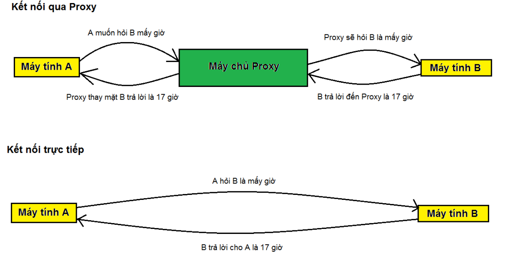

#### Phân loại máy chủ Proxy
| Loại | Đặc điểm |
|-------|----------|
| Máy chủ Proxy Web | Khi một người dùng gửi yêu cầu truy cập một trang web, yêu cầu đó được gửi đến Proxy server thay vì trực tiếp đến máy chủ của trang web. Proxy server này sau đó gửi yêu cầu đó đến máy chủ của trang web và nhận phản hồi từ máy chủ. Cuối cùng, Proxy server chuyển phản hồi đó đến người dùng.|
| Máy chủ nguồn mở  | Máy chủ này giúp ẩn danh mọi thông tin cá nhân của người dùng. Nó được sử dụng để định tuyến lưu lượng truy cập qua các mạng khác nhau nhằm gây khó khăn trong việc theo dõi địa chỉ của người dùng, đồng thời ngăn chặn sự tấn công trái phép từ tin tặc. |
| Máy chủ ẩn danh 12 cấp | Loại Proxy này sử dụng mã hóa để ẩn tất cả các thông tin liên lạc ở nhiều cấp độ. Dữ liệu được mã hóa sau đó được chuyển tiếp qua các bộ định tuyến mạng có mặt ở các vị trí khác nhau. |
| Forward Proxy | Là loại Proxy phổ biến nhất, Forward Proxy hoạt động như trung gian giữa người dùng và internet. Khi người dùng gửi yêu cầu đến một trang web, yêu cầu này sẽ được gửi đến Proxy trước, sau đó Proxy sẽ chuyển tiếp yêu cầu đến trang web và nhận phản hồi, trả về cho người dùng. |
| Reverse Proxy server  | Reverse Proxy server hoạt động ngược lại với Forward Proxy. Reverse Proxy được đặt trước máy chủ web và nhận các yêu cầu từ internet. Proxy sau đó sẽ chuyển tiếp yêu cầu đến máy chủ web phù hợp và trả về phản hồi cho người dùng.|
| Anonymous Proxy | Loại Proxy Server không tiết lộ địa chỉ IP của người dùng cho các trang web mà họ truy cập. Nhờ đó dễ dàng bảo vệ danh tính của người dùng và ngăn chặn việc theo dõi hoạt động trực tuyến của họ. Anonymity Proxy cũng ngăn chặn các trang web sử dụng vị trí địa lý của người dùng để cung cấp nội dung tiếp thị cụ thể.|
| High Anonymity Proxy | Đây là loại Proxy định kỳ thay đổi địa chỉ IP xuất hiện trên máy chủ web, gây khó khăn cho việc theo dõi lưu lượng truy cập của người dùng. Trong các loại Proxy, Proxy ẩn danh cao được đánh giá là một trong những cách an toàn và hiệu quả nhất để truy cập web.|
| Transparent Proxy | Đây là một loại Proxy server hoạt động như một cổng trung gian giữa người dùng và internet mà không làm thay đổi hoặc mã hóa dữ liệu. Nó giúp kiểm soát và giám sát lưu lượng mạng mà không làm ảnh hưởng đến quá trình tương tác với website của người dùng. |
| Common Gateway Interface Proxy (CGI Proxy) | Loại Proxy này dựa trên CGI, một giao thức cho phép máy chủ web thực thi các chương trình trên máy chủ để đáp ứng yêu cầu của người dùng. Tập lệnh CGI hoạt động như một Proxy, thay mặt bạn tìm nạp các trang web.|
| Suffix Proxy | Proxy máy chủ Suffix về cơ bản sẽ thêm tên Proxy vào URL. Loại Proxy này không đảm bảo tính ẩn danh cấp cao. Nó được sử dụng để bỏ qua các bộ lọc web. |
| Rotating Proxies | Đây là một loại Proxy web thay đổi địa chỉ IP thường xuyên. Điều này có nghĩa là mỗi lần người dùng thực hiện một yêu cầu thông qua Proxy, một địa chỉ IP khác được sử dụng sẽ khiến các trang web khó theo dõi hoạt động trực tuyến của người dùng hơn.|
| DNS Proxy | DNS Proxy hoạt động như một trung gian giữa thiết bị của bạn và máy chủ Hệ thống tên miền (DNS). Nó chuyển tiếp các yêu cầu và phản hồi DNS của người dùng, có khả năng mang lại một số lợi thế so với việc truy vấn trực tiếp máy chủ DNS. |

# HTTPs
### 1. Khái niệm HTTPs
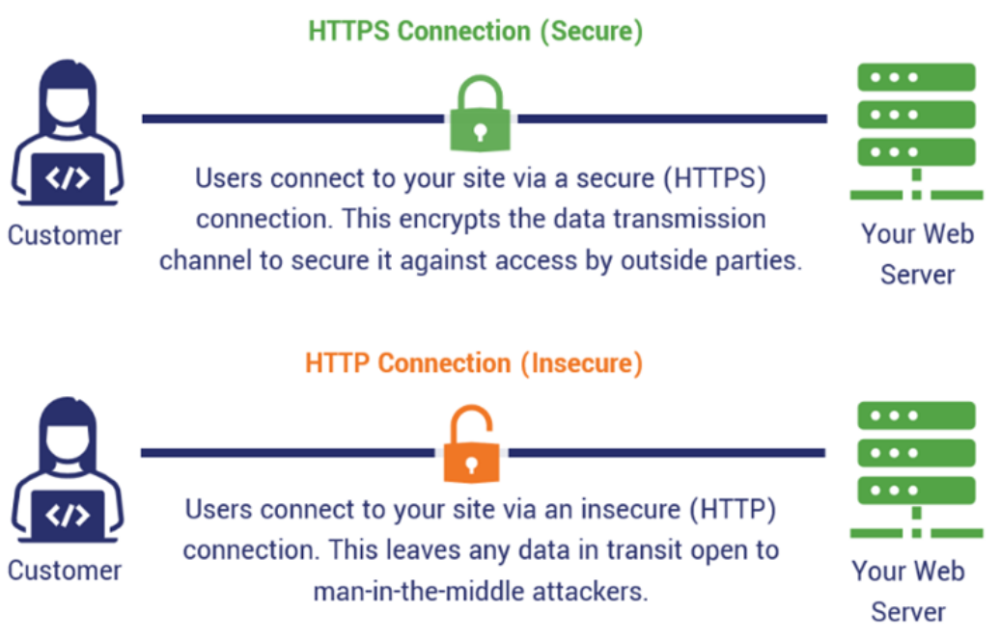

Giao thức HTTPS (HyperText Transfer Protocol Secure) là phiên bản bảo mật của giao thức HTTP, thiết kế để bảo vệ dữ liệu khi truyền qua internet bằng cách mã hóa thông tin. HTTPS thêm một lớp bảo mật bằng cách kết hợp HTTP với công nghệ mã hóa SSL (Secure Sockets Layer) và TLS (Transport Layer Security).

### 2. Cơ chế hoạt động HTTPs
HTTPS hoạt động bằng cách mã hóa dữ liệu truyền tải giữa client (trình duyệt) và server (máy chủ web), sử dụng giao thức TLS (Transport Layer Security) hoặc SSL (Secure Sockets Layer).

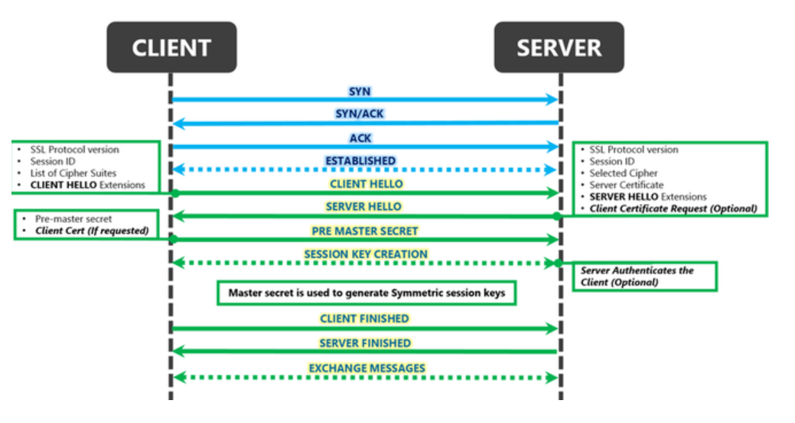

`Bước 1`: **Client Hello**

Khi người dùng truy cập một trang web sử dụng HTTPS, trình duyệt (client) gửi một yêu cầu tới máy chủ (server). Yêu cầu bao gồm:
  - Phiên bản TLS cao nhất mà client hỗ trợ (ví dụ TLS 1.2 hoặc TLS 1.3)
  - Danh sách các cipher suites mà client chấp nhận (ví dụ: TLS_ECDHE_RSA_WITH_AES_256_GCM_SHA384)
  - Client Random: một chuỗi 32 byte ngẫu nhiên (28 byte random + 4 byte timestamp)
  - Các extensions quan trọng: 
    - SNI (Server Name Indication – để biết client muốn kết nối tới domain nào khi server host nhiều domain), 
    - Supported Groups (các đường cong elliptic curve),
    - **Key Share**: client gửi luôn public key tạm thời của mình (thường là X25519 public key – 32 byte)
    - Signature Algorithms, ALPN (Application-Layer Protocol Negotiation), v.v.
→ Đây là tin nhắn đầu tiên, chưa được mã hoá.

```ruby
Client Hello:
    TLS Version: TLS 1.3
    Cipher Suites: AES_256_GCM, CHACHA20_POLY1305
    Random Number: 12345abc
```

`Bước 2`: **Server Hello**

Khi nhận được tin "hello" từ client, server sẽ gửi lại tin nhắn "server hello", tin nhắn này bao gồm:

Server chọn xong mọi thứ và trả lời chỉ trong 1 tin nhắn:
  - Xác nhận dùng TLS 1.3
  - Chọn 1 cipher suite cuối cùng (ví dụ TLS_AES_256_GCM_SHA384)
  - Server Random (32 byte ngẫu nhiên)
  - Key Share: server gửi luôn public key tạm thời của mình (X25519 public key 32 byte)
  - Các extension khác nếu cần
```ruby
Server Hello:
    TLS Version: TLS 1.3
    Chosen Cipher Suite: AES_256_GCM
    Random Number: xyz789
    Certificate: example.com (Đã được xác thực)
```
→ Ngay tại bước này, cả client và server đã có đủ 2 public key tạm thời → cả hai bên tự tính ngay được một bí mật chung gọi là ECDHE shared secret (32 byte) bằng thuật toán Diffie-Hellman trên đường cong elliptic.
Không ai nghe lén biết được bí mật này, dù có private key dài hạn của server.

Từ đây trở đi, mọi tin nhắn đều đã được mã hoá bằng key tạm (Handshake Traffic Keys) sinh ra từ ECDHE shared secret:

Server gửi tiếp (gộp chung trong 1–2 gói TCP):
  - Encrypted Extensions
  - Certificate (chứng chỉ của server – thường ECDSA P-256 hoặc RSA 2048/3072)
  - Certificate Verify (chữ ký chứng minh server có private key tương ứng với chứng chỉ)
  - Finished (một cái hash + MAC của toàn bộ handshake tới lúc này)

`Bước 3`: **Client xác thực chứng chỉ của server**

Client thực hiện các kiểm tra sau với certificate nhận được:

- Giải mã các tin nhắn trên bằng Handshake Traffic Keys
- Kiểm tra chứng chỉ server (chain → root CA tin cậy, hostname đúng, chưa hết hạn, chưa revoke)
- Kiểm tra revocation (CRL hoặc OCSP – tùy cấu hình).
- KKiểm tra chữ ký Certificate Verify
- Kiểm tra tin Finished của server có đúng không
- Gửi lại tin Finished của mình (cũng đã được mã hoá)

→ Khi cả hai bên đều nhận và kiểm tra xong tin Finished của nhau → handshake hoàn tất chỉ trong 1 Round-Trip (1-RTT).

Nếu chứng chỉ không hợp lệ, trình duyệt sẽ cảnh báo: "Kết nối không an toàn" (Your connection is not private).

`Bước 4`: **Tạo session key thật sự (Application Traffic Keys)**
Sau khi Finished thành công:

Cả hai bên dùng HKDF để “nâng cấp” lần cuối từ Handshake Secret → tạo ra Master Secret → sinh ra bộ khóa thật sự dùng cho toàn bộ phiên:

- Client Application Traffic Key (AES-256-GCM hoặc ChaCha20)
- Server Application Traffic Key
- IV, v.v.

→ Đây mới chính là session key mà mọi người hay nói tới (dùng mã hoá toàn bộ dữ liệu HTTP/2, HTTP/3, WebSocket từ lúc tải web trở đi).

`Bước 5`: **Bắt đầu truyền dữ liệu thật**

Từ giây tiếp theo:
- Mọi request/response HTTP đều được mã hoá bằng Application Traffic Keys ở trên.
- Kênh đã hoàn toàn an toàn: xác thực server, Perfect Forward Secrecy, mã hoá từ sớm, chống replay, v.v.

Ví dụ:
```ruby
GET /account HTTP/1.1
Host: example.com
Cookie: session_id=abcd1234
```
# III. DIFFERENT BETWEN HTTP AND HTTPS

| Tiêu chí | HTTP | HTTPS |
|-----------|-------------|---------|
| Bảo mật | Không mã hóa – Dữ liệu truyền tải có thể bị đánh cắp hoặc thay đổi. | Mã hóa – Dữ liệu được bảo vệ khỏi nghe lén, sửa đổi hoặc giả mạo. |
| Chứng chỉ SSL/TLS | Không sử dụng chứng chỉ bảo mật. | Có sử dụng chứng chỉ SSL/TLS để xác thực và mã hóa. |
| Cổng (Port) | 80 (Mặc định) | 443 (Mặc định) |
| Xác thực máy chủ | Không có xác thực, dễ bị tấn công giả mạo. | Có xác thực, đảm bảo kết nối với máy chủ đáng tin cậy. |
| Tốc độ | Nhanh hơn do không có quá trình mã hóa. | Chậm hơn một chút vì cần mã hóa dữ liệu. |
| An toàn dữ liệu | Dễ bị tấn công: - Man-in-the-Middle (MITM) - Eavesdropping (nghe lén). | An toàn hơn: Dữ liệu được mã hóa end-to-end. |
| Ứng dụng | Phù hợp với các trang công khai, không cần bảo mật (ví dụ: blog, diễn đàn mở). | Bắt buộc với các trang cần bảo mật như: - Giao dịch ngân hàng. - Đăng nhập tài khoản. - Thương mại điện tử. |