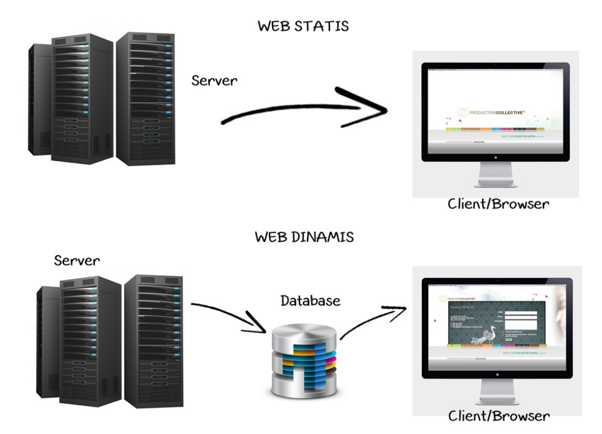
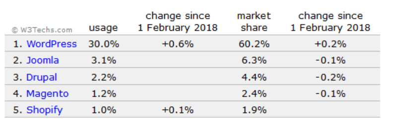
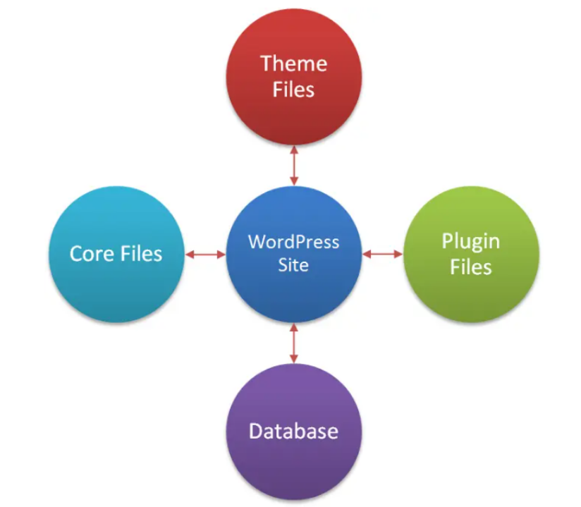
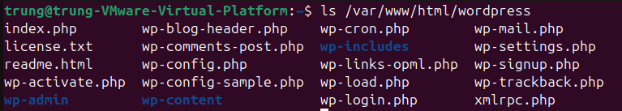

# WORDPRESS
### Web tĩnh – Web động & Sự ra đời của WordPress



WordPress ban đầu chỉ là phần mềm tối ưu cho nền tảng blog –  sau đó phát triển thêm tính năng – trở thành loại CMS – Content Management System – Tức là Hệ Thống Quản trị Nội dung – Cho phép tạo ra những Website phức tạp chứ không chỉ là dạng Blog thông thường.

CMS – chiếm hơn 50% số Websites toàn cầu (trong đó có 30% của WordPress)

Rất nhiều CMS khác viết bằng PHP như Joomla, Drupal, Magento… mỗi loại có ưu nhược điểm khác nhau:

- Drupal hỗ trợ các hệ thống CMS mạnh & phức tạp – thường là các hệ thống xuất bản nội dung lớn như Entertainment Weekly, Taboola..
- Magento hỗ trợ Các trang thương mại điện tử mạnh…
- Joomla là CMS trước đây được đánh giá mạnh hơn WordPress, nhưng hiện nay đã phát triển chậm lại và  không còn phổ biến.

WordPress bùng nổ vì tính linh động và dễ dùng và được phát triển & hỗ trợ liên tục bởi một cộng đồng khổng lồ.

Mặt khác chi phí phát triển & vận hành Website WordPress rất tốt so với bất kỳ CMS nào khác.

Đến năm 2019 WordPress đã chiếm hơn 30% số lượng Websites trên toàn cầu và vẫn tiếp tục tăng, và hiện tại 2020 tiếp tục tăng trưởng đến 35% thị phần



### 1. Khái niệm


**WordPress** là một hệ quản trị nội dung (CMS — Content Management System) mã nguồn mở, viết bằng PHP và dùng cơ sở dữ liệu MySQL/MariaDB để xuất bản các blog, trang web được viết bằng ngôn ngữ lập trình PHP và cơ sở dữ liệu MySQL một cách miễn phí, dễ sử dụng và phổ biến nhất trên thế giới.

**WordPress** không chỉ là vài file PHP — nó là một hệ sinh thái gồm nhiều tầng: server, webserver, PHP runtime, database, mã nguồn WordPress, theme, plugin, API bên ngoài…



#### 1.1) Server / Hosting (Hạ tầng vật lý hoặc cloud)
WordPress cần một môi trường chạy:

Bao gồm:
- Máy chủ vật lý hoặc Cloud (AWS, Google Cloud, DigitalOcean…)
- Hệ điều hành: phổ biến nhất là Linux (Ubuntu, Debian, CentOS)
- Tài nguyên cần có: 
  - CPU
  - RAM
  - Ổ SSD
  - Băng thông mạng

Các loại server phổ biến
- **Shared Hosting** → rẻ, dễ dùng nhưng hạn chế
- **VPS** → mạnh, tùy chỉnh được (đa số doanh nghiệp dùng)
- **Dedicated Server** → dành cho web rất lớn
- **Docker / Kubernetes** → dành cho hệ thống cực lớn

#### 1.2) Webserver (Apache hoặc Nginx hoặc LiteSpeed)
Đây là tầng tiếp theo — tiếp nhận request HTTP từ người dùng, sau đó chuyển request đến PHP để xử lý.

**Tùy chọn phổ biến**
- **Apache** (hỗ trợ .htaccess)
- **Nginx** (hiệu năng cao, không dùng .htaccess)
- **LiteSpeed** (rất nhanh nhưng tính phí)

**Nhiệm vụ**
- Xử lý request
- Cache file tĩnh (CSS, JS, ảnh)
- Reverse proxy
- Áp dụng rewrite rule (để WordPress tạo permalink đẹp)

#### 1.3) PHP (Interpreted runtime environment)
WordPress được viết bằng PHP, nên phải có:

**Thành phần của PHP stack**
- PHP-FPM (FastCGI Process Manager) — xử lý các file .php
- Extensions cần thiết:
  - mysqli (kết nối MySQL)
  - curl
  - json
  - mbstring
  - gd hoặc imagick
  - openssl

**Tại sao PHP quan trọng?**

Vì chính PHP là nơi WordPress:
- đọc file theme
- chạy plugin
- thực thi logic
- truy vấn database
- render HTML gửi cho client

#### 1.4) Database (MySQL / MariaDB / Percona)

WordPress luôn cần database, chủ yếu là:
- MySQL
- MariaDB
- hoặc Percona Server

Trong database WordPress lưu:
- nội dung bài viết
- page
- thông tin user
- cài đặt theme/plugin
- setting của site
- menu
- taxonomy (category, tag)
- metadata của mọi thứ (postmeta, usermeta…)

#### 1.5) WordPress Core ( Mã nguồn WordPress )
Đây là bộ não của toàn bộ hệ thống.

Phần Core được giữ độc lập với phần Front-End – Tức giao diện hiển thị và xử lý bên ngoài Websites mà người dùng nhìn thấy ( Phần này gọi là Theme hay Template).

WordPress Core hay Nhân WordPress – là tất cả các files ngoài Theme, Plugins và các file khác được người dùng thêm vào.

**Gồm 3 thư mục chính**:
```bash
/wp-admin/   → giao diện quản trị
/wp-includes/ → core functions, classes
/wp-content/  → theme, plugin, uploads (thứ duy nhất bạn tác động)
```
**Core xử lý:**
- router (chọn template)
- xử lý permalink
- phân quyền user
- chạy plugin system
- chạy hook + filter
- load theme và các file template
- query bài viết

#### 1.6) Theme (Giao diện WordPress)
Theme là tầng giao diện, nhận dữ liệu từ core và hiện ra thành HTML.

Nhiệm vụ của theme
- định dạng layout
- chọn template (single, page, archive, category…)
- style bằng CSS
- xử lý logic nhỏ (như hiển thị widget, menu)

**Theme không chứa nội dung**: Chỉ hiển thị nội dung lấy từ database.

#### 1.7) Plugin (Chức năng mở rộng)
Plugin cắm vào core bằng hook + filter, giúp WordPress có thêm tính năng. Có thể Tự viết plugin riêng nếu có yêu cầu đặc biệt

Plugins – hay ở nhiều CMS khác gọi là extension/ modules: là phần mở rộng có thể cài thêm vào WordPress để bổ sung hoặc mở rộng tính năng mà WordPress core hay theme không hỗ trợ.

Ví dụ plugin phổ biến
- Yoast SEO (seo)
- WooCommerce (shop)
- Contact Form 7 (form)
- Elementor (drag-and-drop)

Chức năng plugin
- thêm bảng mới vào database
- bổ sung API
- can thiệp vào quá trình render HTML
- thêm menu trong admin
- thêm REST API endpoint

#### 1.8) REST API / External Services
WordPress hỗ trợ REST API để kết nối với dịch vụ ngoài:
- ứng dụng mobile
- web app
- CRM / ERP
- gateway thanh toán
- CDN
- Cloudflare, email service

WordPress REST API là core feature (từ phiên bản 4.7).

#### 1.9) Storage (Uploads + CDN)

Tất cả file như: ảnh, PDF, video, backup, được lưu ở:
```bash
/wp-content/uploads/
```

Hoặc chuyển sang:
- CDN (Cloudflare R2, AWS S3)
- Object storage

#### 1.10) Cache Layer
Để WordPress chạy nhanh, phải có cache:

Các loại cache tầng khác nhau
- **Cache webserver**: FastCGI cache, Nginx cache
- **Plugin cache**: WP Super Cache, W3 Total Cache
- **Object Cache**: Redis / Memcached
- **Browser Cache**
- **CDN Cache**

Cache là lý do WordPress có thể xử lý hàng triệu traffic.

#### 1.11) Security Layer
- Ví dụ: tường lửa (WAF), 
chặn brute-force, 
bảo vệ XMLRPC, 
quét malware, 
hạn chế upload, 
SSL / HTTPS.
#### 1.12) Backup Layer
backup database, backup file, snapshot server, replication → master/slave
### 2. Ưu và nhược điểm của WordPress
#### 2.1 Ưu điểm
- **Miễn phí**: WordPress là mã nguồn mở, tải xuống và sử dụng miễn phí.
- **Dễ sử dụng**: Giao diện trực quan, thao tác đơn giản, phù hợp cho người ít kiến thức lập trình.
- **Phổ biến toàn cầu**: Hơn 45% website trên thế giới sử dụng WordPress, dẫn đầu các nền tảng CMS.
- **Mã nguồn mở**: Tự do tùy chỉnh giao diện, plugin và quản lý website.
- **Bảo mật cao**: Đội ngũ chuyên nghiệp cải thiện liên tục, các sự cố bảo mật thường do lỗi người dùng.
- **Tùy chỉnh linh hoạt**: Đa dạng theme, dễ sửa chữa và thiết kế giao diện theo ý muốn.
- **Thư viện plugin và theme phong phú**: Nhiều tùy chọn miễn phí và trả phí để mở rộng tính năng.
- **Không cần biết code**: Xây dựng website dễ dàng qua thao tác kéo thả, không đòi hỏi kỹ năng lập trình.
- **Hỗ trợ developer**: Phù hợp để mở rộng tính năng cho người có kiến thức HTML, CSS, PHP.
- **Cải thiện trải nghiệm người dùng**: SEO dễ dàng hơn, tiết kiệm thời gian so với xây dựng CMS từ đầu.
- **SEO-Friendly**: WordPress được xây dựng với mục tiêu tối ưu hóa công cụ tìm kiếm (SEO: search engine optimization). Nó tạo ra các URL rõ ràng và dễ đọc, cho phép quản lý thẻ meta dễ dàng và hỗ trợ nhiều plugin SEO khác nhau để nâng cao khả năng hiển thị trang web của bạn trên các công cụ tìm kiếm.
#### 2.2 Nhược điểm
- **Bảo mật kém**: Dễ bị tấn công nếu không cập nhật phiên bản và plugin thường xuyên.
- **Phụ thuộc plugin bên thứ ba**: Có thể gây xung đột hoặc không tương thích với WordPress.
- **Tốc độ tải trang chậm**: Sử dụng theme nặng hoặc nhiều plugin không hợp lý có thể ảnh hưởng hiệu suất.
- **Hạn chế của theme miễn phí**: Thiếu tính năng và khả năng tùy chỉnh, cần nâng cấp để đáp ứng nhu cầu.
### 3. Những loại Website có thể tạo bởi WordPress
- **Blog**
- **Portfolio**
- **Website doanh nghiệp**

### 4. WordPress.com vs WordPress.org
WordPress.com và WordPress.org là hai phiên bản của nền tảng quản lý nội dung (CMS) WordPress, mỗi phiên bản có những đặc điểm riêng biệt:

**WordPress.com:**
- Là một nền tảng cung cấp dịch vụ tạo và quản lý trang web trực tuyến: Hoạt động dựa trên mô hình dịch vụ lưu trữ trực tuyến (hosted service), bạn không cần phải tự cài đặt WordPress lên máy chủ của mình.
- `.com` giới hạn phạm vi tùy chỉnh, bạn chỉ có thể sử dụng các theme và plugin được chọn sẵn bởi nền tảng. Không thể tự cài đặt theme và plugin từ bên ngoài.
- Quản lý và bảo mật máy chủ do WordPress.com đảm nhiệm, giúp người dùng tập trung vào nội dung và chạy trang web mà không phải quan tâm đến việc quản lý máy chủ.

**WordPress.org:**
- Là phiên bản mã nguồn mở của WordPress và được cung cấp miễn phí tại trang web wordpress.org.
- Bạn phải tự tải xuống mã nguồn và cài đặt WordPress lên máy chủ riêng của mình hoặc dịch vụ lưu trữ máy chủ của bên thứ ba.
- Bạn hoàn toàn tự do tùy chỉnh website, sử dụng bất kỳ theme và plugin nào bạn muốn. Điều này cho phép bạn tạo một trang web hoàn toàn độc đáo và theo ý muốn.
- Bạn phải tự chịu trách nhiệm quản lý và bảo mật máy chủ hoặc tùy chỉnh các thiết lập cần thiết để chạy WordPress.

| Đặc điểm | 	WordPress.com |	WordPress.org |
|----------|------------------|---------------|
| Hosting |	Được cung cấp bởi WordPress.com	| Bạn tự quản lý hosting hoặc sử dụng dịch vụ hosting của bên thứ ba |
| Cài đặt và quản lý |	Không cần tự cài đặt, chỉ cần đăng ký tài khoản và bắt đầu sử dụng |	Bạn phải tự cài đặt WordPress trên máy chủ của mình và tự quản lý |
| Tùy chỉnh |	Giới hạn về tùy chỉnh, không thể truy cập vào mã nguồn của trang web |	Hoàn toàn có thể tùy chỉnh và truy cập vào mã nguồn của trang web |
| Plugin và chủ đề | Giới hạn trong việc cài đặt plugin và chủ đề, chỉ có thể sử dụng các plugin và chủ đề được phê duyệt bởi WordPress.com |	Có thể cài đặt và sử dụng bất kỳ plugin và chủ đề nào mà bạn muốn|
| Quảng cáo |	WordPress.com có thể hiển thị quảng cáo trên trang web của bạn, nếu bạn không nâng cấp lên gói trả phí |	Không có quảng cáo được hiển thị mặc định|
|Kiểm soát và tự do| 	Kiểm soát và tự do ít hơn về việc quản lý và tùy chỉnh trang web |	Có kiểm soát và tự do tối đa về quản lý và tùy chỉnh trang web |
| Phí |	Có các gói trả phí với các tính năng mở rộng, như loại bỏ quảng cáo, tên miền tùy chỉnh và lưu trữ nâng cao |	WordPress.org là miễn phí, bạn chỉ phải trả phí cho tên miền và hosting (nếu áp dụng)|
| Bảo trì | WordPress.com tự lo việc bảo trì, cập nhật, sao lưu. | Bạn phải tự chịu trách nhiệm về bảo trì, cập nhật, sao lưu.|
| Phù hợp cho | Người mới bắt đầu, blogger cá nhân không yêu cầu tùy biến cao, muốn sự đơn giản. | Doanh nghiệp, blogger chuyên nghiệp, cửa hàng online, người muốn toàn quyền kiểm soát website.|
| SEO | Gói miễn phí có dạng `tenban.wordpress.com.` Muốn tên miền riêng phải trả phí. |Bạn có toàn quyền sử dụng tên miền riêng (ví dụ:` interdata.vn`).|

### 5. Cơ chế hoạt động của WordPress
Mỗi khi người dùng truy cập vào một trang WordPress, hàng chục tệp PHP và hàng trăm hàm sẽ được thực thi để tạo ra nội dung HTML gửi về trình duyệt.
#### 5.1 Request bắt đầu: PHP nhận yêu cầu từ web server
Khi người dùng truy cập một URL:
```plaintext
https://example.com/san-pham/ao-thun/
```
Trình duyệt gửi HTTP request đến webserver (Apache, Nginx, LiteSpeed…).

Webserver thường cấu hình:

Apache → `.htaccess rewrite`

Nginx → `try_files $uri /index.php?$args`

Web server (Apache hoặc Nginx) định tuyến yêu cầu đến file `index.php` trong thư mục gốc của WordPress.
  - Đây là **entry point** (điểm vào) cho mọi request trong WordPress.
#### 5.2 Bootstrap WordPress — nạp toàn bộ hệ thống
File index.php chỉ chứa 1 dòng:
```php
require( dirname( __FILE__ ) . '/wp-blog-header.php' );
```
`wp-blog-header.php` → gọi `wp-load.php`: nơi bắt đầu quá trình bootstrap toàn bộ hệ thống.

`wp-load.php` → nạp file `wp-config.php`

Trong `wp-config.php`, WordPress:
- Load thông tin database
- Load salts, keys
- Định nghĩa constants quan trọng
- Tạo kết nối MySQL

Nạp `wp-settings.php`

Đây là file “khởi động lõi” WordPress, include các core gồm:
- Load toàn bộ files biến toàn cục, include các core file như `plugin.php`,` functions.php` trong wp-includes (core)
- Các plugin được kích hoạt từ bảng `wp_options` (option `active_plugins`). Nếu là multisite, nạp thêm plugin mạng (mu-plugins).
  - plugins_loaded
  - init
  - after_setup_theme

Giai đoạn này cũng khởi tạo kết nối database thông qua lớp `wpdb` và load các option có cờ `autoload = 'on'` hoặc `'auto'` vào biến `$alloptions`. Đây là bước có ảnh hưởng lớn tới tốc độ khởi tạo của mỗi request.

#### 5.3 WordPress phân tích URL → tạo WP_Query
Khi hệ thống đã sẵn sàng, WordPress bắt đầu xác định: trang nào cần hiển thị bằng cách phân tích URL. 
  - WordPress tạo ra một đối tượng `WP_Query` để truy vấn cơ sở dữ liệu.
  - WordPress so khớp URL với bảng rewrite rules.
  - Map URL vào loại nội dung( post, page, archive, taxonomy,...)
  - Tạo đối tượng `$wp_query` tương ứng với loại nội dung: trang chủ, bài viết, chuyên mục, tìm kiếm, 404, v.v…
  - VD: Tạo đối tượng **WP_Query** xác định:
    - Đây là single custom post type `product`
    - Lấy bài có slug `ao-thun`
    - Lấy meta, categories, thumbnail,…
  - Thực hiện truy vấn database qua lớp `wpdb` để lấy dữ liệu post, meta, term, và comment.
Luồng hooks quan trọng:
- `parse_request`
- `pre_get_posts`
- `the_posts`
- `template_redirect`

#### 5.4 Load Template Hierarchy
Khi đã có dữ liệu, WordPress xác định file template tương ứng để render. Hệ thống tìm kiếm template theo thứ tự ưu tiên (template hierarchy).

- Đối với một bài viết: `single-{post-type}.php` → `single.php` → `index.php`
- Đối với trang: `page-{slug}.php` → `page.php` → `index.php`
- Đối với category: `category-{slug}.php` → `category.php` → `archive.php` → `index.php`

Hàm chịu trách nhiệm chọn template là `get_query_template()`. Sau đó WordPress nạp template và truyền dữ liệu post vào trong vòng lặp `have_posts()`.

WordPress không load theo kiểu “tìm nhiều file rồi merge”.
 Nó chỉ chọn file đầu tiên phù hợp và load đúng 1 file đó làm template chính.

Sau khi chọn template, WordPress load file theme (header.php, footer.php, sidebar.php) thông qua các hàm get_header(), get_footer(), get_sidebar() bên trong template chính.

#### 5.5 Output: gửi dữ liệu ra trình duyệt
- Kết quả được "gắn" dữ liệu từ CSDL vào các template HTML.
- Sau khi HTML được sinh ra, WordPress gửi nội dung này về trình duyệt thông qua output buffer của PHP. Nếu có plugin cache như `WP Super Cache` hoặc` LiteSpeed Cache`, response có thể được lưu lại để phục vụ cho request sau mà không cần khởi tạo toàn bộ quá trình trên.
- Browser nhận HTML → bắt đầu tải CSS/JS → hiển thị giao diện.

#### 5.6 Hệ thống HOOKS - linh hồn mở rộng của WordPress

### 6. Giao diện sử dụng WordPress (Đã cài đặt trên Ubuntu)

- **Dashboard**: Là bảng điều khiển trang web dành cho quản trị viên. Đó chính là màn hình đầu tiên mà người dùng nhìn thấy khi đăng nhập vào khu vực quản trị WordPress. **Dashboard** là nơi giúp người tạo lập và kiểm soát hầu hết các chức năng trên trên website của mình.


- **Themes WordPress (WordPress template)**: Là giao diện của website hoặc blog sử dụng WordPress. Có rất nhiều themes wordpress, bao gồm miễn phí và trả phí.


- **WordPress Plugin**: Đây là các thành phần mở rộng của WordPress, được chia sẻ trên kho Plugin của WordPress. Những Plugin này do chính những người trong nhóm sáng lập WordPress viết ra hoặc cũng có thể do người dùng tự viết và chia sẻ. Plugin này cũng có 2 dạng: 1 dạng miễn phí và 1 dạng phải trả phí.


- **Posts**: Là nơi tạo và quản lý các nội dung theo dạng blog, thường được sắp xếp theo thời gian và có thể gắn thẻ (tags) và danh mục (categories)

  - All posts: Quản lý tất cả các bài viết.
  - Add new: Đăng bài viết mới.
  - Categories: Quản lý tất cả các danh mục.
  - Tags: Quản lý tất cả các Post Tag.


**Trang (Pages)**: nơi tạo và quản lý các nội dung tĩnh, ít thay đổi như trang giới thiệu, trang liên hệ, trang dịch vụ, v.v.


**Thư viện Media (Media Library)**: nơi tải lên và quản lý các tệp đa phương tiện như hình ảnh, video, âm thanh để sử dụng trong bài viết và trang web


- **Comments**: Trang quản lý các ý kiến bình luận trên website của bạn. Bạn có thể xoá hoặc cấm bất kỳ người nào sử dụng chức năng này trên web của bạn.

- **Feedback**: Là trang quản lý những hồi âm, liên hệ của khách hàng gửi cho bạn.

- **Users**: Trang quản lý người dùng đã đăng ký sử dụng tại website của bạn. Bạn có thể thêm, xoá hoặc phân quyền cho bất kỳ người dùng nào tại trang này.

- **Users**: Trang quản lý người dùng đã đăng ký sử dụng tại website của bạn. Bạn có thể thêm, xoá hoặc phân quyền cho bất kỳ người dùng nào tại trang này.

- **Tools**: Trang quản lý xuất/nhập dữ liệu. Bạn có thể xuất ra file để làm file backup cho website phòng trường hợp website của bạn bị hack, bị mất dữ liệu trong tương lai, từ đó bạn có thể sử dụng công cụ import để khôi phục lại dữ liệu đã export.

- **Settings**: Trang chỉnh sửa các thông số chung cho website như url của web, timezone, Date Format, cấu trúc đường dẫn,…. Thông thường việc quản lý và chỉnh sửa thông số của các Plugin cũng được thực hiện tại đây.

**Tìm hiểu thêm tại `https://vietnix.vn/cach-su-dung-wordpress/#dashboard-bang-dieu-khien`**

### 7. Thư mục file WordPress



#### 7.1) CORE APPLICATION

**Nơi chứa toàn bộ logic chính của WordPress**

`wp-includes`

→ *Đây là toàn bộ "bộ não" WordPress*

Chứa:

* WP_Query (truy vấn database)
* WPDB (kết nối MySQL)
* Media API
* Rewrite API
* REST API
* Hooks (actions/filters)
* Cron system
* Ajax API
* Template loader
* L10n/i18n (dịch ngôn ngữ)
* Sanitization / Formatting API

**TÓM LẠI**: *bất cứ thứ gì liên quan đến bản chất WordPress đều nằm trong wp-includes.*

#### 7.2) ADMIN INTERFACE (Dashboard)

**Giao diện quản trị `wp-admin`**
- tất cả các trang Dashboard (Posts, Media, Pages…)
- CSS/JS của admin
- xử lý form
- xử lý update plugin/theme

#### 7.3) THEME SYSTEM (Frontend Renderer)

```bash
wp-content/themes/`
```
Chứa:

* giao diện người dùng
* template PHP
* CSS/JS frontend
* functions.php (hook vào core)

#### 7.4) PLUGIN SYSTEM (Extend Features)
```bash
wp-content/plugins/
```

Chứa:

* plugin mở rộng
* custom post type
* custom API
* WooCommerce, SEO plugin, Security plugin…

```bash
wp-content/mu-plugins/
```
Must-use plugins (autoload)

#### 7.5) CONTENT STORAGE (User Data, Uploads)

```bash
wp-content/uploads/
```

Chứa toàn bộ:

* hình ảnh
* media
* file user upload
* file PDF, docs
* thumbnail các size

→ Đây chính là **data của người dùng**, không thuộc WordPress core.

#### 7.6) BOOTSTRAP & CONFIGURATION

**Các file root ở ngoài cùng**

 **6.1 File bootstrap chính**

| File                   | Vai trò                          |
| ---------------------- | -------------------------------- |
| **index.php**          | Entry point của mọi request      |
| **wp-blog-header.php** | Load query + theme               |
| **wp-load.php**        | Load wp-config & wp-settings     |
| **wp-settings.php**    | Khởi động toàn bộ WordPress Core |

✔ Thuộc phần: **Bootstrap Layer**

---

 **6.2 File cấu hình**

| File                     | Vai trò                           |
| ------------------------ | --------------------------------- |
| **wp-config.php**        | DB, keys, salts, debug, constants |
| **wp-config-sample.php** | File mẫu                          |

✔ Thuộc phần: **Configuration Layer**

---

 **6.3 Cron & Background Tasks**

| File            | Vai trò                                 |
| --------------- | --------------------------------------- |
| **wp-cron.php** | Giả lập cronjob, xử lý scheduled events |

✔ Thuộc phần: **System Task Layer**

---

 **6.4 Login, Signup, Security**

| File                     | Vai trò                                  |
| ------------------------ | ---------------------------------------- |
| **wp-login.php**         | Form đăng nhập                           |
| **wp-signup.php**        | Multisite đăng ký                        |
| **wp-activate.php**      | Multisite kích hoạt                      |
| **xmlrpc.php**           | API XML-RPC (mobile app, remote posting) |
| **wp-comments-post.php** | Xử lý gửi comment                        |

---

 **6.5 Các file metadata / info**

| File            | Vai trò             |
| --------------- | ------------------- |
| **license.txt** | GPLv2 license       |
| **readme.html** | Thông tin phiên bản |

---


| Thành phần hệ thống        | Folder / File tương ứng                                     |
| -------------------------- | ----------------------------------------------------------- |
| **Core System (logic)**    | wp-includes                                                 |
| **Admin System**           | wp-admin                                                    |
| **Theme Layer (frontend)** | wp-content/themes                                           |
| **Plugin Layer (extend)**  | wp-content/plugins, mu-plugins                              |
| **Assets Storage**         | wp-content/uploads                                          |
| **Bootstrap**              | index.php, wp-blog-header.php, wp-load.php, wp-settings.php |
| **Configuration**          | wp-config.php                                               |
| **Authentication**         | wp-login.php, wp-signup.php, wp-activate.php                |
| **API / Integration**      | xmlrpc.php, wp-comments-post.php                            |
| **Cron system**            | wp-cron.php                                                 |
| **Documentation**          | readme.html, license.txt                                    |


