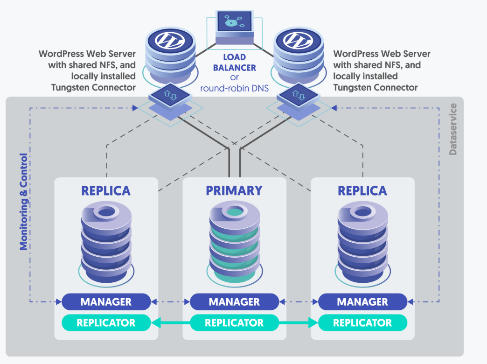
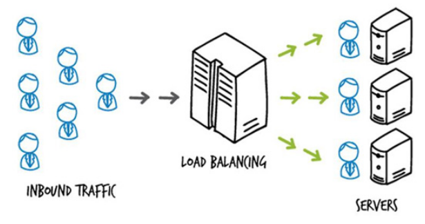

# Tìm hiểu về Wordpress HA
## 1. WordPress HA là gì?
WordPress HA (High Availability) là kiến trúc triển khai WordPress đảm bảo khả năng sẵn sàng cao, nghĩa là website WordPress luôn hoạt động ổn định, giảm thiểu tối đa thời gian gián đoạn dịch vụ khi xảy ra lỗi phần cứng, lỗi mạng hoặc bảo trì thông qua các tính năng dự phòng, cân bằng tải và đồng bộ hóa dữ liệu.
- **Pageviews (PV)**: số lần trang được tải (một người refresh nhiều lần vẫn tính nhiều)
- **Visits / Sessions**: số phiên truy cập (một người vào web rồi lướt trong một khoảng thời gian)
- **Users / Visitors**: số người dùng (thường là unique users)
- **Hits**: số request tới server (ít dùng để đánh giá vì 1 trang có thể tạo rất nhiều hit)
- **Traffic website**: cách nói chung cho tất cả mấy chỉ số trên



**Các thành phần chính của HA**
- Load balancer
- Cụm server web
- Cụm cơ sở dữ liệu
- Lưu trữ chia sẻ
- Cơ chế failover tự động
## 2. Tại sao cần HA cho WordPress?
- Website không bị downtime, đảm bảo trải nghiệm người dùng.
- Hạn chế mất doanh thu (đối với website thương mại điện tử).
- Tăng độ tin cậy và uy tín của hệ thống.
## 3. Kiến trúc WordPress HA cơ bản
### 3.1 Load Balancer (Cân bằng tải):



- Phân phối request đến nhiều server backend chạy WordPress. Là bộ chia tải( phân phối lưu lượng truy cập) và bảo vệ hệ thống khỏi sập.
- Chuyển hướng khi một server gặp lỗi
- Tăng khả năng mở rộng.
- Một load balancer (Cân bằng tải) hoạt động như "traffic cop" (cảnh sát giao thông) ngồi ở phía trước server và routing các request của client trên tất cả các server có khả năng thực hiện các request đó, sao cho tối ưu về tốc độ và hiệu suất nhất và đảm bảo rằng không có server nào phải hoạt động quá mức.

- Nếu một server đơn lẻ bị hỏng, cân bằng tải (load balancer) sẽ chuyển hướng lưu lượng truy cập đến các server trực tuyến còn lại. Khi một server mới được thêm vào nhóm máy chủ, bộ cân bằng tải sẽ tự động bắt đầu gửi yêu cầu đến máy chủ mới thêm này.
- Ví dụ: Nginx, HAProxy hoặc AWS Elastic Load Balancing.

#### 3.1.1 Health Check
LB định kỳ kiểm tra tình trạng của backend server: 
  - Ví dụ: 2-5 giây / lần.
  - Gửi request thử tới server
  - Xem server có phản hồi đúng không.

**Load Balancer VIP PRO – Health Check Checklist**

(Website / WordPress)

| Layer | Thành phần kiểm tra | Cách LB kiểm tra | Ví dụ | Lỗi phát hiện được |
|------:|--------------------|------------------|-------|--------------------|
| L1 | Network | ICMP / Route reachability | ping 10.0.0.5 | VM chết, network partition |
| L2 | TCP / Port | TCP handshake | connect :80 / :443 | Nginx/Apache down, firewall block |
| L3 | TLS / SSL | TLS handshake, cert validity | openssl s_client | Cert hết hạn, SSL config lỗi |
| L4 | HTTP | HTTP status code | GET /health → 200 | 500, 502, timeout |
| L5 | Runtime (PHP-FPM) | Ping / pool status | /php-fpm-ping → pong | PHP-FPM chết, pool full |
| L6 | Application | App boot & logic | wp-load.php | Fatal error, plugin lỗi |
| L7 | Database | DB connect & query | SELECT 1 | DB down, failover chưa xong |
| L7 | Cache | Get / Set test key | Redis ping | Cache crash, memory full |
| L7 | Storage | Read / Write file | touch test.txt | NFS/EFS treo |
| L8 | Performance | Latency / error rate | RTT > 2s | Server quá tải |
| L9 | Security | Integrity / version | checksum / token | Deploy lỗi, tamper |

---

**Health Decision Rules (Ví dụ)**

- **Hard fail**: DB / Runtime / HTTP fail → remove node khỏi pool
- **Soft fail**: Latency cao → giảm traffic
- **Recovery**: Health OK N lần liên tiếp → warm-up → nhận traffic dần

#### 3.1.2 Giữ **Session/Login** ổn định:
- Trong **WordPress** có hỗ trợ **Login/Admin/WooCommerce cart** để giữ ổn định
- Trong **LB** có hỗ trợ **StickySession**(Cơ chế LB nhằm đảm bảo trong phiên login 1 user chỉ gắn với 1 BackendSever duy nhất ) hoặc dùng cache **Redis** or **SessionDB**(dùng trong cơ chế LB - **SharedSessions**)
- SSL Termination:
    - SSL xử lí tại **LoadBalancer**
    - BackEnd chỉ dùng HTTP nội bộ(Giảm tải WebSever, Dễ dàng quản lí chứng chỉ)
---
### 3.2 Nhiều Web Server chạy WordPress - WebNode:
- Một máy/Instance/Sever độc lập them gia vào hệ thống.
  - Nó có thể là VM(EC2,OpenStack,VMware),PhysicalSever,ContainerHost
- Các instance WordPress chạy song song (ngang hàng), bhận HTTP/HTTPS request → xử lý → trả response cho client
- Mỗi web node là 1 bản sao giống nhau về chức năng
- Khác nhau duy nhất: IP / hostname / instance ID
- Mã nguồn đồng bộ qua NFS, EFS, GlusterFS hoặc CI/CD.
### 3.3 Shared Storage (Lưu trữ chung):
- **Shared Storage** là hệ thống file system dùng chung, nhiều server mount cùng 1 thư mục.
- **Object Storage** là kho lưu trữ dữ liệu dưới dạng Object, cho phép truy cập thông qua API, phù hợp cho việc lưu trữ dữ liệu phi cấu trúc với khả năng mở rộng lớn.
- Củ thể trong wordpress chia sẻ thư mục `wp-content/uploads` giữa các node, giống như local disk, nhưng thực ra là storage chung.

- Có thể dùng NFS, EFS (AWS), hoặc plugin đồng bộ S3.
#### 3.3.1 Cách hoạt động
- **Shared Storage**:
  - Dữ liệu dùng chung với nhiều máy
  - Thường dùng dưới dạng file system(nhiều Sever dùng chung ổ đĩa logic hay còn gọi `mount disc`)
  - Giúp cho các WebNode sử dụng chung thư mục `wp-content` thông qua mạng
```python
Web1 ─┐
      ├─ NFS / EFS / NAS ── Disk server(/data/wp-content)
Web2 ─┘
```
- **Object Storage**:
  - Mỗi **Object** gồm: Data, MetaData, Object ID -> Truy cập qua **API(HTTP/REST)**, không mount như ổ đĩa
  - Khả năng Scale rất lớn( khả năg chịu truy cập cũng như dung lượng file or object)
  - Không mount trực tiếp như file truyền thống
  - Phù hợp lưu file tĩnh, ảnh, video, backup: `PUT object, GET object, DELETE object`
#### 3.3.2 Ưu điểm
- **Shared Storage**:
  - Đảm bảo dữ liệu nhất quán: Mọi server nhìn thấy cùng 1 file
  - Loại bỏ SPOF ở tầng web: Web1 chết → Web2 vẫn dùng được data
  - Phục vũ hệ thống HA: App chạy nhiều node
  - Giảm rủi ro mất dữ liệu: Dữ liệu không nằm cục bộ 1 server
- **Object Storage**
  - Lưu trữ dữ liệu phi cấu trúc với khả năng rất lớn
  - Phục vụ lượt truy cập đồng thời cao
  - Giảm tải cho Webserver
  - Backup & Archive
### 3.4 Database Cluster:
- Tập hợp nhiều máy chủ cơ sở dữ liệu MySQL hoạt động cùng nhau trong một mô hình cluster(mô hình các nodes chạy như thể thống nhất), nhằm đảm bảo tính **HA, Data Consistency, Scalability**
- Trong HA, ta KHÔNG dùng 1 DB duy nhất, mà dùng nhiều DB node tạo thành DB Cluster.
- MySQL replication (Master-Slave hoặc Multi-Master).
- Hoặc dùng dịch vụ Database Managed (Amazon RDS Multi-AZ).
- Trong kiến trúc WordPress HA, DB đóng vai trò lưu dữ liệu cốt lõi như: **posts**, **users**, **comments**, **options**.
- DB Nodes có hai mô hình MySQL chính đó là **Primary/Replica** và **Galera**

**Primary/Replica**
```python
          WRITE
           ↓
        Primary
        (RW)
           ↓ Replication
     ┌─────────────┐
     ↓             ↓
 Replica1       Replica2
   (RO)            (RO)
```
- **Primary**: ghi + đọc: xử lí ghi(INSERT, UPDATE, DELETE)
- **Replica**: chỉ đọc: Đồng bộ dữ liệu đọc từ Primary và xử lí đọc SELECT
- Ổn định, dễ triển khai và ổn định nhưng Primary là SPOF(Có thể delay dữ liệu), Failover phức tạp
- Phù hợp website WordPress read nhiều hơn write, phù hợp đồ án hay hệ thống vừa và nhỏ.

**Galera Cluster (Multi-Master)**
```python
   Node1 ←→ Node2 ←→ Node3
   (RW)     (RW)     (RW)
```
- Tất cả các node đều có thể ghi 
- Synchronous replication
- Không cần promote
- Failover cực nhanh
- Data nhất quán mạnh
- Tất cả node giống nhau

## 4. NFS là gì
- **NFS(Network File System) - Hệ thống tệp qua mạng**: cho phép một máy tính(client) truy cập thư mục hoặc tệp nằm trên máy khác( Server) như thể chúng đang nằm trên ổ cứng cục bộ

### 4.1 Cách hoạt động của NFS
  - **Export(Chia sẻ)**: Trên Server, bạn chỉ định thư mục nào muốn chia sẻ( ví dụ: `/var/www/wordpress`) và cho phép những IP nào được truy cập thông qua `/etc/exports`.
  - **Mount( Kết nối)**: Trên Client, bạn thực hiện lệnh `mount`. Hệ điều hành Client sẽ tạo ra một điểm kết nối ảo trỏ đến địa chỉ IP của Server.
  - **Truy xuất**: Khi người dùng trên Client mở một tệp tin trong thư mục đã mount:
    - Yêu cầu được gửi qua mạng tới Server bằng giao thức RPC (Remote Procedure Call).
    - Server xử lý yêu cầu, đọc/ghi tệp tin trên ổ cứng thực của nó.
    - Server gửi kết quả trả lại cho Client
    - Người dùng thấy kết quả ngay lập tức như đang dùng máy cục bộ

### 4.2 Mục đích của NFS
- **Tập trung dữ liệu**: Bạn chỉ cẩn lưu trữ tệp tin tại một nơi duy nhất(Server). Điều này giúp quản lý và sao lưu(backup) dễ dàng hơn.
- **Chia sẻ tài nguyên**: Nhiều máy Client có thể cùng đọc và ghi vào một thư mục cùng lúc.
- **Tiết kiệm dung lượng**: Các máy Client không cần ổ cứng lớn vì dữ liệu thực tế nằm trên Server.
- **Đồng bộ hóa(Dành cho Wordpress)**: Trong mô hình Load Balancing(Nhiều web server chạy cùng một lúc), NFS đảm bảo rằng khi bạn tải một tấm ảnh lên ở Server 1, thì Server 2 cũng thấy tấm ảnh đó ngay lập tức vì cả 2 đều cùng dùng chung 1 thư mục `/var/www/wordpress` trên NFS Server.

# Lab về NFS
## 1. Môi trường
| **Máy ảo** | **OS** | **Vai trò** |
|------------|--------|-------------|
|Web1 | Ubuntu | Web1 |
|Web2 | Ubuntu 24.04 | Web2 |
|lb | Ubuntu 24.04 | Load Balancer |
|NFS + DB | Rocky | NFS + DB server |

**Kiến trúc lab**
```python
            Client
               |
        +------v------+
        | LoadBalancer|
        |   (Nginx)   |
        +------+------+
               |
     -------------------------
     |                       |
+----v----+            +----v----+
| WebNode1|            | WebNode2|
| Nginx   |            | Nginx   |
| PHP-FPM |            | PHP-FPM |
| WP Code |            | WP Code |
+----+----+            +----+----+
     |                       |
     +--------- NFS ---------+
               |
         +-----v-----+
         | NFS Server|
         | /uploads  |
         +-----------+

DB: MySQL (dùng chung)
```

**Phần mềm sử dụng**
| **Vai trò** | **Phần mềm** |
|-------------|--------------|
| Web Server | Nginx + PHP + WordPress |
| Load Balancer | Nginx(Reverse Proxy + Load Balancer) |
| Database | MariaDB hoặc MySQL( đặt trên web1) |
| Shared Storage | NFS( chia sẻ thư mục WordPress từ web1 cho web2 ) |

## 2. Cấu hình NFS Server trên web1 (CentOS 9)
### 2.1 Cài đặt NFS server:
```bash
sudo dnf install nfs-utils -y
```
Kiểm tra
```bash
rqm -qa | grep nfs
```
### 2.2 Tạo thư mục wordpress và phân quyền
```bash
sudo mkdir -p /srv/wordpress
sudo chown -R nobody:nobody /srv/wordpress
sudo chmod -R 755 /srv/wordpress
```
### 2.3 Cấu hình 
```bash
echo "/srv/wordpress 192.168.70.0/24(rw,sync,no_subtree_check,no_root_squash)" | sudo tee -a /etc/exports
```

| Option           | Ý nghĩa                 |
| ---------------- | ----------------------- |
| rw               | Cho phép read/write     |
| sync             | Ghi disk thật (an toàn) |
| no_subtree_check | Tránh lỗi permission    |
| no_root_squash   | Web node ghi file OK    |

- Apply export `sudo exportfs -rav`
- Kiểm tra `sudo exportfs -v`
- Nếu lỗi 
```bash
chown -R root:root /var/lib/nfs
chmod 755 /var/lib/nfs
restorecon -Rv /var/lib/nfs
```
### 2.4 Khởi động dịch vụ NFS
```bash
sudo systemctl enable nfs-server
sudo systemctl start nfs-server
systemctl status nfs-server
```

### 2.5 Mở cổng tường lửa trên web1 (nếu firewall đang chạy)
```bash
sudo firewall-cmd --permanent --add-service=nfs
sudo firewall-cmd --permanent --add-service=mountd
sudo firewall-cmd --permanent --add-service=rpc-bind
sudo firewall-cmd --reload
```
Kiểm tra
```bash
sudo firewall-cmd --list-all
```
SELinux
```bash
getenforce
```
Nếu thấy `Enforcing` -> `sudo setsebool -P nfs_export_all_rw 1`
### 2.6 Test NFS Server ngay tại Rocky
```bash
showmount -e localhost
```
## 3. Triển khai Web Node(Web1 & Web2)
### 3.1 Cài Stack web trên cả web1 & web 2
```bash
sudo apt update
sudo apt install -y software-properties-common
sudo add-apt-repository ppa:ondrej/php -y
sudo apt update
```
```bash
sudo apt install -y \
  php8.1-fpm \
  php8.1-mysql \
  php8.1-cli \
  php8.1-curl \
  php8.1-gd \
  php8.1-mbstring \
  php8.1-xml \
  php8.1-zip
```
Khóa php version để tránh upgrade nhầm
```bash
sudo apt-mark hold php8.1*
```
### 3.1 Cài đặt NFS client
```bash
sudo apt update
sudo apt install nfs-common -y
```
Check
```bash
which mount.nfs
```
### 3.3 Mount NFS vào WordPress uploads
```bash
sudo mkdir -p /var/www/wordpress
sudo mount -t nfs 192.168.70.124:/srv/wordpress /var/www/wordpress
```
Test
```bash
df -h | grep wordpress
```
Để mount tự động khi khởi động
```bash
echo "192.168.70.124:/srv/wordpress /var/www/wordpress nfs defaults 0 0" | sudo tee -a /etc/fstab
```
## 4. Cài WordPress trên NFS server
```bash
cd /srv/wordpress
sudo wget https://wordpress.org/latest.zip 
sudo unzip latest.zip --strip-components=1
sudo chown -R www-data:www-data wordpress
```
## 4. Cài đặt MariaDB trên web1 (DB dùng chung)
### 4.1 Cài MariaDB:
```bash
sudo dnf install mariadb-server -y
sudo systemctl enable --now mariadb
```
### 4.2 Tạo database Wordpress
```bash
sudo mysql -u root -p 
```
- Lưu ý cấp quyền cho các IP khác cũng truy cập được không chỉ mỗi localhost
```mysql
CREATE DATABASE wordpress;
CREATE USER 'wpuser'@'%' IDENTIFIED BY 'wppassword';
GRANT ALL PRIVILEGES ON wordpress.* TO 'wpuser'@'%';
FLUSH PRIVILEGES;
Exit
```
### 4.3 Mở cổng 3306 nếu cầu:
```bash
sudo firewall-cmd --add-port=3306/tcp --permanent
sudo firewall-cmd --reload
```

### 4.4 Check Bind Database
```bash
sudo ss -lntp | grep 3306
```
- Nếu thấy : `127.0.0.1:3306` -> chỉ local 
- Phải mở Bind
```bash
sudo nano /etc/my.cnf.d/mariadb-server.cnf
[mysqld]
bind-address = 0.0.0.0
sudo systemctl restart mariadb
```
### 4.5 SELinux của Rocky Linux chặn Apache/PHP kết nối DB từ xa
WordPress dùng PHP → chạy dưới context `httpd_t`

SELinux mặc định CẤM `httpd `connect DB qua network

- Kiểm tra: `getenforce` nếu ra `Enforcing` Thì phải sửa:
- Cho phép connect MySQL từ xa vĩnh viễn:
```bash
sudo setsebool -P httpd_can_network_connect_db 1
sudo systemctl restart httpd
sudo systemctl restart php-fpm
sudo setenforce 0
```
### 4.6 Cấu hình DB cho wordpress
```bash
cd wordpress
sudo cp wp-config-sample.php wp-config.php
sudo nano wp-config.php
```
Sửa
```php
define('DB_NAME', 'wordpress');
define('DB_USER', 'wpuser');
define('DB_PASSWORD', 'wppassword');
define('DB_HOST', '10.0.0.30');
```
Đồng bộ hóa
```bash
rsync -av /var/www/wordpress web2:/var/www/
```
## 5. Cấu hình Nginx cho WordPress
```bash
sudo nano /etc/nginx/sites-available/wordpress
```
```nginx
server {
    listen 80;
    root /var/www/html/wordpress;
    index index.php index.html;

    location / {
        try_files $uri $uri/ /index.php?$args;
    }

    location ~ \.php$ {
        include snippets/fastcgi-php.conf;
        fastcgi_pass unix:/run/php/php8.1-fpm.sock;
        fastcgi_param SCRIPT_FILENAME $document_root$fastcgi_script_name;
    }
}
```
Enable
```bash
sudo ln -s /etc/nginx/sites-available/wordpress /etc/nginx/sites-enabled/
sudo nginx -t
sudo systemctl reload nginx
```

## 6. Cài đặt Load Balancer trên Ib-server (Ubuntu)
### 6.1 Cài đặt Nginx
```bash
sudo apt install nginx -y
```
### 6.2 Cấu hình `/etc/nginx/sites-available/wordpress-lb`:
```bash
upstream wordpress_backend {
    server 192.168.70.114;
    server 192.168.70.126;
}

server {
    listen 80;
    server_name _;

    location / {
        proxy_pass http://wordpress_backend;
        proxy_http_version 1.1;

        proxy_set_header Host $http_host;
        proxy_set_header X-Real-IP $remote_addr;
        proxy_set_header X-Forwarded-For $proxy_add_x_forwarded_for;
        proxy_set_header X-Forwarded-Proto $scheme;

        proxy_redirect off;
    }
}
```
Kích hoạt soft-link
```bash
sudo ln -s /etc/nginx/sites-available/wordpress-lb /etc/nginx/sites-enabled/
sudo nginx -t && sudo systemctl reload nginx
```

### 6.3 NGINX trên LOAD BALANCER trả 404 TRƯỚC KHI proxy vào backend.
- Backend 192.168.70.114 HOẠT ĐỘNG TỐT
```bash
curl -I http://192.168.70.114/wp-login.php
→ 200 OK
```
- Load Balancer `192.168.70.124` trả `404` từ chính **NGINX LB**
```bash
Server: nginx/1.24.0 (Ubuntu)
→ 404 Not Found
```
- REQUEST CHƯA HỀ ĐI TỚI BACKEND, NGINX LB đang dùng default site / wrong server block
```bash
#BACKEND
Server: nginx/1.20.1
X-Powered-By: PHP
#LB
Server: nginx/1.24.0 (Ubuntu)
Content-Length: 162
```
- Disable Site mặc định của Ubuntu: `sudo rm -f /etc/nginx/sites-enabled/default`
## 7. Kiểm tra hệ thống
- **Mở trình duyệt truy cập**:
```bash
http://192.168.70.124
```

## 8. Cài đặt PHP + Nginx + WordPress trên CentOS (Options)
### 5.1 Trên web-server1 (CentOS):
```bash
sudo dnf install nginx php php-fpm php-mysqlnd -y
```
### 5.2 Trên web-server2 (ubuntu):
```bash
sudo apt install nginx php-fpm php-mysql -y
```
### 5.3 Sửa phiên bản php nếu không trùng giữa Rocky và Ubuntu (Options)
- **Dừng dịch vụ**: `sudo systemctl stop php-fpm`
- **Gỡ toàn bộ PHP & Extension**: 
```bash
sudo dnf remove -y 'php*'
rpm -qa | grep php
```
- **Reset module PHP**: `sudo dnf module reset php -y`
- **Cài Remi repo (chuẩn RHEL/Rocky)**
```bash
sudo dnf install -y epel-release
sudo dnf install -y https://rpms.remirepo.net/enterprise/remi-release-9.rpm
```
- **Chọn PHP version**: 
```bash
dnf module list php
sudo dnf module enable php:remi-8.4 -y
```
- **Cài PHP + extensions cần thiết cho WordPress**
```bash
sudo dnf install -y \
php php-fpm php-mysqlnd php-gd php-xml \
php-mbstring php-curl php-zip php-opcache
```
- **Bật FPM**: `sudo systemctl enable --now php-fpm`
- **Check lại phiên bản**
```bash
php -v
php-fpm -v
rpm -q php-fpm
```
- **Check trên Ubuntu**
```bash
ls /usr/sbin | grep php-fpm
php -v

### 5.4 Tải wordPress chỉ cần thực hiện trên `web1`
```bash
cd /var/www/wordpress
sudo curl -O https://wordpress.org/latest.tar.gz
sudo tar -xzf latest.tar.gz --strip-components=1
sudo chown -R nginx:nginx(apache/apache) /var/www/wordpress
```
- `Web2` sẽ thấy nội dung vì đã mount NFS rồi.