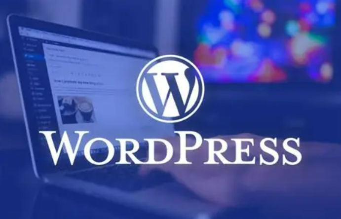

# WORDPRESS
### 1. Khái niệm



**WordPress** là một hệ quản trị nội dung (CMS — Content Management System) mã nguồn mở, viết bằng PHP và dùng cơ sở dữ liệu MySQL/MariaDB để xuất bản các blog, trang web được viết bằng ngôn ngữ lập trình PHP và cơ sở dữ liệu MySQL một cách miễn phí, dễ sử dụng và phổ biến nhất trên thế giới.
### 2. Ưu và nhược điểm của WordPress
#### 2.1 Ưu điểm
- **Miễn phí**: WordPress là mã nguồn mở, tải xuống và sử dụng miễn phí.
- **Dễ sử dụng**: Giao diện trực quan, thao tác đơn giản, phù hợp cho người ít kiến thức lập trình.
- **Phổ biến toàn cầu**: Hơn 45% website trên thế giới sử dụng WordPress, dẫn đầu các nền tảng CMS.
- **Mã nguồn mở**: Tự do tùy chỉnh giao diện, plugin và quản lý website.
- **Bảo mật cao**: Đội ngũ chuyên nghiệp cải thiện liên tục, các sự cố bảo mật thường do lỗi người dùng.
- **Tùy chỉnh linh hoạt**: Đa dạng theme, dễ sửa chữa và thiết kế giao diện theo ý muốn.
- **Thư viện plugin và theme phong phú**: Nhiều tùy chọn miễn phí và trả phí để mở rộng tính năng.
- **Không cần biết code**: Xây dựng website dễ dàng qua thao tác kéo thả, không đòi hỏi kỹ năng lập trình.
- **Hỗ trợ developer**: Phù hợp để mở rộng tính năng cho người có kiến thức HTML, CSS, PHP.
- **Cải thiện trải nghiệm người dùng**: SEO dễ dàng hơn, tiết kiệm thời gian so với xây dựng CMS từ đầu.
- **SEO-Friendly**: WordPress được xây dựng với mục tiêu tối ưu hóa công cụ tìm kiếm (SEO: search engine optimization). Nó tạo ra các URL rõ ràng và dễ đọc, cho phép quản lý thẻ meta dễ dàng và hỗ trợ nhiều plugin SEO khác nhau để nâng cao khả năng hiển thị trang web của bạn trên các công cụ tìm kiếm.
#### 2.2 Nhược điểm
- **Bảo mật kém**: Dễ bị tấn công nếu không cập nhật phiên bản và plugin thường xuyên.
- **Phụ thuộc plugin bên thứ ba**: Có thể gây xung đột hoặc không tương thích với WordPress.
- **Tốc độ tải trang chậm**: Sử dụng theme nặng hoặc nhiều plugin không hợp lý có thể ảnh hưởng hiệu suất.
- **Hạn chế của theme miễn phí**: Thiếu tính năng và khả năng tùy chỉnh, cần nâng cấp để đáp ứng nhu cầu.
### 3. Những loại Website có thể tạo bởi WordPress
#### 3.1 Blog
WordPress là công cụ lý tưởng dành cho việc viết blog, đặc biệt phù hợp để tạo blog cá nhân. Bạn có thể bắt đầu hành trình viết blog hoàn toàn miễn phí với WordPress. Nếu muốn nâng cao sự chuyên nghiệp và tiếp cận nhiều độc giả hơn, bạn có thể chọn các gói dịch vụ trả phí.
#### 3.2 Portfolio
Portfolio là hình thức lý tưởng để các nghệ sĩ, nhiếp ảnh gia, freelancer, nhạc sĩ, hay nhà thiết kế trình bày tài năng sáng tạo, thu hút nhà tuyển dụng hoặc khách hàng. Với kho giao diện thẩm mỹ, hiện đại, WordPress trở thành lựa chọn hàng đầu để xây dựng portfolio chuyên nghiệp.


#### 3.3 Website doanh nghiệp
WordPress là giải pháp lý tưởng cho doanh nghiệp vừa và nhỏ nhờ chi phí hợp lý. Ngay cả các doanh nghiệp lớn cũng tin tưởng sử dụng WordPress để xây dựng website, tận dụng kho tính năng và plugin phong phú mà nền tảng này cung cấp.
#### 3.4 Trang web thương mại điện tử, báo chí, giáo dục
WordPress không chỉ là nền tảng lý tưởng để mở cửa hàng trực tuyến mà còn phù hợp với các website báo chí và giáo dục. Với vài thao tác đơn giản, bạn có thể cài đặt plugin thương mại điện tử WooCommerce để biến trang WordPress thành một website bán hàng chuyên nghiệp. Plugin này cung cấp đầy đủ các tính năng thiết yếu như giỏ hàng, quản lý đơn hàng, thanh toán, cùng nhiều tiện ích mở rộng khác, đáp ứng mọi nhu cầu kinh doanh trực tuyến.


### 4. WordPress.com vs WordPress.org
WordPress.com và WordPress.org là hai phiên bản của nền tảng quản lý nội dung (CMS) WordPress, mỗi phiên bản có những đặc điểm riêng biệt:

**WordPress.com:**
- Là một nền tảng cung cấp dịch vụ tạo và quản lý trang web trực tuyến: Hoạt động dựa trên mô hình dịch vụ lưu trữ trực tuyến (hosted service), bạn không cần phải tự cài đặt WordPress lên máy chủ của mình.
- `.com` giới hạn phạm vi tùy chỉnh, bạn chỉ có thể sử dụng các theme và plugin được chọn sẵn bởi nền tảng. Không thể tự cài đặt theme và plugin từ bên ngoài.
- Quản lý và bảo mật máy chủ do WordPress.com đảm nhiệm, giúp người dùng tập trung vào nội dung và chạy trang web mà không phải quan tâm đến việc quản lý máy chủ.

**WordPress.org:**
- Là phiên bản mã nguồn mở của WordPress và được cung cấp miễn phí tại trang web wordpress.org.
- Bạn phải tự tải xuống mã nguồn và cài đặt WordPress lên máy chủ riêng của mình hoặc dịch vụ lưu trữ máy chủ của bên thứ ba.
- Bạn hoàn toàn tự do tùy chỉnh website, sử dụng bất kỳ theme và plugin nào bạn muốn. Điều này cho phép bạn tạo một trang web hoàn toàn độc đáo và theo ý muốn.
- Bạn phải tự chịu trách nhiệm quản lý và bảo mật máy chủ hoặc tùy chỉnh các thiết lập cần thiết để chạy WordPress.

| Đặc điểm | 	WordPress.com |	WordPress.org |
|----------|------------------|---------------|
| Hosting |	Được cung cấp bởi WordPress.com	| Bạn tự quản lý hosting hoặc sử dụng dịch vụ hosting của bên thứ ba |
| Cài đặt và quản lý |	Không cần tự cài đặt, chỉ cần đăng ký tài khoản và bắt đầu sử dụng |	Bạn phải tự cài đặt WordPress trên máy chủ của mình và tự quản lý |
| Tùy chỉnh |	Giới hạn về tùy chỉnh, không thể truy cập vào mã nguồn của trang web |	Hoàn toàn có thể tùy chỉnh và truy cập vào mã nguồn của trang web |
| Plugin và chủ đề | Giới hạn trong việc cài đặt plugin và chủ đề, chỉ có thể sử dụng các plugin và chủ đề được phê duyệt bởi WordPress.com |	Có thể cài đặt và sử dụng bất kỳ plugin và chủ đề nào mà bạn muốn|
| Quảng cáo |	WordPress.com có thể hiển thị quảng cáo trên trang web của bạn, nếu bạn không nâng cấp lên gói trả phí |	Không có quảng cáo được hiển thị mặc định|
|Kiểm soát và tự do| 	Kiểm soát và tự do ít hơn về việc quản lý và tùy chỉnh trang web |	Có kiểm soát và tự do tối đa về quản lý và tùy chỉnh trang web |
| Phí |	Có các gói trả phí với các tính năng mở rộng, như loại bỏ quảng cáo, tên miền tùy chỉnh và lưu trữ nâng cao |	WordPress.org là miễn phí, bạn chỉ phải trả phí cho tên miền và hosting (nếu áp dụng)|
| Bảo trì | WordPress.com tự lo việc bảo trì, cập nhật, sao lưu. | Bạn phải tự chịu trách nhiệm về bảo trì, cập nhật, sao lưu.|
| Phù hợp cho | Người mới bắt đầu, blogger cá nhân không yêu cầu tùy biến cao, muốn sự đơn giản. | Doanh nghiệp, blogger chuyên nghiệp, cửa hàng online, người muốn toàn quyền kiểm soát website.|
| SEO | Gói miễn phí có dạng `tenban.wordpress.com.` Muốn tên miền riêng phải trả phí. |Bạn có toàn quyền sử dụng tên miền riêng (ví dụ:` interdata.vn`).|

### 5. Cơ chế hoạt động của WordPress
Mỗi khi người dùng truy cập vào một trang WordPress, hàng chục tệp PHP và hàng trăm hàm sẽ được thực thi để tạo ra nội dung HTML gửi về trình duyệt.
#### 5.1 Request bắt đầu: PHP nhận yêu cầu từ web server
Khi người dùng truy cập một URL:
```plaintext
https://example.com/san-pham/ao-thun/
```
Trình duyệt gửi HTTP request đến webserver (Apache, Nginx, LiteSpeed…).

Webserver thường cấu hình:

Apache → `.htaccess rewrite`

Nginx → `try_files $uri /index.php?$args`

Để đảm bảo mọi URL đẹp (pretty permalink) đều trỏ về index.php (trừ file thực như .jpg, .css, .js).
#### 5.2 Bootstrap WordPress — nạp toàn bộ hệ thống
File index.php chỉ chứa 1 dòng:
```php
require( dirname( __FILE__ ) . '/wp-blog-header.php' );
```
`wp-blog-header.php` → gọi `wp-load.php`: nơi bắt đầu quá trình bootstrap toàn bộ hệ thống.

`wp-load.php` → nạp file `wp-config.php`

Trong `wp-config.php`, WordPress:
- Load thông tin database
- Load salts, keys
- Định nghĩa constants quan trọng
- Tạo kết nối MySQL

Nạp `wp-settings.php`

Đây là file “khởi động lõi” WordPress, include các core gồm:
- Load toàn bộ files biến toàn cục, include các core file như `plugin.php`,` functions.php` trong wp-includes (core)
- Các plugin được kích hoạt từ bảng `wp_options` (option `active_plugins`). Nếu là multisite, nạp thêm plugin mạng (mu-plugins).
  - plugins_loaded
  - init
  - after_setup_theme

Giai đoạn này cũng khởi tạo kết nối database thông qua lớp `wpdb` và load các option có cờ `autoload = 'on'` hoặc `'auto'` vào biến `$alloptions`. Đây là bước có ảnh hưởng lớn tới tốc độ khởi tạo của mỗi request.

#### 5.3 WordPress phân tích URL → tạo WP_Query
Khi hệ thống đã sẵn sàng, WordPress bắt đầu xác định: trang nào cần hiển thị bằng cách phân tích URL. Quá trình này diễn ra trong lớp `WP_Query`:
  - WordPress so khớp URL với bảng rewrite rules.
  - Map URL vào loại nội dung( post, page, archive, taxonomy,...)
  - Tạo đối tượng $wp_query tương ứng với loại nội dung: trang chủ, bài viết, chuyên mục, tìm kiếm, 404, v.v…
  - VD: Tạo đối tượng **WP_Query** xác định:
    - Đây là single custom post type `product`
    - Lấy bài có slug `ao-thun`
    - Lấy meta, categories, thumbnail,…
  - Thực hiện truy vấn SQL qua lớp `wpdb` để lấy dữ liệu post, meta, term, và comment.
Luồng hooks quan trọng:
- `parse_request`
- `pre_get_posts`
- `the_posts`
- `template_redirect`

#### 5.4 Load Template Hierarchy
Khi đã có dữ liệu, WordPress xác định file template tương ứng để render. Hệ thống tìm kiếm template theo thứ tự ưu tiên (template hierarchy).

- Đối với một bài viết: `single-{post-type}.php` → `single.php` → `index.php`
- Đối với trang: `page-{slug}.php` → `page.php` → `index.php`
- Đối với category: `category-{slug}.php` → `category.php` → `archive.php` → `index.php`