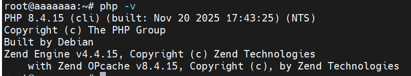
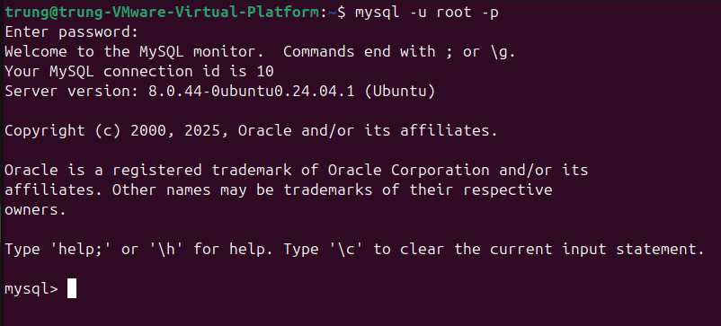
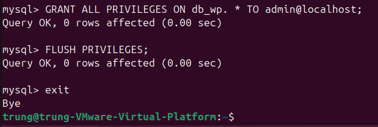
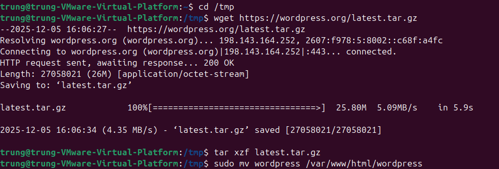
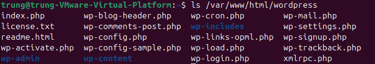
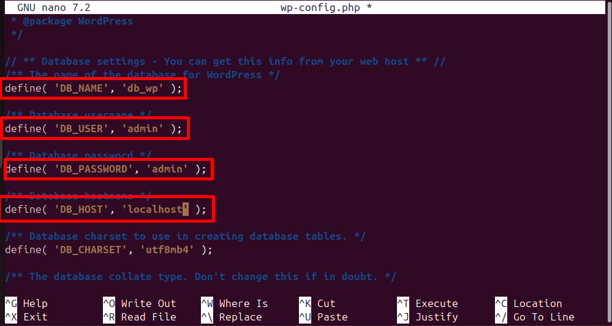
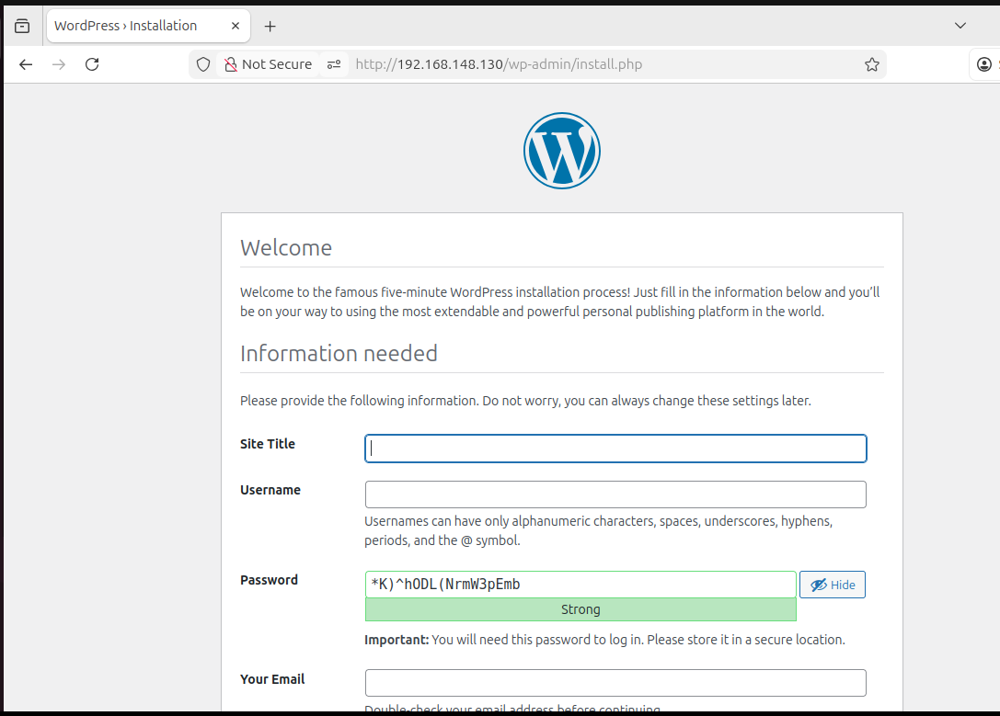
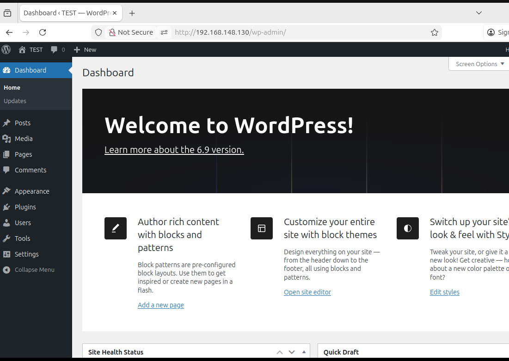
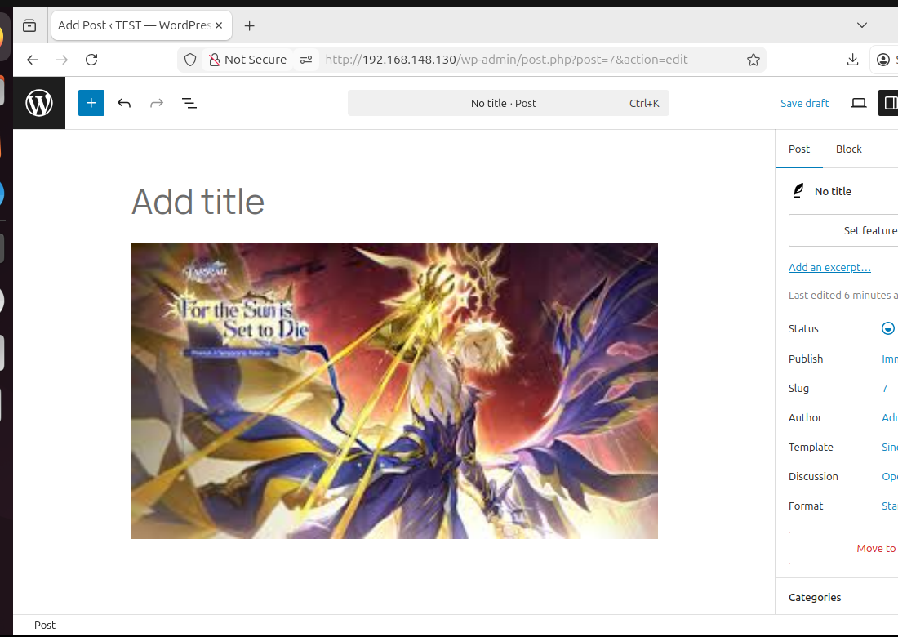

# Cài đặt WordPress trên Ubuntu với LAMP Stack
## 1) Chuẩn bị & kiểm tra hệ thống
Cập nhật apt:
```bash
sudo apt update && sudo apt upgrade -y
```
Cài các công cụ cần thiết: 
```bash
sudo apt install wget unzip -y
```
## 2) Cài Apache (web server)
```bash
sudo apt install apache2 -y
sudo systemctl start apache2
sudo systemctl enable apache2
sudo systemctl status apache2
```
## 2.1) Cài đặt PHP
```bash
sudo apt update
sudo apt install software-properties-common -y
sudo add-apt-repository ppa:ondrej/php -y
sudo apt install php -y
```



## 3) Cài MySQL (hoặc MariaDB)
```bash
sudo apt install mysql-server -y
sudo mysql_secure_installation
```
Đăng nhập vào tài khoản `root` của database:
```bash
mysql -u root -p
```



Terminal chuyển sang mysql
- Tạo Database cho WP. Ở đây đặt là `db_wp`
```mysql
CREATE DATABASE db_wp;
```
- Tạo tài khoản riêng để quản lí DB. Tên tài khoản: `admin`, Mật khẩu: `admin`
```mysql
CREATE USER admin@localhost IDENTIFIED BY 'admin';
```
- Cấp quyền quản lý cơ sở dữ liệu cho user mới tạo:
```mysql
GRANT ALL PRIVILEGES ON db_wp.* TO admin@localhost;
```
- Xác thực những thay đổi về quyền:
```mysql
FLUSH PRIVILEGES;
```
**lưu ý**: `GRANT` không còn cho phép tạo user + đặt mật khẩu trong cùng 1 câu lệnh nữa trên MySQL 8 trở lên (Ubuntu, XAMPP, Windows đều vậy).
- Thoát khỏi mysql
```mysql
exit
```


### 3.1 Sửa lỗi không thể `mysql -u root -p`
- MySQL root đang dùng auth_socket (Ubuntu mặc định)
```plaintext
sudo mysql
```
Đổi thành dùng password
```bash
ALTER USER 'root'@'localhost'
IDENTIFIED WITH mysql_native_password BY 'yourpassword';

FLUSH PRIVILEGES;
```
Thoát và Test là thành công.

Hoặc bạn cũng có thể tạo USER mới
```mysql
CREATE USER 'admin'@'localhost' IDENTIFIED BY '123456';
GRANT ALL PRIVILEGES ON *.* TO 'admin'@'localhost' WITH GRANT OPTION;
FLUSH PRIVILEGES;
```

## 4) Tải và cài đặt WordPress
- Cài gói hỗ trợ `php-gd`:
```bash
sudo apt install php-gd
```
- Tải xuống WordPress phiên bản mới nhất: Nếu chưa cài đặt `wget` thì có thể cài bằng câu lệnh `sudo apt install wget`
```bash
cd /tmp
wget https://wordpress.org/latest.tar.gz
```
- Sau khi tải xong. Ta tiến hành giải nén file `latest.tar.gz`
```bash
tar xzf latest.tar.gz
```
- Copy các file trong thư mục wordpress tới đường dẫn `/var/www/html`
```bash
sudo mv wordpress /var/www/html/wordpress
```



## 5) Cấu hình WordPress
File cấu hình wordpress:` /var/www/html/wp-config.php`
- Di chuyển tới thư mục `/var/www/html/wordpress`
- File cấu hình wordpress là `wp-config.php`. Tuy nhiên tại đây chỉ có file `wp-config-sample.php`.



Tiến hành copy lại file cấu hình như sau:
```bash
cp wp-config-sample.php wp-config.php
```
- Chỉnh sửa file cấu hình `wp-config.php`. Chỉnh lại tên database, username, password đã đặt ở trên. (db_name: `db_wp`, username: `admin`, pass: `admin`) và lưu lại.



## 6) Tạo Apache Virtual Host 
```bash
sudo nano /etc/apache2/sites-available/wordpress.conf
```
```bash
<VirtualHost *:80>
    ServerName wordpress.com
    ServerAlias www.wordpress.com
    DocumentRoot /var/www/html/wordpress

    <Directory /var/www/html/wordpress>
        AllowOverride All
        Require all granted
    </Directory>

    ErrorLog ${APACHE_LOG_DIR}/wordpress_error.log
    CustomLog ${APACHE_LOG_DIR}/wordpress_access.log combined
</VirtualHost>
```
- Kích hoạt site và module rewrite
```bash
sudo a2ensite wordpress.conf
sudo a2enmod rewrite
sudo systemctl reload apache2
```

## 7) Hoàn tất cài đặt giao diện



- Nhập các thông tin cần thiết rồi click Install WordPress.



## 8) Phân quyền WordPress
- Phân quyền thư mục `wordpress` cho` user apache` để `user` này được phép tạo các thư mục và lưu trữ các tệp tin tải lên.
```bash
sudo chown -R www-data:www-data /var/www/html/wordpress
# file 644, thư mục 755 (tùy chỉnh nếu cần)
sudo find /var/www/html/wordpress/ -type d -exec chmod 755 {} \;
sudo find /var/www/html/wordpress/ -type f -exec chmod 644 {} \;
```

**Lưu ý**:
`www-data` không phải user của bạn, cũng không phải root.

Nó là user mặc định của Apache/Nginx dùng để chạy web server.

Trên Ubuntu, khi cài Apache hoặc Nginx, hệ thống tự tạo user:

User: `www-data`

Group: `www-data`

Đây là user chuyên để chạy website, không dùng để đăng nhập. Khi Apache phục vụ trang web, nó chạy dưới tài khoản:

WordPress cần Apache ghi file (upload hình, cài plugin, cài theme)

Apache chạy dưới user www-data

Nếu WordPress thuộc sở hữu của trung, Apache không có quyền ghi, dẫn tới lỗi:
- ❌ “Unable to create directory”
- ❌ “Uploads folder is not writable”
- ❌ “Plugin installation failed – permission denied”



Như vậy là bạn đã có thể tiến hành upload ảnh và đăng bài viết lên trang wordpress của mình.

# Cài đặt WordPress với LEMP
## 1) Cài đặt PHP 
sudo apt update
sudo apt install software-properties-common -y
sudo add-apt-repository ppa:ondrej/php -y
sudo apt update
sudo apt install php -y

## 2) Cài đặt nginx
```bash
Sudo apt install nginx -Y
```
## 3) Tải và cấu hình WordPress
```bash
cd /tmp
sudo wget https://wordpress.org/latest.tar.gz
sudo tar -xzvf latest.tar.gz --strip-components=1
sudo mv wordpress /var/www/html/wordpress2
sudo chown -R www-data:www-data /var/www/html/wordpress2
```

- `--strip-components=1`: thay vì giải nén ra thư mục wordpress chứa các tệp tin wordpress bên trong thì sẽ giải nén trực tiếp các tệp tin ra ngoài mà không cần thư mục wordpress.

## 4) Tạo database và user cho WordPress
```bash
sudo mysql -r root -p
```
```mysql
CREATE DATABASE db_wp;
CREATE USER admin2@localhost IDENTIFIED BY 'admin';
GRANT ALL PRIVILEGES ON db_wp.* TO admin2@localhost;
FLUSH PRIVILEGES;
exit
```
## 5) Tạo file cấu hình cho Web site mới
```bash
sudo nano /etc/nginx/sites-available/wordpress2
```
- Thay đổi cổng khác với cổng Apache2
```bash
server {
    listen 8080;
    server_name localhost;

    root /var/www/lempsite;
    index index.php index.html;

    location / {
        try_files $uri $uri/ /index.php?$args;
    }

    location ~ \.php$ {
        include snippets/fastcgi-php.conf;
        fastcgi_pass unix:/run/php/php8.3-fpm.sock;
    }

    location ~ /\.ht {
        deny all;
    }
}
```

## 6) Kích hoạt site và restart Nginx
# Tạo một liên kết tượng trưng -> kích hoạt cấu hình website
```bash
sudo ln -s /etc/nginx/sites-available/lempsite /etc/nginx/sites-enabled/

sudo nginx -t

sudo systemctl reload nginx
```
