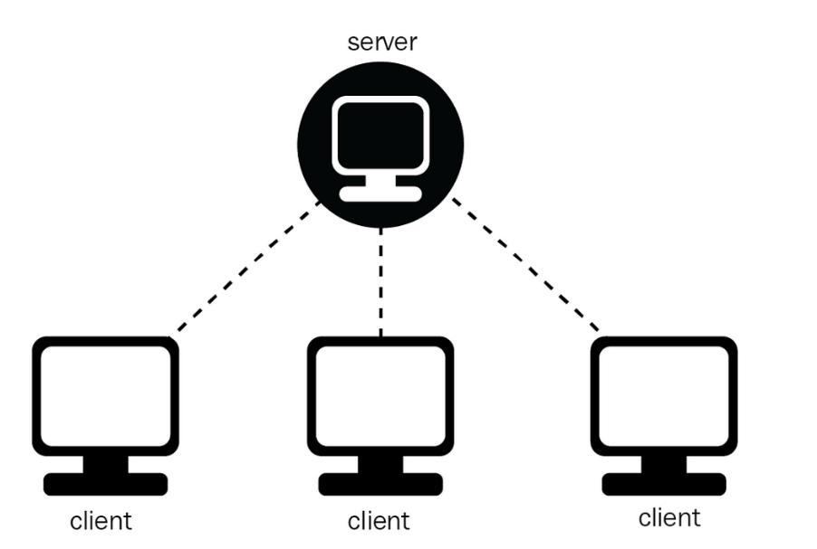
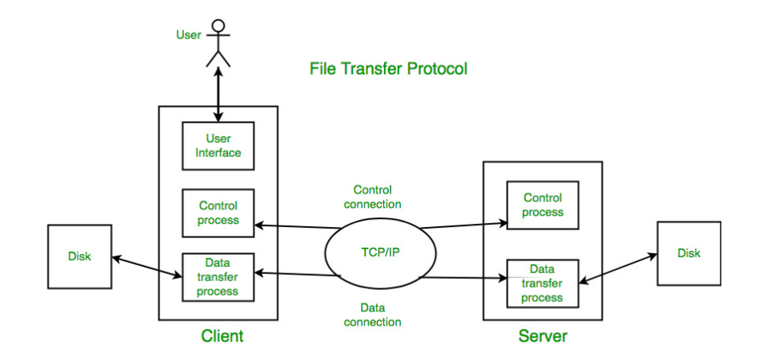
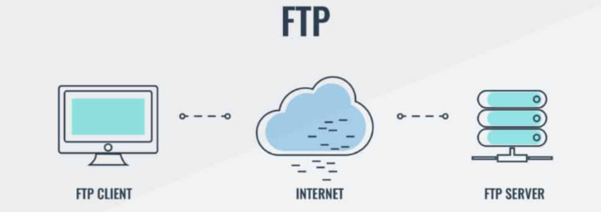
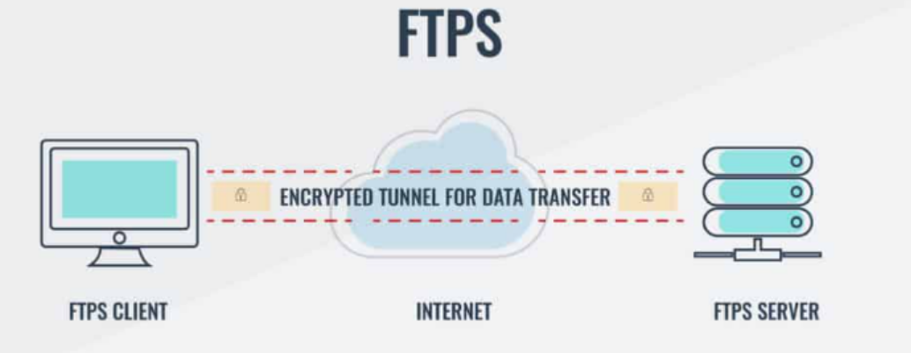
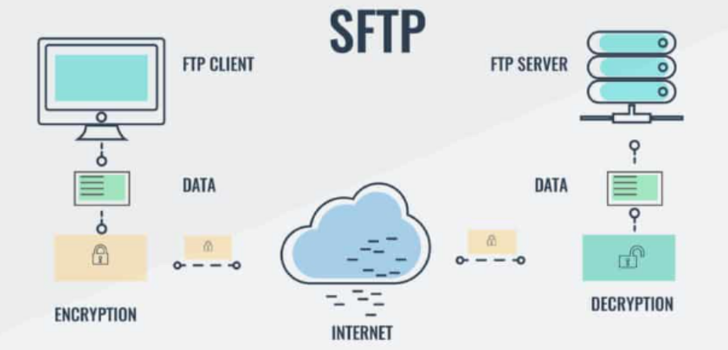

# Tìm hiểu về FTP
### 1. Khái niệm FTP
**FTP** viết tắt của **File Transfer Protocol**(Giao thức truyền tải tập tin) là một giao thức mạng tiêu chuẩn giúp các máy tính có thể gửi và nhận tập tin với nhau qua mạng giữa máy khách (client) và máy chủ (server) trên mạng TCP/IP, như Internet hoặc mạng nội bộ (LAN).
Nó sinh ra với mục đích duy nhất : **Di chuyển dữ liệu giữa các máy tính**



### 2. Thành phần và cách thức hoạt động của giao thức FTP


- **FTP Server**: Máy chủ lưu trữ dữ liệu, xử lý và phản hồi yêu cầu.
  - Chạy phần mềm **FTP Server**(như vsftpd, FileZilla Server, ProFTPD...)
  - Lắng nghe các kết nối đến từ client thông qua cổng 21(control).
  - Sau khi xác thực(nếu có), server chấp nhận hoặc từ chối yêu cầu truy cập.
  - Khi cần truyền file, server mở thêm kênh dữ liệu( data channel) để gửi hoặc nhận tập tin( dùng cổng 20 trong chế độ active, hoặc cổng tuỳ chọn trong passive)
  - Có thể giới hạn quyền truy cập: chỉ đọc, chỉ ghi hoặc là toàn quyền.
  - Máy chủ cung cấp dữ liệu được yêu cầu bởi máy khách và quản lý các hoạt động trên tệp tin và thư mục.
- **FTP Client**: Người dùng muốn tải lên hoặc tải xuống dữ liệu từ FTP server.
  - Dùng phần mềm FTP client như FileZilla, WinSCP, lệnh `ftp` trong terminal
  - Khi kết nối đến server:
    - Gửi yêu cầu đến địa chỉ IP server + cổng 21
    - Gửi thông tin tên người dùng và mật khẩu (nếu cần xác thực)
  - Sau khi được xác nhận:
    - Client gửi lệnh như: `list`,`get`,`put`,`delete`,`rename` để tương tác với file
    - Nhận hoặc gửi dữ liệu thông qua data channel
    - Người dùng sử dụng client để tải lên hoặc tải xuống các tệp tin từ máy chủ FTP.

- **Các bước để bắt đầu sử dụng FTP**
  - **Kết nối tới FTP Server**: Người dùng sử dụng tên đăng nhập, mật khẩu, địa chỉ thông qua FTP client hoặc các giao diện command line. 
  - **Transfer file and Manage Files**: Người dùng bắt đầu giao tiếp với server, sử dụng các yêu cầu để download, delete,...
  - **Close the Connection**: Sử dụng các lệnh `bye` hoặc `quit` để kết thúc khi đã truyền file xong.
### 3. Công dụng của FTP:
- Truyền tải tệp tin: Upload/download giữa máy tính và server.
  - Ví dụ: **web developers**: Sử dụng FTP để tải các tệp tạo nên 1 trang web( html, css, Js, Images, Vid,...) từ máy tính cá nhân lên web server.
- **Quản lý tệp tin từ xa**: Tạo, sửa, xóa, đổi tên thư mục/ tệp tin trên server
- **Phát triển website**: Cập nhật mã nguồn, hình ảnh lên website.
- **Sao lưu và phục hồi**: Sao lưu dữ liệu định kỳ, phục hồi khi cần.
- **Chia sẻ dữ liệu**: Đồng bộ và chia sẻ dữ liệu nội bộ.
- **Truyền tệp tự động(Automated Files Transfer)**: Ứng dụng hoặc hệ thống được cấu hình để tự động truyền tệp qua FTP theo lịch hoặc một số sự kiện cụ thể xảy ra.

### 4. Ưu điểm FTP
`Ưu điểm`:
- **Truyền nhiều tin cùng một lúc**
- **Khả năng truyền tệp tin khi mất kết nối**: Trường hợp mất kết nối khi truyền tệp tin, giao thức FTP cho phép tiếp tục quá trình truyền từ nơi đã bị gián đoạn mà không cần phải bắt đầu lại từ đầu.
- **Tự động chuyển tập tin bằng các Script**: FTP hỗ trợ tích hợp các tập lệnh và kịch bản (script) tự động chuyển tệp tin, giúp tự động hóa quy trình và giảm sự can thiệp của người dùng.
- **Quản lý khung chờ và lên lịch truyền**
- **Khả năng đồng bộ hóa tệp tin**: đảm bảo dữ liệu luôn được cập nhật và đồng nhất trên các thiết bị.

`Nhược điểm`:
- **Khả năng bảo mật kém**: Giao thức FTP không cung cấp các biện pháp bảo mật cao như mã hóa dữ liệu, gửi mật khẩu theo phương thức bảo mật SSL/TLS, dẫn đến nguy cơ bị tấn công và thông tin bị đánh cắp.
- **Không phù hợp cho các tổ chức yêu cầu kết nối an toàn**
### 5. Các loại FTP phổ biến
**FTP (Plain FTP)**: FTP Plain (FTP đơn giản) là một giao thức truyền tải các tệp tin thông qua mạng máy tính, giúp truyền tải dữ liệu giữa hai máy tính thông qua mạng không có tính năng bảo mật và mã hóa dữ liệu, nên khả năng bị tấn công bởi các hacker cao.



**FTPS**: FTPS là một giao thức truyền tải tệp tin thông qua mạng máy tính, là một biến thể của FTP đã được mã hóa bằng SSL hoặc TLS. FTPS có khả năng truyền tải dữ liệu giữa hai máy tính thông qua mạng, và đảm bảo tính bảo mật và an toàn cao.
  - Có 2 kiểu **FTPS**: 
    - **Explicit FTPS**: client yêu cầu bắt đầu mã hóa sau khi kết nối.
    - **Implicit FTPS**: mã hóa bắt buộc ngay từ đầu (dùng cổng 990).



**SFTP (SSH File Transfer Protocol)**: 
  - Hoàn toàn khác với FTP/FTPS – không dùng cổng 21.
  - Là một phần của SSH, chạy qua port 22.
  - Toàn bộ phiên làm việc được mã hóa.
  - Ưu điểm:
    - Phổ biến nhất hiện nay.
    - Không cần tải FTP server riêng nếu server đã có OpenSSH.



**TFTP (Trivial FTP)**: 
  - Phiên bản rút gọn của FTP – không có xác thực người dùng, không mã hóa.
  - Dùng giao thức UDP (port 69).
  - Dùng trong các thiết bị mạng như router, switch để cập nhật firmware.
  - Dùng khi cần truyền file cực đơn giản, không cần bảo mật. Phổ biến trong môi trường nhúng, mạng nội bộ.

### 6. Các loại kết nối trong FTP
#### 6.1 Control connection
- Client mở kết nối TCP đến cổng 21 của server
- Đây là kênh giao tiếp lệnh như:
  - `USER` - gửi tên đăng nhập
  - `PASS` - gửi mật khẩu
  - `LIST` - yêu cầu liệt kê thư mục
  - `STOR`, `RETR` - yêu cầu upload hoặc download file
- Kết nối này giữ mở trong suốt phiên làm việc
#### 6.2 Data connection
- Được dùng để truyền dữ liệu thực tế như:
  - danh sách file/ thư mục (`LIST`)
  - nội dung file khi download(`RETR`)
  - nội dung file khi upload(`STOR`)
- Data connection không giữ mở liên tục 
  - Mỗi lần truyền dữ liệu sau thì kết nối sẽ đóng

FTP dùng **2 kiểu data connection**:

**Active mode**:
  - Client mở control connection tới server cổng 21
  - Khi cần truyền dữ liệu:
    - Client mở một cổng ngẫu nhiên và gửi lệnh `PORT`( báo cho server biết IP + port của client)
    - Server chủ động mở TCP connection từ cổng 20 tới port mà client chỉ định
    - Dữ liệu được truyền từ server sang client

```arduino
Client  ----21---->  Server   (control)
Client  <---20----  Server   (data)
```

**Passive Mode**:
  - Client mở kết nối điều khiển đến server cổng 21
  - Khi cần truyền dữ liệu:
    - Client gửi lệnh `PASV` để yêu cầu server chuyển sang chế độ bị động.
    - Server mở một cổng ngẫu nhiên, gửi lại IP + cổng đó cho client. 
    - Client chủ động mở TCP tới port đó để truyền dữ liệu.

```arduino
Client  ----21---->  Server   (control)
Client  ----random-> Server  (data)
```
- Ưu điểm: 
  - Client không cần mở port
  - Phù hợp NAT/ firewall
  - Được dùng phổ biến hiện nay

### 7. FTP Session
- Sau khi kênh dữ liệu được thiết lập, Client gửi một gói tin TCP connection với server, Client gửi thông tin điều khiển. Server nhận được và bắt đầu gửi kết nối dữ liệu tới client. Kết nối điều khiển được mở xuyên suốt phiên giao dịch.
- Client upload(`STOR`), download(`RETR`) file hoặc liệt kê(`LIST`) thư mục.
- Dữ liệu được truyền qua kênh Data Connection
- **Đóng kết nối**:
  - Đóng kênh dữ liệu (sau mỗi lần truyền).
  - Đóng kênh điều khiển( khi kết thúc phiên).

### 8. Các phương thức truyền dữ liệu trong FTP
**1. Stream mode(Chế độ luồng)**:

**Đặc điểm**: 
  - Mặc định trong hầu hết các FTP client và server
  - Dữ liệu được gửi liên tục dưới dạng dòng byte, không chia khối.
  - Khi truyền xong, đóng kết nối để đánh dấu kết thúc.

**Ứng dụng**: Phù hợp khi truyền file đơn giản, không cần kiểm soát khổi dữ liệu.
 

**2. Block mode(Chế độ khối)**: 

**Đặc điểm**: Dữ liệu được chia thành các khối(block), mỗi khối có:
  - Header chứa loại khối và độ dài
  - Dữ liệu thật sự cần truyền

**Ưu điểm**:
  - Linh hoạt hơn: có thể chèn thêm thông tin điều khiển hoặc metadata.
  - Phù hợp cho hệ thống truyền dữ liệu phức tạp, có yêu cầu kiểm soát cao hơn.

**Ứng dụng**: Các ứng dụng FTP tự phát triển, hoặc môi trường yêu cầu bảo trì/ chuẩn đoán dữ liệu.

**3. Compressed mode(Chế độ nén)**:

**Đặc điểm**:
  - Dữ liệu được nén trước khi truyền để giảm kích thước.
  - FTP thường dùng thuật toán nén **Run-Length Encoding(RLE)**

**Ưu điểm**:
  - Tiết kiệm băng thông
  - Truyền file lớn nhanh hơn nếu nội dung có tính lặp lại cao(vd: log, văn bản...)

**Nhược điểm**
  - Tăng thời gian xử lý(nén/ giải nén)
  - Ít được hỗ trợ bở các FTP client phổ biến hiện nay.