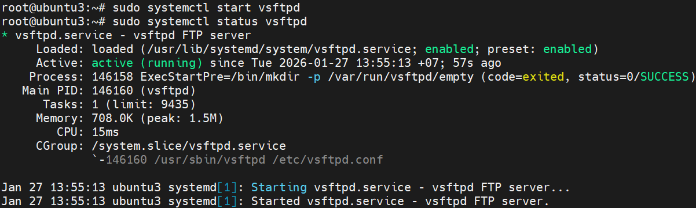
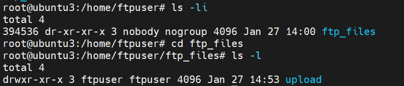
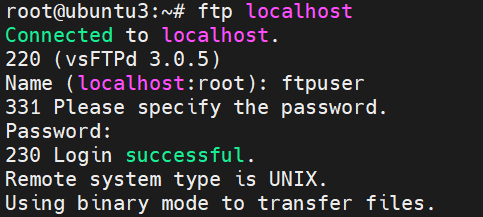
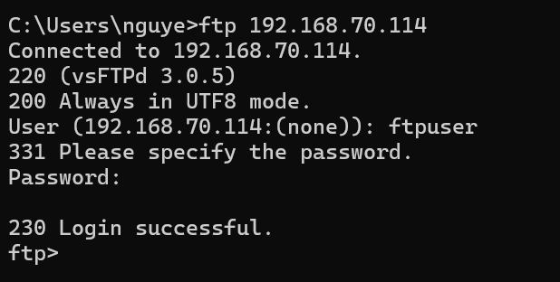
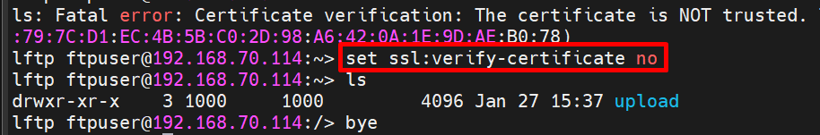

# FTP Lab
### 1. Mô hình Lab

| Máy | Chức năng | IP |
|-----|-----------|----|
|Ubuntu | FTP Server | 192.168.70.114 |
| Rocky | FTP Client | 192.168.70.124 |
| Window | FTP Client | 192.168.3.42 |

### 2. Cài FTP Server
```bash
sudo apt install vsftpd -y
```
- **Bật Service**
```bash
sudo systemctl start vsftpd
sudo systemctl enable vsftpd
```
- **Check**
```bash
sudo systemctl status vsftpd
```



### 3. Tạo người dùng FTP và thiết lập thư mục
- **Tạo người dùng mới**
```bash
sudo adduser ftpuser
sudo passwd ftpuser
```
- **Tạo thư mục riêng để chứa file FTP (ftp_files)**
```bash
# Tạo thư mục riêng để chứa file FTP (ftp_files)
sudo mkdir -p /home/ftpuser/ftp_files

# Gán quyền sở hữu thư mục cho user
sudo chown nobody:nogroup /home/ftpuser/ftp_files

# Gỡ quyền ghi của user
sudo chmod a-w /home/ftpuser/ftp_files
```
  - `nobody`: để gán file cho user cực hạn chế, nhằm cô lập quyền truy cập của service hoặc client.
  - Gỡ quyền ghi để không user nào có thể sửa/ xoá trực tiếp trong thư mục chính.

- Tạo thư mục `upload` bên trong để user có thể ghi vào file. Gán quyền sở hữu cho user `ftpuser`:
```bash
sudo mkdir /home/ftpuser/ftp_files/upload
sudo chown ftpuser:ftpuser /home/ftpuser/ftp_files/upload
```



- Người sở hữu chỉ có quyền ghi vào upload, không có quyền ghi vào ftp_files, Các user khác không có quyền ghi ở tất cả các thư mục.
### 4. Cấu hình vsftpd
```bash
sudo nano /etc/vsftpd.conf
```
- Thêm đoạn sau vào cuối chỉnh sửa ở trên nếu bị trùng
```ini
# Cho phép user hệ thống đăng nhập
local_enable=YES

# Cho phép ghi file (upload, xóa,...)
write_enable=YES

# Giới hạn user trong home
chroot_local_user=YES

# Cho phép ghi trong chroot
allow_writeable_chroot=YES

# Passive mode
pasv_enable=YES
pasv_min_port=10000
pasv_max_port=10100

# Cho phép dùng biến username
user_sub_token=$USER

# Root FTP cho mỗi user
local_root=/home/$USER/ftp_files

# Listen IPv4
listen=YES
listen_ipv6=NO

```
- Lưu ý quan trọng: Vì đã sử dụng pasv_enable, comment lại active FTP `connect_from_port_20=YES`

**Khởi động lại dịch vụ vsftpd**
```bash
sudo systemctl restart vsftpd
```
**Mở tường lửa (UFW)**
```bash
sudo ufw allow 20/tcp
sudo ufw allow 21/tcp
sudo ufw allow 10000:10100/tcp
sudo ufw reload
```
  - `20`: Dữ liệu FTP (active mode).
  - `21`: Điều khiển FTP.
  - `10000-10100`: passive mode

**Kiểm tra FTP**
```bash
ftp localhost
```





### 5. Thực hành một số lệnh trên FTP
**Lệnh thao tác trên server**
| Lệnh             | Ý nghĩa                          |
| ---------------- | -------------------------------- |
| `pwd`            | xem thư mục hiện tại trên server |
| `cd dir`         | đổi thư mục trên server          |
| `ls`             | liệt kê file/thư mục server      |
| `dir`            | giống `ls` (dạng chi tiết hơn)   |
| `get file`       | tải file từ server               |
| `put file`       | upload file lên server           |
| `mget *.txt`     | tải nhiều file                   |
| `mput *.txt`     | upload nhiều file                |
| `delete file`    | xoá file server                  |
| `mkdir dir`      | tạo thư mục server               |
| `rmdir dir`      | xoá thư mục server               |
| `rename old new` | đổi tên file server              |
| `chmod 755 file` | đổi permission file server       |
| `size file`      | xem dung lượng                   |
| `stat`           | trạng thái kết nối               |
| `passive`        | bật/tắt passive mode             |
| `binary`         | chuyển binary mode               |
| `ascii`          | chuyển ascii mode                |


**Lệnh thao tác trên client**

| Lệnh           | Ý nghĩa                   |
| -------------- | ------------------------- |
| `lpwd`         | xem thư mục local         |
| `lcd dir`      | đổi thư mục local         |
| `!ls`          | list file local           |
| `!pwd`         | pwd local                 |
| `!mkdir dir`   | tạo thư mục local         |
| `!rm file`     | xoá file local            |
| `!cp a b`      | copy file local           |
| `prompt`       | bật/tắt hỏi khi mget/mput |
| `hash`         | hiện # khi transfer       |
| `bell`         | bật/tắt tiếng             |
| `status`       | xem trạng thái client     |
| `bye` / `quit` | thoát FTP                 |

### 6. Phân biệt Anonymous User và Local User
- Anonymous và local user có thể trỏ vào cùng 1 thư mục.
- Chỉ khác nhau ở user identity + permission Linux

FTP server = process chạy dưới Linux user

Khi login:
  - anonymous -> mapped thành user `ftp` hoặc `nobody`
  - local -> mapped thành user thật (`ftpuser`)

- Mô hình nên ứng dụng:
```bash
/srv/ftp
├── public     (anonymous read)
/srv/ftp
├── upload     (local only)
```
### 7.(Options) Cấu hình vsftpd sử FTPS
```ini
ssl_enable=YES
allow_anon_ssl=NO
force_local_logins_ssl=YES
force_local_data_ssl=YES

rsa_cert_file=/etc/ssl/certs/ssl-cert-snakeoil.pem
rsa_private_key_file=/etc/ssl/private/ssl-cert-snakeoil.key
```
**Restart**
```bash
sudo systemctl restart vsftpd
```

#### 7.1 Tải lftp về máy Client
```bash
sudo apt install lftp
```
#### 7.2 Setup 
```bash
lftp
```
- Truy cập vào lftp
```bash
set ftp:ssl-force true
```
- Chỉ truy cập nếu server bật SSL, nếu không bật - ngắt
```bash
set ftp:ssl-protect-data true
```
- Bật TLS cho data channel
- FTP có 2 connection: Data và Control -> Nếu chỉ mã hoá mỗi Control text sẽ có thể bị nhìn trộm
```bash
set ssl:verify-certificate no
```
- Tắt kiểm tra CA, vì đây là lab, dùng chữ ký self signed: `ssl-cert-snakeoil.pem`, Client thấy user unknown -> từ chối.



```ini
open 192.168.70.114
```
-> Mở control connection TCP tới port 21: 192.168.70.114
```arduino
Client → TCP 21
Server → 220 banner
Client → AUTH TLS
TLS handshake
```
```ini
user ftpuser
```
- Gửi User, Password truy cập